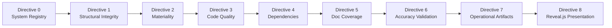

# Technical Specification

# 0. Agent Action Plan

## 0.1 Intent Clarification

### 0.1.1 Core Documentation Objective

Based on the provided requirements, the Blitzy platform understands that the documentation objective is to **execute a comprehensive, multi-framework codebase audit of SplendidCRM Community Edition v15.2** and produce a complete suite of auditor-facing and developer-facing documentation artifacts — without creating, modifying, or remediating any source code.

**Request Categorization:** Create new documentation — a full-spectrum audit report suite delivered as structured documentation files.

**Documentation Types Required:**
- Architecture assessment reports (system registry, structural integrity)
- Compliance-mapped findings reports (COSO/NIST/CIS-aligned)
- Code quality audit reports (per-component materiality-scoped analysis)
- Dependency and cross-cutting concern analysis reports
- Documentation coverage audit reports
- Accuracy validation reports with statistical pass/fail determination
- Executive summary narrative (operational artifact)
- Mermaid-based operational flowchart with NIST CSF swimlanes (operational artifact)
- Developer contribution guide with 9 GATE: PASS/FAIL points (operational artifact)
- Reveal.js HTML presentation for Risk Executives (operational artifact)

**Documentation Requirements with Enhanced Clarity:**

- **Directive 0 — System Definition and Classification:** Decompose the entire SplendidCRM codebase into discrete systems along two axes — functional domain verticals (identity/access, network control, secret management, CI/CD, data management, campaign execution, etc.) and architectural layer horizontals (provisioning/IaC, orchestration, application source, configuration, API, database). Classify each as Static or Dynamic. Map every system to COSO Principles (1–17), NIST SP 800-53 Rev 5 control families (AC, AU, CM, IA, SC, SI), NIST CSF functions (Identify, Protect, Detect, Respond, Recover), and CIS Controls v8 (IG2/IG3).
- **Directive 1 — Structural Integrity Scan:** Validate COSO Principle 10 (Selects and Develops Control Activities) by scanning for broken cross-references, orphaned configurations, missing environment variables, dangling service dependencies, unreachable code paths, and missing or incomplete error handling at system boundaries.
- **Directive 2 — Materiality Classification:** Classify every component as Material or Non-Material based on its impact on operational reliability. Material components are those governing access control, audit logging, configuration hardening, network segmentation, system/software integrity, secret management, or core business logic.
- **Directive 3 — Code Quality Audit:** For each Material component, assess code smells (DRY violations, >50-line methods, SRP violations, deep nesting >3 levels, magic numbers), complexity metrics (cyclomatic >10, cognitive complexity, coupling >7 dependencies, cohesion), and security quality (input validation gaps, error messages exposing internal state).
- **Directive 4 — Cross-Cutting Dependency Audit:** Map inter-system dependencies, identify shared utilities consumed by 3+ systems, perform risk assessment per NIST CM-3 and SC-5, and calculate a Blast Radius Score (Low/Medium/High) per COSO Principle 9 (Identifies and Analyzes Significant Change).
- **Directive 5 — Documentation Coverage Audit:** Verify that Material components have documentation explaining the WHY (intent/rationale) per COSO Principle 14 (Communicates Internally). Verify that cross-cutting concerns have documented blast radius and ownership.
- **Directive 6 — Accuracy Validation:** Sample Static systems (1 instance each) and Dynamic systems (10–25 instances each). Apply ≥87% accuracy threshold for PASS status per COSO Principle 16 (Conducts Ongoing and/or Separate Evaluations).
- **Directive 7 — Operational and Executive Artifacts:** Produce a Global Executive Summary, a Mermaid flowchart with NIST CSF swimlanes, and a Developer Contribution Guide with 9 GATE: PASS/FAIL checkpoints.
- **Directive 8 — Risk Executive Presentation:** Generate a Reveal.js presentation using styling/CSS found within the SplendidCRM codebase. Required slides: Title, State of the Environment (COSO/NIST CSF), Critical Risks (High Blast Radius), Compliance Scorecard, Technical Debt Impact, and Prioritized Focus Areas.

### 0.1.2 Special Instructions and Constraints

**Critical Directives Captured:**

- **Assess-only mandate:** The auditor role MUST NOT create, modify, or remediate any code or documentation within the SplendidCRM repository. All output is new audit documentation generated outside the existing codebase structure.
- **Sequential execution:** Directives 0 through 8 must be executed in strict sequential order; each builds upon the findings of its predecessors.
- **Framework authority hierarchy:** Where COSO, NIST SP 800-53, NIST CSF, and CIS Controls v8 conflict, apply the more restrictive requirement and flag the conflict in the output.
- **Mandatory report header format:** Every report from Directives 1–6 must begin with (1) a Report Executive Summary paragraph describing the "Theme of Failure/Success" linked to COSO Control Activities, and (2) an Attention Required Table with columns: Component Path, Primary Finding, Risk Severity, Governing NIST/CIS Control, COSO Principle.
- **System-type-aware sampling:** Static systems receive exactly 1 sample instance; Dynamic systems receive 10–25 sample instances during accuracy validation.
- **System ID attribution:** All findings must be attributed to a `system_id` from the system registry produced in Directive 0.
- **Materiality scoping:** Non-Material components are explicitly excluded from detailed code quality audit (Directive 3).
- **COSO references mandatory:** Every executive summary and narrative section must include COSO references.
- **CSS source for Reveal.js:** The presentation must use the styling/CSS found within the SplendidCRM codebase — specifically from `SplendidCRM/App_Themes/` (7 themes: Arctic, Atlantic, Mobile, Pacific, Seven, Six, Sugar).

**Template Requirements:**

The Attention Required Table template is prescribed exactly:

```
| Component Path | Primary Finding | Risk Severity | Governing NIST/CIS Control | COSO Principle |
|---|---|---|---|---|
| [Path] | [Brief Description] | [Critical/Moderate/Minor] | [ID] | [e.g., Principle 11] |
```

**Style Preferences:**

- Auditor-facing reports: formal, evidence-based, framework-referenced prose
- Developer-facing guides: practical, gate-structured, actionable
- Executive presentation: high-level, risk-prioritized, visually clear

### 0.1.3 Technical Interpretation

These documentation requirements translate to the following technical documentation strategy:

- To **produce the System Registry** (Directive 0), we will analyze the SplendidCRM monolithic architecture, enumerate all functional domains (API Surface, Security, Cache/State, Business Logic, Background Processing, Real-Time, Error/Observability) and architectural layers (SQL Database, ASP.NET Application, IIS Configuration, Client SPAs, Build Pipeline), classify each as Static or Dynamic, and create a comprehensive mapping document cross-referencing COSO Principles 1–17, NIST SP 800-53 control families, NIST CSF functions, and CIS Controls v8 safeguards.
- To **execute the Structural Integrity Scan** (Directive 1), we will create a report documenting every instance of broken cross-references (e.g., 16 enterprise integration stubs referencing non-functional connectors), orphaned configurations (e.g., `Web.config` settings for disabled features), missing environment variables, dangling dependencies (e.g., 24 manually managed DLLs without NuGet), and error-handling gaps at the API Surface, SOAP, REST, and Timer boundaries.
- To **classify Materiality** (Directive 2), we will create a component inventory categorizing each of the 60+ `_code/` utility classes, 40+ Administration sub-modules, 60+ CRM module folders, SQL schema objects, and client applications as Material or Non-Material based on their governance function.
- To **perform the Code Quality Audit** (Directive 3), we will create detailed quality assessment reports for each Material component, documenting code smells, complexity metrics, and security quality findings with file path citations.
- To **map Cross-Cutting Dependencies** (Directive 4), we will create a dependency graph document identifying shared utilities (e.g., `Security.cs`, `SplendidCache.cs`, `SplendidError.cs`, `Sql.cs` consumed by virtually all systems) with Blast Radius Scores.
- To **audit Documentation Coverage** (Directive 5), we will create a coverage report assessing inline documentation, code comments, and architectural rationale documentation for all Material components.
- To **validate Accuracy** (Directive 6), we will create a validation report with sampling results and statistical pass/fail determination.
- To **produce Operational Artifacts** (Directive 7), we will create three files: a narrative executive summary, a Mermaid flowchart document, and a developer contribution guide with 9 explicit GATE points.
- To **generate the Risk Executive Presentation** (Directive 8), we will create a `reveal-js-presentation.html` file using Reveal.js v5.2.1 with CSS sourced from SplendidCRM's `App_Themes/` directory.

### 0.1.4 Inferred Documentation Needs

Based on comprehensive codebase analysis, the following implicit documentation needs are surfaced:

- **Based on security architecture:** The MD5 password hashing (SugarCRM backward compatibility), `requestValidationMode="2.0"`, `enableEventValidation="false"`, `validateRequest="false"`, and `customErrors="Off"` in `Web.config` constitute Critical-severity security findings that must be prominently documented in the audit reports under NIST IA (Identification and Authentication) and SC (System and Communications Protection) control families.
- **Based on zero testing infrastructure:** The complete absence of automated testing across all tiers (no unit tests, no integration tests, no E2E tests, no CI/CD, no static analysis) represents a Critical finding under COSO Principle 10 (Control Activities) and NIST SI (System and Information Integrity), requiring extensive documentation in both the Structural Integrity Scan and the Code Quality Audit.
- **Based on single-server architecture:** The InProc session state, process-local caching, and timer-bound background processing (Constraints C-001, C-002, C-004, C-005) require documentation of availability and resilience gaps under NIST CP (Contingency Planning) and CIS Controls v8 safeguards.
- **Based on dependency management:** The 24 manually managed DLLs in `BackupBin2012/` without NuGet or any package management system require documentation under NIST CM-3 (Configuration Change Control) and CIS Control 2 (Inventory and Control of Software Assets).
- **Based on integration stubs:** The 16 non-functional enterprise integration directories under `_code/Spring.Social.*` represent orphaned code paths that must be flagged in the Structural Integrity Scan.
- **Based on multi-frontend coexistence:** The 4 coexisting client interfaces (React 18.2.0, Angular ~13.3.0 experimental, HTML5/jQuery 1.4.2, WebForms) with different security postures require cross-cutting dependency documentation and Blast Radius analysis.
- **Based on observability gaps:** The absence of external APM, distributed tracing, health check endpoints, automated alerting, and SLA monitoring requires documentation under NIST AU (Audit and Accountability) and CIS Control 8 (Audit Log Management).


## 0.2 Documentation Discovery and Analysis

### 0.2.1 Existing Documentation Infrastructure Assessment

Repository analysis reveals a **near-zero documentation infrastructure** with no documentation framework, no documentation generator, and a single `README.md` file as the sole developer-facing documentation artifact.

**Search Patterns Employed:**

- Documentation files: `README*`, `docs/**`, `*.md`, `*.mdx`, `*.rst`, `wiki/**` — Result: Only `README.md` found at repository root
- Documentation generators: `mkdocs.yml`, `docusaurus.config.js`, `sphinx.conf.py`, `.readthedocs.yml` — Result: None found
- Inline documentation: C# XML doc comments, JSDoc/TSDoc, SQL script headers — Result: Minimal; SQL scripts contain AGPLv3 headers but no functional documentation
- API documentation tools: Swagger/OpenAPI specs, WSDL files, JSDoc configs — Result: None found (SOAP WSDL is auto-generated by ASP.NET runtime, not a maintained artifact)
- Diagram tools: Mermaid configs, PlantUML, draw.io files — Result: None found
- Style guides: `CONTRIBUTING.md`, `STYLEGUIDE.md`, coding standards — Result: None found

**Existing Documentation Inventory:**

| Documentation Asset | Location | Coverage | Status |
|---|---|---|---|
| README.md | `/README.md` | Build prerequisites, DLL dependencies, React build steps | Only documentation file; 79 lines |
| XML IntelliSense Docs | `BackupBin2012/*.xml` | 25 .NET assembly API references | Auto-generated; third-party library docs only |
| SQL Script Headers | `SQL Scripts Community/**/*.sql` | AGPLv3 license headers | License-only; no functional documentation |
| Web.config Comments | `SplendidCRM/Web.config` | Inline XML comments for IIS settings | Minimal configuration documentation |
| Versions.xml | `SplendidCRM/Administration/Versions.xml` | Version history metadata | Structured data, not documentation |

**Documentation Framework Status:**

- Current documentation framework: **None** — no static site generator, no doc build pipeline
- Documentation generator configuration: **Not present**
- API documentation tools: **None** — no Swagger, no JSDoc, no XML doc generation configured
- Diagram tools: **None** — no Mermaid CLI, no PlantUML, no architecture diagrams
- Documentation hosting/deployment: **Not applicable** — no documentation site exists

### 0.2.2 Repository Code Analysis for Documentation

**Search Patterns Used for Code to Document:**

- Public APIs: `SplendidCRM/Rest.svc.cs` (WCF REST — primary API gateway), `SplendidCRM/soap.asmx.cs` (SOAP API), `SplendidCRM/Administration/Rest.svc.cs` (Admin REST)
- Module interfaces: 60+ CRM module folders under `SplendidCRM/` (Accounts, Contacts, Leads, Opportunities, Cases, Campaigns, etc.)
- Core utility layer: 60+ C# classes in `SplendidCRM/_code/` (Security, Cache, Init, Scheduler, Email, REST, Search, Import/Export, Error handling)
- Configuration options: `SplendidCRM/Web.config`, `SplendidCRM/React/package.json`, `SQL Scripts Community/Data/` (configuration seed data)
- CLI/Build commands: `SQL Scripts Community/Build.bat`, React build via `yarn build`
- Security components: `Security.cs`, `ActiveDirectory.cs`, `DuoUniversal/`, `SplendidHubAuthorize.cs`
- Background processing: `SchedulerUtils.cs`, `EmailUtils.cs`, `Global.asax.cs` (timer initialization)

**Key Directories Examined:**

| Directory | Contents | Audit Relevance |
|---|---|---|
| `SplendidCRM/_code/` | 60+ C# utility classes — core infrastructure | **Critical** — Material components for Directives 2–5 |
| `SplendidCRM/_code/SignalR/` | SignalR hub implementations | **High** — Real-time security boundary |
| `SplendidCRM/Administration/` | 40+ admin sub-modules | **High** — Configuration and access control |
| `SplendidCRM/React/` | React SPA source (TypeScript) | **High** — Primary client interface |
| `SplendidCRM/React/src/` | App shell, routes, views, components | **High** — Client-side security, state management |
| `SQL Scripts Community/` | SQL schema, views, procedures, triggers | **Critical** — Data integrity and audit trails |
| `BackupBin2012/` | 24 .NET DLLs + 25 XML docs | **Medium** — Dependency inventory for Directive 4 |
| `SplendidCRM/App_Themes/` | 7 CSS themes (Arctic, Atlantic, Mobile, Pacific, Seven, Six, Sugar) | **Medium** — CSS source for Reveal.js presentation |
| `SplendidCRM/Angular/` | Experimental Angular client | **Low** — Explicitly non-production (Constraint C-007) |
| `SplendidCRM/html5/` | Legacy jQuery/RequireJS client | **Medium** — Legacy security posture assessment |

**Related Documentation Found:** No existing audit documentation, compliance reports, architecture decision records, or security assessment artifacts were discovered in the repository.

### 0.2.3 Web Search Research Conducted

- **COSO Internal Control — Integrated Framework (2013):** The framework defines 5 components (Control Environment, Risk Assessment, Control Activities, Information and Communication, Monitoring Activities) containing 17 principles that must all be present and functioning for effective internal control. This provides the governance anchor for the audit narrative structure.
- **NIST SP 800-53 Rev 5 control families:** Primary technical control reference covering AC (Access Control), AU (Audit and Accountability), CM (Configuration Management), IA (Identification and Authentication), SC (System and Communications Protection), and SI (System and Information Integrity). These provide the specific control mappings for audit findings.
- **NIST CSF structure:** Identify → Protect → Detect → Respond → Recover narrative flow provides the organizational structure for the operational flowchart artifact (Directive 7, Artifact 1).
- **CIS Controls v8 (IG2/IG3):** Inventory management, access control, audit logging, vulnerability management, and secure configuration safeguards provide the implementation-level control benchmarks for the audit.
- **Reveal.js v5.2.1:** The latest stable release on npm. The framework provides HTML-based presentations with CSS theming, Markdown support, speaker notes, and PDF export. The presentation will use SplendidCRM's existing CSS from `App_Themes/` to maintain visual alignment with the audited codebase.
- **Codebase audit documentation best practices:** Evidence-based reporting with file path citations, materiality-scoped analysis to focus auditor attention, framework-mapped findings for compliance traceability, and statistical sampling for accuracy validation.


## 0.3 Documentation Scope Analysis

### 0.3.1 Code-to-Documentation Mapping

The audit documentation must cover the entire SplendidCRM codebase, organized into systems identified during Directive 0. Below is the comprehensive mapping of code modules to the audit documentation they require.

**Security Domain — Material Components:**

- Module: `SplendidCRM/_code/Security.cs`
  - Public APIs: `IsAuthenticated()`, `GetUserAccess()`, `Filter()`, `LoginUser()`, MD5 hashing, Rijndael encryption
  - Current documentation: Missing — no inline doc comments, no external docs
  - Audit documentation needed: Materiality classification, code quality assessment, security quality review (MD5 weakness), COSO Principle 10/11 mapping, NIST IA/AC control assessment

- Module: `SplendidCRM/_code/ActiveDirectory.cs`
  - Public APIs: SSO/NTLM integration, ADFS/Azure AD JWT validation (stubbed)
  - Current documentation: Missing
  - Audit documentation needed: Materiality classification, structural integrity check for stubbed methods, NIST IA control assessment

- Module: `SplendidCRM/_code/SignalR/SplendidHubAuthorize.cs`
  - Public APIs: `IAuthorizeHubConnection`, `IAuthorizeHubMethodInvocation` implementations
  - Current documentation: Missing
  - Audit documentation needed: Security boundary analysis, session-cookie coupling risk, NIST AC/SC assessment

- Module: `SplendidCRM/Administration/DuoUniversal/`
  - Public APIs: 2FA challenge/callback flow
  - Current documentation: Missing
  - Audit documentation needed: Authentication mechanism assessment, NIST IA-2 multi-factor control mapping

**Core Infrastructure — Material Components:**

- Module: `SplendidCRM/_code/SplendidCache.cs`
  - Public APIs: Thousands of metadata query getters, `ClearTable()`, React-focused cache accessors
  - Current documentation: Missing
  - Audit documentation needed: Blast radius analysis (consumed by all systems), NIST CM assessment, code quality metrics

- Module: `SplendidCRM/_code/SplendidInit.cs`
  - Public APIs: `InitApp()`, `LoginUser()`, `BuildDatabase()`, session/user initialization
  - Current documentation: Missing
  - Audit documentation needed: Bootstrap sequence integrity, COSO Control Activities assessment

- Module: `SplendidCRM/_code/SplendidError.cs`
  - Public APIs: Centralized error logging to SYSTEM_LOG
  - Current documentation: Missing
  - Audit documentation needed: Error handling completeness, NIST AU assessment, blast radius analysis

- Module: `SplendidCRM/_code/Sql.cs` / `SqlBuild.cs` / `SqlClientFactory.cs`
  - Public APIs: Provider-agnostic DB operations, transaction management, schema build
  - Current documentation: Missing
  - Audit documentation needed: Transaction safety assessment, NIST SI control mapping

**API Surface — Material Components:**

- Module: `SplendidCRM/Rest.svc.cs`
  - Endpoints: WCF REST — authentication, metadata (`Application_GetReactState`), CRUD, relationships, sync, exports, OData-style queries
  - Current documentation: Missing — no Swagger/OpenAPI spec
  - Audit documentation needed: Input validation assessment, error exposure analysis, NIST AC/SC mapping

- Module: `SplendidCRM/soap.asmx.cs`
  - Endpoints: SugarCRM-compatible SOAP — `sugarsoap` namespace, session auth, entity CRUD
  - Current documentation: Missing — WSDL is runtime-generated only
  - Audit documentation needed: Legacy protocol security assessment, NIST SC mapping

- Module: `SplendidCRM/Administration/Rest.svc.cs`
  - Endpoints: Admin REST — layout CRUD, config management, module management, ACL administration
  - Current documentation: Missing
  - Audit documentation needed: Admin privilege escalation risk, IS_ADMIN enforcement validation

**Background Processing — Material Components:**

- Module: `SplendidCRM/_code/SchedulerUtils.cs`
  - Public APIs: `OnTimer()`, cron parsing, job dispatch, reentrancy guards, cache invalidation
  - Current documentation: Missing
  - Audit documentation needed: Reentrancy protection assessment, job catalog documentation

- Module: `SplendidCRM/_code/EmailUtils.cs`
  - Public APIs: `OnTimer()`, campaign queue, inbound/outbound polling, SMTP delivery, reminders
  - Current documentation: Missing
  - Audit documentation needed: Email security assessment, NIST SC mapping

- Module: `SplendidCRM/Global.asax.cs`
  - Public APIs: `Application_Start`, `Session_Start`, timer initialization, TLS enforcement
  - Current documentation: Missing
  - Audit documentation needed: Bootstrap sequence validation, COSO Control Environment mapping

**Database Layer — Material Components:**

- Module: `SQL Scripts Community/Procedures/`
  - Components: CRUD stored procedures, relationship management, team/assignment normalization
  - Current documentation: SQL headers only (license)
  - Audit documentation needed: Data integrity assessment, NIST SI/AU mapping

- Module: `SQL Scripts Community/Triggers/BuildAllAuditTables.1.sql`
  - Components: Audit trigger generation for all CRM entities
  - Current documentation: Missing
  - Audit documentation needed: Audit completeness verification, COSO Principle 16 mapping

- Module: `SQL Scripts Community/Views/`
  - Components: 300+ view projections (list, detail, edit, sync, SOAP, relationship, metadata)
  - Current documentation: Missing
  - Audit documentation needed: View integrity assessment, cross-reference validation

**Configuration — Material Components:**

- Module: `SplendidCRM/Web.config`
  - Options: Session state, authentication mode, request validation, WCF service model, assembly redirects
  - Current documentation: Inline XML comments (minimal)
  - Audit documentation needed: Security hardening assessment (`requestValidationMode=2.0`, `customErrors=Off`), NIST CM mapping

**Client Applications — Material Components for Security Assessment:**

- Module: `SplendidCRM/React/` (React 18.2.0 / TypeScript 5.3.3)
  - Current documentation: `package.json` metadata only
  - Audit documentation needed: Client-side security, dependency vulnerability surface, NIST SI mapping

- Module: `SplendidCRM/html5/` (jQuery 1.4.2–2.2.4 / RequireJS 2.3.3)
  - Current documentation: None
  - Audit documentation needed: Legacy library vulnerability surface, NIST SI mapping

### 0.3.2 Documentation Gap Analysis

Given the requirements and repository analysis, documentation gaps include the following:

**Undocumented Public APIs:**
- WCF REST API (`Rest.svc.cs`) — zero external API documentation; no Swagger/OpenAPI spec
- SOAP API (`soap.asmx.cs`) — no maintained WSDL documentation; runtime-generated only
- Admin REST API (`Administration/Rest.svc.cs`) — no documentation
- 60+ `_code/` utility classes — no XML doc comments, no external API reference
- All CRM module endpoints — no documentation

**Missing Architecture Documentation:**
- No architecture decision records (ADRs)
- No system design documents
- No data flow diagrams
- No security architecture documentation
- No deployment architecture documentation
- No disaster recovery runbooks
- No RPO/RTO target documentation

**Missing Compliance Documentation:**
- No COSO control mapping documentation
- No NIST SP 800-53 control assessment
- No CIS Controls v8 benchmark assessment
- No security audit history
- No risk register
- No vulnerability management records

**Missing Operational Documentation:**
- No contribution guidelines (`CONTRIBUTING.md`)
- No developer setup guide beyond README.md build steps
- No testing strategy (no tests exist to document)
- No monitoring/alerting runbooks
- No incident response procedures
- No change management documentation

**Outdated/Incomplete Documentation:**
- README.md covers build prerequisites but lacks architecture overview, security considerations, deployment guide, or operational guidance
- BackupBin2012 XML docs are third-party auto-generated IntelliSense files, not SplendidCRM-specific documentation


## 0.4 Documentation Implementation Design

### 0.4.1 Documentation Structure Planning

The audit documentation suite is organized to mirror the Directive sequence (0–8) while supporting both auditor-facing and developer-facing consumption patterns. All documentation is created as new files; no existing repository files are modified.

```
docs/
├── README.md (audit suite overview, navigation guide)
├── directive-0-system-registry/
│   ├── system-registry.md (complete system decomposition and classification)
│   ├── coso-mapping.md (COSO Principles 1–17 mapping per system)
│   ├── nist-mapping.md (NIST SP 800-53 / NIST CSF mapping per system)
│   └── cis-mapping.md (CIS Controls v8 IG2/IG3 mapping per system)
├── directive-1-structural-integrity/
│   └── structural-integrity-report.md (broken refs, orphaned configs, missing error handling)
├── directive-2-materiality/
│   └── materiality-classification.md (Material vs Non-Material for every component)
├── directive-3-code-quality/
│   ├── code-quality-summary.md (aggregate findings across Material components)
│   ├── security-domain-quality.md (Security.cs, ActiveDirectory.cs, DuoUniversal, HubAuthorize)
│   ├── api-surface-quality.md (Rest.svc.cs, soap.asmx.cs, Admin REST)
│   ├── infrastructure-quality.md (SplendidCache, SplendidInit, Sql, SplendidError)
│   ├── background-processing-quality.md (SchedulerUtils, EmailUtils, Global.asax)
│   └── database-quality.md (stored procedures, views, triggers)
├── directive-4-dependency-audit/
│   └── cross-cutting-dependency-report.md (inter-system deps, shared utilities, blast radius)
├── directive-5-documentation-coverage/
│   └── documentation-coverage-report.md (WHY documentation verification per Material component)
├── directive-6-accuracy-validation/
│   └── accuracy-validation-report.md (sampling results, pass/fail per system type)
├── directive-7-operational-artifacts/
│   ├── artifact-0-global-executive-summary.md (3–5 paragraph stakeholder narrative)
│   ├── artifact-1-operational-flowchart.md (Mermaid flowchart with NIST CSF swimlanes)
│   └── artifact-2-developer-contribution-guide.md (9 GATE: PASS/FAIL points)
└── directive-8-presentation/
    └── risk-executive-presentation.html (Reveal.js presentation with SplendidCRM CSS)
```

### 0.4.2 Content Generation Strategy

**Information Extraction Approach:**

- Extract security architecture findings from `SplendidCRM/_code/Security.cs`, `SplendidCRM/Web.config`, `SplendidCRM/_code/ActiveDirectory.cs`, `SplendidCRM/_code/SignalR/SplendidHubAuthorize.cs` using direct source code analysis
- Extract API surface metrics from `SplendidCRM/Rest.svc.cs`, `SplendidCRM/soap.asmx.cs`, `SplendidCRM/Administration/Rest.svc.cs` using method-count and complexity analysis
- Extract dependency graph from `SplendidCRM/SplendidCRM7_VS2017.csproj` (24 DLL references), `SplendidCRM/React/package.json` (npm dependencies), `SplendidCRM/Angular/package.json` (npm dependencies)
- Extract database schema metrics from `SQL Scripts Community/` subdirectories (view counts, procedure counts, trigger configurations)
- Extract configuration security posture from `SplendidCRM/Web.config` (authentication mode, session config, request validation, custom errors)
- Extract system classification data from `SplendidCRM/Global.asax.cs` (bootstrap sequence, timer initialization), `SplendidCRM/_code/SchedulerUtils.cs` (scheduled job catalog)

**Template Application:**

- Apply the mandatory Attention Required Table template to every Directive 1–6 report header
- Apply the COSO Principle reference format throughout all narrative sections
- Apply the `system_id` attribution format derived from the Directive 0 system registry

**Documentation Standards:**

- Markdown formatting with proper headers (`#`, `##`, `###`)
- Mermaid diagram integration using fenced code blocks for the NIST CSF operational flowchart, system decomposition diagrams, and dependency graphs
- Code examples using language-specific fenced blocks with syntax highlighting (C#, SQL, TypeScript, JSON) — limited to short illustrative snippets of audit findings
- Source citations as inline file path references: `Source: SplendidCRM/_code/Security.cs`
- Tables for all structured findings: Attention Required, system registry entries, materiality classifications, code quality metrics, dependency inventories, coverage metrics
- Consistent terminology aligned with COSO, NIST SP 800-53, NIST CSF, and CIS Controls v8 vocabularies

### 0.4.3 Diagram and Visual Strategy

**Mermaid Diagrams to Create:**

- **System Decomposition Diagram** (Directive 0): Grid visualization mapping functional domain verticals against architectural layer horizontals with Static/Dynamic classification
- **NIST CSF Swimlane Flowchart** (Directive 7, Artifact 1): Operational flowchart organized by Identify → Protect → Detect → Respond → Recover swimlanes, with sub-lanes per audit dimension (structural integrity, materiality, code quality, dependencies, documentation, accuracy)
- **Dependency Graph** (Directive 4): Directed graph showing inter-system dependencies with edge weights representing Blast Radius Scores (Low/Medium/High)
- **Error Handling Flow** (Directive 1): Flowchart documenting the 6 error categories and their convergence at `SplendidError.cs` → `SYSTEM_LOG`
- **Authorization Model Diagram** (Directive 3): Layered diagram showing the 4-tier authorization model (module ACL → team filtering → field-level → record-level)
- **Bootstrap Sequence Diagram** (Directive 1): Sequential diagram of the `Application_Start` → timer initialization chain in `Global.asax.cs`

**Reveal.js Presentation Visuals** (Directive 8):

- CSS sourced from `SplendidCRM/App_Themes/Seven/style.css` as the primary theme (modern, clean aesthetic)
- Slide backgrounds derived from the SplendidCRM color palette
- Summary Risk Table as an HTML table on the Critical Risks slide
- Compliance Scorecard as a visual grid with PASS/FAIL indicators
- Technical Debt Impact as a prioritized bullet list with severity badges

### 0.4.4 Report Executive Summary Pattern

Every Directive 1–6 report follows this prescribed pattern:

```
# Directive N — [Title]

#### Report Executive Summary

[1–2 paragraph narrative describing the "Theme of Failure/Success" for this
audit dimension, explicitly linked to the COSO Control Activities component]

#### Attention Required

| Component Path | Primary Finding | Risk Severity | Governing NIST/CIS Control | COSO Principle |
|---|---|---|---|---|
| [Path] | [Brief Description] | [Critical/Moderate/Minor] | [ID] | [e.g., Principle 11] |

#### Detailed Findings

[Findings organized by system_id, with file path citations]
```


## 0.5 Documentation File Transformation Mapping

### 0.5.1 File-by-File Documentation Plan

Every documentation file to be created, updated, or referenced is mapped below. Since this is an assess-only audit producing entirely new documentation artifacts, all target files use the **CREATE** transformation mode. Existing repository files are used as **REFERENCE** sources for analysis but are never modified.

| Target Documentation File | Transformation | Source Code/Docs | Content/Changes |
|---|---|---|---|
| `docs/README.md` | CREATE | All directives | Audit suite navigation guide: purpose, directory structure, how to read the reports, framework glossary, and report index |
| `docs/directive-0-system-registry/system-registry.md` | CREATE | `SplendidCRM/Global.asax.cs`, `SplendidCRM/_code/**/*.cs`, `SplendidCRM/Rest.svc.cs`, `SplendidCRM/soap.asmx.cs`, `SplendidCRM/Administration/**`, `SQL Scripts Community/**`, `SplendidCRM/React/`, `SplendidCRM/Angular/`, `SplendidCRM/html5/`, `SplendidCRM/Web.config`, `BackupBin2012/` | Complete system decomposition along vertical (functional domain) and horizontal (architectural layer) axes; Static/Dynamic classification per system; system_id registry |
| `docs/directive-0-system-registry/coso-mapping.md` | CREATE | `docs/directive-0-system-registry/system-registry.md` | COSO Principles 1–17 mapped to each system_id with rationale; identifies which principles are present/functioning and which have gaps |
| `docs/directive-0-system-registry/nist-mapping.md` | CREATE | `docs/directive-0-system-registry/system-registry.md` | NIST SP 800-53 Rev 5 (AC, AU, CM, IA, SC, SI) and NIST CSF (ID, PR, DE, RS, RC) control mapping per system_id |
| `docs/directive-0-system-registry/cis-mapping.md` | CREATE | `docs/directive-0-system-registry/system-registry.md` | CIS Controls v8 IG2/IG3 safeguard mapping per system_id; inventory, access, logging, vulnerability, and configuration controls |
| `docs/directive-1-structural-integrity/structural-integrity-report.md` | CREATE | `SplendidCRM/_code/Spring.Social.*/**`, `SplendidCRM/Web.config`, `SplendidCRM/Global.asax.cs`, `SplendidCRM/Rest.svc.cs`, `SplendidCRM/soap.asmx.cs`, `SplendidCRM/_code/**/*.cs`, `SQL Scripts Community/**` | Report Executive Summary + Attention Required Table; findings for broken cross-references, orphaned configurations (16 enterprise stubs), missing environment variables, dangling dependencies (24 manual DLLs), unreachable code paths, incomplete error handling at boundaries |
| `docs/directive-2-materiality/materiality-classification.md` | CREATE | All `SplendidCRM/_code/**/*.cs`, `SplendidCRM/Administration/**`, `SplendidCRM/Rest.svc.cs`, `SplendidCRM/soap.asmx.cs`, `SQL Scripts Community/**`, `SplendidCRM/React/src/**`, `SplendidCRM/Web.config`, `SplendidCRM/Global.asax.cs` | Material/Non-Material classification for every component; classification criteria aligned with COSO Information & Communication component; materiality justification for each component |
| `docs/directive-3-code-quality/code-quality-summary.md` | CREATE | All Material component analysis | Aggregate code quality findings: total code smells, complexity hotspots, security quality gaps; summary statistics and severity distribution |
| `docs/directive-3-code-quality/security-domain-quality.md` | CREATE | `SplendidCRM/_code/Security.cs`, `SplendidCRM/_code/ActiveDirectory.cs`, `SplendidCRM/_code/SignalR/SplendidHubAuthorize.cs`, `SplendidCRM/Administration/DuoUniversal/**` | Report Executive Summary + Attention Required Table; code smells, complexity metrics, security quality for all security-domain Material components; MD5 hashing finding, session coupling finding |
| `docs/directive-3-code-quality/api-surface-quality.md` | CREATE | `SplendidCRM/Rest.svc.cs`, `SplendidCRM/soap.asmx.cs`, `SplendidCRM/Administration/Rest.svc.cs`, `SplendidCRM/Administration/Impersonation.svc.cs` | Report Executive Summary + Attention Required Table; code smells, complexity metrics, security quality for REST/SOAP/Admin API Material components; input validation gaps, error message exposure |
| `docs/directive-3-code-quality/infrastructure-quality.md` | CREATE | `SplendidCRM/_code/SplendidCache.cs`, `SplendidCRM/_code/SplendidInit.cs`, `SplendidCRM/_code/Sql.cs`, `SplendidCRM/_code/SqlBuild.cs`, `SplendidCRM/_code/SplendidError.cs`, `SplendidCRM/_code/RestUtil.cs`, `SplendidCRM/_code/SplendidDynamic.cs`, `SplendidCRM/_code/SearchBuilder.cs` | Report Executive Summary + Attention Required Table; code smells, complexity metrics, coupling analysis for core infrastructure Material components |
| `docs/directive-3-code-quality/background-processing-quality.md` | CREATE | `SplendidCRM/_code/SchedulerUtils.cs`, `SplendidCRM/_code/EmailUtils.cs`, `SplendidCRM/Global.asax.cs` | Report Executive Summary + Attention Required Table; timer reentrancy analysis, job dispatch complexity, error handling completeness |
| `docs/directive-3-code-quality/database-quality.md` | CREATE | `SQL Scripts Community/Procedures/**`, `SQL Scripts Community/Views/**`, `SQL Scripts Community/Triggers/**`, `SQL Scripts Community/Functions/**` | Report Executive Summary + Attention Required Table; stored procedure complexity, view integrity, trigger completeness, idempotency validation |
| `docs/directive-4-dependency-audit/cross-cutting-dependency-report.md` | CREATE | `SplendidCRM/SplendidCRM7_VS2017.csproj`, `SplendidCRM/React/package.json`, `SplendidCRM/Angular/package.json`, `BackupBin2012/**`, `SplendidCRM/_code/**/*.cs` | Report Executive Summary + Attention Required Table; inter-system dependency map, shared utilities consumed by 3+ systems, Blast Radius Scores (Low/Medium/High), NIST CM-3 and SC-5 risk assessment |
| `docs/directive-5-documentation-coverage/documentation-coverage-report.md` | CREATE | All Material components, `README.md` | Report Executive Summary + Attention Required Table; WHY documentation verification per Material component, blast radius and ownership documentation check for cross-cutting concerns |
| `docs/directive-6-accuracy-validation/accuracy-validation-report.md` | CREATE | All prior directive outputs | Report Executive Summary + Attention Required Table; static system sampling (1 instance each), dynamic system sampling (10–25 instances each), ≥87% accuracy threshold PASS/FAIL determination, COSO Principle 16 compliance |
| `docs/directive-7-operational-artifacts/artifact-0-global-executive-summary.md` | CREATE | All prior directive outputs | 3–5 paragraph executive narrative; COSO Internal Controls effectiveness statement; Summary Risk Table of top 5 systems; NIST CSF posture overview |
| `docs/directive-7-operational-artifacts/artifact-1-operational-flowchart.md` | CREATE | All prior directive outputs | Mermaid flowchart with NIST CSF swimlanes (Identify/Protect/Detect/Respond/Recover); sub-lanes per audit dimension; process nodes for each directive finding |
| `docs/directive-7-operational-artifacts/artifact-2-developer-contribution-guide.md` | CREATE | All prior directive outputs, `SplendidCRM/_code/**`, `SplendidCRM/Web.config` | Developer guide for secure extensions; 9 explicit GATE: PASS/FAIL points aligned to COSO/NIST/CIS controls; code contribution checklist |
| `docs/directive-8-presentation/risk-executive-presentation.html` | CREATE | `SplendidCRM/App_Themes/Seven/style.css`, `SplendidCRM/App_Themes/Arctic/style.css`, all prior directive outputs | Self-contained Reveal.js v5.2.1 HTML presentation; slides: Title, State of Environment, Critical Risks, Compliance Scorecard, Technical Debt Impact, Prioritized Focus Areas; CSS from SplendidCRM App_Themes |

### 0.5.2 New Documentation Files Detail

**File: `docs/directive-0-system-registry/system-registry.md`**
- Type: System Classification Report
- Source Code: All SplendidCRM directories, `SQL Scripts Community/`, `BackupBin2012/`
- Sections:
  - System Decomposition Methodology (vertical domains × horizontal layers)
  - Vertical Domain Registry (Identity/Access, Data Management, Campaign Execution, Communication, Background Processing, Configuration, Reporting, Content Management)
  - Horizontal Layer Registry (SQL Database, ASP.NET Application, IIS Configuration, React SPA, Angular Client, HTML5 Client, WebForms, Build Pipeline)
  - Static vs Dynamic Classification Matrix
  - Framework Mapping Index (COSO, NIST, CIS cross-references)
- Diagrams: System decomposition grid (Mermaid), domain boundary overview
- Key Citations: `SplendidCRM/Global.asax.cs`, `SplendidCRM/_code/`, `SQL Scripts Community/Build.bat`

**File: `docs/directive-3-code-quality/security-domain-quality.md`**
- Type: Code Quality Audit Report
- Source Code: `SplendidCRM/_code/Security.cs`, `SplendidCRM/_code/ActiveDirectory.cs`, `SplendidCRM/_code/SignalR/SplendidHubAuthorize.cs`, `SplendidCRM/Administration/DuoUniversal/`
- Sections:
  - Report Executive Summary (Theme of Failure/Success for security domain)
  - Attention Required Table
  - Security.cs: Code Smells (method length, DRY violations), Complexity (cyclomatic, coupling to Session/Cache/Sql), Security Quality (MD5 hashing, Rijndael key management)
  - ActiveDirectory.cs: Structural integrity of stubbed SSO methods
  - SplendidHubAuthorize.cs: Session-cookie coupling risk, bypass potential
  - DuoUniversal: 2FA implementation completeness
- Key Citations: `SplendidCRM/_code/Security.cs`, `SplendidCRM/Web.config`

**File: `docs/directive-7-operational-artifacts/artifact-2-developer-contribution-guide.md`**
- Type: Developer Contribution Guide
- Source Code: All audit findings
- Sections:
  - Introduction (purpose, scope, framework alignment)
  - GATE 1: Access Control Compliance (NIST AC, CIS Control 6) — PASS/FAIL
  - GATE 2: Authentication Standards (NIST IA, COSO Principle 5) — PASS/FAIL
  - GATE 3: Audit Logging Requirements (NIST AU, CIS Control 8) — PASS/FAIL
  - GATE 4: Configuration Management (NIST CM, CIS Control 4) — PASS/FAIL
  - GATE 5: Input Validation and Encoding (NIST SI, COSO Principle 11) — PASS/FAIL
  - GATE 6: Error Handling Standards (NIST SI, COSO Principle 10) — PASS/FAIL
  - GATE 7: Dependency Management (NIST CM-3, CIS Control 2) — PASS/FAIL
  - GATE 8: Documentation Requirements (COSO Principle 14) — PASS/FAIL
  - GATE 9: Testing Requirements (COSO Principle 16, NIST CA) — PASS/FAIL
- Key Citations: All prior directive outputs

**File: `docs/directive-8-presentation/risk-executive-presentation.html`**
- Type: Reveal.js HTML Presentation
- Source Code: `SplendidCRM/App_Themes/Seven/style.css`, all audit findings
- Slides:
  - Slide 1: Title (SplendidCRM v15.2 Codebase Audit — Risk Executive Summary)
  - Slide 2: State of the Environment (COSO component effectiveness + NIST CSF posture)
  - Slide 3: Critical Risks (High Blast Radius findings with system_ids)
  - Slide 4: Compliance Scorecard (COSO/NIST/CIS coverage grid)
  - Slide 5: Technical Debt Impact (testing gap, MD5, manual DLLs, legacy clients)
  - Slide 6: Prioritized Focus Areas (ranked remediation recommendations)
- Key Citations: SplendidCRM CSS themes, all directive outputs

### 0.5.3 Documentation Configuration Updates

Since SplendidCRM has no existing documentation framework, the audit documentation suite is self-contained. No configuration files need updating:

- **No `mkdocs.yml`** — not applicable; documentation is delivered as static Markdown files
- **No `docusaurus.config.js`** — not applicable
- **No `.readthedocs.yml`** — not applicable
- **No `package.json` documentation scripts** — the Reveal.js presentation is a standalone HTML file requiring only a web browser to view

The `docs/README.md` file serves as the navigation index and entry point for the entire audit documentation suite.

### 0.5.4 Cross-Documentation Dependencies

- **Directive 0 output** → consumed by all subsequent directives as `system_id` reference
- **Directive 2 output** → consumed by Directive 3 (only Material components are audited for code quality)
- **Directive 4 output** → consumed by Directive 5 (blast radius and ownership verification) and Directive 7 (executive summary risk ranking)
- **Directives 1–6 outputs** → consumed by Directive 7 (operational artifacts synthesize all findings)
- **All directive outputs** → consumed by Directive 8 (presentation summarizes the complete audit)
- **`docs/README.md`** → links to all directive subdirectories and files
- **Framework mappings** (COSO, NIST, CIS) → consistently referenced across all reports using standardized control IDs


## 0.6 Dependency Inventory

### 0.6.1 Documentation Dependencies

All documentation tools and packages relevant to producing the audit documentation suite are listed below with exact versions.

| Registry | Package Name | Version | Purpose |
|---|---|---|---|
| npm | reveal.js | 5.2.1 | HTML presentation framework for Directive 8 Risk Executive Presentation |
| — | Mermaid (inline) | N/A | Diagram notation embedded in Markdown files; rendered by any Mermaid-compatible viewer |
| — | Markdown | N/A | Base documentation format for all audit reports (Directives 0–7) |
| — | HTML5 | N/A | Self-contained format for Reveal.js presentation (Directive 8) |

**Reveal.js Dependency Details:**

The Risk Executive Presentation (`docs/directive-8-presentation/risk-executive-presentation.html`) is delivered as a self-contained HTML file with Reveal.js v5.2.1 assets either inlined or loaded from CDN. No build step is required — the file opens directly in any modern web browser. The presentation uses CSS derived from `SplendidCRM/App_Themes/Seven/style.css` for visual alignment with the SplendidCRM brand.

**Mermaid Diagram Rendering:**

Mermaid diagrams are embedded as fenced code blocks within Markdown files. They are rendered client-side by any Mermaid-compatible viewer including GitHub, GitLab, VS Code (with Mermaid extension), and static site generators. No separate Mermaid CLI installation is required for viewing, though `@mermaid-js/mermaid-cli` (v10.6.1 on npm) can be used for offline SVG/PNG export if needed.

### 0.6.2 Audited Codebase Dependencies

The following are the key dependencies of the SplendidCRM codebase that are subject to the Directive 4 Cross-Cutting Dependency Audit. These are not documentation tools; they are the audited assets.

**Backend .NET Dependencies (24 manually managed DLLs — no NuGet):**

| DLL Name | Purpose | Audit Relevance |
|---|---|---|
| AjaxControlToolkit.dll | WebForms AJAX controls | Medium — UI framework dependency |
| Antlr3.Runtime.dll | Parser runtime | Low — indirect dependency |
| BouncyCastle.Crypto.dll | Cryptographic library | **Critical** — security operations |
| CKEditor.NET.dll | Rich text editor server control | Low — UI component |
| Common.Logging.dll | Logging abstraction | Medium — cross-cutting logging |
| DocumentFormat.OpenXml.dll | Excel/Word generation | Medium — export functionality |
| ICSharpCode.SharpZLib.dll | Compression library | Low — utility |
| MailKit.dll | Email client library (IMAP/POP3/SMTP) | **High** — email security boundary |
| Microsoft.AspNet.SignalR.Core.dll | SignalR server hub (v1.2.2 legacy) | **High** — real-time security |
| Microsoft.AspNet.SignalR.SystemWeb.dll | SignalR IIS hosting | High — web infrastructure |
| Microsoft.Owin.dll | OWIN middleware | High — authentication pipeline |
| Microsoft.Owin.Host.SystemWeb.dll | OWIN IIS host | High — web infrastructure |
| Microsoft.Owin.Security.dll | OWIN security | **Critical** — authentication |
| Microsoft.Web.Infrastructure.dll | ASP.NET infrastructure | Medium — web framework |
| MimeKit.dll | MIME processing | Medium — email processing |
| Newtonsoft.Json.dll (→13.0.0.0) | JSON serialization | **High** — API data handling |
| Owin.dll | OWIN interface | Medium — middleware |
| RestSharp.dll | REST client | Medium — external API calls |
| Spring.Rest.dll | Spring REST framework | Low — enterprise stub |
| Spring.Social.Core.dll | Spring Social framework | Low — enterprise stub |
| System.Web.Optimization.dll | Bundle/minification | Low — performance |
| TweetinCore.dll | Twitter integration | Low — enterprise stub |
| Twilio.Api.dll | Twilio SMS/Voice | **High** — external communication |
| WebGrease.dll | CSS/JS optimization | Low — build tool |

**React SPA Dependencies (from `SplendidCRM/React/package.json`):**

| Package | Version | Audit Relevance |
|---|---|---|
| react | 18.2.0 | High — core UI framework |
| typescript | 5.3.3 | Medium — build tool |
| mobx / mobx-react | 6.12.0 / 4.0.0 | High — state management (security context) |
| webpack | 5.90.2 | Medium — build tool |
| bootstrap | 5.3.2 | Medium — UI framework |
| @microsoft/signalr | 8.0.0 | **High** — real-time client (version asymmetry with server) |
| signalr (legacy) | 2.4.3 | **High** — legacy real-time client |
| ckeditor5 | custom build | Medium — content editing |
| @amcharts/amcharts4 | 4.10.38 | Low — charting |
| bpmn-js | 1.3.3 | Low — workflow designer |
| idb | 8.0.0 | Medium — IndexedDB offline caching |

**SQL Server Dependencies:**

| Component | Version | Audit Relevance |
|---|---|---|
| SQL Server Express | 2008+ (minimum) | **Critical** — sole data store |
| SQL Server Full-Text Search | Optional | Medium — search functionality |
| T-SQL Stored Procedures | 300+ procedures | **Critical** — data integrity |
| T-SQL Views | 300+ views | **Critical** — data access layer |
| T-SQL Triggers | Audit triggers for all entities | **Critical** — audit trail |

### 0.6.3 Documentation Reference Updates

Since all audit documentation is new (CREATE mode) and exists in a self-contained `docs/` directory, no existing documentation links require updating. Internal cross-references within the audit suite use relative paths:

- `docs/directive-0-system-registry/system-registry.md` → referenced by all subsequent directive reports via `../directive-0-system-registry/system-registry.md`
- `docs/directive-2-materiality/materiality-classification.md` → referenced by Directive 3 quality reports
- `docs/README.md` → serves as the central index linking to all reports
- All directive reports → referenced by `docs/directive-7-operational-artifacts/artifact-0-global-executive-summary.md`


## 0.7 Coverage and Quality Targets

### 0.7.1 Documentation Coverage Metrics

**Current Coverage Analysis (Pre-Audit Baseline):**

| Audit Dimension | Components Discovered | Currently Documented | Coverage | Target |
|---|---|---|---|---|
| System registry (Directive 0) | ~15 distinct systems (estimated across verticals × horizontals) | 0/15 (0%) | 0% | 100% — every system classified and mapped |
| Structural integrity findings (Directive 1) | All system boundary points (~20+ boundaries) | 0/20 (0%) | 0% | 100% — every boundary scanned |
| Materiality classification (Directive 2) | ~150+ components (60+ _code/ classes, 40+ Admin modules, 60+ CRM modules, APIs, SQL, configs) | 0/150 (0%) | 0% | 100% — every component classified |
| Code quality assessment (Directive 3) | Material components only (estimated ~40–60 components) | 0/~50 (0%) | 0% | 100% — every Material component assessed |
| Cross-cutting dependencies (Directive 4) | Shared utilities consumed by 3+ systems (estimated ~15–20) | 0/~18 (0%) | 0% | 100% — every shared utility mapped with Blast Radius |
| Documentation WHY coverage (Directive 5) | All Material components (~40–60) | 0/~50 (0%) | 0% | 100% — every Material component verified for WHY docs |
| Accuracy validation (Directive 6) | All systems from registry | 0 samples | 0% | Static: 1 sample each; Dynamic: 10–25 samples each; ≥87% accuracy for PASS |
| Operational artifacts (Directive 7) | 3 artifacts required | 0/3 (0%) | 0% | 100% — all 3 artifacts produced |
| Executive presentation (Directive 8) | 1 presentation, 6 required slides | 0/1 (0%) | 0% | 100% — all 6 slides produced |

**Coverage Gaps to Address:**

- **_code/ layer:** 60+ C# utility classes with zero inline or external documentation; all must be classified and Material components must receive full code quality audit
- **Administration modules:** 40+ admin sub-modules with zero documentation; all must be classified for materiality
- **SQL Schema:** 300+ views, extensive stored procedures, triggers — all undocumented beyond license headers; schema integrity and audit trigger completeness must be verified
- **API Surface:** 3 API paradigms (REST, SOAP, Admin REST) with zero API documentation; input validation and error handling must be assessed for all Material APIs
- **Client applications:** 4 frontend clients with varying security postures; dependency vulnerability surface must be documented
- **Configuration:** `Web.config` security settings inadequately documented; security hardening gaps must be cataloged

### 0.7.2 Documentation Quality Criteria

**Completeness Requirements:**

- Every audit report includes a Report Executive Summary with COSO Control Activities linkage
- Every Directive 1–6 report includes the Attention Required Table in the prescribed format
- Every finding is attributed to a `system_id` from the Directive 0 registry
- Every finding includes a Risk Severity classification (Critical/Moderate/Minor)
- Every finding maps to at least one governing framework control (NIST SP 800-53, NIST CSF, or CIS Controls v8)
- Every finding maps to at least one COSO Principle (1–17)
- The Developer Contribution Guide includes exactly 9 GATE: PASS/FAIL points
- The Reveal.js presentation includes exactly 6 required slides
- The Global Executive Summary is 3–5 paragraphs and leads with COSO Internal Controls effectiveness statement

**Accuracy Validation (Directive 6 Requirements):**

- Static systems: exactly 1 instance sampled per system
- Dynamic systems: 10–25 instances sampled per system
- Accuracy threshold: ≥87% for PASS status
- Accuracy calculation: (confirmed accurate findings / total sampled findings) × 100
- PASS/FAIL determination aligned with COSO Principle 16 (Conducts Ongoing and/or Separate Evaluations)

**Clarity Standards:**

- Technical accuracy with formal auditor-facing language for Directives 0–6
- Practical, actionable language for the Developer Contribution Guide (Directive 7, Artifact 2)
- Executive-accessible language for the Global Executive Summary (Directive 7, Artifact 0) and Reveal.js presentation (Directive 8)
- Consistent use of COSO, NIST, and CIS terminology throughout all documents
- Progressive disclosure: executive summaries → attention required tables → detailed findings

**Maintainability:**

- Source file path citations for traceability (e.g., `Source: SplendidCRM/_code/Security.cs:L42`)
- `system_id` attribution for cross-referencing across directives
- Standardized table formats for structured data across all reports
- Self-contained `docs/` directory requiring no build tools to read

### 0.7.3 Example and Diagram Requirements

**Minimum Deliverable Counts:**

| Artifact Type | Minimum Count | Location |
|---|---|---|
| Mermaid diagrams | 6 (system decomposition, NIST CSF flowchart, dependency graph, error handling flow, authorization model, bootstrap sequence) | Distributed across directive reports |
| Attention Required Tables | 6 (one per Directive 1–6 report) | Each directive report header |
| Code quality finding tables | 5 (one per Directive 3 sub-report) | Directive 3 sub-reports |
| Framework mapping tables | 3 (COSO, NIST, CIS) | Directive 0 sub-reports |
| GATE: PASS/FAIL checkpoints | 9 | Directive 7, Artifact 2 |
| Reveal.js slides | 6 | Directive 8 presentation |
| Summary Risk Table | 1 (top 5 systems) | Directive 7, Artifact 0 |

**Diagram Specifications:**

- All Mermaid diagrams use `flowchart`, `sequenceDiagram`, or `graph` syntax
- Diagrams include descriptive node labels with component names and file paths
- The NIST CSF swimlane flowchart uses Mermaid subgraphs to represent Identify/Protect/Detect/Respond/Recover functions
- The dependency graph uses edge labels to indicate Blast Radius Scores

**Code Snippet Usage:**

- Code snippets are used only to illustrate specific audit findings (e.g., showing a `requestValidationMode="2.0"` configuration line)
- Snippets are limited to 2–3 lines maximum
- Snippets include file path and line number citations


## 0.8 Scope Boundaries

### 0.8.1 Exhaustively In Scope

**New Documentation Files (all CREATE mode):**

- `docs/README.md` — audit suite overview and navigation index
- `docs/directive-0-system-registry/**/*.md` — system decomposition, COSO/NIST/CIS mappings
- `docs/directive-1-structural-integrity/**/*.md` — structural integrity scan report
- `docs/directive-2-materiality/**/*.md` — materiality classification report
- `docs/directive-3-code-quality/**/*.md` — code quality audit reports (summary + 5 domain-specific sub-reports)
- `docs/directive-4-dependency-audit/**/*.md` — cross-cutting dependency and blast radius report
- `docs/directive-5-documentation-coverage/**/*.md` — documentation coverage audit report
- `docs/directive-6-accuracy-validation/**/*.md` — accuracy validation report with sampling results
- `docs/directive-7-operational-artifacts/**/*.md` — global executive summary, NIST CSF flowchart, developer contribution guide
- `docs/directive-8-presentation/**/*.html` — Reveal.js risk executive presentation

**Source Code Analyzed (read-only — for audit findings, never modified):**

- `SplendidCRM/_code/**/*.cs` — all 60+ core infrastructure utility classes
- `SplendidCRM/_code/SignalR/**/*.cs` — SignalR hub implementations and authorization
- `SplendidCRM/_code/Spring.Social.*/**` — 16 enterprise integration stub directories
- `SplendidCRM/Rest.svc.cs` — WCF REST API gateway
- `SplendidCRM/soap.asmx.cs` — SOAP API
- `SplendidCRM/Administration/**` — 40+ admin sub-modules including `Rest.svc.cs`, `Impersonation.svc.cs`
- `SplendidCRM/Global.asax.cs` — application lifecycle and bootstrap
- `SplendidCRM/Web.config` — security and configuration settings
- `SplendidCRM/SystemCheck.aspx.cs` — diagnostics endpoint
- `SplendidCRM/React/package.json` — React SPA dependencies
- `SplendidCRM/React/src/**` — React application source (routes, views, components, scripts)
- `SplendidCRM/Angular/package.json` — Angular client dependencies
- `SplendidCRM/html5/**` — HTML5 legacy client
- `SplendidCRM/SplendidCRM7_VS2017.csproj` — project file with DLL references
- `SQL Scripts Community/**` — all SQL scripts (BaseTables, Tables, Views, Procedures, ProceduresDDL, ViewsDDL, Functions, Data, Terminology, Triggers)
- `SQL Scripts Community/Build.bat` — database build orchestrator
- `BackupBin2012/**` — 24 .NET DLLs and 25 XML documentation files
- `README.md` — existing project documentation

**CSS Assets Referenced (read-only — for Reveal.js theming):**

- `SplendidCRM/App_Themes/Seven/style.css` — primary theme for presentation styling
- `SplendidCRM/App_Themes/Arctic/style.css` — secondary theme reference
- `SplendidCRM/App_Themes/*/style.css` — all 7 theme stylesheets available for color palette extraction

**CRM Module Folders Analyzed (read-only — for module count and pattern assessment):**

- `SplendidCRM/Accounts/`, `SplendidCRM/Contacts/`, `SplendidCRM/Leads/`, `SplendidCRM/Opportunities/`, `SplendidCRM/Orders/` — Sales modules
- `SplendidCRM/Campaigns/`, `SplendidCRM/EmailMarketing/`, `SplendidCRM/ProspectLists/`, `SplendidCRM/Prospects/` — Marketing modules
- `SplendidCRM/Cases/`, `SplendidCRM/Bugs/` — Support modules
- `SplendidCRM/Emails/`, `SplendidCRM/EmailClient/`, `SplendidCRM/SmsMessages/`, `SplendidCRM/ChatChannels/`, `SplendidCRM/ChatMessages/` — Communication modules
- `SplendidCRM/Calendar/`, `SplendidCRM/Meetings/`, `SplendidCRM/Calls/`, `SplendidCRM/Tasks/` — Activity modules
- `SplendidCRM/Documents/`, `SplendidCRM/Notes/`, `SplendidCRM/Reports/`, `SplendidCRM/Dashboard/` — Content modules
- All remaining CRM module folders under `SplendidCRM/`

### 0.8.2 Explicitly Out of Scope

- **Source code modifications:** No C#, TypeScript, JavaScript, SQL, or configuration file modifications — this is an assess-only audit
- **Code remediation:** No fixes, patches, or improvements applied to any repository file
- **Test creation:** No test files created (the absence of tests is itself an audit finding, not a task to remediate)
- **Documentation tool installation in the repository:** No mkdocs, docusaurus, or sphinx configurations added to the repository
- **Non-Material component deep audit:** Components classified as Non-Material in Directive 2 are excluded from the Directive 3 code quality audit per the explicit user directive
- **Enterprise-only integration functionality:** The 16 `Spring.Social.*` stub directories are assessed only for structural integrity (orphaned code); their intended enterprise functionality is out of scope
- **Angular client deep audit:** Explicitly experimental (Constraint C-007); included in system registry but receives minimal code quality analysis
- **Aspirational controls:** No documentation of controls that should exist but do not; findings are limited to what is observed in the codebase
- **Feature additions or code refactoring:** No new features, no code restructuring
- **Deployment configuration changes:** No IIS, SQL Server, or build pipeline modifications
- **Runtime testing or penetration testing:** The audit is static analysis and documentation only; no runtime testing is performed
- **Third-party library internal auditing:** BackupBin2012 DLLs are inventoried and assessed for dependency risk but their internal source code is not audited


## 0.9 Execution Parameters

### 0.9.1 Documentation-Specific Instructions

**Documentation Build Command:**

No build step is required. All Markdown reports are authored as static `.md` files readable by any Markdown viewer (GitHub, GitLab, VS Code, any text editor). The Reveal.js presentation is a self-contained `.html` file that opens directly in a web browser.

If offline Mermaid diagram rendering to SVG/PNG is desired:
```bash
npx @mermaid-js/mermaid-cli@10.6.1 -i input.md -o output.svg
```

**Documentation Preview Command:**

- Markdown files: open in any Markdown-capable editor or renderer
- Reveal.js presentation: open `docs/directive-8-presentation/risk-executive-presentation.html` in a modern web browser (Chrome, Firefox, Safari, Edge)

**Diagram Generation Command:**

Mermaid diagrams are embedded inline within Markdown files as fenced code blocks. No separate generation step is required for viewing in GitHub/GitLab. For standalone rendering:
```bash
npx @mermaid-js/mermaid-cli@10.6.1 -i diagram.mmd -o diagram.svg
```

**Default Format:** Markdown with Mermaid diagrams for all audit reports; HTML with Reveal.js v5.2.1 for the executive presentation.

**Citation Requirement:** Every finding section must reference source files using the format: `Source: [file_path]` or `Source: [file_path]:L[line_number]`.

**Style Guide:** Formal auditor-facing prose for Directives 0–6; practical developer-facing language for Directive 7 Artifact 2; executive-accessible language for Directive 7 Artifact 0 and Directive 8.

**Documentation Validation:**

- Markdown linting: validate with any standard Markdown linter (e.g., `markdownlint`)
- Link checking: verify all internal cross-references resolve to existing files within the `docs/` directory
- Mermaid syntax: validate diagram rendering in a Mermaid live editor or compatible Markdown viewer
- Reveal.js: validate presentation rendering in Chrome/Firefox by opening the HTML file
- Framework control ID accuracy: verify all COSO Principle numbers (1–17), NIST SP 800-53 control family codes (AC, AU, CM, IA, SC, SI), NIST CSF function names (Identify, Protect, Detect, Respond, Recover), and CIS Controls v8 safeguard numbers are used correctly

### 0.9.2 Directive Execution Sequence

Directives must be executed in strict sequential order, as each builds upon the outputs of its predecessors:



**Dependency Chain:**

| Directive | Depends On | Produces | Consumed By |
|---|---|---|---|
| 0 — System Registry | Codebase analysis | `system_id` registry, Static/Dynamic classification | All subsequent directives |
| 1 — Structural Integrity | Directive 0 (system_ids) | Boundary scan findings | Directives 2, 7, 8 |
| 2 — Materiality | Directive 0 (system_ids) | Material/Non-Material classification | Directive 3 (scoping), Directives 5, 7, 8 |
| 3 — Code Quality | Directive 2 (Material components) | Code smells, complexity, security findings | Directives 4, 7, 8 |
| 4 — Dependencies | Directive 0 (system_ids), Directive 3 findings | Blast Radius Scores, shared utility map | Directives 5, 7, 8 |
| 5 — Doc Coverage | Directive 2 (Material), Directive 4 (blast radius) | WHY documentation gaps | Directives 6, 7, 8 |
| 6 — Accuracy Validation | All Directives 0–5 | PASS/FAIL per system | Directives 7, 8 |
| 7 — Operational Artifacts | All Directives 0–6 | Executive summary, flowchart, developer guide | Directive 8 |
| 8 — Presentation | All Directives 0–7 | Reveal.js HTML presentation | Final deliverable |

### 0.9.3 Framework Control Reference

**COSO Internal Control — Integrated Framework (2013) — 17 Principles:**

| Component | Principles | Audit Application |
|---|---|---|
| Control Environment | 1–5 | Directive 0 system classification context |
| Risk Assessment | 6–9 | Directive 0 (Principle 7), Directive 4 (Principle 9) |
| Control Activities | 10–12 | Directive 1 (Principle 10), Directive 3 (Principle 11) |
| Information & Communication | 13–15 | Directive 2 (Principle 14), Directive 5 (Principle 14) |
| Monitoring Activities | 16–17 | Directive 6 (Principle 16) |

**NIST SP 800-53 Rev 5 — Primary Control Families:**

| Family Code | Family Name | Audit Application |
|---|---|---|
| AC | Access Control | Security.cs 4-tier authorization, API access controls |
| AU | Audit and Accountability | SQL triggers → _AUDIT tables, SYSTEM_LOG, USERS_LOGINS |
| CM | Configuration Management | Web.config, manual DLL management, build pipeline |
| IA | Identification and Authentication | MD5 hashing, DuoUniversal 2FA, ActiveDirectory SSO |
| SC | System and Communications Protection | TLS 1.2, Rijndael encryption, SignalR authorization |
| SI | System and Information Integrity | Input validation, error handling, zero testing infrastructure |

**NIST CSF — Operational Flowchart Functions:**

| Function | Audit Mapping |
|---|---|
| Identify | Directive 0 (system registry), Directive 2 (materiality) |
| Protect | Directive 1 (structural integrity), Directive 3 (security quality) |
| Detect | Directive 5 (documentation coverage), Directive 4 (dependency monitoring) |
| Respond | Directive 1 (error handling assessment), Directive 7 (developer guide GATE points) |
| Recover | Directive 6 (accuracy validation), Directive 7 (executive summary remediation priorities) |

**CIS Controls v8 (IG2/IG3) — Primary Safeguards:**

| Control | Safeguard | Audit Application |
|---|---|---|
| 1 | Inventory and Control of Enterprise Assets | Directive 0 system registry |
| 2 | Inventory and Control of Software Assets | Directive 4 dependency inventory (24 DLLs, npm packages) |
| 4 | Secure Configuration of Enterprise Assets | Directive 1 (Web.config hardening), Directive 3 (config quality) |
| 5 | Account Management | Directive 3 (Security.cs assessment) |
| 6 | Access Control Management | Directive 3 (4-tier authorization assessment) |
| 8 | Audit Log Management | Directive 5 (audit trail completeness) |
| 16 | Application Software Security | Directive 3 (input validation, error handling) |


## 0.10 Rules for Documentation

### 0.10.1 Mandatory Audit Rules

The following rules are derived directly from the user's audit prompt and must be strictly enforced across all documentation artifacts:

- **MUST NOT create, modify, or remediate any code or documentation** within the SplendidCRM repository. The auditor role is assess, classify, measure, and report only. All output is new audit documentation in the `docs/` directory.

- **MUST NOT audit Non-Material components** beyond materiality classification. Only components classified as Material in Directive 2 proceed to the Directive 3 code quality audit.

- **MUST NOT document aspirational controls.** Findings are limited to what is actually observed in the codebase. Do not describe controls that should exist but do not; instead, document the absence as a finding.

- **MUST execute Directives 0–8 in strict sequential order.** Each directive builds upon the findings of its predecessors; no directive may be started until all preceding directives are complete.

- **MUST include COSO references in all summaries.** Every Report Executive Summary, every narrative section, and the Global Executive Summary must explicitly reference relevant COSO components and principles.

- **MUST attribute all findings to a `system_id`** from the system registry produced in Directive 0. No orphan findings are permitted.

- **MUST include the mandatory Report Executive Summary and Attention Required Table** at the top of every Directive 1–6 report, using the exact prescribed table format.

- **MUST apply framework authority hierarchy:** Where COSO, NIST SP 800-53, NIST CSF, and CIS Controls v8 conflict, apply the more restrictive requirement and flag the conflict in the output.

- **MUST apply system-type-aware sampling** in Directive 6: Static systems receive exactly 1 sample instance; Dynamic systems receive 10–25 sample instances. The ≥87% accuracy threshold determines PASS/FAIL status.

- **MUST produce the Reveal.js presentation** using styling/CSS found within the SplendidCRM codebase (`SplendidCRM/App_Themes/`), not external themes.

- **MUST include exactly 9 GATE: PASS/FAIL points** in the Developer Contribution Guide (Directive 7, Artifact 2), each aligned to specific COSO/NIST/CIS controls.

- **MUST lead the Global Executive Summary** (Directive 7, Artifact 0) with a statement on the effectiveness of Internal Controls over the codebase based on COSO components, and include a Summary Risk Table of the top 5 systems requiring attention.

### 0.10.2 Documentation Quality Rules

- Every finding must include evidence in the form of file path citations (e.g., `Source: SplendidCRM/_code/Security.cs`)
- Every finding must include a Risk Severity classification: Critical, Moderate, or Minor
- Every finding must map to at least one NIST SP 800-53 or CIS Controls v8 control identifier
- Every finding must map to at least one COSO Principle (1–17)
- Code snippets in findings are limited to 2–3 lines, used only to illustrate specific issues
- Tables must use the consistent column format prescribed for each report type
- Mermaid diagrams must use valid syntax and render correctly in GitHub/GitLab Markdown viewers
- The Reveal.js presentation must be a self-contained HTML file that renders correctly in modern browsers without requiring a local server
- All internal cross-references between documents must use relative paths that resolve within the `docs/` directory

### 0.10.3 Framework Consistency Rules

- Use "COSO Principle N" format consistently (e.g., "COSO Principle 10", not "P10" or "Principle Ten")
- Use NIST SP 800-53 family codes in uppercase (e.g., "AC", "AU", "CM", "IA", "SC", "SI")
- Use NIST CSF function names capitalized (e.g., "Identify", "Protect", "Detect", "Respond", "Recover")
- Use CIS Controls v8 format as "CIS Control N" (e.g., "CIS Control 2", "CIS Control 8")
- Use Risk Severity values exactly as prescribed: "Critical", "Moderate", or "Minor"
- Use System Classification values exactly: "Static" or "Dynamic"
- Use Materiality values exactly: "Material" or "Non-Material"
- Use Blast Radius Score values exactly: "Low", "Medium", or "High"
- Use Accuracy Validation status exactly: "PASS" or "FAIL"
- Use GATE status exactly: "PASS" or "FAIL"


## 0.11 References

### 0.11.1 Repository Files and Folders Searched

The following files and folders were systematically explored to derive the conclusions documented in this Agent Action Plan:

**Root Level:**
- `/README.md` — Project overview, build prerequisites, DLL dependencies, React build steps (79 lines; sole documentation file)
- `/LICENSE` — AGPLv3 license text
- `/BackupBin2012/` — 25 XML IntelliSense documentation files for .NET assembly dependencies
- `/SQL Scripts Community/` — SQL Server delivery pipeline with `Build.bat` orchestrator and 12 subdirectories
- `/SplendidCRM/` — Main ASP.NET/React/Angular hybrid application

**SplendidCRM Core:**
- `SplendidCRM/Global.asax.cs` — Application lifecycle, TLS enforcement, timer initialization, session cookie hardening
- `SplendidCRM/Rest.svc.cs` — WCF REST API gateway for SPA clients
- `SplendidCRM/soap.asmx.cs` — SugarCRM-compatible SOAP API
- `SplendidCRM/Web.config` — Backend configuration (session state, authentication, request validation, assembly redirects)
- `SplendidCRM/SystemCheck.aspx.cs` — System diagnostics endpoint
- `SplendidCRM/SplendidCRM7_VS2017.csproj` — MSBuild project file with 24 DLL references
- `SplendidCRM/AssemblyInfo.cs` — Assembly metadata

**Core Infrastructure Layer (`SplendidCRM/_code/`):**
- `SplendidCRM/_code/Security.cs` — 4-tier authorization, multi-mechanism authentication, MD5 hashing, Rijndael encryption
- `SplendidCRM/_code/SplendidCache.cs` — In-memory metadata caching via HttpApplicationState
- `SplendidCRM/_code/SplendidInit.cs` — Application/session/user initialization, SQL build orchestration
- `SplendidCRM/_code/SchedulerUtils.cs` — Timer-based job dispatch, reentrancy guards, cron parsing
- `SplendidCRM/_code/EmailUtils.cs` — Email processing pipeline (campaign, inbound, outbound, reminders)
- `SplendidCRM/_code/RestUtil.cs` — REST JSON serialization, timezone/epoch math
- `SplendidCRM/_code/SplendidDynamic.cs` — Metadata-driven layout rendering
- `SplendidCRM/_code/SearchBuilder.cs` — Provider-aware WHERE clause generation
- `SplendidCRM/_code/SplendidImport.cs` — Multi-format import pipeline
- `SplendidCRM/_code/SplendidExport.cs` — Multi-format export pipeline
- `SplendidCRM/_code/SplendidError.cs` — Centralized error handling
- `SplendidCRM/_code/Sql.cs`, `SqlBuild.cs`, `SqlClientFactory.cs` — Database operations and schema build
- `SplendidCRM/_code/SplendidMailClient.cs` — Multi-provider mail client abstraction
- `SplendidCRM/_code/MimeUtils.cs` — MIME processing via MailKit
- `SplendidCRM/_code/ImapUtils.cs`, `PopUtils.cs` — Email protocol handling
- `SplendidCRM/_code/ActiveDirectory.cs` — AD/SSO integration
- `SplendidCRM/_code/L10n.cs` — Localization
- `SplendidCRM/_code/Currency.cs`, `TimeZone.cs` — Currency and timezone utilities
- `SplendidCRM/_code/SignalR/SignalRUtils.cs` — OWIN startup for SignalR
- `SplendidCRM/_code/SignalR/ChatManagerHub.cs` — Real-time chat hub
- `SplendidCRM/_code/SignalR/TwilioManagerHub.cs` — Twilio SMS hub
- `SplendidCRM/_code/SignalR/SplendidHubAuthorize.cs` — Session-aware SignalR authorization
- `SplendidCRM/_code/Spring.Social.*/**` — 16 enterprise integration stub directories

**Administration (`SplendidCRM/Administration/`):**
- `SplendidCRM/Administration/Rest.svc.cs` — Admin REST API aggregator
- `SplendidCRM/Administration/Impersonation.svc.cs` — User impersonation (v15.2)
- `SplendidCRM/Administration/DuoUniversal/` — 2FA implementation
- `SplendidCRM/Administration/ACLRoles/`, `AuditEvents/`, `Backups/`, `Configurator/`, `DynamicLayout/`, `EmailMan/`, `FullTextSearch/`, `Languages/`, `Modules/`, `PasswordManager/`, `Schedulers/`, `SystemLog/`, `UserLogins/`, `Undelete/` — and 25+ additional admin sub-modules

**Client Applications:**
- `SplendidCRM/React/package.json` — React SPA dependency manifest (React 18.2.0, TypeScript 5.3.3, MobX 6.12.0, Webpack 5.90.2)
- `SplendidCRM/React/src/` — React application source (App.tsx, routes, views, components)
- `SplendidCRM/React/config.xml` — Cordova mobile configuration
- `SplendidCRM/Angular/package.json` — Angular client dependencies (~13.3.0)
- `SplendidCRM/html5/` — Legacy jQuery/RequireJS client

**CSS Themes:**
- `SplendidCRM/App_Themes/Arctic/style.css`
- `SplendidCRM/App_Themes/Atlantic/style.css`
- `SplendidCRM/App_Themes/Mobile/style.css`
- `SplendidCRM/App_Themes/Pacific/style.css`
- `SplendidCRM/App_Themes/Seven/style.css`
- `SplendidCRM/App_Themes/Six/style.css`
- `SplendidCRM/App_Themes/Sugar/style.css`

**SQL Scripts:**
- `SQL Scripts Community/Build.bat` — Database build orchestrator
- `SQL Scripts Community/BaseTables/` — Core entity CREATE TABLE scripts
- `SQL Scripts Community/Tables/` — Schema upgrade scripts
- `SQL Scripts Community/Views/` — 300+ read-only view projections
- `SQL Scripts Community/Procedures/` — CRUD and relationship stored procedures
- `SQL Scripts Community/ProceduresDDL/` — Schema reflection utilities
- `SQL Scripts Community/ViewsDDL/` — Meta-database helpers
- `SQL Scripts Community/Functions/` — Scalar and table-valued helpers
- `SQL Scripts Community/Data/` — Configuration and metadata seed data
- `SQL Scripts Community/Terminology/` — en-US localization seeds
- `SQL Scripts Community/Triggers/` — Audit trigger generation (`BuildAllAuditTables.1.sql`)

### 0.11.2 Technical Specification Sections Retrieved

The following sections of the existing technical specification were retrieved and analyzed for context:

| Section | Key Information Extracted |
|---|---|
| 1.1 Executive Summary | SplendidCRM v15.2, AGPLv3, 20-year history (2005–2025), full CRM lifecycle, self-hosted Windows/IIS/SQL Server |
| 1.3 Scope | In-scope CRM modules (Sales, Marketing, Support, Communication, Activities, Projects, Content, Reporting); requirements (ASP.NET 4.8, SQL Server Express 2008+, Node 16.20, Yarn 1.22); out-of-scope items |
| 3.1 Programming Languages | C# (.NET 4.8), TypeScript (5.3.3/~4.6.2), JavaScript (HTML5 legacy), T-SQL |
| 3.2 Frameworks & Libraries | ASP.NET 4.8, React 18.2.0, MobX 6.12.0, Angular ~13.3.0, jQuery 1.4.2–2.2.4, SignalR 8.0.0+1.2.2, Cordova 12.0.0, Bootstrap 5.3.2/3.3.7 |
| 5.1 High-Level Architecture | Layered monolithic architecture, single-server deployment, metadata-driven UI, 4-tier authorization, incremental modernization |
| 5.2 Component Details | Backend application server, core infrastructure layer, API surface layer, React SPA, SQL database layer, SignalR, background processing, additional client interfaces |
| 5.4 Cross-Cutting Concerns | Monitoring (internal DB logs), logging (SplendidError.cs), error handling (6 categories), transaction safety, reentrancy protection, auth, performance, DR |
| 6.1 Core Services Architecture | Monolithic determination, intra-process functional domains, scalability constraints, resilience patterns, external integration points, bootstrap sequence, architectural evolution |
| 6.4 Security Architecture | Multi-mechanism authentication, session management, 4-tier authorization, RBAC, MD5/Rijndael, TLS 1.2, audit trails, password policies, GDPR support, Web.config security settings |
| 6.5 Monitoring and Observability | Internal-only observability, SplendidError.cs → SYSTEM_LOG, login auditing, entity audit triggers, 3 background timers, admin UI, no external APM |
| 6.6 Testing Strategy | Zero automated testing infrastructure across all tiers; no CI/CD, no static analysis |

### 0.11.3 External Research Sources

| Source | Information Gathered |
|---|---|
| COSO.org and KPMG COSO whitepaper | COSO 2013 Framework structure: 5 components, 17 principles, present-and-functioning assessment requirement |
| NIST SP 800-53 Rev 5 (known reference) | Control families AC, AU, CM, IA, SC, SI used for technical control mapping |
| NIST CSF (known reference) | Identify → Protect → Detect → Respond → Recover narrative structure for operational flowchart |
| CIS Controls v8 (known reference) | IG2/IG3 safeguards for inventory, access, logging, vulnerability, configuration controls |
| npm registry (npmjs.com) | Reveal.js v5.2.1 confirmed as latest stable version |
| Reveal.js official documentation (revealjs.com) | Installation methods, CSS theming, plugin support, PDF export capability |
| GitHub hakimel/reveal.js releases | Version history confirmation, feature set for v5.x |

### 0.11.4 Attachments

No user-provided attachments (files, Figma screens, or images) were included with this project. All analysis is derived from the repository codebase and the existing technical specification document.


