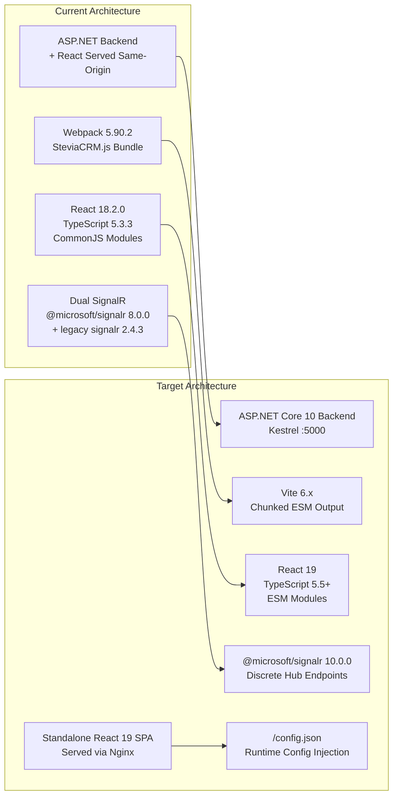
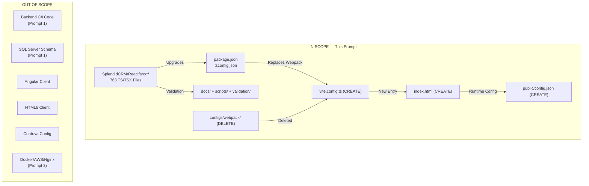

# Technical Specification

# 0. Agent Action Plan

## 0.1 Intent Clarification

### 0.1.1 Core Refactoring Objective

Based on the prompt, the Blitzy platform understands that the refactoring objective is to **modernize the SplendidCRM React SPA from a Webpack-based, same-origin-hosted frontend into a standalone, decoupled React 19 / Vite application running on Node 20 LTS** — while preserving 100% visual and functional parity across all CRM modules.

**Refactoring Type:** Tech stack migration + Build toolchain modernization + Hosting decoupling

**Target Repository:** Same repository — the frontend at `SplendidCRM/React/` is extracted into a standalone workspace within the existing monorepo.

**Prompt Context:** This is **Prompt 2 of 3** in the SplendidCRM modernization initiative. Prompt 1 (backend .NET 10 migration) is confirmed complete (85.5%, 600 tests passing, zero build errors). Prompt 3 covers containerization, AWS infrastructure, and deployment. This prompt covers the frontend modernization exclusively.

**Refactoring Goals with Enhanced Clarity:**

- **React 18.2.0 → React 19 Upgrade:** Address all breaking changes including removal of `defaultProps` on function components, deprecated legacy context API, `forwardRef` pattern changes, `StrictMode` behavioral updates, and PropTypes removal. The codebase has zero `defaultProps`, zero `ReactDOM.render`, zero `forwardRef` usage, and already uses `createRoot` — indicating high migration readiness.
- **Webpack 5.90.2 → Vite Migration:** Replace 6 Webpack configuration files (`common.js`, `dev_local.js`, `dev_remote.js`, `mobile.js`, `prod.js`, `prod_minimize.js`) with a single `vite.config.ts`. Migrate from thread-loader/ts-loader/style-loader/css-loader/sass-loader/svg-inline-loader/file-loader/url-loader/ForkTsCheckerWebpackPlugin/HtmlWebpackPlugin/WebpackPwaManifest to Vite-native equivalents. Abandon the single-file `SteviaCRM.js` bundle pattern in favor of Vite's chunked output with `index.html` entry point.
- **TypeScript 5.3.3 → 5.5+ Upgrade:** Modernize `tsconfig.json` from `target: ES5` / `module: CommonJS` to `target: ES2015+` / `module: ESNext` / `moduleResolution: bundler`. Preserve `experimentalDecorators: true` for MobX decorator syntax.
- **CommonJS → ESM Module Transition:** Convert 44 files using `require()` calls (40+ in `BusinessProcesses/`, plus `DynamicLayout_Compile.ts`, `ProcessButtons.tsx`, `UserDropdown.tsx`) and 1 file using `module.exports` (`adal.ts`) to ESM `import`/`export` syntax.
- **Node 16.20 → Node 20 LTS Compatibility:** Ensure all dependencies and build tooling operate on Node 20 LTS. Node 20.20.1 is already installed in the environment.
- **Package Manager Modernization:** Migrate from Yarn 1.22 to npm (current LTS), aligning with `npm run build` as the canonical build command.
- **Same-Origin Hosting → Standalone Decoupled SPA:** Remove the assumption that the React app is served from the same origin as the ASP.NET backend. Implement runtime configuration injection via `/config.json` for `API_BASE_URL`, `SIGNALR_URL`, and `ENVIRONMENT`.
- **SignalR Client Upgrade:** Replace `@microsoft/signalr` 8.0.0 with 10.0.0 and remove legacy `signalr` 2.4.3 jQuery-based client entirely. Update hub connection URLs from legacy `/signalr` to discrete ASP.NET Core endpoints: `/hubs/chat`, `/hubs/twilio`, `/hubs/phoneburner`.
- **Dependency Modernization:** Upgrade all npm dependencies to React 19 / Node 20 compatible versions, including critical updates like `lodash` 3.10.1 → 4.x (security), `react-router-dom` 6.22.1 → `react-router` 7.x, `node-sass` 9.0.0 → `sass` (Dart Sass), and React Bootstrap to a React 19 compatible version.
- **`@babel/standalone` Preservation:** Maintain the runtime in-browser TSX compilation capability used by `DynamicLayout_Compile.ts` for metadata-driven UI rendering. This package must remain a production dependency and must not be tree-shaken or excluded by Vite's optimization.

**Implicit Requirements Surfaced:**

- **CORS Configuration:** The decoupled frontend requires the backend's `CORS_ORIGINS` environment variable to include the frontend origin for cross-origin API calls to succeed.
- **Credential Forwarding:** All `fetch` calls must include `credentials: 'include'` for cross-origin cookie-based authentication.
- **Cordova Compatibility:** The React SPA is also wrapped by Cordova 12.0.0 for mobile. Build changes must not break the mobile deployment pathway; however, Cordova configuration itself is explicitly out of scope.
- **SCSS → Dart Sass Migration:** The current build uses `node-sass` 9.0.0, which is deprecated and incompatible with Node 20. Migration to `sass` (Dart Sass) is required. Only 1 SCSS file (`index.scss`) and 17 CSS files exist.
- **webpack.ProvidePlugin Replacement:** The current Webpack config provides `process` as a global via `process/browser`. Vite handles environment differently — this requires explicit handling via `define` configuration or a polyfill.
- **External Module Handling:** Webpack externalizes `xlsx`, `canvg`, and `pdfmake` as CommonJS modules. Vite must handle these via `optimizeDeps` pre-bundling or `ssr.external` configuration.
- **CKEditor 5 Custom Build:** The CKEditor custom build at `SplendidCRM/React/ckeditor5-custom-build/` has its own Webpack configuration. This build produces pre-compiled output in `build/` and must be preserved as a local dependency.

### 0.1.2 Technical Interpretation

This refactoring translates to the following technical transformation strategy:

**Architecture Transformation — Before and After:**



**Transformation Rules and Patterns:**

- **Build Entry Point:** Transform from Webpack JS entry (`src/index.tsx` → `SteviaCRM.js`) to Vite HTML entry (`index.html` → chunked `dist/` output with auto-injected `<script type="module">`)
- **Module System:** Transform all application source from CommonJS (`require()` / `module.exports`) to ESM (`import` / `export`). Vite's `optimizeDeps` handles third-party CJS dependencies.
- **API Communication:** Transform from implicit same-origin relative URLs to explicit `config.API_BASE_URL + path` for every REST, SignalR, and file upload call.
- **Configuration:** Transform from build-time constants to runtime-injected values via `/config.json` loaded before React app initialization.
- **SignalR Connections:** Transform from single `/signalr` endpoint with hub multiplexing to three discrete hub endpoints (`/hubs/chat`, `/hubs/twilio`, `/hubs/phoneburner`).
- **CSS Processing:** Transform from Webpack's loader chain (`style-loader` → `css-loader` → `postcss-loader` → `sass-loader`) to Vite's built-in CSS/PostCSS/Sass support.
- **Asset Handling:** Transform from Webpack's `file-loader`/`url-loader`/`svg-inline-loader` to Vite's built-in asset handling with `?inline` for SVGs and automatic asset fingerprinting.
- **Type Checking:** Transform from `ForkTsCheckerWebpackPlugin` (in-build type checking) to `tsc --noEmit` as a separate script (Vite does not type-check during builds).

**Confirmed Backend API Contracts (from Prompt 1):**

- REST API: `{API_BASE_URL}/Rest.svc/` — 152 endpoints
- Admin API: `{API_BASE_URL}/Administration/Rest.svc/` — 65 endpoints
- SignalR Hubs: `{API_BASE_URL}/hubs/chat`, `{API_BASE_URL}/hubs/twilio`, `{API_BASE_URL}/hubs/phoneburner`
- Health Check: `GET {API_BASE_URL}/api/health` → HTTP 200
- SOAP: Preserved via SoapCore — not consumed by React frontend
- JSON Serialization: Newtonsoft.Json 13.0.3 fallback alongside System.Text.Json — defensive parsing recommended

## 0.2 Source Analysis

### 0.2.1 Comprehensive Source File Discovery

The migration target is the React SPA located at `SplendidCRM/React/`. A thorough scan of this directory reveals 763 TypeScript/TSX source files, 17 CSS files, 1 SCSS file, and 0 JavaScript source files — the entire application is TypeScript.

**Current Structure Mapping:**

```
SplendidCRM/React/
├── config.xml                          (Cordova configuration — out of scope)
├── package.json                        (v15.2.9366 — primary migration target)
├── package-lock.json                   (current lockfile — to be regenerated)
├── tsconfig.json                       (TypeScript config — requires modernization)
├── .vscode/                            (VS Code settings)
├── ckeditor5-custom-build/             (Custom CKEditor 5 — preserve as local dep)
│   ├── package.json
│   ├── webpack.config.js               (CKEditor's own Webpack build — separate concern)
│   ├── build/                          (Pre-compiled CKEditor output)
│   │   ├── ckeditor.js
│   │   └── translations/
│   └── src/
│       └── ckeditor.ts                 (Plugin configuration)
├── configs/
│   └── webpack/                        (6 Webpack configs — to be REMOVED)
│       ├── common.js                   (Shared loaders, plugins, externals)
│       ├── dev_local.js                (Dev server → localhost:80)
│       ├── dev_remote.js               (Dev server → training.splendidcrm.com)
│       ├── mobile.js                   (Cordova build with awesome-typescript-loader)
│       ├── prod.js                     (Production bundle)
│       └── prod_minimize.js            (Minified production bundle)
├── src/
│   ├── index.tsx                       (App entry — createRoot, createBrowserRouter)
│   ├── index.html.ejs                  (Webpack HTML template — to be replaced)
│   ├── index.scss                      (Global SCSS — only SCSS file in project)
│   ├── App.tsx                         (Root app component)
│   ├── AppVersion.ts                   (Version constant)
│   ├── PrivateRoute.tsx                (Auth-guarded route wrapper)
│   ├── PublicRouteFC.tsx               (Public route wrapper)
│   ├── Router5.tsx                     (Legacy router — unused?)
│   ├── routes.tsx                      (Route definitions)
│   ├── scripts/                        (44 infrastructure modules)
│   │   ├── SplendidRequest.ts          (HTTP abstraction — requires API_BASE_URL)
│   │   ├── SplendidCache.ts            (Metadata cache — MobX observable)
│   │   ├── Credentials.ts             (Auth state — MobX @observable decorators)
│   │   ├── DynamicLayout.ts            (Layout resolution)
│   │   ├── DynamicLayout_Compile.ts    (Runtime TSX compilation via @babel/standalone)
│   │   ├── Application.ts             (App initialization)
│   │   ├── Login.ts                    (Auth flow)
│   │   ├── Security.ts                (Role/ACL checks)
│   │   ├── Formatting.ts              (Display formatting)
│   │   ├── L10n.ts                    (Localization)
│   │   ├── Sql.ts                     (SQL query helpers)
│   │   ├── utility.ts                 (General utilities)
│   │   ├── adal.ts                    (Azure AD auth — has module.exports)
│   │   └── ... (30+ more infrastructure scripts)
│   ├── SignalR/                         (14 files — dual SignalR implementation)
│   │   ├── SignalRCoreStore.ts          (Core SignalR orchestration store)
│   │   ├── SignalRStore.ts              (Legacy SignalR store)
│   │   ├── ChatCore.ts                  (Chat hub — @microsoft/signalr)
│   │   ├── Chat.ts                      (Chat hub — legacy jQuery signalr)
│   │   ├── TwilioCore.ts               (Twilio hub — Core)
│   │   ├── Twilio.ts                    (Twilio hub — legacy)
│   │   ├── PhoneBurnerCore.ts           (PhoneBurner hub — Core)
│   │   ├── PhoneBurner.ts              (PhoneBurner hub — legacy)
│   │   ├── AsteriskCore.ts             (Asterisk hub — Core)
│   │   ├── Asterisk.ts                  (Asterisk hub — legacy)
│   │   ├── AvayaCore.ts                (Avaya hub — Core)
│   │   ├── Avaya.ts                     (Avaya hub — legacy)
│   │   ├── TwitterCore.ts              (Twitter hub — Core)
│   │   └── Twitter.ts                   (Twitter hub — legacy)
│   ├── views/                           (30+ high-level view components)
│   │   ├── DetailView.tsx
│   │   ├── EditView.tsx
│   │   ├── ListView.tsx
│   │   ├── DashboardView.tsx
│   │   ├── AdministrationView.tsx
│   │   ├── CalendarView.tsx
│   │   ├── BigCalendarView.tsx
│   │   ├── ChatDashboardView.tsx
│   │   ├── DynamicDetailView.tsx
│   │   ├── DynamicEditView.tsx
│   │   ├── DynamicListView.tsx
│   │   ├── DynamicLayoutView.tsx
│   │   └── ... (20+ more view components)
│   ├── components/                      (22 shared UI components)
│   │   ├── CKEditor.tsx                 (Rich text integration)
│   │   ├── SplendidGrid.tsx             (Data grid component)
│   │   ├── SplendidStream.tsx           (Activity stream)
│   │   ├── DynamicButtons.tsx           (Metadata-driven buttons)
│   │   ├── ProcessButtons.tsx           (BPMN buttons — has require())
│   │   ├── UserDropdown.tsx             (User menu — has require())
│   │   ├── SchedulingGrid.tsx           (Schedule display)
│   │   └── ... (15 more components)
│   ├── ModuleViews/                     (48 CRM module folders)
│   │   ├── Accounts/
│   │   ├── Contacts/
│   │   ├── Leads/
│   │   ├── Opportunities/
│   │   ├── Cases/
│   │   ├── Campaigns/
│   │   ├── Emails/
│   │   ├── Administration/
│   │   │   └── BusinessProcesses/       (40+ files with require() — BPMN integration)
│   │   ├── ... (40 more module folders)
│   │   ├── Router5.tsx
│   │   └── index.ts
│   ├── types/                           (42 TypeScript type definition files)
│   │   ├── MODULE.ts, CONFIG.ts, EDITVIEWS.ts, DETAILVIEWS.ts, ...
│   │   └── ... (domain-specific interfaces)
│   ├── styles/                          (Theme CSS files)
│   │   ├── Arctic/                      (style.css, ChatDashboard.css, ...)
│   │   ├── Atlantic.css
│   │   ├── Seven/
│   │   ├── Six/
│   │   ├── gentelella/
│   │   └── mobile.css
│   ├── ThemeComponents/                 (7 theme implementations + factories)
│   │   ├── Arctic/, Atlantic/, Pacific/, Seven/, Six/, Sugar/, Sugar2006/
│   │   ├── HeaderButtonsFactory.ts
│   │   ├── SubPanelButtonsFactory.ts
│   │   └── index.ts
│   ├── Dashlets/                        (Dashboard widget components)
│   ├── DashletsJS/                      (JavaScript-based dashlets)
│   ├── DashboardComponents/             (Dashboard infrastructure)
│   ├── CustomViewsJS/                   (Custom view implementations)
│   ├── DetailComponents/                (Detail view building blocks)
│   ├── EditComponents/                  (Edit view building blocks)
│   ├── GridComponents/                  (Grid/list building blocks)
│   ├── DynamicLayoutComponents/         (Layout editor components)
│   ├── ModuleBuilder/                   (Module builder interface)
│   ├── ReportDesigner/                  (Report builder components)
│   ├── SurveyComponents/               (Survey module components)
│   └── SignalR/                         (see above)
└── www/
    ├── index.html                       (SPA shell — loads SteviaCRM.js)
    ├── index.css                        (Global theme overrides)
    └── manifest.json                    (PWA metadata)
```

### 0.2.2 CommonJS require() Hotspot Analysis

44 files in the source tree use CommonJS `require()` patterns that must be converted to ESM `import` statements for Vite compatibility.

| Location Pattern | File Count | Context |
|---|---|---|
| `src/ModuleViews/Administration/BusinessProcesses/**/*.ts` | 40 | bpmn-js integration modules using `require()` for diagram.js plugin registration |
| `src/scripts/DynamicLayout_Compile.ts` | 1 | Runtime compilation — 44+ `require()` calls making modules available to `@babel/standalone` compiled components |
| `src/components/ProcessButtons.tsx` | 1 | Lazy-loads BPMN process button functionality |
| `src/components/UserDropdown.tsx` | 1 | Lazy-loads user dropdown dependencies |
| `src/scripts/adal.ts` | 1 | Azure AD auth library — sole `module.exports` usage |

**Critical Note on `DynamicLayout_Compile.ts`:** This file's `require()` calls are not standard module imports — they register modules in a global scope so that `@babel/standalone`-compiled components can reference them at runtime. The ESM conversion strategy for this file must preserve the runtime module registry pattern, potentially using dynamic `import()` or a Vite-compatible module registration approach.

### 0.2.3 MobX Decorator Usage

The codebase uses MobX's legacy decorator syntax (`experimentalDecorators`) in 7 instances across infrastructure stores:

| File | Decorator Usage |
|---|---|
| `src/scripts/Credentials.ts` | `@observable` on authentication state properties (theme, date format, currency, user prefs) |
| Other MobX stores | `@observable`, `@action`, `@computed` on store class members |

The Vite build must include Babel plugin configuration for legacy decorator transpilation. The `@vitejs/plugin-react` plugin must be configured with `babel.plugins` including `['@babel/plugin-proposal-decorators', { legacy: true }]` and `['@babel/plugin-proposal-class-properties', { loose: true }]`.

### 0.2.4 SignalR Dual Implementation

The `src/SignalR/` directory contains 14 files implementing a dual SignalR architecture:

- **Core implementations** (`*Core.ts`): Use `@microsoft/signalr` `HubConnection` — these are the migration targets
- **Legacy implementations** (non-`Core` files): Use jQuery-based `signalr` 2.4.3 — these must be removed entirely

The Core implementations must be updated to:
- Use `@microsoft/signalr` 10.0.0 API
- Connect to discrete hub endpoints (`/hubs/chat`, `/hubs/twilio`, `/hubs/phoneburner`) instead of the legacy `/signalr` path
- Read hub URLs from runtime config (`API_BASE_URL` or `SIGNALR_URL`)

### 0.2.5 Build Configuration Analysis

**Current Webpack Configuration (6 files in `configs/webpack/`):**

| Config File | Purpose | Key Settings |
|---|---|---|
| `common.js` (117 lines) | Shared base configuration | ts-loader with thread-loader (4 workers), style-loader/css-loader/postcss-loader chain, sass-loader, svg-inline-loader, file-loader (fonts), url-loader (images), ForkTsCheckerWebpackPlugin, HtmlWebpackPlugin (index.html.ejs), WebpackPwaManifest, ProvidePlugin (process/browser), externals (xlsx/canvg/pdfmake) |
| `dev_local.js` | Local development | Merges common + devServer proxy to `http://localhost:80`, hot reload, source-map |
| `dev_remote.js` | Remote development | Merges common + devServer proxy to `https://training.splendidcrm.com`, source-map |
| `prod.js` | Production build | Merges common + output `SteviaCRM.js`, no minimization |
| `prod_minimize.js` | Minified production | Merges common + TerserPlugin minimization |
| `mobile.js` | Cordova mobile build | Uses `awesome-typescript-loader` instead of `ts-loader`, targets Cordova WebView |

### 0.2.6 Codebase Metrics Summary

| Metric | Count |
|---|---|
| TypeScript/TSX source files | 763 |
| JavaScript source files | 0 |
| CSS files | 17 |
| SCSS files | 1 (`index.scss`) |
| CRM module view folders | 48 |
| Infrastructure script files | 44 |
| SignalR hub files | 14 |
| Shared UI component files | 22 |
| High-level view files | 30+ |
| Type definition files | 42 |
| Theme variants | 7 (Arctic, Atlantic, Pacific, Seven, Six, Sugar, Sugar2006) |
| Files with `require()` patterns | 44 |
| Files with `module.exports` | 1 |
| MobX decorator instances | 7 |
| `defaultProps` usage | 0 |
| `ReactDOM.render` usage | 0 |
| `forwardRef` usage | 0 |
| `createRoot` usage | 1 (`index.tsx`) |

## 0.3 Scope Boundaries

### 0.3.1 Exhaustively In Scope

**Source Transformations:**

- `SplendidCRM/React/src/**/*.ts` — All 763 TypeScript source files requiring ESM conversion, React 19 compatibility, and import path updates
- `SplendidCRM/React/src/**/*.tsx` — All TSX component files for React 19 API compliance
- `SplendidCRM/React/src/scripts/**/*.ts` — 44 infrastructure modules (SplendidRequest, Credentials, DynamicLayout_Compile, etc.)
- `SplendidCRM/React/src/SignalR/**/*.ts` — 14 SignalR files: remove 7 legacy files, upgrade 7 Core files
- `SplendidCRM/React/src/ModuleViews/Administration/BusinessProcesses/**/*.ts` — 40+ BPMN integration files with `require()` → ESM conversion
- `SplendidCRM/React/src/components/ProcessButtons.tsx` — require() → ESM conversion
- `SplendidCRM/React/src/components/UserDropdown.tsx` — require() → ESM conversion
- `SplendidCRM/React/src/scripts/adal.ts` — module.exports → ESM export conversion

**Build Configuration:**

- `SplendidCRM/React/package.json` — Complete rewrite: remove Webpack/Babel dev deps, add Vite deps, update scripts, upgrade all runtime deps
- `SplendidCRM/React/tsconfig.json` — Modernize: target ES2015+, module ESNext, moduleResolution bundler, preserve experimentalDecorators
- `SplendidCRM/React/vite.config.ts` — CREATE: New Vite configuration with React plugin, Babel decorator support, dev proxy, asset handling, build output
- `SplendidCRM/React/index.html` — CREATE: Vite entry point HTML replacing index.html.ejs Webpack template
- `SplendidCRM/React/public/config.json` — CREATE: Development runtime config with localhost defaults

**Webpack Files to Remove:**

- `SplendidCRM/React/configs/webpack/common.js` — REMOVE
- `SplendidCRM/React/configs/webpack/dev_local.js` — REMOVE
- `SplendidCRM/React/configs/webpack/dev_remote.js` — REMOVE
- `SplendidCRM/React/configs/webpack/mobile.js` — REMOVE
- `SplendidCRM/React/configs/webpack/prod.js` — REMOVE
- `SplendidCRM/React/configs/webpack/prod_minimize.js` — REMOVE
- `SplendidCRM/React/configs/` — REMOVE (entire directory)

**Runtime Configuration:**

- `SplendidCRM/React/src/scripts/SplendidRequest.ts` — Prepend `API_BASE_URL` to all HTTP request URLs
- `SplendidCRM/React/src/scripts/Credentials.ts` — Update `RemoteServer` getter to read from runtime config
- `SplendidCRM/React/src/scripts/Application.ts` — Load `/config.json` before app initialization
- `SplendidCRM/React/src/index.tsx` — Initialize runtime config before `createRoot`
- `SplendidCRM/React/src/SignalR/ChatCore.ts` — Use runtime config for hub URL
- `SplendidCRM/React/src/SignalR/TwilioCore.ts` — Use runtime config for hub URL
- `SplendidCRM/React/src/SignalR/PhoneBurnerCore.ts` — Use runtime config for hub URL
- `SplendidCRM/React/src/SignalR/AsteriskCore.ts` — Use runtime config for hub URL
- `SplendidCRM/React/src/SignalR/AvayaCore.ts` — Use runtime config for hub URL
- `SplendidCRM/React/src/SignalR/TwitterCore.ts` — Use runtime config for hub URL

**Import Corrections:**

- `SplendidCRM/React/src/**/*.ts` — Update `react-router-dom` imports to `react-router`
- `SplendidCRM/React/src/**/*.tsx` — Update `react-router-dom` imports to `react-router`
- `SplendidCRM/React/src/ModuleViews/Administration/BusinessProcesses/**/*.ts` — Convert `require()` to `import`
- `SplendidCRM/React/src/scripts/DynamicLayout_Compile.ts` — Restructure `require()` registry for ESM compatibility

**CSS/Style Updates:**

- `SplendidCRM/React/src/index.scss` — Verify Dart Sass compatibility (replacing node-sass)
- `SplendidCRM/React/src/styles/**/*.css` — 17 CSS files, verify Vite CSS processing

**Documentation and Validation:**

- `docs/environment-setup.md` — CREATE: Full-stack environment setup guide
- `scripts/build-and-run.sh` — CREATE: Automated local development setup script
- `validation/screenshots/` — CREATE: E2E test screenshot evidence directory
- `validation/database-changes.md` — CREATE: Schema change log (ideally empty)
- `validation/backend-changes.md` — CREATE: Backend change log (ideally empty)

**Dependencies to Add:**

- `vite` — Build tool
- `@vitejs/plugin-react` — React plugin for Vite with Babel support
- `sass` — Dart Sass (replacing node-sass)
- `@microsoft/signalr@10.0.0` — Upgraded SignalR client

**Dependencies to Remove:**

- `webpack`, `webpack-cli`, `webpack-dev-server` — Replaced by Vite
- `ts-loader`, `thread-loader`, `awesome-typescript-loader` — Replaced by Vite's built-in TypeScript support
- `style-loader`, `css-loader`, `postcss-loader`, `sass-loader` — Replaced by Vite's built-in CSS processing
- `svg-inline-loader`, `file-loader`, `url-loader` — Replaced by Vite's built-in asset handling
- `fork-ts-checker-webpack-plugin` — Replaced by separate `tsc --noEmit`
- `html-webpack-plugin`, `webpack-pwa-manifest` — Replaced by Vite's HTML entry and PWA plugin
- `terser-webpack-plugin`, `webpack-merge` — No longer needed
- `node-sass` — Replaced by `sass` (Dart Sass)
- `signalr` (2.4.3) — Legacy jQuery SignalR client removed
- `react-router-dom` — Replaced by `react-router` (v7 consolidation)

### 0.3.2 Explicitly Out of Scope

**Backend Code (Prompt 1 Responsibility):**

- `SplendidCRM/_code/**/*.cs` — All C# backend code
- `SplendidCRM/Administration/**/*.cs` — Admin backend code
- `SplendidCRM/Web.config` — ASP.NET configuration
- SQL Server schema, stored procedures, views — Database layer
- **Exception:** Minimal backend/schema changes permitted ONLY as last resort to unblock E2E test failures, documented in `validation/backend-changes.md` and `validation/database-changes.md`

**Other Frontend Clients:**

- `SplendidCRM/Angular/` — Angular 13 experimental client, excluded from modernization
- `SplendidCRM/html5/` — Legacy HTML5/jQuery client, excluded
- `SplendidCRM/*.aspx` / `SplendidCRM/*.ascx` — WebForms pages, excluded

**Mobile Platform Configuration:**

- `SplendidCRM/React/config.xml` — Cordova configuration (separate effort)
- Cordova platform plugins — Android/iOS native layer
- Mobile-specific Webpack config migration (`mobile.js`) — Cordova build is a separate concern

**Architecture and Design Decisions:**

- New UI features, screens, or module additions — NOT permitted
- UI/UX redesign or visual improvements — Visual parity only
- CSS framework migration — Bootstrap stays at 5.3.x
- State management migration — MobX stays (no Redux/Zustand)
- `moment` → `date-fns` migration — Explicitly out of scope
- Class component → function component conversion — Only if React 19 forces deprecation
- `lodash` → native utilities migration — Only 3.x → 4.x security upgrade

**Infrastructure (Prompt 3 Responsibility):**

- Docker containerization
- AWS ECS/Fargate deployment
- Nginx configuration
- ALB setup
- CI/CD pipeline creation

### 0.3.3 Scope Boundary Diagram



## 0.4 Target Design

### 0.4.1 Refactored Structure Planning

The target architecture transforms `SplendidCRM/React/` from a Webpack-hosted, same-origin React 18 app into a standalone Vite-powered React 19 workspace. The existing component and module organization is preserved — only the build tooling, configuration, and infrastructure layers change.

**Target Architecture:**

```
SplendidCRM/React/                     (Standalone React 19 + Vite workspace)
├── index.html                          (CREATE — Vite HTML entry point)
├── package.json                        (UPDATE — React 19, Vite, ESM deps)
├── package-lock.json                   (REGENERATE — via npm install)
├── tsconfig.json                       (UPDATE — ES2015+, ESNext modules)
├── vite.config.ts                      (CREATE — Vite config with React plugin)
├── .npmrc                              (CREATE — if needed for registry config)
├── public/
│   ├── config.json                     (CREATE — runtime config defaults)
│   ├── manifest.json                   (MOVE — from www/)
│   └── favicon.ico                     (MOVE — from www/ or existing assets)
├── ckeditor5-custom-build/             (PRESERVE — local CKEditor dependency)
│   ├── package.json                    (PRESERVE — CKEditor's own build)
│   ├── build/
│   │   ├── ckeditor.js                 (PRESERVE — pre-compiled output)
│   │   └── translations/
│   └── src/
│       └── ckeditor.ts
├── src/
│   ├── index.tsx                       (UPDATE — config loading before createRoot)
│   ├── index.scss                      (UPDATE — verify Dart Sass compat)
│   ├── App.tsx                         (UPDATE — React 19 compat)
│   ├── AppVersion.ts                   (PRESERVE)
│   ├── config.ts                       (CREATE — runtime config loader module)
│   ├── PrivateRoute.tsx                (UPDATE — react-router v7 imports)
│   ├── PublicRouteFC.tsx               (UPDATE — react-router v7 imports)
│   ├── routes.tsx                      (UPDATE — react-router v7 imports)
│   ├── vite-env.d.ts                   (CREATE — Vite type declarations)
│   ├── scripts/                        (UPDATE — ESM conversion, API_BASE_URL)
│   │   ├── SplendidRequest.ts          (UPDATE — prepend API_BASE_URL)
│   │   ├── Credentials.ts             (UPDATE — runtime config for RemoteServer)
│   │   ├── DynamicLayout_Compile.ts    (UPDATE — ESM-compatible module registry)
│   │   ├── Application.ts             (UPDATE — config initialization)
│   │   ├── Login.ts                    (UPDATE — ESM imports)
│   │   ├── adal.ts                    (UPDATE — module.exports → export default)
│   │   └── ... (remaining 38 scripts — ESM conversion)
│   ├── SignalR/                         (UPDATE — remove legacy, upgrade Core)
│   │   ├── SignalRCoreStore.ts          (UPDATE — signalr 10.x, runtime URLs)
│   │   ├── ChatCore.ts                  (UPDATE — /hubs/chat endpoint)
│   │   ├── TwilioCore.ts               (UPDATE — /hubs/twilio endpoint)
│   │   ├── PhoneBurnerCore.ts           (UPDATE — /hubs/phoneburner endpoint)
│   │   ├── AsteriskCore.ts             (UPDATE — runtime hub URL)
│   │   ├── AvayaCore.ts                (UPDATE — runtime hub URL)
│   │   ├── TwitterCore.ts              (UPDATE — runtime hub URL)
│   │   ├── SignalRStore.ts              (REMOVE — legacy jQuery signalr)
│   │   ├── Chat.ts                      (REMOVE — legacy)
│   │   ├── Twilio.ts                    (REMOVE — legacy)
│   │   ├── PhoneBurner.ts              (REMOVE — legacy)
│   │   ├── Asterisk.ts                  (REMOVE — legacy)
│   │   ├── Avaya.ts                     (REMOVE — legacy)
│   │   └── Twitter.ts                   (REMOVE — legacy)
│   ├── views/**/*.tsx                   (UPDATE — react-router v7 imports)
│   ├── components/**/*.tsx              (UPDATE — ESM, React 19 compat)
│   ├── ModuleViews/**/*.tsx             (UPDATE — ESM, react-router v7 imports)
│   ├── ModuleViews/Administration/BusinessProcesses/**/*.ts
│   │                                    (UPDATE — require() → import)
│   ├── types/**/*.ts                    (PRESERVE — type definitions)
│   ├── styles/**/*.css                  (PRESERVE — CSS files)
│   ├── ThemeComponents/**/*.ts          (UPDATE — ESM imports)
│   ├── Dashlets/**/*.tsx                (UPDATE — ESM, React 19)
│   ├── DashletsJS/**/*.tsx              (UPDATE — ESM)
│   ├── DashboardComponents/**/*.tsx     (UPDATE — ESM)
│   ├── DetailComponents/**/*.tsx        (UPDATE — ESM)
│   ├── EditComponents/**/*.tsx          (UPDATE — ESM)
│   ├── GridComponents/**/*.tsx          (UPDATE — ESM)
│   ├── DynamicLayoutComponents/**/*.tsx (UPDATE — ESM)
│   ├── ModuleBuilder/**/*.tsx           (UPDATE — ESM)
│   ├── ReportDesigner/**/*.tsx          (UPDATE — ESM)
│   ├── SurveyComponents/**/*.tsx        (UPDATE — ESM)
│   └── CustomViewsJS/**/*.tsx           (UPDATE — ESM)
├── dist/                                (BUILD OUTPUT — Vite production)
│   ├── index.html                       (Vite-generated with script injection)
│   └── assets/
│       ├── index-[hash].js              (App entry chunk)
│       ├── vendor-[hash].js             (Vendor chunk)
│       └── index-[hash].css             (Compiled styles)
├── docs/
│   └── environment-setup.md             (CREATE — full-stack setup guide)
├── scripts/
│   └── build-and-run.sh                 (CREATE — automated setup script)
├── validation/
│   ├── screenshots/                     (CREATE — E2E test evidence)
│   ├── database-changes.md              (CREATE — schema change log)
│   └── backend-changes.md               (CREATE — backend change log)
└── www/                                 (DEPRECATE — Webpack output directory)
    ├── index.html                       (SUPERSEDED by root index.html)
    ├── index.css                        (REVIEW — merge into src/styles if needed)
    └── manifest.json                    (MOVE to public/)
```

### 0.4.2 Web Search Research Conducted

Research was conducted on the following topics to inform the target design:

- **React 19 Breaking Changes:** React official upgrade guide confirms removal of `defaultProps` on function components, PropTypes silently ignored, legacy context removed, `forwardRef` simplified (ref as prop), `StrictMode` improvements. The SplendidCRM codebase has zero usage of deprecated patterns — migration readiness is high.
- **Vite Version Selection:** Vite 6.x is the recommended stable version for production use with Node 20. Vite 7 requires Node 20.19+ and Vite 8 (latest, using Rolldown) requires Node 20.19+. Since the user's prompt specifies "Vite (latest stable)" and Node 20 LTS, **Vite 6.x** is the safe target — it is the latest major version with proven Node 20 compatibility and broad ecosystem support. Vite 7/8 may also work but introduce more migration risk.
- **React Router v6 → v7 Migration:** The v7 upgrade is designed to have no breaking changes if future flags are enabled in v6. Key change: `react-router-dom` is consolidated into `react-router` package. `createBrowserRouter` and `RouterProvider` (already used by SplendidCRM) are the recommended router creation methods in v7.
- **MobX + React 19 Compatibility:** MobX releases confirm React 19 support was added in `mobx-react-lite@4.1.0` and `mobx-react@9.2.0`. The `mobx` core at 6.15.0 also supports React 19. Decorator support (`experimentalDecorators`) continues to work with appropriate Babel configuration.
- **@microsoft/signalr 10.0.0:** Latest stable version on npm, compatible with ASP.NET Core SignalR. API is compatible with 8.x — `HubConnectionBuilder`, `withUrl()`, `.start()`, `.invoke()`, `.on()` patterns unchanged.
- **node-sass → sass Migration:** `node-sass` is deprecated and incompatible with Node 20. `sass` (Dart Sass) is the official replacement with compatible API. Vite uses `sass` natively.

### 0.4.3 Design Pattern Applications

- **Runtime Configuration Pattern:** A config loader module (`src/config.ts`) fetches `/config.json` at startup and exports a typed singleton. All modules read from this singleton rather than environment variables or build-time constants. This pattern enables the same build artifact to run in any environment.
- **API Base URL Injection:** `SplendidRequest.ts` adopts a base URL prefix pattern where every HTTP call prepends `config.API_BASE_URL` to the request path. This replaces the implicit same-origin assumption.
- **Hub Connection Factory:** SignalR Core stores adopt a factory pattern where hub URLs are constructed from `config.API_BASE_URL + '/hubs/{hubName}'`, replacing hardcoded paths.
- **ESM Module Registry (for DynamicLayout_Compile):** The runtime compilation system requires a module registry that `@babel/standalone`-compiled components can access. The refactored approach pre-imports all required modules via ESM and registers them in a global map, replacing the `require()` registry.
- **Vite Plugin Composition:** The Vite config composes plugins for React (with Babel decorator support), SCSS, SVG handling, and PWA manifest generation.

### 0.4.4 Key Vite Configuration Design

```typescript
// vite.config.ts — key structure outline
export default defineConfig({
  plugins: [
    react({
      babel: {
        plugins: [
          ['@babel/plugin-proposal-decorators', { legacy: true }],
          ['@babel/plugin-proposal-class-properties', { loose: true }]
        ]
      }
    })
  ],
  resolve: { alias: { /* path aliases */ } },
  define: { 'process.env': {} },
  server: {
    proxy: {
      '/Rest.svc': 'http://localhost:5000',
      '/Administration/Rest.svc': 'http://localhost:5000',
      '/hubs': { target: 'http://localhost:5000', ws: true },
      '/api': 'http://localhost:5000'
    }
  },
  build: {
    outDir: 'dist',
    sourcemap: true
  },
  optimizeDeps: {
    include: ['@babel/standalone']
  }
})
```

### 0.4.5 Runtime Configuration Design

```json
// public/config.json — development defaults
{
  "API_BASE_URL": "http://localhost:5000",
  "SIGNALR_URL": "",
  "ENVIRONMENT": "development"
}
```

The config loader module (`src/config.ts`) fetches this file before app initialization and exports a typed configuration object. The `SIGNALR_URL` defaults to `API_BASE_URL` when empty or omitted. The `index.html` entry point includes an inline script that loads config before the Vite module entry.

### 0.4.6 Handoff Artifacts for Prompt 3

The following information is documented for the containerization prompt:

- **Build command:** `npm run build` → output directory `dist/`
- **config.json schema:** `{ "API_BASE_URL": "string", "SIGNALR_URL": "string (optional)", "ENVIRONMENT": "string" }`
- **Nginx requirements:** SPA fallback (`try_files $uri $uri/ /index.html`), static asset cache headers, no proxy pass needed
- **Entrypoint script:** Writes env vars → `/usr/share/nginx/html/config.json`
- **API_BASE_URL format:** Full URL to ALB backend (e.g., `http://internal-alb-dns`)
- **Zero build-time env vars:** All config is runtime-injected

## 0.5 Transformation Mapping

### 0.5.1 File-by-File Transformation Plan

The entire refactor is executed in **ONE phase**. Every target file is mapped to a source file with explicit transformation mode and key changes.

**Build Configuration and Project Root Files:**

| Target File | Transformation | Source File | Key Changes |
|---|---|---|---|
| `SplendidCRM/React/package.json` | UPDATE | `SplendidCRM/React/package.json` | Remove all 81 current deps; add React 19, Vite, ESM-compatible deps; update scripts to `vite build`/`vite`/`vite preview`; remove Webpack/Babel/Cordova dev deps |
| `SplendidCRM/React/tsconfig.json` | UPDATE | `SplendidCRM/React/tsconfig.json` | Change target ES5→ES2015, module CommonJS→ESNext, add moduleResolution bundler, preserve experimentalDecorators, update jsx to react-jsx |
| `SplendidCRM/React/vite.config.ts` | CREATE | `SplendidCRM/React/configs/webpack/common.js` | New Vite config: @vitejs/plugin-react with Babel decorator plugins, dev proxy, CSS/SCSS support, optimizeDeps for @babel/standalone, define process.env |
| `SplendidCRM/React/index.html` | CREATE | `SplendidCRM/React/src/index.html.ejs` | Vite HTML entry point: config.json loading script, `<script type="module" src="/src/index.tsx">`, PWA manifest link |
| `SplendidCRM/React/public/config.json` | CREATE | — | Runtime config: `{"API_BASE_URL":"http://localhost:5000","SIGNALR_URL":"","ENVIRONMENT":"development"}` |
| `SplendidCRM/React/public/manifest.json` | CREATE | `SplendidCRM/React/www/manifest.json` | Move PWA manifest to Vite public directory |
| `SplendidCRM/React/package-lock.json` | CREATE | — | Regenerated by npm install |

**Files to Remove:**

| Target File | Transformation | Source File | Key Changes |
|---|---|---|---|
| `SplendidCRM/React/configs/webpack/common.js` | REMOVE | — | Replaced by vite.config.ts |
| `SplendidCRM/React/configs/webpack/dev_local.js` | REMOVE | — | Replaced by vite.config.ts server.proxy |
| `SplendidCRM/React/configs/webpack/dev_remote.js` | REMOVE | — | Replaced by vite.config.ts server.proxy |
| `SplendidCRM/React/configs/webpack/mobile.js` | REMOVE | — | Cordova build out of scope |
| `SplendidCRM/React/configs/webpack/prod.js` | REMOVE | — | Replaced by vite build |
| `SplendidCRM/React/configs/webpack/prod_minimize.js` | REMOVE | — | Replaced by vite build (minified by default) |
| `SplendidCRM/React/src/index.html.ejs` | REMOVE | — | Replaced by root index.html |

**Application Entry and Routing:**

| Target File | Transformation | Source File | Key Changes |
|---|---|---|---|
| `SplendidCRM/React/src/index.tsx` | UPDATE | `SplendidCRM/React/src/index.tsx` | Load config.json before createRoot; update react-router-dom→react-router imports; update createBrowserRouter for v7 |
| `SplendidCRM/React/src/config.ts` | CREATE | `SplendidCRM/React/src/scripts/Credentials.ts` | New runtime config loader: fetch /config.json, export typed AppConfig singleton with API_BASE_URL, SIGNALR_URL, ENVIRONMENT |
| `SplendidCRM/React/src/vite-env.d.ts` | CREATE | — | Vite client type declarations: `/// <reference types="vite/client" />` |
| `SplendidCRM/React/src/App.tsx` | UPDATE | `SplendidCRM/React/src/App.tsx` | React 19 compatibility review; verify no deprecated API usage |
| `SplendidCRM/React/src/PrivateRoute.tsx` | UPDATE | `SplendidCRM/React/src/PrivateRoute.tsx` | Change `from 'react-router-dom'` → `from 'react-router'` |
| `SplendidCRM/React/src/PublicRouteFC.tsx` | UPDATE | `SplendidCRM/React/src/PublicRouteFC.tsx` | Change `from 'react-router-dom'` → `from 'react-router'` |
| `SplendidCRM/React/src/routes.tsx` | UPDATE | `SplendidCRM/React/src/routes.tsx` | Change `from 'react-router-dom'` → `from 'react-router'` |
| `SplendidCRM/React/src/Router5.tsx` | UPDATE | `SplendidCRM/React/src/Router5.tsx` | Change `from 'react-router-dom'` → `from 'react-router'`; update re-exports |

**Infrastructure Scripts (44 files in `src/scripts/`):**

| Target File | Transformation | Source File | Key Changes |
|---|---|---|---|
| `SplendidCRM/React/src/scripts/SplendidRequest.ts` | UPDATE | `SplendidCRM/React/src/scripts/SplendidRequest.ts` | Prepend `config.API_BASE_URL` to all HTTP request URLs; add `credentials: 'include'` for cross-origin; ESM imports |
| `SplendidCRM/React/src/scripts/Credentials.ts` | UPDATE | `SplendidCRM/React/src/scripts/Credentials.ts` | Update RemoteServer getter to read from runtime config; ESM imports |
| `SplendidCRM/React/src/scripts/DynamicLayout_Compile.ts` | UPDATE | `SplendidCRM/React/src/scripts/DynamicLayout_Compile.ts` | Convert 44+ require() calls to ESM imports; create module registry map for @babel/standalone runtime compilation |
| `SplendidCRM/React/src/scripts/Application.ts` | UPDATE | `SplendidCRM/React/src/scripts/Application.ts` | Initialize runtime config from /config.json during app startup; ESM imports |
| `SplendidCRM/React/src/scripts/adal.ts` | UPDATE | `SplendidCRM/React/src/scripts/adal.ts` | Convert `module.exports` to `export default` |
| `SplendidCRM/React/src/scripts/Login.ts` | UPDATE | `SplendidCRM/React/src/scripts/Login.ts` | ESM imports; verify API URL usage with runtime config |
| `SplendidCRM/React/src/scripts/*.ts` | UPDATE | `SplendidCRM/React/src/scripts/*.ts` | Remaining 38 scripts: ESM import verification, runtime config adoption where API calls exist |

**SignalR Files (14 files in `src/SignalR/`):**

| Target File | Transformation | Source File | Key Changes |
|---|---|---|---|
| `SplendidCRM/React/src/SignalR/SignalRCoreStore.ts` | UPDATE | `SplendidCRM/React/src/SignalR/SignalRCoreStore.ts` | Update @microsoft/signalr 8→10 API; remove jQuery proxy helpers; use runtime config for hub URLs |
| `SplendidCRM/React/src/SignalR/ChatCore.ts` | UPDATE | `SplendidCRM/React/src/SignalR/ChatCore.ts` | Hub URL: `{config.API_BASE_URL}/hubs/chat`; signalr 10.x API |
| `SplendidCRM/React/src/SignalR/TwilioCore.ts` | UPDATE | `SplendidCRM/React/src/SignalR/TwilioCore.ts` | Hub URL: `{config.API_BASE_URL}/hubs/twilio`; signalr 10.x API |
| `SplendidCRM/React/src/SignalR/PhoneBurnerCore.ts` | UPDATE | `SplendidCRM/React/src/SignalR/PhoneBurnerCore.ts` | Hub URL: `{config.API_BASE_URL}/hubs/phoneburner`; signalr 10.x API |
| `SplendidCRM/React/src/SignalR/AsteriskCore.ts` | UPDATE | `SplendidCRM/React/src/SignalR/AsteriskCore.ts` | Hub URL from runtime config; signalr 10.x API |
| `SplendidCRM/React/src/SignalR/AvayaCore.ts` | UPDATE | `SplendidCRM/React/src/SignalR/AvayaCore.ts` | Hub URL from runtime config; signalr 10.x API |
| `SplendidCRM/React/src/SignalR/TwitterCore.ts` | UPDATE | `SplendidCRM/React/src/SignalR/TwitterCore.ts` | Hub URL from runtime config; signalr 10.x API |
| `SplendidCRM/React/src/SignalR/SignalRStore.ts` | REMOVE | — | Legacy jQuery SignalR store — replaced by SignalRCoreStore |
| `SplendidCRM/React/src/SignalR/Chat.ts` | REMOVE | — | Legacy jQuery SignalR — replaced by ChatCore.ts |
| `SplendidCRM/React/src/SignalR/Twilio.ts` | REMOVE | — | Legacy — replaced by TwilioCore.ts |
| `SplendidCRM/React/src/SignalR/PhoneBurner.ts` | REMOVE | — | Legacy — replaced by PhoneBurnerCore.ts |
| `SplendidCRM/React/src/SignalR/Asterisk.ts` | REMOVE | — | Legacy — replaced by AsteriskCore.ts |
| `SplendidCRM/React/src/SignalR/Avaya.ts` | REMOVE | — | Legacy — replaced by AvayaCore.ts |
| `SplendidCRM/React/src/SignalR/Twitter.ts` | REMOVE | — | Legacy — replaced by TwitterCore.ts |

**BPMN / BusinessProcesses Files (40+ files with require()):**

| Target File | Transformation | Source File | Key Changes |
|---|---|---|---|
| `SplendidCRM/React/src/ModuleViews/Administration/BusinessProcesses/**/*.ts` | UPDATE | Same paths | Convert all `require()` calls to ESM `import` statements; bpmn-js plugin registration via ESM dynamic imports |

**Components with require() (2 files):**

| Target File | Transformation | Source File | Key Changes |
|---|---|---|---|
| `SplendidCRM/React/src/components/ProcessButtons.tsx` | UPDATE | Same path | Convert `require()` to ESM `import` |
| `SplendidCRM/React/src/components/UserDropdown.tsx` | UPDATE | Same path | Convert `require()` to ESM `import` |

**react-pose Dependent Files (53 files):**

The `react-pose` library (4.0.10) is deprecated and unmaintained. It must be evaluated for React 19 compatibility. If incompatible, replace with a lightweight CSS transition approach or `framer-motion` (which is the successor to `react-pose`). All 53 files using `posed` animations must be updated:

| Target File Pattern | Transformation | Key Changes |
|---|---|---|
| `SplendidCRM/React/src/components/Collapsable.tsx` | UPDATE | Replace `posed` collapse animation with React 19-compatible alternative |
| `SplendidCRM/React/src/ThemeComponents/*/SubPanelHeaderButtons.tsx` | UPDATE | Replace `posed` animation (6 theme variants) |
| `SplendidCRM/React/src/views/AccessView.tsx` | UPDATE | Replace `posed` animation |
| `SplendidCRM/React/src/views/DetailViewRelationships.tsx` | UPDATE | Replace `posed` animation |
| `SplendidCRM/React/src/views/SubPanelStreamView.tsx` | UPDATE | Replace `posed` animation |
| `SplendidCRM/React/src/views/SubPanelView.tsx` | UPDATE | Replace `posed` animation |
| `SplendidCRM/React/src/ModuleViews/Administration/**/*.tsx` | UPDATE | Replace `posed` animation (~30 admin files) |
| `SplendidCRM/React/src/ModuleViews/Campaigns/*.tsx` | UPDATE | Replace `posed` animation (3 files) |
| `SplendidCRM/React/src/ModuleViews/ChatChannels/ChatMessages.tsx` | UPDATE | Replace `posed` animation |
| `SplendidCRM/React/src/ModuleViews/Documents/DocumentRevisions.tsx` | UPDATE | Replace `posed` animation |
| `SplendidCRM/React/src/ModuleViews/Users/*.tsx` | UPDATE | Replace `posed` animation (4 files) |
| `SplendidCRM/React/src/ModuleViews/Invoices/Payments.tsx` | UPDATE | Replace `posed` animation |
| `SplendidCRM/React/src/ModuleViews/Surveys/*.tsx` | UPDATE | Replace `posed` animation |
| `SplendidCRM/React/src/ModuleViews/SurveyPages/SurveyQuestions.tsx` | UPDATE | Replace `posed` animation |

**react-lifecycle-appear Dependent Files (83 files):**

The `react-lifecycle-appear` library provides an `Appear` component for lifecycle hooks. It must be evaluated for React 19 compatibility. If incompatible, replace with a lightweight `useEffect`-based equivalent or `IntersectionObserver` pattern. All 83 files importing `Appear` must be updated:

| Target File Pattern | Transformation | Key Changes |
|---|---|---|
| `SplendidCRM/React/src/Dashlets/*.tsx` | UPDATE | Replace Appear component (17 dashlet files) |
| `SplendidCRM/React/src/SurveyComponents/*.tsx` | UPDATE | Replace Appear component (18 survey files) |
| `SplendidCRM/React/src/ModuleViews/Administration/**/*.tsx` | UPDATE | Replace Appear component (~30 admin files) |
| `SplendidCRM/React/src/ModuleViews/Campaigns/*.tsx` | UPDATE | Replace Appear component (3 files) |
| `SplendidCRM/React/src/ModuleViews/Users/*.tsx` | UPDATE | Replace Appear component (4 files) |
| `SplendidCRM/React/src/views/*.tsx` | UPDATE | Replace Appear component (4 view files) |
| `SplendidCRM/React/src/scripts/DynamicLayout_Compile.ts` | UPDATE | Update Appear registry for runtime compilation |
| `SplendidCRM/React/src/ModuleViews/ChatChannels/ChatMessages.tsx` | UPDATE | Replace Appear component |
| `SplendidCRM/React/src/ModuleViews/Documents/DocumentRevisions.tsx` | UPDATE | Replace Appear component |
| `SplendidCRM/React/src/ModuleViews/Invoices/Payments.tsx` | UPDATE | Replace Appear component |
| `SplendidCRM/React/src/ModuleViews/Surveys/SurveyPages.tsx` | UPDATE | Replace Appear component |
| `SplendidCRM/React/src/ModuleViews/SurveyPages/SurveyQuestions.tsx` | UPDATE | Replace Appear component |

**React Bootstrap Dependent Files (73 files):**

| Target File Pattern | Transformation | Key Changes |
|---|---|---|
| `SplendidCRM/React/src/**/*.tsx` (73 files) | UPDATE | Upgrade react-bootstrap to React 19-compatible version; verify API compatibility |

**react-bootstrap-table-next Dependent Files (9 files):**

| Target File Pattern | Transformation | Key Changes |
|---|---|---|
| `SplendidCRM/React/src/components/SplendidGrid.tsx` | UPDATE | Verify react-bootstrap-table-next React 19 compat; replace if unmaintained |
| `SplendidCRM/React/src/components/SplendidStream.tsx` | UPDATE | Same as above |
| `SplendidCRM/React/src/views/AuditView.tsx` | UPDATE | Same |
| `SplendidCRM/React/src/views/PersonalInfoView.tsx` | UPDATE | Same |
| `SplendidCRM/React/src/ModuleViews/Administration/DataPrivacy/PopupMarkFields.tsx` | UPDATE | Same |
| `SplendidCRM/React/src/ModuleViews/SurveyPages/SurveyQuestions.tsx` | UPDATE | Same |
| `SplendidCRM/React/src/SurveyComponents/ResultsPaginateResponses.tsx` | UPDATE | Same |
| `SplendidCRM/React/src/index.tsx` | UPDATE | Bootstrap table imports |
| `SplendidCRM/React/src/scripts/DynamicLayout_Compile.ts` | UPDATE | Module registry update |

**Documentation and Validation Deliverables:**

| Target File | Transformation | Source File | Key Changes |
|---|---|---|---|
| `docs/environment-setup.md` | CREATE | — | Full-stack setup guide: Node 20, .NET 10 SDK, SQL Server, step-by-step |
| `scripts/build-and-run.sh` | CREATE | — | Automated setup: prereq checks, build, start, health check |
| `validation/screenshots/` | CREATE | — | E2E test evidence directory |
| `validation/database-changes.md` | CREATE | — | Schema change log (empty if no changes) |
| `validation/backend-changes.md` | CREATE | — | Backend change log (empty if no changes) |

**CKEditor Custom Build (PRESERVE):**

| Target File | Transformation | Source File | Key Changes |
|---|---|---|---|
| `SplendidCRM/React/ckeditor5-custom-build/` | REFERENCE | Same path | Preserve entire directory; CKEditor's own Webpack build is independent. Referenced as local file: dependency in package.json |

### 0.5.2 Cross-File Dependencies

**Import Statement Updates:**

- FROM: `import { ... } from 'react-router-dom'` → TO: `import { ... } from 'react-router'` (5 files)
- FROM: `import { RouterStore, syncHistoryWithStore } from 'mobx-react-router'` → TO: Verify compatibility with `react-router` v7 or replace with direct MobX store + `useNavigate` pattern (4 files)
- FROM: `import posed from 'react-pose'` → TO: CSS transition replacement or `framer-motion` equivalent (53 files)
- FROM: `import { Appear } from 'react-lifecycle-appear'` → TO: Custom `useEffect`-based Appear hook or equivalent (83 files)
- FROM: `const x = require('module')` → TO: `import x from 'module'` (44 files)
- FROM: `module.exports = ...` → TO: `export default ...` (1 file)
- FROM: `import * as signalR from '@microsoft/signalr'` → TO: Same (version 10.0.0 compatible API)
- FROM: `@types/react-router-dom` → REMOVE from package.json (v7 has built-in types)
- FROM: `@types/signalr` → REMOVE (legacy signalr types no longer needed)

**Configuration Updates for New Structure:**

- `package.json` scripts: `"build": "vite build"`, `"dev": "vite"`, `"preview": "vite preview"`, `"typecheck": "tsc --noEmit"`
- `tsconfig.json`: target, module, moduleResolution, jsx fields updated
- Dev proxy: API calls to `http://localhost:5000` via Vite dev server proxy
- Public directory: Vite serves from `public/` (config.json, manifest.json, favicon)

### 0.5.3 Wildcard Patterns

Wildcard patterns are used sparingly and only with trailing patterns:

- `SplendidCRM/React/src/**/*.ts` | UPDATE — ESM conversion, React 19 compat across all TypeScript files
- `SplendidCRM/React/src/**/*.tsx` | UPDATE — ESM conversion, React 19 compat across all TSX component files
- `SplendidCRM/React/src/scripts/*.ts` | UPDATE — Infrastructure scripts ESM conversion
- `SplendidCRM/React/src/SignalR/*Core.ts` | UPDATE — SignalR Core hub files with runtime config
- `SplendidCRM/React/src/SignalR/!(*.Core).ts` | REMOVE — Legacy SignalR files (non-Core)
- `SplendidCRM/React/src/ModuleViews/Administration/BusinessProcesses/**/*.ts` | UPDATE — BPMN require() → import
- `SplendidCRM/React/src/styles/**/*.css` | PRESERVE — CSS files unchanged
- `SplendidCRM/React/configs/webpack/*.js` | REMOVE — All Webpack configs

### 0.5.4 One-Phase Execution

The entire refactor is executed by Blitzy in **ONE phase**. All files listed above — configuration, source code, build tooling, documentation, and validation artifacts — are created, updated, or removed in a single execution pass. There is no multi-phase split.

## 0.6 Dependency Inventory

### 0.6.1 Key Private and Public Packages

The following table documents all key packages involved in this migration, with exact current versions from `SplendidCRM/React/package.json` and target versions based on React 19 / Node 20 / Vite compatibility requirements.

**Core Framework Dependencies (Production):**

| Registry | Package | Current Version | Target Version | Purpose |
|---|---|---|---|---|
| npm | `react` | 18.2.0 | 19.1.0 | Core React framework |
| npm | `react-dom` | 18.2.0 | 19.1.0 | React DOM rendering |
| npm | `react-router` | 6.22.1 | 7.6.1 | Client-side routing (replaces react-router-dom) |
| npm | `react-router-dom` | 6.22.1 | REMOVE | Consolidated into react-router in v7 |
| npm | `typescript` | 5.3.3 | 5.8.3 | Type-safe development (devDependency) |
| npm | `mobx` | 6.12.0 | 6.15.0 | Observable state management |
| npm | `mobx-react` | 9.1.0 | 9.2.1 | MobX-React bindings (React 19 support) |
| npm | `mobx-react-router` | 5.0.3 | 5.0.3 | MobX router integration — verify react-router v7 compat |
| npm | `history` | 5.3.0 | 5.3.0 | Browser history management |
| npm | `bootstrap` | 5.3.2 | 5.3.6 | CSS framework |
| npm | `react-bootstrap` | 2.10.1 | 2.10.9 | React Bootstrap components |

**SignalR Dependencies:**

| Registry | Package | Current Version | Target Version | Purpose |
|---|---|---|---|---|
| npm | `@microsoft/signalr` | 8.0.0 | 10.0.0 | ASP.NET Core SignalR client |
| npm | `signalr` | 2.4.3 | REMOVE | Legacy jQuery SignalR — no longer needed |
| npm | `@types/signalr` | 2.4.3 | REMOVE | Types for legacy signalr package |

**Rich Content and Visualization Dependencies:**

| Registry | Package | Current Version | Target Version | Purpose |
|---|---|---|---|---|
| npm | `ckeditor5-custom-build` | file:./ckeditor5-custom-build | file:./ckeditor5-custom-build | Custom CKEditor 5 build (local) |
| npm | `@ckeditor/ckeditor5-build-classic` | ^22.0.0 | REMOVE or update | Evaluate if still needed alongside custom build |
| npm | `@amcharts/amcharts4` | 4.10.38 | 4.10.38 | Charts — no major upgrade, preserve exact version |
| npm | `bpmn-js` | 1.3.3 | 1.3.3 | BPMN workflow diagrams — preserve |
| npm | `bpmn-js-properties-panel` | 0.13.1 | 0.13.1 | BPMN properties — preserve |
| npm | `camunda-bpmn-moddle` | 3.2.0 | 3.2.0 | BPMN model extensions — preserve |
| npm | `diagram-js` | 2.6.1 | 2.6.1 | Diagram foundation — preserve |
| npm | `diagram-js-direct-editing` | 1.6.4 | 1.6.4 | Diagram editing — preserve |
| npm | `react-big-calendar` | 1.10.1 | 1.17.1 | Calendar component — latest React 19 compatible |
| npm | `react-signature-canvas` | 1.0.6 | 1.0.7 | Signature capture — latest |
| npm | `react-dnd` | 16.0.1 | 16.0.1 | Drag-and-drop — verify React 19 compat |
| npm | `react-dnd-html5-backend` | 16.0.1 | 16.0.1 | DnD HTML5 backend — verify React 19 compat |
| npm | `react-dnd-touch-backend` | 16.0.1 | 16.0.1 | DnD touch backend — for Cordova |
| npm | `react-select` | 5.8.0 | 5.9.0 | Enhanced select component |
| npm | `react-datetime` | 3.2.0 | 3.2.0 | Date/time picker — verify React 19 compat |
| npm | `fullcalendar-reactwrapper` | ^1.0.7 | ^1.0.7 | FullCalendar wrapper — verify React 19 compat |

**UI and Utility Dependencies:**

| Registry | Package | Current Version | Target Version | Purpose |
|---|---|---|---|---|
| npm | `@fortawesome/fontawesome-svg-core` | 6.5.1 | 6.7.2 | FontAwesome core |
| npm | `@fortawesome/free-regular-svg-icons` | 6.5.1 | 6.7.2 | FontAwesome regular icons |
| npm | `@fortawesome/free-solid-svg-icons` | 6.5.1 | 6.7.2 | FontAwesome solid icons |
| npm | `@fortawesome/react-fontawesome` | 0.2.0 | 0.2.2 | FontAwesome React bindings |
| npm | `jquery` | 3.7.1 | 3.7.1 | DOM manipulation (preserve — used by BPMN/supporting) |
| npm | `lodash` | 3.10.1 | 4.17.21 | Utility functions — security upgrade required |
| npm | `moment` | 2.30.1 | 2.30.1 | Date handling — preserve (migration to date-fns out of scope) |
| npm | `query-string` | 8.2.0 | 9.1.1 | URL query string parsing |
| npm | `fast-xml-parser` | 3.21.1 | 3.21.1 | XML parsing — preserve minor version |
| npm | `idb` | 8.0.0 | 8.0.1 | IndexedDB wrapper |
| npm | `@babel/standalone` | 7.22.20 | 7.27.1 | Runtime in-browser TSX compilation (PRODUCTION dep) |
| npm | `react-pose` | 4.0.10 | REPLACE | Deprecated — replace with framer-motion or CSS transitions |
| npm | `react-lifecycle-appear` | ^1.1.2 | REPLACE | Unmaintained — replace with useEffect-based alternative |
| npm | `react-bootstrap-table-next` | ^4.0.3 | ^4.0.3 | Data table — verify React 19 compat |
| npm | `react-bootstrap-table2-paginator` | ^2.0.7 | ^2.0.7 | Table pagination — verify React 19 compat |
| npm | `react-autocomplete` | ^1.8.1 | ^1.8.1 | Autocomplete — verify React 19 compat |
| npm | `react-treeview` | ^0.4.7 | ^0.4.7 | Tree view component — verify React 19 compat |
| npm | `react-router6-redirect` | ^1.0.1 | REMOVE or REPLACE | Likely not needed with react-router v7 |
| npm | `inherits` | 2.0.4 | 2.0.4 | Prototype chain helper — preserve |
| npm | `min-dom` | 4.1.0 | 4.1.0 | Minimal DOM helpers (bpmn-js dep) |
| npm | `process` | 0.11.10 | 0.11.10 | Process polyfill for browser — may be replaced by Vite define |

**TypeScript Type Dependencies:**

| Registry | Package | Current Version | Target Version | Purpose |
|---|---|---|---|---|
| npm | `@types/react` | 18.2.56 | 19.1.2 | React type definitions |
| npm | `@types/react-dom` | 18.2.19 | 19.1.3 | React DOM type definitions |
| npm | `@types/react-router` | 5.1.20 | REMOVE | Built-in types in react-router v7 |
| npm | `@types/react-router-dom` | ^5.1.5 | REMOVE | Consolidated into react-router |

**Build Tool Dependencies (Dev):**

| Registry | Package | Current Version | Target Version | Purpose |
|---|---|---|---|---|
| npm | `vite` | — | 6.3.5 | Build tool (NEW) |
| npm | `@vitejs/plugin-react` | — | 4.5.2 | Vite React plugin with Babel support (NEW) |
| npm | `sass` | — | 1.89.0 | Dart Sass compiler (replaces node-sass) (NEW) |
| npm | `webpack` | 5.90.2 | REMOVE | Replaced by Vite |
| npm | `webpack-cli` | 5.1.4 | REMOVE | Replaced by Vite |
| npm | `webpack-dev-server` | 4.15.1 | REMOVE | Replaced by Vite dev server |
| npm | `webpack-merge` | 5.10.0 | REMOVE | No longer needed |
| npm | `webpack-dev-middleware` | 7.0.0 | REMOVE | No longer needed |
| npm | `webpack-pwa-manifest` | 4.3.0 | REMOVE | Replaced by vite-plugin-pwa or manual manifest |
| npm | `html-webpack-plugin` | 5.6.0 | REMOVE | Replaced by Vite HTML entry |
| npm | `ts-loader` | 9.5.1 | REMOVE | Vite handles TS natively |
| npm | `thread-loader` | 4.0.2 | REMOVE | No longer needed |
| npm | `fork-ts-checker-webpack-plugin` | 9.0.2 | REMOVE | Replaced by `tsc --noEmit` script |
| npm | `css-loader` | 6.10.0 | REMOVE | Vite handles CSS natively |
| npm | `style-loader` | 3.3.4 | REMOVE | Vite handles CSS natively |
| npm | `postcss-loader` | 8.1.0 | REMOVE | Vite has built-in PostCSS |
| npm | `sass-loader` | 14.1.0 | REMOVE | Vite uses sass directly |
| npm | `node-sass` | 9.0.0 | REMOVE | Replaced by sass (Dart Sass) |
| npm | `svg-inline-loader` | ^0.8.2 | REMOVE | Vite ?inline import suffix |
| npm | `file-loader` | 6.2.0 | REMOVE | Vite built-in asset handling |
| npm | `url-loader` | 4.1.1 | REMOVE | Vite built-in asset handling |

**Cordova Dependencies (PRESERVE but not actively modified):**

| Registry | Package | Current Version | Target Version | Purpose |
|---|---|---|---|---|
| npm | `cordova` | 12.0.0 | 12.0.0 | Mobile framework — out of scope but preserved in package.json |
| npm | `cordova-android` | 12.0.1 | 12.0.1 | Android platform — preserved |
| npm | `cordova-ios` | 7.0.1 | 7.0.1 | iOS platform — preserved |
| npm | `cordova-plugin-*` | Various | Various | Cordova plugins — preserved |

### 0.6.2 Dependency Updates

**Import Refactoring:**

Files requiring import updates (by pattern):

- `SplendidCRM/React/src/**/*.ts` — Update all internal imports for ESM compatibility
- `SplendidCRM/React/src/**/*.tsx` — Update all component imports for ESM and React 19
- `SplendidCRM/React/src/scripts/*.ts` — Infrastructure script ESM imports
- `SplendidCRM/React/src/SignalR/*.ts` — SignalR import updates

Import transformation rules:

- Old: `import { ... } from 'react-router-dom'` → New: `import { ... } from 'react-router'` (apply to all 5 files containing this import)
- Old: `const module = require('package')` → New: `import module from 'package'` (apply to 44 files with require())
- Old: `module.exports = value` → New: `export default value` (apply to 1 file: `adal.ts`)
- Old: `import posed from 'react-pose'` → New: Replacement animation import (apply to 53 files)
- Old: `import { Appear } from 'react-lifecycle-appear'` → New: Custom Appear component or useEffect hook (apply to 83 files)

**External Reference Updates:**

- `SplendidCRM/React/package.json` — Complete dependency rewrite
- `SplendidCRM/React/tsconfig.json` — Module and target updates
- `SplendidCRM/React/vite.config.ts` — New build configuration
- `SplendidCRM/React/index.html` — New Vite entry point
- `docs/environment-setup.md` — New documentation
- `scripts/build-and-run.sh` — New automation script

### 0.6.3 lodash 3.x → 4.x Migration Notes

The upgrade from `lodash` 3.10.1 to 4.17.21 introduces breaking API changes that must be addressed:

- `_.pluck(collection, property)` → `_.map(collection, property)` — `_.pluck` was removed in lodash 4
- `_.first(array)` → `_.head(array)` — `_.first` was renamed
- `_.rest(array)` → `_.tail(array)` — `_.rest` was renamed
- `_.contains(collection, value)` → `_.includes(collection, value)` — `_.contains` was renamed
- `_.object(keys, values)` → `_.zipObject(keys, values)` — `_.object` was renamed
- `_.merge` behavior change — lodash 4 `_.merge` no longer mutates primitive values in the same way
- `_.defaults` behavior change — minor differences in how undefined properties are handled

All files importing `lodash` must be scanned for deprecated method usage and updated accordingly.

## 0.7 Refactoring Rules

### 0.7.1 Refactoring-Specific Rules from User

The following rules are explicitly emphasized by the user and must be strictly observed:

- **Minimal Change Clause:** Make only the changes necessary for the React 18→19, Webpack→Vite, and hosting decoupling transitions. Preserve all component logic, rendering behavior, and user interactions exactly as-is.
- **Visual Parity Requirement:** The React 19 SPA must render all module list views, detail views, edit views, dashboards, and admin panels with 100% visual and functional parity to the current React 18 build. No redesign, no layout rearrangement, no visual style changes.
- **No State Management Migration:** MobX stays. No Redux, Zustand, or other state management library conversion.
- **No Date Library Migration:** `moment` stays at 2.x. No migration to `date-fns` or Temporal.
- **No Class-to-Function Component Conversion:** Do not convert class components to function components unless React 19 forces deprecation of a specific pattern.
- **No New Features:** Do not add new components, screens, or features. Do not add UI/UX improvements.
- **Preserve File Structure:** Preserve original file structure and component organization where possible. The `src/` directory hierarchy (scripts/, SignalR/, views/, components/, ModuleViews/, types/, styles/, ThemeComponents/, Dashlets/, etc.) is immutable.
- **lodash Upgrade Exception:** The `lodash` 3.x→4.x upgrade is permitted solely to address security vulnerabilities. Verify and fix API breaking changes only.
- **Backend/Schema Change Last Resort:** Backend C# code changes and SQL Server schema changes are permitted ONLY as a last resort when an E2E test failure is directly caused by a backend/schema issue that cannot be resolved by a frontend change. Documentation in `validation/backend-changes.md` and `validation/database-changes.md` is mandatory.
- **`@babel/standalone` Must Stay in Production deps:** This is a runtime dependency, not a dev dependency. It must remain importable and functional in the Vite production build, not excluded by tree-shaking or dead code elimination.
- **MobX Decorator Support is Non-Negotiable:** `experimentalDecorators: true` must be preserved in `tsconfig.json`. The Vite Babel plugin must include decorator transpilation configuration. Without this, all MobX-decorated classes will fail silently at runtime.
- **Linux Build Mandate:** The frontend MUST build via `npm run build` on Linux with zero Windows dependencies. No Windows-only tools or paths.

### 0.7.2 Special Instructions and Constraints

**Runtime Configuration Injection (Critical Architectural Requirement):**

- The build output MUST NOT contain any environment-specific values (API URLs, feature flags, environment names)
- `/config.json` is loaded at application initialization BEFORE rendering
- The same build artifact MUST function correctly when `/config.json` contains Dev values and when it contains Production values, with zero rebuilds
- A development mode MUST support a local `public/config.json` with localhost defaults for `npm run dev`

User Example — config.json schema:
```json
{
  "API_BASE_URL": "http://localhost:5000",
  "SIGNALR_URL": "",
  "ENVIRONMENT": "development"
}
```

**SignalR Hub Path Breaking Change (Confirmed from Prompt 1):**

- Legacy OWIN SignalR at `/signalr` is GONE
- New ASP.NET Core SignalR hub endpoints:
  - `/hubs/chat` (ChatHub)
  - `/hubs/twilio` (TwilioHub)
  - `/hubs/phoneburner` (PhoneBurnerHub)
- All hub connection initialization MUST use these new paths

User Example — Vite dev proxy:
```
server.proxy: {
  '/Rest.svc': 'http://localhost:5000',
  '/Administration/Rest.svc': 'http://localhost:5000',
  '/hubs': 'http://localhost:5000',
  '/api': 'http://localhost:5000'
}
```

**Vite Bundle Output Change:**

- The legacy `SteviaCRM.js` single-bundle pattern is abandoned
- Vite produces hashed, chunked output (e.g., `index-[hash].js`, vendor chunks)
- A proper `index.html` at the project root serves as Vite's entry point
- The Nginx `try_files` SPA fallback serves this `index.html` for all routes

**CommonJS → ESM Transition:**

- Update `tsconfig.json` module system to ESM-compatible target
- Convert all 44 files with `require()` calls to `import` statements
- Convert `module.exports` to `export default` (1 file)
- Configure Vite's `optimizeDeps` to pre-bundle CJS-only dependencies
- Test that no runtime `require is not defined` errors occur in the browser

**Defensive JSON Parsing:**

- Backend JSON serialization uses Newtonsoft.Json 13.0.3 alongside System.Text.Json
- Edge-case drift in `DateTime` formatting, `null` handling, and `DataTable` serialization has not been verified
- Frontend parsing should be defensive: handle both formats gracefully

### 0.7.3 Immutable Frontend Contracts

The following behaviors and interfaces are immutable and must be preserved exactly:

- Module list view, detail view, and edit view component structure and rendered output
- MobX store interfaces and observable property names consumed by components
- All admin panel layout editor drag-and-drop behavior
- Dashboard widget rendering and configuration
- CKEditor 5 custom build toolbar and plugin configuration
- amCharts 4 chart types and configuration patterns
- Calendar event rendering and interaction patterns
- All keyboard shortcuts and accessibility behaviors
- URL routing structure (react-router path patterns)

### 0.7.4 Validation Framework

**Required E2E Test Workflows:**

| Workflow | Steps | Pass Criteria |
|---|---|---|
| Authentication | Navigate → login → submit → session | User lands on home/dashboard |
| Sales CRUD | Accounts → create → view detail → edit → save → verify list | Record persists across all views |
| Support CRUD | Cases → create → assign → update status → save | Case lifecycle completes |
| Marketing | Campaigns → view list → open detail | Campaign data renders correctly |
| Dashboard | Load dashboard → verify widgets | All widgets render with data |
| Admin Panel | Admin → Users → view list → open detail | Admin navigation functional |
| Rich Text | Email compose/note editor → type → save | CKEditor 5 toolbar and save work |
| SignalR | Verify connection to /hubs/chat | Hub shows connected |
| Metadata Views | Module Builder/Dynamic Layout Editor → verify fields render | @babel/standalone runtime compilation works |

**Screenshot Evidence Required:**

- Successful login and post-login dashboard
- Module list view with data rows
- Module detail view with populated fields
- Edit/create form with successful save
- Dashboard with rendered widgets
- Admin panel with user list or settings
- Dynamic Layout Editor showing metadata-driven rendering
- Browser console showing zero critical errors

### 0.7.5 Success Criteria Summary

- `npm install && npm run build` completes on Node 20 / Linux with zero errors
- All 9 E2E workflows pass
- Screenshots captured in `validation/screenshots/`
- Build time ≤ current Webpack build time
- No unexpected bundle size increase >15% vs Webpack baseline
- Application reads `API_BASE_URL` from `/config.json` at runtime
- Same build artifact works with Dev and Prod config values
- SignalR connects to `/hubs/chat`, `/hubs/twilio`, `/hubs/phoneburner`
- MobX decorators transpile and execute correctly
- Zero `require is not defined` runtime errors
- `@babel/standalone` loads in production build
- All CRM modules render with visual and functional parity

## 0.8 References

### 0.8.1 Repository Files and Folders Searched

The following files and folders were comprehensively searched across the codebase to derive the conclusions in this Agent Action Plan:

**Root Level:**

| Path | Type | Purpose |
|---|---|---|
| `SplendidCRM/` | Folder | Main application root — multi-frontend ASP.NET hybrid |
| `SplendidCRM/React/` | Folder | React SPA workspace — primary migration target |
| `SQL Scripts Community/` | Folder | Database schema SQL scripts |
| `README.md` | File | Project overview |
| `LICENSE` | File | AGPLv3 license |

**React SPA — Configuration and Build:**

| Path | Type | Purpose |
|---|---|---|
| `SplendidCRM/React/package.json` | File | Complete dependency manifest — 81 deps analyzed (v15.2.9366) |
| `SplendidCRM/React/tsconfig.json` | File | TypeScript configuration — target ES5, CommonJS modules |
| `SplendidCRM/React/configs/webpack/common.js` | File | Shared Webpack config — 117 lines, loaders, plugins, externals |
| `SplendidCRM/React/configs/webpack/dev_local.js` | File | Dev server config → localhost:80 |
| `SplendidCRM/React/configs/webpack/dev_remote.js` | File | Dev server config → training.splendidcrm.com |
| `SplendidCRM/React/configs/webpack/mobile.js` | File | Cordova Webpack build |
| `SplendidCRM/React/configs/webpack/prod.js` | File | Production build config |
| `SplendidCRM/React/configs/webpack/prod_minimize.js` | File | Minified production build |

**React SPA — Source Code:**

| Path | Type | Purpose |
|---|---|---|
| `SplendidCRM/React/src/` | Folder | Source root — 763 TS/TSX files |
| `SplendidCRM/React/src/index.tsx` | File | App entry point — createRoot, createBrowserRouter, MobX Provider |
| `SplendidCRM/React/src/index.html.ejs` | File | Webpack HTML template |
| `SplendidCRM/React/src/App.tsx` | File | Root application component |
| `SplendidCRM/React/src/PrivateRoute.tsx` | File | Auth-guarded route wrapper |
| `SplendidCRM/React/src/PublicRouteFC.tsx` | File | Public route wrapper |
| `SplendidCRM/React/src/routes.tsx` | File | Route definitions |
| `SplendidCRM/React/src/Router5.tsx` | File | Legacy router component |
| `SplendidCRM/React/src/scripts/` | Folder | 44 infrastructure modules |
| `SplendidCRM/React/src/scripts/SplendidRequest.ts` | File | HTTP request abstraction — dual Cordova/fetch paths |
| `SplendidCRM/React/src/scripts/Credentials.ts` | File | Auth state store with MobX @observable decorators |
| `SplendidCRM/React/src/scripts/DynamicLayout_Compile.ts` | File | Runtime TSX compilation via @babel/standalone — 44+ require() calls |
| `SplendidCRM/React/src/scripts/adal.ts` | File | Azure AD auth — sole module.exports |
| `SplendidCRM/React/src/SignalR/` | Folder | 14 SignalR hub files (7 Core + 7 legacy) |
| `SplendidCRM/React/src/SignalR/SignalRCoreStore.ts` | File | Core SignalR orchestration with jQuery helpers |
| `SplendidCRM/React/src/SignalR/ChatCore.ts` | File | Chat hub using @microsoft/signalr HubConnection |
| `SplendidCRM/React/src/views/` | Folder | 30+ high-level view components |
| `SplendidCRM/React/src/components/` | Folder | 22 shared UI components |
| `SplendidCRM/React/src/ModuleViews/` | Folder | 48 CRM module view folders |
| `SplendidCRM/React/src/ModuleViews/Administration/BusinessProcesses/` | Folder | 40+ files with BPMN require() patterns |
| `SplendidCRM/React/src/types/` | Folder | 42 TypeScript type definitions |
| `SplendidCRM/React/src/styles/` | Folder | Theme CSS (Arctic, Atlantic, Seven, Six, gentelella, mobile) |
| `SplendidCRM/React/src/ThemeComponents/` | Folder | 7 theme implementations + factories |
| `SplendidCRM/React/src/Dashlets/` | Folder | Dashboard widget components |
| `SplendidCRM/React/src/DashboardComponents/` | Folder | Dashboard infrastructure |
| `SplendidCRM/React/src/DynamicLayoutComponents/` | Folder | Layout editor components |
| `SplendidCRM/React/src/ModuleBuilder/` | Folder | Module builder interface |
| `SplendidCRM/React/src/ReportDesigner/` | Folder | Report builder components |
| `SplendidCRM/React/src/SurveyComponents/` | Folder | Survey module components |
| `SplendidCRM/React/src/CustomViewsJS/` | Folder | Custom view implementations |
| `SplendidCRM/React/src/DetailComponents/` | Folder | Detail view building blocks |
| `SplendidCRM/React/src/EditComponents/` | Folder | Edit view building blocks |
| `SplendidCRM/React/src/GridComponents/` | Folder | Grid/list building blocks |

**CKEditor Custom Build:**

| Path | Type | Purpose |
|---|---|---|
| `SplendidCRM/React/ckeditor5-custom-build/` | Folder | Custom CKEditor 5 ClassicEditor build |
| `SplendidCRM/React/ckeditor5-custom-build/package.json` | File | CKEditor build manifest |
| `SplendidCRM/React/ckeditor5-custom-build/webpack.config.js` | File | CKEditor's own Webpack config |
| `SplendidCRM/React/ckeditor5-custom-build/build/` | Folder | Pre-compiled CKEditor output |
| `SplendidCRM/React/ckeditor5-custom-build/src/ckeditor.ts` | File | Plugin configuration |

**Static Assets:**

| Path | Type | Purpose |
|---|---|---|
| `SplendidCRM/React/www/` | Folder | Current Webpack output directory |
| `SplendidCRM/React/www/index.html` | File | SPA shell — loads SteviaCRM.js |
| `SplendidCRM/React/www/index.css` | File | Global theme overrides |
| `SplendidCRM/React/www/manifest.json` | File | PWA manifest configuration |

**Tech Spec Sections Retrieved:**

| Section | Purpose |
|---|---|
| 7.1 CORE UI TECHNOLOGIES | Multi-frontend architecture, React SPA technology stack, all dependency versions |
| 3.2 FRAMEWORKS & LIBRARIES | Complete framework inventory across all 4 frontend clients + Cordova |

### 0.8.2 Codebase Pattern Analysis Commands

The following bash commands were executed to derive quantitative analysis:

- `find SplendidCRM/React/src -name "*.ts" -o -name "*.tsx" | wc -l` — 763 TS/TSX files
- `grep -rl "require(" SplendidCRM/React/src` — 44 files with CommonJS require()
- `grep -rl "module\.exports" SplendidCRM/React/src` — 1 file (adal.ts)
- `grep -rl "defaultProps" SplendidCRM/React/src` — 0 files (React 19 ready)
- `grep -rl "ReactDOM.render" SplendidCRM/React/src` — 0 files (already createRoot)
- `grep -rl "forwardRef" SplendidCRM/React/src` — 0 files
- `grep -rl "createRoot" SplendidCRM/React/src` — 1 file (index.tsx)
- `grep -rl "@observable\|@action\|@computed" SplendidCRM/React/src` — 7 instances
- `grep -rl "react-router-dom" SplendidCRM/React/src` — 5 files
- `grep -rl "react-pose" SplendidCRM/React/src` — 53 files
- `grep -rl "react-lifecycle-appear" SplendidCRM/React/src` — 83 files
- `grep -rl "react-bootstrap-table" SplendidCRM/React/src` — 9 files
- `grep -rl "react-bootstrap" SplendidCRM/React/src` — 73 files
- `grep -rl "mobx-react-router" SplendidCRM/React/src` — 4 files
- `grep -rl "from.*'history'" SplendidCRM/React/src` — 15 files
- `find SplendidCRM/React/src -name "*.scss" | wc -l` — 1 SCSS file
- `find SplendidCRM/React/src -name "*.css" | wc -l` — 17 CSS files

### 0.8.3 Web Research Conducted

| Topic | Key Findings |
|---|---|
| React 19 Upgrade Guide (react.dev) | PropTypes silently ignored; defaultProps removed on function components; forwardRef simplified; legacy context removed; StrictMode improvements; codemods available |
| Vite Releases (vite.dev) | Vite 6.x is latest proven stable for Node 20; Vite 7 requires Node 20.19+; Vite 8 uses Rolldown bundler |
| React Router v6→v7 Migration (reactrouter.com) | v7 has no breaking changes if future flags enabled; react-router-dom consolidated into react-router; createBrowserRouter/RouterProvider preserved |
| @microsoft/signalr npm (npmjs.com) | Latest stable: 10.0.0; HubConnectionBuilder API unchanged from 8.x |
| MobX React 19 Support (github.com/mobxjs) | React 19 support added in mobx-react@9.2.0 and mobx-react-lite@4.1.0; mobx@6.15.0 compatible |
| MobX Installation Guide (mobx.js.org) | Babel decorator configuration required: @babel/plugin-proposal-decorators + @babel/plugin-proposal-class-properties |

### 0.8.4 Attachments and External References

**No file attachments** were provided for this project.

**No Figma URLs** were specified.

**External URLs Referenced in User Prompt:**

| URL | Context |
|---|---|
| ASP.NET Core documentation (implied) | Backend SignalR hub configuration from Prompt 1 |
| npm registry (npmjs.com) | Package version verification for all dependencies |

**Environment Variables Available:**

| Variable | Purpose |
|---|---|
| `ConnectionStrings__SplendidCRM` | Database connection string (backend use) |
| `SQL_PASSWORD` | SQL Server SA password (secret) |

**Environment Setup Script Provided:**

The user provided a bash setup script for Environment 1 that installs .NET SDK, Docker, and SQL Server Express. This script is for the backend environment and is referenced in the `docs/environment-setup.md` deliverable for full-stack setup guidance.

