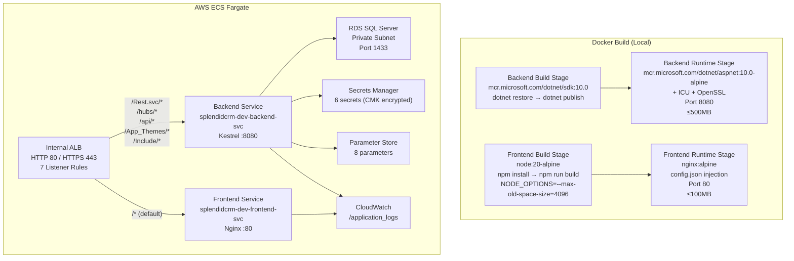
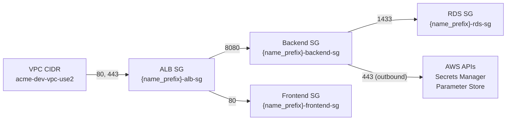

# Technical Specification

# 0. Agent Action Plan

## 0.1 Intent Clarification

### 0.1.1 Core Refactoring Objective

Based on the prompt, the Blitzy platform understands that the refactoring objective is to **containerize, provision infrastructure for, and deploy the modernized SplendidCRM application to AWS ECS Fargate** — without modifying any application business logic, SQL Server schemas, or adding features.

- **Refactoring Type:** Infrastructure packaging and cloud deployment orchestration (Containerization + IaC + CI/CD)
- **Target Repository:** Same repository — all new files (Dockerfiles, Terraform, scripts) are added alongside the existing source tree
- **Migration Context:** This is **Prompt 3 of 3** in the SplendidCRM modernization series:
  - Prompt 1 (complete): Backend migration from .NET Framework 4.8 / WebForms / WCF / IIS to .NET 10 / ASP.NET Core / Kestrel
  - Prompt 2 (complete): Frontend migration from React 18 / Webpack to React 19 / Vite 6.x with runtime configuration injection
  - **Prompt 3 (this prompt): Package Prompt 1 and Prompt 2 outputs into Docker containers, provision all AWS infrastructure via ACME private Terraform modules, and deploy to ECS Fargate behind an internal Application Load Balancer**

The refactoring goals are:

- **Backend Dockerfile** — Create a multi-stage Docker image: .NET 10 SDK build stage → ASP.NET 10 Alpine runtime image (target ≤500MB), including ICU/OpenSSL native dependencies (G1), Kestrel port 8080 (G2), and explicit copy of `SplendidCRM/App_Themes/` and `SplendidCRM/Include/` static asset directories
- **Frontend Dockerfile** — Create a multi-stage Docker image: Node 20 build stage (Vite) → Nginx Alpine serving stage (target ≤100MB), with runtime `config.json` injection via `docker-entrypoint.sh` (G3), OOM protection (G4), source map exclusion (G5), and CKEditor custom build handling (G11)
- **Terraform Infrastructure-as-Code** — Provision all AWS resources (ECR, ECS Fargate, ALB, RDS SQL Server, IAM, KMS, Secrets Manager, Parameter Store, CloudWatch, security groups) using ACME private Terraform modules following strict ACME directory structure and naming conventions
- **LocalStack Validation** — Validate all Terraform plans against LocalStack Pro before any real AWS deployment, with idempotency and destroy verification
- **Local Docker Validation** — Pass all 12 local validation tests (health checks, config injection, source map blocking, SPA fallback, end-to-end login) before any ECR push
- **Deployment Orchestration** — Define first-time and subsequent deployment sequences including schema provisioning (`Build.sql` + `SplendidSessions` DDL), ECR image push, ECS service launch, and rollback procedures
- **Observability** — CloudWatch log streaming, monitoring alarms, and auto-scaling policies

**Implicit Requirements Surfaced:**
- The backend's `Program.cs` resolves `App_Themes` and `Include` assets via `Path.GetFullPath(Path.Combine(app.Environment.ContentRootPath, "..", "..", "SplendidCRM"))` — in the container context, `/SplendidCRM/App_Themes` and `/SplendidCRM/Include` must exist relative to the published app directory
- The `ckeditor5-custom-build` directory is a `file:` npm dependency that must be copied before `npm install` in the Docker build context
- Kestrel port 8080 must be consistent across five locations: Dockerfile ENV, EXPOSE, ECS task definition, ALB target group, and security group
- API_BASE_URL for the frontend must be empty string (same-origin ALB) to preserve cookie-based session authentication (G8)
- ECS secrets references must use full ARNs, not friendly names (G7)
- All Secrets Manager secrets must be encrypted with a KMS Customer Managed Key, not the AWS default key

### 0.1.2 Technical Interpretation

This refactoring translates to the following technical transformation strategy:

- **Current Architecture:** Two-project .NET 10 solution (`SplendidCRM.Core` + `SplendidCRM.Web`) served by Kestrel on localhost:5000, React 19 SPA served by Vite dev server on localhost:3000 with API proxy, SQL Server Express in a Docker container on localhost:1433 — all orchestrated by `scripts/build-and-run.sh`
- **Target Architecture:** Two ECS Fargate services behind a single internal ALB in `acme-dev-vpc-use2`, with path-based routing (`/Rest.svc/*`, `/Administration/Rest.svc/*`, `/hubs/*`, `/api/*`, `/App_Themes/*`, `/Include/*` → backend; `/*` default → frontend), connected to RDS SQL Server in private subnets, all provisioned via Terraform with ACME private modules

The transformation rules are:
- **Package, do not modify** — Dockerfiles wrap the exact `dotnet publish` and `npm run build` outputs without changing any application code
- **Inject, do not bake** — All environment-specific configuration (connection strings, auth mode, SSO credentials, Duo keys, SMTP) is injected at runtime via ECS task definition environment variables and secrets references
- **Same image, different config** — The same Docker image tags deploy to Dev, Staging, and Production; behavior is determined entirely by injected configuration
- **ACME-first modules** — Use ACME private Terraform modules (`tfe.acme.com/acme/{module}/aws`) for all resources; the agent writes standard `aws_*` resource blocks for LocalStack compatibility, with a human-handoff mapping table for ACME module swap
- **Validate locally first** — Local Docker validation (12 tests) and LocalStack infrastructure validation (15 tests + 4 Docker SQL Server tests) must all pass before targeting real AWS

## 0.2 Source Analysis

### 0.2.1 Comprehensive Source File Discovery

The repository contains no existing containerization or infrastructure files — no `Dockerfile`, `.dockerignore`, `docker-compose.yml`, `nginx.conf`, `docker-entrypoint.sh`, or Terraform (`.tf`) files exist. All deliverables specified in this prompt are new file creation.

The following existing source files and directories are inputs to the containerization and infrastructure work:

**Backend Application Sources (consumed by `Dockerfile.backend`):**

| Path | Purpose | Relevance |
|------|---------|-----------|
| `SplendidCRM.sln` | Visual Studio solution file | Entry point for `dotnet restore` and `dotnet publish` |
| `src/SplendidCRM.Core/SplendidCRM.Core.csproj` | Core business logic project (net10.0) | Restored and built during Docker multi-stage build |
| `src/SplendidCRM.Web/SplendidCRM.Web.csproj` | Web host project (net10.0, SDK.Web) | Published output becomes Docker ENTRYPOINT |
| `src/SplendidCRM.Web/Program.cs` | Composition root — bootstraps all services | Resolves `App_Themes` via `../../SplendidCRM` relative to ContentRootPath |
| `src/SplendidCRM.Web/appsettings.json` | Base configuration with all placeholders | Included in publish output |
| `src/SplendidCRM.Web/appsettings.*.json` | Environment-specific config overrides | Included in publish output |
| `src/SplendidCRM.Web/Controllers/HealthCheckController.cs` | `GET /api/health` endpoint (AllowAnonymous) | Health check target for ECS and ALB |
| `src/SplendidCRM.Web/Configuration/StartupValidator.cs` | Fail-fast validation of 18 configuration keys | Validates required env vars at container startup |
| `src/SplendidCRM.Web/Configuration/AwsSecretsManagerProvider.cs` | AWS Secrets Manager config provider (Tier 1) | Reads secrets at startup from AWS |
| `src/SplendidCRM.Web/Configuration/AwsParameterStoreProvider.cs` | AWS SSM Parameter Store config provider (Tier 3) | Reads parameters at startup from AWS |
| `SplendidCRM/App_Themes/` | Theme CSS and image assets (7 themes: Arctic, Atlantic, Mobile, Pacific, Seven, Six, Sugar) | Must be explicitly copied into backend Docker image |
| `SplendidCRM/Include/` | Shared JS utilities and assets (Silverlight, charts, images, javascript, jqPlot) | Must be explicitly copied into backend Docker image |
| `src/SplendidCRM.Core/**/*.cs` | 78+ business logic classes | Part of `dotnet publish` output |
| `src/SplendidCRM.Web/Controllers/**/*.cs` | REST controllers (82 main + 58 admin endpoints) | Part of `dotnet publish` output |
| `src/SplendidCRM.Web/Hubs/**/*.cs` | SignalR hubs (Chat, Twilio, PhoneBurner) | Part of `dotnet publish` output |
| `src/SplendidCRM.Web/Soap/**/*.cs` | SOAP service (41 methods) | Part of `dotnet publish` output |
| `src/SplendidCRM.Web/Services/**/*.cs` | 4 background hosted services | Part of `dotnet publish` output |

**Frontend Application Sources (consumed by `Dockerfile.frontend`):**

| Path | Purpose | Relevance |
|------|---------|-----------|
| `SplendidCRM/React/package.json` | npm manifest — 45 dependencies, 12 devDependencies | Entry point for `npm install` in Docker build |
| `SplendidCRM/React/package-lock.json` | Lockfile (591KB) | Ensures reproducible `npm install` |
| `SplendidCRM/React/.npmrc` | npm configuration (legacy-peer-deps) | Copied before install |
| `SplendidCRM/React/vite.config.ts` | Vite 6.4.1 build configuration with MobX decorator support | Drives `npm run build` → `dist/` output |
| `SplendidCRM/React/tsconfig.json` | TypeScript 5.8.3 configuration | Used during Vite build |
| `SplendidCRM/React/index.html` | SPA entry point with CSP meta tag and config-loader script | Bundled into `dist/` |
| `SplendidCRM/React/public/config-loader.js` | Synchronous XHR to load `/config.json` before React init | Bundled into `dist/` — requires `config.json` at runtime |
| `SplendidCRM/React/public/config.json` | Development default: `{"API_BASE_URL":"http://localhost:5000",...}` | Overwritten at container startup by entrypoint script |
| `SplendidCRM/React/src/config.ts` | Typed runtime config singleton reading `window.__SPLENDID_CONFIG__` | Consumes config.json values |
| `SplendidCRM/React/ckeditor5-custom-build/` | Pre-built CKEditor 5 with Webpack config | `file:` dependency — must be copied before `npm install` (G11) |
| `SplendidCRM/React/src/**/*.tsx` | 763+ TypeScript/TSX component files | Part of Vite build |

**Database Schema Sources (consumed by `scripts/deploy-schema.sh`):**

| Path | Purpose | Relevance |
|------|---------|-----------|
| `SQL Scripts Community/` | 12 domain-specific subdirectories with idempotent SQL scripts | Concatenated into `Build.sql` |
| `SQL Scripts Community/Build.bat` | Windows batch script for SQL concatenation | Reference for build order |
| `validation/database-changes.md` | Documents `SplendidSessions` table DDL (1 approved schema change) | Sequential DDL after `Build.sql` |
| `validation/backend-changes.md` | Documents 7 backend fixes from Prompt 2 E2E validation | Confirms source tree includes these fixes |

**Operational References:**

| Path | Purpose | Relevance |
|------|---------|-----------|
| `scripts/build-and-run.sh` | Full-stack local dev bootstrap script | Reference for SQL provisioning order and build commands |
| `docs/environment-setup.md` | Canonical environment setup guide | Documents planned containerization patterns |
| `README.md` | Repository overview and migration documentation | Documents architecture and build commands |
| `blitzy/documentation/Project Guide.md` | Migration status tracker | Confirms Prompt 1 and Prompt 2 completion |
| `blitzy/documentation/Technical Specifications.md` | Frontend migration design contract | Documents build output conventions |

### 0.2.2 Current Repository Structure

```
Repository Root
├── SplendidCRM.sln                          # Solution file (2 app + 4 test projects)
├── README.md                                 # Migration documentation
├── LICENSE                                   # AGPLv3
├── .gitignore                                # Git ignore patterns
│
├── src/                                      # Modern .NET 10 source root
│   ├── SplendidCRM.Core/                     # Business logic library (78+ classes)
│   │   ├── SplendidCRM.Core.csproj           # net10.0, Microsoft.Data.SqlClient 6.1.4
│   │   ├── Integrations/                     # Third-party integration stubs
│   │   └── DuoUniversal/                     # Duo 2FA support
│   └── SplendidCRM.Web/                      # ASP.NET Core web host
│       ├── SplendidCRM.Web.csproj            # net10.0, SDK.Web, linux-x64;win-x64
│       ├── Program.cs                        # Composition root (7-phase startup)
│       ├── appsettings.json                  # Base config (all placeholders)
│       ├── appsettings.Development.json      # Local dev overrides
│       ├── appsettings.Staging.json          # Staging overrides
│       ├── appsettings.Production.json       # Production overrides
│       ├── Authentication/                   # Forms, Windows, SSO, Duo auth
│       ├── Authorization/                    # 4-tier ACL system
│       ├── Configuration/                    # AWS config providers + validator
│       ├── Controllers/                      # REST + health check + admin endpoints
│       ├── Hubs/                             # SignalR hubs (chat, twilio, phoneburner)
│       ├── Middleware/                        # Cookie policy, SPA redirect, logging
│       ├── Services/                         # 4 hosted background services
│       ├── SignalR/                           # Hub auth filters and managers
│       └── Soap/                             # SugarCRM-compatible SOAP service
│
├── SplendidCRM/                              # Legacy application root
│   ├── App_Themes/                           # 7 theme directories (Arctic..Sugar)
│   ├── Include/                              # Shared JS/browser utilities
│   └── React/                                # React 19 SPA workspace
│       ├── package.json                      # v15.2.9366, React 19.1.0, Vite 6.4.1
│       ├── package-lock.json                 # 591KB lockfile
│       ├── .npmrc                            # legacy-peer-deps configuration
│       ├── vite.config.ts                    # Build config with MobX decorators
│       ├── tsconfig.json                     # TypeScript 5.8.3 config
│       ├── index.html                        # SPA entry with CSP + config-loader
│       ├── ckeditor5-custom-build/           # Pre-built CKEditor 5 (file: dependency)
│       ├── public/                           # Static assets + config-loader.js
│       └── src/                              # 763+ TSX/TS source files
│
├── SQL Scripts Community/                    # SQL Server schema pipeline
│   ├── Build.bat                             # Windows concatenation script
│   ├── BaseTables/, Tables/, Views/          # Schema DDL scripts
│   ├── Procedures/, ProceduresDDL/           # Stored procedure definitions
│   ├── Functions/, ViewsDDL/, Triggers/      # Additional schema objects
│   └── Data/, Reports/, Terminology/         # Seed data and terminology
│
├── tests/                                    # 4 test projects
│   ├── SplendidCRM.Core.Tests/               # Core unit tests (xUnit + Moq)
│   ├── SplendidCRM.Web.Tests/                # Web host integration tests
│   ├── SplendidCRM.Integration.Tests/        # Full-stack integration tests
│   └── AdminRestController.Tests/            # Admin API contract tests
│
├── scripts/
│   └── build-and-run.sh                      # Full-stack local dev bootstrap
│
├── validation/                               # Migration governance artifacts
│   ├── backend-changes.md                    # 7 backend fixes (Prompt 2)
│   ├── database-changes.md                   # SplendidSessions DDL (Prompt 2)
│   └── esm-exceptions.md                     # ESM conversion verification
│
├── docs/
│   └── environment-setup.md                  # Developer setup guide
│
├── blitzy/documentation/                     # Migration documentation
│   ├── Project Guide.md                      # Status and progress tracker
│   └── Technical Specifications.md           # Frontend migration design
│
└── BackupBin2012/                            # Historical XML API docs
```

## 0.3 Scope Boundaries

### 0.3.1 Exhaustively In Scope

**Containerization Files (new creation):**
- `Dockerfile.backend` — Multi-stage .NET 10 backend image
- `Dockerfile.frontend` — Multi-stage React 19 / Nginx frontend image
- `docker-entrypoint.sh` — Runtime `config.json` generation for frontend
- `nginx.conf` — Nginx configuration for SPA serving, health check, security headers, source map blocking
- `.dockerignore` — Docker build context exclusions

**Terraform Infrastructure-as-Code (new creation):**
- `infrastructure/environments/dev/data.tf` — VPC and subnet data sources
- `infrastructure/environments/dev/dev.auto.tfvars` — Dev environment variables
- `infrastructure/environments/dev/locals.tf` — Dev environment sizing
- `infrastructure/environments/dev/main.tf` — Module instantiation
- `infrastructure/environments/dev/variables.tf` — Variable definitions
- `infrastructure/environments/dev/versions.tf` — Terraform Cloud backend configuration
- `infrastructure/environments/staging/*.tf` — Staging environment (same structure, different values)
- `infrastructure/environments/prod/*.tf` — Production environment (same structure, different values)
- `infrastructure/environments/localstack/*.tf` — LocalStack provider overrides with local state
- `infrastructure/modules/common/alb.tf` — Internal ALB with 7 listener rules
- `infrastructure/modules/common/cloudwatch.tf` — CloudWatch log group and stream
- `infrastructure/modules/common/data.tf` — Common data sources
- `infrastructure/modules/common/ecr.tf` — 2× ECR repositories
- `infrastructure/modules/common/ecs-fargate.tf` — ECS cluster, 2× task definitions, 2× services
- `infrastructure/modules/common/iam.tf` — 3× IAM roles with least-privilege policies
- `infrastructure/modules/common/kms.tf` — KMS Customer Managed Key with alias
- `infrastructure/modules/common/locals.tf` — Local values and configurations
- `infrastructure/modules/common/main.tf` — Module organization
- `infrastructure/modules/common/outputs.tf` — Required Terraform outputs
- `infrastructure/modules/common/rds.tf` — RDS SQL Server instance
- `infrastructure/modules/common/secrets.tf` — 6× Secrets Manager + 8× Parameter Store
- `infrastructure/modules/common/security-groups.tf` — 4× security groups
- `infrastructure/modules/common/variables.tf` — Module variables

**Deployment and Validation Scripts (new creation):**
- `scripts/deploy-schema.sh` — Database schema provisioning (Build.sql + SplendidSessions)
- `scripts/validate-docker-local.sh` — 12-test local Docker validation suite
- `scripts/validate-infra-localstack.sh` — LocalStack + Docker SQL Server validation (19 tests)
- `scripts/build-and-push.sh` — CI/CD image build, tag, and push to ECR

**Configuration and Documentation Updates:**
- `README.md` — Update with containerization and deployment documentation
- `docs/environment-setup.md` — Update with Docker and Terraform setup instructions

### 0.3.2 Explicitly Out of Scope

The following are explicitly excluded per the user's **Minimal Change Clause**:

- **Application business logic** — No modifications to any `.cs` files in `src/SplendidCRM.Core/` or `src/SplendidCRM.Web/` (controllers, services, hubs, middleware, authentication, authorization)
- **SQL Server schema** — No modifications to any `.sql` files in `SQL Scripts Community/`; `Build.sql` is executed as-is
- **Frontend source code** — No modifications to any `.tsx`, `.ts`, `.css`, or `.scss` files in `SplendidCRM/React/src/`
- **Frontend build configuration** — No modifications to `vite.config.ts`, `tsconfig.json`, or `package.json`
- **Additional AWS services** — No ElastiCache, SQS, Lambda, S3, or any service not specified in the prompt
- **Public-facing infrastructure** — ALB is internal-facing only; no Route 53 DNS, CloudFront CDN, or WAF
- **Application code optimization** — No code changes to optimize for container runtime; package as-is
- **Test modifications** — No changes to any test projects in `tests/`
- **Legacy WebForms code** — No modifications to `SplendidCRM/*.cs` (Global.asax.cs, Rest.svc.cs, etc.)
- **Cordova/mobile builds** — No containerization of mobile build pipeline
- **Angular/HTML5 clients** — No containerization of legacy Angular or HTML5 SPA variants
- **BackupBin2012** — Historical XML docs excluded from all containers

## 0.4 Target Design

### 0.4.1 Refactored Structure Planning

All new files are added to the repository root and a new `infrastructure/` directory. No existing files are moved or renamed.

```
Target (new files only):
├── Dockerfile.backend                        # Multi-stage: SDK build → alpine runtime
├── Dockerfile.frontend                       # Multi-stage: Node build → Nginx serve
├── docker-entrypoint.sh                      # Runtime config.json generation
├── nginx.conf                                # Nginx SPA configuration
├── .dockerignore                             # Build context exclusions
│
├── infrastructure/
│   ├── environments/
│   │   ├── dev/
│   │   │   ├── data.tf                       # VPC/subnet data sources (tag-based)
│   │   │   ├── dev.auto.tfvars               # Dev-specific variable values
│   │   │   ├── locals.tf                     # Dev sizing (512 CPU, 1024MB)
│   │   │   ├── main.tf                       # Module instantiation
│   │   │   ├── variables.tf                  # Variable definitions
│   │   │   └── versions.tf                   # TFE backend + provider config
│   │   ├── staging/
│   │   │   ├── data.tf
│   │   │   ├── staging.auto.tfvars           # Staging values
│   │   │   ├── locals.tf                     # Staging sizing (1024 CPU, 2048MB)
│   │   │   ├── main.tf
│   │   │   ├── variables.tf
│   │   │   └── versions.tf
│   │   ├── prod/
│   │   │   ├── data.tf
│   │   │   ├── prod.auto.tfvars              # Prod values
│   │   │   ├── locals.tf                     # Prod sizing (2048 CPU, 4096MB)
│   │   │   ├── main.tf
│   │   │   ├── variables.tf
│   │   │   └── versions.tf
│   │   └── localstack/
│   │       ├── data.tf
│   │       ├── localstack.auto.tfvars        # LocalStack overrides
│   │       ├── locals.tf
│   │       ├── main.tf
│   │       ├── variables.tf
│   │       └── versions.tf                   # Local state backend + endpoint overrides
│   └── modules/
│       └── common/
│           ├── alb.tf                        # Internal ALB + 7 listener rules
│           ├── cloudwatch.tf                 # Log group + stream
│           ├── data.tf                       # Common data sources
│           ├── ecr.tf                        # 2× ECR repositories
│           ├── ecs-fargate.tf                # Cluster + 2× task defs + 2× services
│           ├── iam.tf                        # 3× IAM roles + policies
│           ├── kms.tf                        # CMK with alias + key policy
│           ├── locals.tf                     # Local values
│           ├── main.tf                       # Module organization
│           ├── outputs.tf                    # Required outputs (10 values)
│           ├── rds.tf                        # RDS SQL Server
│           ├── secrets.tf                    # 6× Secrets Manager + 8× Parameter Store
│           ├── security-groups.tf            # 4× security groups
│           └── variables.tf                  # Module variables
│
├── scripts/
│   ├── build-and-run.sh                      # (existing — unchanged)
│   ├── deploy-schema.sh                      # Database schema provisioning
│   ├── validate-docker-local.sh              # 12-test local Docker validation
│   ├── validate-infra-localstack.sh          # 19-test LocalStack validation
│   └── build-and-push.sh                     # CI/CD ECR push script
│
├── docs/
│   └── environment-setup.md                  # (existing — updated with Docker/TF docs)
│
└── README.md                                 # (existing — updated with deployment docs)
```

### 0.4.2 Design Pattern Applications

**Multi-Stage Docker Builds** — Separate build and runtime stages to minimize image size, exclude build tools and source code from production images, and prevent secret leakage in image layers.

**Infrastructure-as-Code (Terraform)** — All AWS resources are codified, version-controlled, and reproducible. Environment-specific differences are isolated to `*.auto.tfvars` files while sharing common modules.

**Environment Parity** — Same Docker images deploy across Dev, Staging, and Production. All behavioral differences are injected via ECS task definition environment variables and Secrets Manager references.

**Defense-in-Depth Security:**
- Source maps deleted from image AND blocked by Nginx
- Secrets injected via Secrets Manager (encrypted with CMK), never baked into images
- IAM roles follow least-privilege (scoped to specific secret names and parameter paths)
- Security groups enforce ALB→Fargate→RDS connectivity with no extra ports
- KMS Customer Managed Key with automatic rotation for all Secrets Manager secrets

**Path-Based Routing (Single-Origin ALB):**
- Backend paths: `/Rest.svc/*`, `/Administration/Rest.svc/*`, `/hubs/*`, `/api/*`, `/App_Themes/*`, `/Include/*`
- Frontend default: `/*` (all other paths → Nginx SPA with `try_files` fallback)
- Same-origin cookie architecture preserved (G8)

### 0.4.3 Container Architecture



### 0.4.4 User Interface Design

This prompt is scoped exclusively to infrastructure and deployment — no user interface modifications. The React SPA and its runtime `config.json` injection pattern were established in Prompt 2. The frontend container serves the existing `dist/` build output through Nginx with:
- SPA fallback routing (all non-file paths → `index.html`)
- Security headers (`X-Content-Type-Options: nosniff`, `X-Frame-Options: SAMEORIGIN`)
- Source map blocking (HTTP 404 for `*.map` requests)
- Static asset caching (1-year expiry with `Cache-Control: public, immutable` for hashed chunks)
- Health check endpoint (`/health` → HTTP 200 `ok`)
- Runtime `config.json` generated from environment variables at container startup

## 0.5 Transformation Mapping

### 0.5.1 File-by-File Transformation Plan

All files are delivered in a single execution phase. No multi-phase splitting is permitted.

**Containerization Files:**

| Target File | Transformation | Source File | Key Changes |
|-------------|---------------|-------------|-------------|
| `Dockerfile.backend` | CREATE | `src/SplendidCRM.Web/SplendidCRM.Web.csproj` | Multi-stage: SDK 10.0 build → aspnet 10.0-alpine runtime; COPY solution and projects for restore; publish Release; install ICU + OpenSSL (G1); set ASPNETCORE_URLS=http://+:8080 (G2); COPY App_Themes and Include directories; ENTRYPOINT dotnet SplendidCRM.Web.dll |
| `Dockerfile.frontend` | CREATE | `SplendidCRM/React/package.json` | Multi-stage: node:20-alpine build → nginx:alpine serve; COPY ckeditor5-custom-build before npm install (G11); set NODE_OPTIONS=--max-old-space-size=4096 (G4); npm run build; delete *.map files (G5); COPY nginx.conf and docker-entrypoint.sh; chmod +x entrypoint (G3) |
| `docker-entrypoint.sh` | CREATE | `SplendidCRM/React/public/config-loader.js` | Shell script writing API_BASE_URL, SIGNALR_URL, ENVIRONMENT to /usr/share/nginx/html/config.json from env vars; exec nginx -g 'daemon off;' |
| `nginx.conf` | CREATE | `SplendidCRM/React/vite.config.ts` | Server block: listen 80; try_files SPA fallback; *.map → 404; static asset caching (1y immutable); /health → 200 ok; security headers (X-Content-Type-Options, X-Frame-Options) |
| `.dockerignore` | CREATE | `.gitignore` | Exclude .git, node_modules, BackupBin2012, tests, blitzy, dist, infrastructure, *.md except README |

**Terraform Environment Files — Dev:**

| Target File | Transformation | Source File | Key Changes |
|-------------|---------------|-------------|-------------|
| `infrastructure/environments/dev/versions.tf` | CREATE | — | Terraform Cloud backend (org: acme, hostname: tfe.acme.com, workspace: splendidcrm-dev); AWS provider >= 6.0.0 with assume_role |
| `infrastructure/environments/dev/variables.tf` | CREATE | — | Define all required variables: name_prefix, environment, account_id, container_port, portfolio, cost_center, owner_email, image_tag |
| `infrastructure/environments/dev/dev.auto.tfvars` | CREATE | — | name_prefix=splendidcrm-dev, environment=dev, container_port=8080, portfolio=CRM, cost_center=IT |
| `infrastructure/environments/dev/data.tf` | CREATE | — | Data sources for VPC (tag: acme-dev-vpc-use2) and subnets (tag: *-app-*) |
| `infrastructure/environments/dev/locals.tf` | CREATE | — | Dev sizing: task_cpu=512, task_memory=1024, task_ephemeral_gb=21, min_tasks=1, max_tasks=4 |
| `infrastructure/environments/dev/main.tf` | CREATE | `infrastructure/modules/common/*.tf` | Module instantiation passing all variables to common module |

**Terraform Environment Files — Staging:**

| Target File | Transformation | Source File | Key Changes |
|-------------|---------------|-------------|-------------|
| `infrastructure/environments/staging/versions.tf` | CREATE | `infrastructure/environments/dev/versions.tf` | Same structure; workspace: splendidcrm-staging |
| `infrastructure/environments/staging/variables.tf` | CREATE | `infrastructure/environments/dev/variables.tf` | Same variable definitions |
| `infrastructure/environments/staging/staging.auto.tfvars` | CREATE | `infrastructure/environments/dev/dev.auto.tfvars` | name_prefix=splendidcrm-staging, environment=staging |
| `infrastructure/environments/staging/data.tf` | CREATE | `infrastructure/environments/dev/data.tf` | Same VPC discovery pattern |
| `infrastructure/environments/staging/locals.tf` | CREATE | `infrastructure/environments/dev/locals.tf` | Staging sizing: task_cpu=1024, task_memory=2048, task_ephemeral_gb=30, min_tasks=2, max_tasks=6 |
| `infrastructure/environments/staging/main.tf` | CREATE | `infrastructure/environments/dev/main.tf` | Same module instantiation |

**Terraform Environment Files — Prod:**

| Target File | Transformation | Source File | Key Changes |
|-------------|---------------|-------------|-------------|
| `infrastructure/environments/prod/versions.tf` | CREATE | `infrastructure/environments/dev/versions.tf` | Same structure; workspace: splendidcrm-prod |
| `infrastructure/environments/prod/variables.tf` | CREATE | `infrastructure/environments/dev/variables.tf` | Same variable definitions |
| `infrastructure/environments/prod/prod.auto.tfvars` | CREATE | `infrastructure/environments/dev/dev.auto.tfvars` | name_prefix=splendidcrm-prod, environment=prod |
| `infrastructure/environments/prod/data.tf` | CREATE | `infrastructure/environments/dev/data.tf` | Same VPC discovery pattern |
| `infrastructure/environments/prod/locals.tf` | CREATE | `infrastructure/environments/dev/locals.tf` | Prod sizing: task_cpu=2048, task_memory=4096, task_ephemeral_gb=50, min_tasks=2, max_tasks=10 |
| `infrastructure/environments/prod/main.tf` | CREATE | `infrastructure/environments/dev/main.tf` | Same module instantiation |

**Terraform Environment Files — LocalStack:**

| Target File | Transformation | Source File | Key Changes |
|-------------|---------------|-------------|-------------|
| `infrastructure/environments/localstack/versions.tf` | CREATE | `infrastructure/environments/dev/versions.tf` | Local state backend (no Terraform Cloud); AWS provider with LocalStack endpoint overrides (all services → http://localhost:4566); skip_credentials_validation=true |
| `infrastructure/environments/localstack/variables.tf` | CREATE | `infrastructure/environments/dev/variables.tf` | Same variable definitions |
| `infrastructure/environments/localstack/localstack.auto.tfvars` | CREATE | `infrastructure/environments/dev/dev.auto.tfvars` | name_prefix=splendidcrm-local, environment=localstack, account_id=000000000000 |
| `infrastructure/environments/localstack/data.tf` | CREATE | `infrastructure/environments/dev/data.tf` | Same VPC discovery pattern (against LocalStack) |
| `infrastructure/environments/localstack/locals.tf` | CREATE | `infrastructure/environments/dev/locals.tf` | Dev-equivalent sizing for LocalStack |
| `infrastructure/environments/localstack/main.tf` | CREATE | `infrastructure/environments/dev/main.tf` | Same module instantiation |

**Terraform Common Modules:**

| Target File | Transformation | Source File | Key Changes |
|-------------|---------------|-------------|-------------|
| `infrastructure/modules/common/ecr.tf` | CREATE | — | 2× ECR repos (splendidcrm-backend, splendidcrm-frontend); image scanning enabled; lifecycle: retain 10; MUTABLE tags |
| `infrastructure/modules/common/security-groups.tf` | CREATE | — | 4× SGs: ALB (VPC CIDR → 80/443), Backend (ALB → 8080, outbound RDS 1433 + HTTPS 443), Frontend (ALB → 80), RDS (Backend → 1433) |
| `infrastructure/modules/common/alb.tf` | CREATE | — | Internal ALB; HTTP/HTTPS listeners; 2 target groups (backend :8080 /api/health, frontend :80 /health); 7 listener rules for path routing |
| `infrastructure/modules/common/iam.tf` | CREATE | — | 3× roles: execution (ECR pull + CloudWatch + Secrets + KMS), backend task (Secrets + KMS + SSM), frontend task (no permissions) |
| `infrastructure/modules/common/ecs-fargate.tf` | CREATE | — | Cluster (container insights + exec command); 2× task defs (backend: 7 secrets + 7 env vars; frontend: 3 env vars); 2× services with auto-scaling (70% CPU/Memory) |
| `infrastructure/modules/common/kms.tf` | CREATE | — | CMK alias/splendidcrm-secrets; key policy (ECS roles decrypt, TF role admin); auto-rotation enabled |
| `infrastructure/modules/common/rds.tf` | CREATE | — | RDS SQL Server in private subnets; per-environment instance sizing |
| `infrastructure/modules/common/secrets.tf` | CREATE | — | 6× Secrets Manager secrets (CMK encrypted): db-connection, sso-client-id, sso-client-secret, duo-integration-key, duo-secret-key, smtp-credentials; 8× SSM parameters |
| `infrastructure/modules/common/cloudwatch.tf` | CREATE | — | Log group /application_logs; stream naming {name_prefix}-ecs-logs |
| `infrastructure/modules/common/data.tf` | CREATE | — | Common data sources (caller identity, region, etc.) |
| `infrastructure/modules/common/locals.tf` | CREATE | — | Local values for naming, image URIs, computed references |
| `infrastructure/modules/common/variables.tf` | CREATE | — | Module input variables (all from environment layer) |
| `infrastructure/modules/common/outputs.tf` | CREATE | — | 10 required outputs: ecr URLs, cluster name, ALB DNS, log group/stream, SG IDs, RDS endpoint |
| `infrastructure/modules/common/main.tf` | CREATE | — | Module organization and provider requirements |

**Deployment and Validation Scripts:**

| Target File | Transformation | Source File | Key Changes |
|-------------|---------------|-------------|-------------|
| `scripts/deploy-schema.sh` | CREATE | `scripts/build-and-run.sh` | sqlcmd-based: create DB → execute Build.sql (G9: -t 600, no -b flag) → SplendidSessions DDL → validate counts (≥218 tables, ≥583 views, ≥890 procedures) |
| `scripts/validate-docker-local.sh` | CREATE | — | 12 tests: backend/frontend build, image sizes, health checks, config.json, SPA fallback, source maps blocked, no *.map in image, no secrets in history, E2E login |
| `scripts/validate-infra-localstack.sh` | CREATE | — | 19 tests: LocalStack terraform apply + 15 resource verifications + idempotency + destroy + Docker SQL Server schema + connectivity |
| `scripts/build-and-push.sh` | CREATE | — | CI/CD: build images → run local validation → ECR login → tag → push → verify |

**Documentation Updates:**

| Target File | Transformation | Source File | Key Changes |
|-------------|---------------|-------------|-------------|
| `README.md` | UPDATE | `README.md` | Add Docker build/run instructions, Terraform deployment guide, deployment sequence, rollback procedures |
| `docs/environment-setup.md` | UPDATE | `docs/environment-setup.md` | Add Docker prerequisites, Terraform setup, LocalStack validation, ECR push instructions |

### 0.5.2 Cross-File Dependencies

**Port Consistency Chain (G2):**
All five files must reference port 8080 for the backend:
- `Dockerfile.backend` → `ENV ASPNETCORE_URLS=http://+:8080` and `EXPOSE 8080`
- `infrastructure/modules/common/ecs-fargate.tf` → `containerPort: 8080`
- `infrastructure/modules/common/alb.tf` → backend target group port 8080
- `infrastructure/modules/common/security-groups.tf` → ALB→Backend inbound rule port 8080

**Image URI Chain:**
- `infrastructure/modules/common/ecr.tf` → creates `aws_ecr_repository.backend` and `.frontend`
- `infrastructure/modules/common/locals.tf` → computes `backend_image` and `frontend_image` URIs from repository URL + `var.image_tag`
- `infrastructure/modules/common/ecs-fargate.tf` → references computed image URIs in task definitions

**Secrets ARN Chain (G7):**
- `infrastructure/modules/common/secrets.tf` → creates 6× `aws_secretsmanager_secret` resources
- `infrastructure/modules/common/kms.tf` → provides CMK ARN for `kms_key_id` on each secret
- `infrastructure/modules/common/ecs-fargate.tf` → references `aws_secretsmanager_secret.*.arn` in task definition `valueFrom` (full ARN, not friendly name)
- `infrastructure/modules/common/iam.tf` → grants `secretsmanager:GetSecretValue` and `kms:Decrypt` permissions

**Same-Origin Cookie Chain (G8):**
- `infrastructure/modules/common/alb.tf` → single ALB with path-based routing (both services share one DNS)
- `docker-entrypoint.sh` → writes `API_BASE_URL=""` (empty = same-origin)
- `infrastructure/modules/common/ecs-fargate.tf` → frontend task definition sets `API_BASE_URL=""` and `CORS_ORIGINS=""`

### 0.5.3 One-Phase Execution

The entire refactoring deliverable — all 50+ files across Dockerfiles, Terraform modules, environment configurations, deployment scripts, and documentation updates — is executed by Blitzy in a single phase. There is no phased delivery.

## 0.6 Dependency Inventory

### 0.6.1 Key Private and Public Packages

**Docker Base Images:**

| Registry | Image | Version | Purpose |
|----------|-------|---------|---------|
| MCR (Microsoft) | `mcr.microsoft.com/dotnet/sdk` | `10.0` | Backend build stage — .NET 10 SDK for restore and publish |
| MCR (Microsoft) | `mcr.microsoft.com/dotnet/aspnet` | `10.0-alpine` | Backend runtime stage — ASP.NET Core on Alpine Linux |
| Docker Hub | `node` | `20-alpine` | Frontend build stage — Node.js 20 LTS for npm install and Vite build |
| Docker Hub | `nginx` | `alpine` | Frontend runtime stage — Static file serving |
| MCR (Microsoft) | `mcr.microsoft.com/mssql/server` | `2022-latest` | Local development SQL Server and schema validation |

**Terraform Providers:**

| Registry | Provider/Module | Version | Purpose |
|----------|----------------|---------|---------|
| HashiCorp Registry | `hashicorp/aws` | `>= 6.0.0` | AWS provider for all infrastructure resources |
| ACME Private | `tfe.acme.com/acme/ecr/aws` | Per registry | ECR repository provisioning |
| ACME Private | `tfe.acme.com/acme/ecs-fargate/aws` | Per registry | ECS Fargate cluster, task definitions, services |
| ACME Private | `tfe.acme.com/acme/elb/aws` | Per registry | Application Load Balancer with listener rules |
| ACME Private | `tfe.acme.com/acme/security-group/aws` | Per registry | Security group definitions |
| ACME Private | `tfe.acme.com/acme/iam/aws` | Per registry | IAM roles and policies |
| ACME Private | `tfe.acme.com/acme/kms/aws` | Per registry | KMS Customer Managed Key (or `aws_kms_key` if unavailable) |
| ACME Private | `tfe.acme.com/acme/rds/aws` | Per registry | RDS SQL Server instance |

**Backend NuGet Packages (from `SplendidCRM.Web.csproj` and `SplendidCRM.Core.csproj`):**

| Registry | Package | Version | Purpose |
|----------|---------|---------|---------|
| NuGet | Microsoft.Data.SqlClient | 6.1.4 | SQL Server data access (requires ICU + OpenSSL in Alpine — G1) |
| NuGet | AWSSDK.SecretsManager | 3.7.500 | Tier 1 configuration: secrets retrieval at startup |
| NuGet | AWSSDK.SimpleSystemsManagement | 3.7.405.5 | Tier 3 configuration: SSM Parameter Store retrieval |
| NuGet | Microsoft.Extensions.Caching.SqlServer | 10.0.0 | Distributed SQL session provider (requires SplendidSessions table) |
| NuGet | Microsoft.Extensions.Caching.StackExchangeRedis | 10.0.0 | Redis session provider (alternative to SQL) |
| NuGet | SoapCore | 1.2.1.12 | SOAP middleware for legacy SugarCRM client support |
| NuGet | Microsoft.AspNetCore.Authentication.Negotiate | 10.0.0 | Windows/Negotiate authentication |
| NuGet | Microsoft.AspNetCore.Authentication.OpenIdConnect | 10.0.0 | OIDC/SAML SSO authentication |
| NuGet | Newtonsoft.Json | 13.0.3 | JSON serialization (backward compatibility) |
| NuGet | MailKit | 4.15.0 | SMTP/IMAP/POP3 email client |
| NuGet | BouncyCastle.Cryptography | 2.6.2 | DuoUniversal TLS pinning + HMAC-SHA512 |
| NuGet | Twilio | 7.8.0 | SMS/Voice telephony SDK |
| NuGet | Microsoft.IdentityModel.JsonWebTokens | 8.7.0 | JWT token validation for Duo and SSO |

**Frontend npm Packages (from `SplendidCRM/React/package.json`):**

| Registry | Package | Version | Purpose |
|----------|---------|---------|---------|
| npm | react | 19.1.0 | Core React framework |
| npm | react-dom | 19.1.0 | React DOM renderer |
| npm | vite | 6.4.1 | Build tool (produces `dist/` with chunked ESM output) |
| npm | typescript | 5.8.3 | TypeScript compiler |
| npm | @microsoft/signalr | 10.0.0 | SignalR client for real-time hubs |
| npm | mobx | 6.15.0 | State management (decorators require Babel config) |
| npm | react-router | 7.13.2 | Client-side routing |
| npm | @vitejs/plugin-react | 4.5.2 | Vite React plugin with Babel decorator support |
| npm (local) | ckeditor5-custom-build | file:./ckeditor5-custom-build | Pre-built CKEditor 5 (local file: dependency — G11) |

**CLI Tools:**

| Tool | Version | Purpose |
|------|---------|---------|
| Terraform | >= 1.12.x | Infrastructure provisioning and state management |
| AWS CLI | v2 | ECR authentication, resource verification, LocalStack interaction |
| Docker Engine | Latest stable | Image build, local validation, container testing |
| LocalStack Pro | 4.14.0 | AWS service emulation for infrastructure validation |
| sqlcmd | Latest | SQL Server schema provisioning against RDS |

### 0.6.2 Dependency Updates

**Alpine Native Dependencies (backend runtime image — G1):**

The ASP.NET 10.0-alpine image requires these packages for `Microsoft.Data.SqlClient` to function:

```sh
apk add --no-cache icu-libs icu-data-full openssl-libs-static
```

Without these packages, SQL Server connections throw `PlatformNotSupportedException` at runtime.

**Import Refactoring — Not Applicable:**

This refactoring does not modify any application source code imports. All `.cs`, `.tsx`, and `.ts` files remain unchanged. The only import-like changes are in Terraform module source references:

- Agent code uses standard `aws_*` resource blocks (LocalStack-compatible)
- Human handoff swaps to `tfe.acme.com/acme/{module}/aws` module sources when ACME registry access is available
- The mapping table in the user's prompt defines the exact correspondence between standard resources and ACME modules

**External Reference Updates:**

| File | Change Type | Description |
|------|------------|-------------|
| `README.md` | Content addition | Docker build/run commands, Terraform deployment guide, ECR push instructions, rollback procedures |
| `docs/environment-setup.md` | Content addition | Docker prerequisites, Terraform/LocalStack setup, infrastructure validation guide |

## 0.7 Special Analysis

### 0.7.1 Backend Dockerfile — App_Themes/Include Static Asset Path Resolution

The most critical cross-cutting concern for the backend Dockerfile is the static asset path resolution in `Program.cs` (line 517):

```cs
string sSplendidRoot = Path.GetFullPath(
  Path.Combine(app.Environment.ContentRootPath, "..", "..", "SplendidCRM"));
```

In the Docker container with `WORKDIR /app` (standard for published .NET apps), `ContentRootPath` resolves to `/app`. The relative path `../../SplendidCRM` resolves to `/SplendidCRM`. Therefore, the Dockerfile must create `/SplendidCRM/App_Themes/` and `/SplendidCRM/Include/` in the image:

```dockerfile
COPY SplendidCRM/App_Themes /SplendidCRM/App_Themes
COPY SplendidCRM/Include /SplendidCRM/Include
```

The Docker build context for `Dockerfile.backend` must be the repository root (not `src/SplendidCRM.Web/`) to access these directories. This also makes `SplendidCRM.sln` available for the `dotnet restore` and `dotnet publish` steps. The 7 theme directories (Arctic, Atlantic, Mobile, Pacific, Seven, Six, Sugar) contain CSS, images, and chart assets required for the React SPA's theme rendering.

### 0.7.2 Guardrail Cross-Reference Matrix

Every guardrail from the user's prompt maps to specific files and verification points:

| Guardrail | Files Affected | Verification |
|-----------|---------------|-------------|
| **G1**: Alpine native dependencies | `Dockerfile.backend` | `apk add icu-libs icu-data-full openssl-libs-static`; `DOTNET_SYSTEM_GLOBALIZATION_INVARIANT=false` |
| **G2**: Kestrel port 8080 | `Dockerfile.backend`, `ecs-fargate.tf`, `alb.tf`, `security-groups.tf` | Port 8080 in all 5 locations; validated by `validate-docker-local.sh` |
| **G3**: Entrypoint permissions | `Dockerfile.frontend` | `COPY` + `chmod +x` + `ENTRYPOINT` (not CMD); `config.json` exists before Nginx serves |
| **G4**: OOM protection | `Dockerfile.frontend` | `ENV NODE_OPTIONS=--max-old-space-size=4096` in build stage |
| **G5**: Source map exclusion | `Dockerfile.frontend`, `nginx.conf` | `find ... -name '*.map' -delete` in image; `location ~* \.map$ { return 404; }` in Nginx |
| **G7**: Secrets Manager ARN format | `ecs-fargate.tf`, `iam.tf` | `valueFrom = aws_secretsmanager_secret.*.arn` (full ARN, not friendly name) |
| **G8**: Same-origin cookies | `alb.tf`, `ecs-fargate.tf`, `docker-entrypoint.sh` | Single ALB, `API_BASE_URL=""`, no separate DNS names |
| **G9**: Schema deployment timeout | `scripts/deploy-schema.sh` | `sqlcmd -t 600 -l 30` (no `-b` flag); SplendidSessions after Build.sql |
| **G10**: ACME module registry | All `modules/common/*.tf` | Agent writes `aws_*` resources; mapping table for human handoff to ACME modules |
| **G11**: CKEditor custom build | `Dockerfile.frontend` | `COPY ckeditor5-custom-build ./ckeditor5-custom-build/` before `npm install` |

### 0.7.3 Security Group Connectivity Analysis

The 4 security groups form a layered network policy:



- **ALB SG**: Inbound from VPC CIDR on ports 80/443; outbound to Backend SG:8080 and Frontend SG:80
- **Backend SG**: Inbound from ALB SG on port 8080; outbound to RDS SG:1433 and HTTPS:443 (Secrets Manager, Parameter Store, KMS)
- **Frontend SG**: Inbound from ALB SG on port 80; no outbound required
- **RDS SG**: Inbound from Backend SG on port 1433; no outbound required

### 0.7.4 Configuration Injection Flow

The 5-tier configuration hierarchy operates differently in Docker vs. ECS:

**Local Docker (validation):** Environment variables injected via `docker run -e` provide connection strings and runtime config. AWS providers gracefully fall back when credentials are unavailable.

**ECS Fargate (production):** The ECS task definition specifies:
- 7 secret references (`valueFrom` pointing to Secrets Manager ARNs) — the ECS agent resolves these to environment variables before container startup
- 7 literal environment variables (`ASPNETCORE_ENVIRONMENT`, `SESSION_PROVIDER`, `AUTH_MODE`, etc.)
- SSM Parameter Store values are read at runtime by the .NET app's `AwsParameterStoreProvider` using the ECS task role's `ssm:GetParameter` permission

The `StartupValidator.cs` fail-fast check runs on container startup and exits with code 1 if any of the 7 required configuration values are missing. In ECS, this causes the task to stop immediately with a descriptive error in CloudWatch logs, rather than running in an invalid state.

### 0.7.5 ALB Listener Rule Evaluation Order

The 7 listener rules must be ordered by specificity (most specific first) because ALB evaluates rules in numeric priority order:

| Priority | Path Pattern | Target Group | Request Types |
|----------|-------------|-------------|---------------|
| 1 | `/Rest.svc/*` | Backend | 152 main REST API endpoints |
| 2 | `/Administration/Rest.svc/*` | Backend | 65 admin REST API endpoints |
| 3 | `/hubs/*` | Backend | SignalR WebSocket hubs (chat, twilio, phoneburner) |
| 4 | `/api/*` | Backend | Health check at `/api/health` |
| 5 | `/App_Themes/*` | Backend | Theme CSS/images served by ASP.NET Core static files |
| 6 | `/Include/*` | Backend | Shared JS utilities served by ASP.NET Core static files |
| Default | `/*` | Frontend | React SPA with Nginx `try_files` fallback |

The default rule catches all paths not matched by higher-priority rules, routing them to the frontend Nginx container which serves `index.html` for SPA client-side routing.

### 0.7.6 ACME Module Two-Layer Approach

Per guardrail G10, the agent writes standard Terraform `aws_*` resource blocks that work directly against LocalStack for validation. When ACME private module registry access is available, the human developer swaps to ACME module sources using this mapping:

| Agent Resource Block | ACME Module Source | Notes |
|---------------------|-------------------|-------|
| `aws_ecr_repository` | `tfe.acme.com/acme/ecr/aws` | Check module variables.tf for exact interface |
| `aws_ecs_cluster` + `aws_ecs_task_definition` + `aws_ecs_service` | `tfe.acme.com/acme/ecs-fargate/aws` | May bundle cluster + service + task def |
| `aws_lb` + `aws_lb_listener` + `aws_lb_target_group` | `tfe.acme.com/acme/elb/aws` | May abstract listener rule creation |
| `aws_security_group` + `aws_security_group_rule` | `tfe.acme.com/acme/security-group/aws` | Verify ACME naming/tagging conventions |
| `aws_iam_role` + `aws_iam_policy` | `tfe.acme.com/acme/iam/aws` | Verify trust policy format |
| `aws_kms_key` + `aws_kms_alias` | `tfe.acme.com/acme/kms/aws` | Fall back to `aws_kms_key` if no ACME module exists |
| `aws_db_instance` | `tfe.acme.com/acme/rds/aws` | Check for ACME-specific engine parameter groups |

The agent MUST NOT reference `tfe.acme.com` in any `source` block. All module sources in `modules/common/*.tf` use standard `resource` blocks, not remote module sources.

### 0.7.7 LocalStack Validation Strategy

The LocalStack validation approach addresses the limitation that LocalStack Pro emulates AWS APIs but does not run actual application containers or database engines:

- **LocalStack validates:** Resource creation (ECR repos, ECS task defs, services, ALB, security groups, IAM roles, KMS keys, Secrets Manager, Parameter Store, RDS API), idempotency (second `terraform plan` shows zero changes), clean teardown (`terraform destroy` with zero orphans)
- **Docker SQL Server validates:** Actual database connectivity, schema provisioning (`Build.sql` + `SplendidSessions`), backend health check against real SQL Server, CRUD operations
- **Local Docker validates:** Image builds, container startup, health checks, config injection, SPA fallback, source map blocking, end-to-end login

These three validation layers together provide comprehensive confidence before any real AWS deployment.

## 0.8 Refactoring Rules

### 0.8.1 User-Specified Refactoring Rules

The user's **Minimal Change Clause** establishes these non-negotiable rules:

- **Package, do not modify** — Dockerfiles package the exact outputs from Prompt 1 (backend, including 7 fixes applied during Prompt 2 E2E validation documented in `validation/backend-changes.md`) and Prompt 2 (frontend) without any application code modifications
- **Execute Build.sql as-is** — The SQL Server schema is deployed using the existing `SQL Scripts Community/` pipeline without modifications; the schema artifact `Build.sql` is concatenated from 12 domain-specific subdirectories in dependency order
- **ACME modules first** — Use ACME private Terraform modules for all resources where modules exist; do not create custom resources where ACME equivalents are available
- **Do not introduce additional AWS services** — Only the services specified in the prompt (ECR, ECS, ALB, RDS, IAM, KMS, Secrets Manager, Parameter Store, CloudWatch, VPC/subnets/security groups); no ElastiCache, SQS, Lambda, S3, or other services
- **Least-privilege security** — Security group rules open only documented ports; IAM policies scope to specific secret names (`splendidcrm/*`) and parameter paths (`/splendidcrm/*`)
- **Do not optimize application code for container runtime** — Package the existing application as-is

### 0.8.2 Infrastructure-Specific Constraints

**ACME Terraform Standards (non-negotiable):**
- Directory structure: `environments/{dev,staging,prod,localstack}/` + `modules/common/`
- Naming convention: `{name_prefix}-{resource}` (e.g., `splendidcrm-dev-backend-sg`)
- Default tags: 14 ACME-standard tags via provider `default_tags` block (`admin:environment`, `finops:*`, `managed_by`, `ops:*`)
- VPC/subnet discovery: Tag-based data sources (not hardcoded IDs)
- Terraform Cloud backend: `tfe.acme.com` with workspace naming `splendidcrm-{env}`
- Assume role provider: `arn:aws:iam::${var.account_id}:role/acme-tfe-assume-role`
- All required outputs must be exported (10 outputs specified)

**Container Constraints:**
- Backend image ≤ 500MB
- Frontend image ≤ 100MB
- Same image tags deploy to Dev, Staging, and Production
- Zero environment-specific values baked into images
- Zero secrets in image layers (`docker history` must show no connection strings or passwords)

**Deployment Constraints:**
- All 12 local Docker validation tests must pass before ECR push
- All LocalStack validation tests must pass before real AWS `terraform apply`
- Image URIs in ECS task definitions must use Terraform variable references (`${aws_ecr_repository.*.repository_url}:${var.image_tag}`), never hardcoded strings
- First-time deployment follows a strict bootstrap sequence: Terraform creates ECR → push images → Terraform updates ECS with image tag
- Rollback to previous task definition must complete within 5 minutes

### 0.8.3 Special Instructions and Constraints

**Port 8080 Consistency (G2):** The Kestrel port 8080 must be verified in all 5 locations (Dockerfile ENV, Dockerfile EXPOSE, ECS task definition containerPort, ALB backend target group port, backend security group inbound rule). A mismatch at any single point causes ECS health check failure and infinite task restart loops.

**Same-Origin Cookie Architecture (G8):** Both frontend and backend MUST be behind the same ALB DNS name. Separate DNS names, separate ALBs, or Cloud Map service discovery endpoints are prohibited. The `API_BASE_URL` in the frontend container must be empty string or the ALB DNS origin.

**Secrets Manager Full ARN (G7):** ECS `valueFrom` for Secrets Manager must use `aws_secretsmanager_secret.*.arn` (the full ARN), not the friendly secret name. Using friendly names causes silent container startup failure with no useful error.

**KMS CMK Requirement:** All 6 Secrets Manager secrets must specify the KMS Customer Managed Key (`alias/splendidcrm-secrets`) as `kms_key_id`. The AWS default key (`aws/secretsmanager`) must not be used. The ECS execution role and backend task role must have `kms:Decrypt` permission scoped to this CMK ARN.

**Schema Deployment Order (G9):** `Build.sql` must execute before `SplendidSessions` DDL. The `-b` flag must not be used with `sqlcmd` because the idempotent DDL scripts produce non-fatal dependency warnings on first run that are safe to ignore.

**CKEditor Docker Build (G11):** The `ckeditor5-custom-build/` directory must be copied into the frontend Docker build context before `npm install` because it is referenced as a `file:` dependency in `package.json`. Without it, dependency resolution fails silently.

**LocalStack Environment:** All autonomous Terraform operations must run from `environments/localstack/` — not `environments/dev/`. The dev/staging/prod environments reference `tfe.acme.com` as the Terraform Cloud backend, which is inaccessible during autonomous development. The localstack environment uses local state and LocalStack endpoints.

**Environment-Specific Sizing (uniform per ACME standard):**

| Environment | Task CPU | Task Memory | Ephemeral Storage | Min Tasks | Max Tasks |
|------------|---------|-------------|-------------------|-----------|-----------|
| Dev | 512 | 1024 MB | 21 GB | 1 | 4 |
| Staging | 1024 | 2048 MB | 30 GB | 2 | 6 |
| Production | 2048 | 4096 MB | 50 GB | 2 | 10 |

Frontend tasks use the same sizing as backend tasks (uniform per ACME standard).

## 0.9 References

### 0.9.1 Repository Files and Folders Searched

The following files and folders were inspected to derive conclusions for this Agent Action Plan:

**Root-Level Files:**
- `SplendidCRM.sln` — Solution structure: 2 app projects + 4 test projects, build configurations
- `README.md` — Repository overview, migration documentation, architecture description
- `LICENSE` — AGPLv3 licensing terms
- `.gitignore` — Git ignore patterns

**Backend Source Files:**
- `src/SplendidCRM.Web/SplendidCRM.Web.csproj` — Web project: net10.0, SDK.Web, RuntimeIdentifiers linux-x64;win-x64, NuGet package references (SoapCore 1.2.1.12, AWSSDK.SecretsManager 3.7.500, AWSSDK.SimpleSystemsManagement 3.7.405.5, Microsoft.Extensions.Caching.SqlServer 10.0.0)
- `src/SplendidCRM.Core/SplendidCRM.Core.csproj` — Core library: net10.0, Microsoft.Data.SqlClient 6.1.4, Newtonsoft.Json 13.0.3, MailKit 4.15.0, BouncyCastle 2.6.2, Twilio 7.8.0
- `src/SplendidCRM.Web/Program.cs` — Composition root: 7-phase startup, 5-tier config hierarchy, middleware pipeline, static file serving for App_Themes and Include (lines 517-533), health endpoint mapping
- `src/SplendidCRM.Web/Controllers/HealthCheckController.cs` — GET /api/health endpoint: AllowAnonymous, returns JSON with status/machineName/timestamp/initialized, 503 on DB failure
- `src/SplendidCRM.Web/Configuration/StartupValidator.cs` — Fail-fast validation of 18 configuration keys: 7 required, 3 conditional (SSO), 8 optional with defaults
- `src/SplendidCRM.Web/Configuration/AwsSecretsManagerProvider.cs` — Tier 1 config provider: reads secrets at startup with 5-minute refresh
- `src/SplendidCRM.Web/Configuration/AwsParameterStoreProvider.cs` — Tier 3 config provider: reads SSM parameters at startup
- `src/SplendidCRM.Web/appsettings.json` — Base configuration: all 18 configuration keys with placeholder defaults
- `src/SplendidCRM.Web/appsettings.Development.json` — Dev overrides: localhost connection string, debug logging
- `src/SplendidCRM.Web/appsettings.Staging.json` — Staging overrides: no detailed errors, empty secret placeholders
- `src/SplendidCRM.Web/appsettings.Production.json` — Production overrides: warning-level logging

**Frontend Source Files:**
- `SplendidCRM/React/package.json` — npm manifest: React 19.1.0, Vite 6.4.1, TypeScript 5.8.3, 45 dependencies, ckeditor5-custom-build (file: reference)
- `SplendidCRM/React/package-lock.json` — 591KB lockfile for reproducible installs
- `SplendidCRM/React/vite.config.ts` — Build configuration: MobX decorators, proxy settings, manualChunks (vendor/mobx), sourcemap: hidden, outDir: dist
- `SplendidCRM/React/index.html` — SPA entry: CSP meta tag, config-loader.js script, module entry src/index.tsx
- `SplendidCRM/React/public/config-loader.js` — Synchronous XHR loading of /config.json into window.__SPLENDID_CONFIG__
- `SplendidCRM/React/public/config.json` — Development defaults: API_BASE_URL=http://localhost:5000
- `SplendidCRM/React/src/config.ts` — Typed config singleton: reads window.__SPLENDID_CONFIG__, SIGNALR_URL falls back to API_BASE_URL
- `SplendidCRM/React/ckeditor5-custom-build/package.json` — CKEditor 5 custom build: version 0.0.1, Webpack-based

**Legacy Static Assets:**
- `SplendidCRM/App_Themes/` — 7 theme directories: Arctic, Atlantic, Mobile, Pacific, Seven, Six, Sugar
- `SplendidCRM/Include/` — 5 asset directories: Silverlight, charts, images, javascript, jqPlot

**Database Schema:**
- `SQL Scripts Community/` — 12 subdirectories: BaseTables, Tables, Views, ViewsDDL, Procedures, ProceduresDDL, Functions, Triggers, Data, Reports, Terminology + Build.bat

**Validation and Migration Artifacts:**
- `validation/backend-changes.md` — 7 backend fixes across 3 files (RestController.cs, AdminRestController.cs, RestUtil.cs, SplendidCache.cs) from Prompt 2 E2E validation
- `validation/database-changes.md` — 1 schema change: SplendidSessions table DDL for ASP.NET Core distributed SQL session
- `validation/esm-exceptions.md` — ESM conversion verification: 0 active require() calls in 763 files

**Operational Scripts and Documentation:**
- `scripts/build-and-run.sh` — Full-stack bootstrap: SQL Server Docker, schema provisioning, frontend/backend build, health checks
- `docs/environment-setup.md` — Developer setup guide: prerequisites, build commands, runtime config, planned containerization patterns
- `blitzy/documentation/Project Guide.md` — Migration progress tracker
- `blitzy/documentation/Technical Specifications.md` — Frontend migration design contract

**Test Projects:**
- `tests/SplendidCRM.Core.Tests/SplendidCRM.Core.Tests.csproj` — Core unit tests: xUnit, Moq, FluentAssertions
- `tests/SplendidCRM.Web.Tests/SplendidCRM.Web.Tests.csproj` — Web integration tests: WebApplicationFactory
- `tests/SplendidCRM.Integration.Tests/SplendidCRM.Integration.Tests.csproj` — Full-stack integration tests
- `tests/AdminRestController.Tests/AdminRestController.Tests.csproj` — Admin API contract tests

**Technical Specification Sections Retrieved:**
- Section 3.1 Programming Languages — C# 14 / .NET 10 LTS, TypeScript 5.8.3, T-SQL, Bash
- Section 3.6 Development & Deployment — Build pipelines, containerization readiness, testing framework
- Section 3.8 Configuration Architecture — 5-tier hierarchy, environment configs, startup validation
- Section 5.1 High-Level Architecture — Monolithic modular architecture, system boundaries, data flows
- Section 8.4 Containerization — Container readiness assessment, development container infrastructure, planned patterns

### 0.9.2 External Research Conducted

- **Terraform AWS Provider 6.0** — Confirmed GA release (June 18, 2025) with multi-region support; latest version 6.38.0 available on HashiCorp releases; `>= 6.0.0` version constraint is valid and current

### 0.9.3 User-Provided Attachments and Metadata

- **No Figma URLs provided** — This prompt is infrastructure-scoped with no UI design requirements
- **No file attachments provided** — All deliverables are derived from the repository source and the user's prompt text
- **Environment variables provided:** `AWS_ACCESS_KEY_ID`, `AWS_DEFAULT_REGION`, `ConnectionStrings__SplendidCRM`
- **Secrets provided:** `AWS_SECRET_ACCESS_KEY`, `LOCALSTACK_AUTH_TOKEN`, `SQL_PASSWORD`
- **Environment 1 setup instructions:** .NET 10 SDK installation, Docker SQL Server Express provisioning, Build.sql concatenation from SQL Scripts Community
- **Environment 2 setup instructions:** AWS CLI, LocalStack Pro CLI 4.14.0 installation, LocalStack start and S3 verification test

