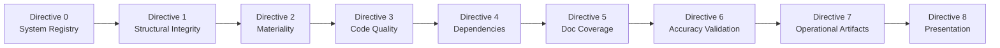

# SplendidCRM Community Edition v15.2 — Codebase Audit Documentation Suite

This documentation suite contains the complete results of a comprehensive, multi-framework codebase audit of **SplendidCRM Community Edition v15.2**. The audit produces auditor-facing and developer-facing documentation artifacts structured around nine sequential directives (0–8), assessed against the **COSO 2013 Internal Control — Integrated Framework** (17 Principles across 5 Components), **NIST SP 800-53 Rev 5** (control families AC, AU, CM, IA, SC, SI), the **NIST Cybersecurity Framework (CSF)** (Identify, Protect, Detect, Respond, Recover), and **CIS Controls v8** (Implementation Groups IG2/IG3).

> **Assess-Only Mandate:** This audit documentation was produced without creating, modifying, or remediating any source code or existing documentation within the SplendidCRM repository. All files in this `docs/` directory are newly generated audit artifacts. The auditor role is limited to assess, classify, measure, and report — consistent with COSO Principle 16 (Conducts Ongoing and/or Separate Evaluations).

> **Sequential Execution:** Directives 0 through 8 are executed in strict sequential order. Each directive builds upon the findings and classifications of its predecessors, ensuring traceability from system identification through accuracy validation to executive presentation.

---

## How to Read This Audit Suite

### Report Structure Pattern

Every audit report produced by Directives 1 through 6 follows a prescribed structure to ensure consistency and enable rapid auditor navigation:

1. **Report Executive Summary** — A 1–2 paragraph narrative describing the "Theme of Failure/Success" for the audit dimension, explicitly linked to the COSO Control Activities component (Principles 10–12). This summary provides the auditor with an immediate assessment of the control posture for the domain under review.

2. **Attention Required Table** — A structured table highlighting the most critical findings requiring immediate attention. Every Directive 1–6 report begins with this table, using the following prescribed format:

   | Component Path | Primary Finding | Risk Severity | Governing NIST/CIS Control | COSO Principle |
   |---|---|---|---|---|
   | [Path] | [Brief Description] | [Critical/Moderate/Minor] | [ID] | [e.g., Principle 11] |

3. **Detailed Findings** — Findings organized by `system_id` (assigned in the Directive 0 system registry), with file path citations for evidence traceability.

### Finding Attribution

Every finding in this audit suite is attributed to a `system_id` from the system registry produced in [Directive 0 — System Registry](directive-0-system-registry/system-registry.md). This ensures complete traceability from individual code-level observations back to the system decomposition and framework control mappings. No orphan findings (findings without a `system_id`) are permitted.

### Audience Tracks

This audit suite serves three distinct audiences:

| Audience | Primary Documents | Purpose |
|---|---|---|
| **Auditor** | Directives 0–6 | Detailed, evidence-based assessment reports with COSO/NIST/CIS control mappings, file path citations, and risk severity classifications |
| **Developer** | [Developer Contribution Guide](directive-7-operational-artifacts/artifact-2-developer-contribution-guide.md) | Practical, gate-structured guide with 9 explicit GATE: PASS/FAIL checkpoints aligned to COSO, NIST, and CIS controls |
| **Executive** | [Global Executive Summary](directive-7-operational-artifacts/artifact-0-global-executive-summary.md), [Risk Executive Presentation](directive-8-presentation/risk-executive-presentation.html) | High-level, risk-prioritized narrative and visual presentation for strategic decision-making |

### Framework Authority Hierarchy

Where COSO, NIST SP 800-53, NIST CSF, and CIS Controls v8 requirements conflict, this audit applies the **more restrictive requirement** and flags the conflict in the relevant report. This hierarchy ensures the most conservative control posture is documented.

---

## Directory Structure

```
docs/
├── README.md
├── directive-0-system-registry/
│   ├── system-registry.md
│   ├── coso-mapping.md
│   ├── nist-mapping.md
│   └── cis-mapping.md
├── directive-1-structural-integrity/
│   └── structural-integrity-report.md
├── directive-2-materiality/
│   └── materiality-classification.md
├── directive-3-code-quality/
│   ├── code-quality-summary.md
│   ├── security-domain-quality.md
│   ├── api-surface-quality.md
│   ├── infrastructure-quality.md
│   ├── background-processing-quality.md
│   └── database-quality.md
├── directive-4-dependency-audit/
│   └── cross-cutting-dependency-report.md
├── directive-5-documentation-coverage/
│   └── documentation-coverage-report.md
├── directive-6-accuracy-validation/
│   └── accuracy-validation-report.md
├── directive-7-operational-artifacts/
│   ├── artifact-0-global-executive-summary.md
│   ├── artifact-1-operational-flowchart.md
│   └── artifact-2-developer-contribution-guide.md
└── directive-8-presentation/
    └── risk-executive-presentation.html
```

---

## Report Index

| # | Directive | File | Description |
|---|---|---|---|
| 1 | Directive 0 — System Registry | [system-registry.md](directive-0-system-registry/system-registry.md) | Complete system decomposition along functional domain verticals and architectural layer horizontals; Static/Dynamic classification; `system_id` registry for all identified systems |
| 2 | Directive 0 — COSO Mapping | [coso-mapping.md](directive-0-system-registry/coso-mapping.md) | COSO Principles 1–17 mapped to each `system_id` with rationale; identifies which principles are present, functioning, or have gaps |
| 3 | Directive 0 — NIST Mapping | [nist-mapping.md](directive-0-system-registry/nist-mapping.md) | NIST SP 800-53 Rev 5 (AC, AU, CM, IA, SC, SI) and NIST CSF (Identify, Protect, Detect, Respond, Recover) control mapping per `system_id` |
| 4 | Directive 0 — CIS Mapping | [cis-mapping.md](directive-0-system-registry/cis-mapping.md) | CIS Controls v8 IG2/IG3 safeguard mapping per `system_id`; inventory, access, logging, vulnerability, and configuration controls |
| 5 | Directive 1 — Structural Integrity | [structural-integrity-report.md](directive-1-structural-integrity/structural-integrity-report.md) | Broken cross-references, orphaned configurations, missing environment variables, dangling dependencies, unreachable code paths, and incomplete error handling at system boundaries — per COSO Principle 10 |
| 6 | Directive 2 — Materiality | [materiality-classification.md](directive-2-materiality/materiality-classification.md) | Material vs. Non-Material classification for every component based on operational reliability impact; classification criteria aligned with COSO Information & Communication component (Principles 13–15) |
| 7 | Directive 3 — Code Quality Summary | [code-quality-summary.md](directive-3-code-quality/code-quality-summary.md) | Aggregate code quality findings across all Material components: total code smells, complexity hotspots, security quality gaps, severity distribution |
| 8 | Directive 3 — Security Domain Quality | [security-domain-quality.md](directive-3-code-quality/security-domain-quality.md) | Code smells, complexity metrics, and security quality assessment for Security.cs, ActiveDirectory.cs, SplendidHubAuthorize.cs, and DuoUniversal |
| 9 | Directive 3 — API Surface Quality | [api-surface-quality.md](directive-3-code-quality/api-surface-quality.md) | Code smells, complexity metrics, and security quality assessment for REST, SOAP, and Admin API Material components |
| 10 | Directive 3 — Infrastructure Quality | [infrastructure-quality.md](directive-3-code-quality/infrastructure-quality.md) | Code smells, complexity metrics, and coupling analysis for SplendidCache, SplendidInit, Sql, SqlBuild, SplendidError, RestUtil, SplendidDynamic, and SearchBuilder |
| 11 | Directive 3 — Background Processing Quality | [background-processing-quality.md](directive-3-code-quality/background-processing-quality.md) | Timer reentrancy analysis, job dispatch complexity, and error handling completeness for SchedulerUtils, EmailUtils, and Global.asax |
| 12 | Directive 3 — Database Quality | [database-quality.md](directive-3-code-quality/database-quality.md) | Stored procedure complexity, view integrity, trigger completeness, and idempotency validation for SQL Scripts Community |
| 13 | Directive 4 — Dependency Audit | [cross-cutting-dependency-report.md](directive-4-dependency-audit/cross-cutting-dependency-report.md) | Inter-system dependency map, shared utilities consumed by 3+ systems, Blast Radius Scores (Low/Medium/High), NIST CM-3 and SC-5 risk assessment per COSO Principle 9 |
| 14 | Directive 5 — Documentation Coverage | [documentation-coverage-report.md](directive-5-documentation-coverage/documentation-coverage-report.md) | WHY documentation verification per Material component; blast radius and ownership documentation check for cross-cutting concerns per COSO Principle 14 |
| 15 | Directive 6 — Accuracy Validation | [accuracy-validation-report.md](directive-6-accuracy-validation/accuracy-validation-report.md) | Static system sampling (1 instance each), Dynamic system sampling (10–25 instances each), ≥87% accuracy threshold PASS/FAIL determination per COSO Principle 16 |
| 16 | Directive 7 — Global Executive Summary | [artifact-0-global-executive-summary.md](directive-7-operational-artifacts/artifact-0-global-executive-summary.md) | 3–5 paragraph executive narrative; COSO Internal Controls effectiveness statement; Summary Risk Table of top 5 systems; NIST CSF posture overview |
| 17 | Directive 7 — Operational Flowchart | [artifact-1-operational-flowchart.md](directive-7-operational-artifacts/artifact-1-operational-flowchart.md) | Mermaid flowchart with NIST CSF swimlanes (Identify, Protect, Detect, Respond, Recover); sub-lanes per audit dimension |
| 18 | Directive 7 — Developer Contribution Guide | [artifact-2-developer-contribution-guide.md](directive-7-operational-artifacts/artifact-2-developer-contribution-guide.md) | Developer guide for secure extensions with 9 explicit GATE: PASS/FAIL checkpoints aligned to COSO, NIST, and CIS controls |
| 19 | Directive 8 — Risk Executive Presentation | [risk-executive-presentation.html](directive-8-presentation/risk-executive-presentation.html) | Self-contained Reveal.js v5.2.1 HTML presentation with 6 slides: Title, State of Environment, Critical Risks, Compliance Scorecard, Technical Debt Impact, Prioritized Focus Areas — styled with SplendidCRM App_Themes CSS |

---

## Framework Glossary

### COSO 2013 Internal Control — Integrated Framework

The COSO framework defines five interrelated components of internal control containing 17 principles. For effective internal control, all principles must be present and functioning. This audit evaluates the SplendidCRM codebase against each principle.

**Control Environment (Principles 1–5)**

| Principle | Name |
|---|---|
| COSO Principle 1 | Demonstrates Commitment to Integrity and Ethical Values |
| COSO Principle 2 | Exercises Oversight Responsibility |
| COSO Principle 3 | Establishes Structure, Authority, and Responsibility |
| COSO Principle 4 | Demonstrates Commitment to Competence |
| COSO Principle 5 | Enforces Accountability |

**Risk Assessment (Principles 6–9)**

| Principle | Name |
|---|---|
| COSO Principle 6 | Specifies Suitable Objectives |
| COSO Principle 7 | Identifies and Analyzes Risk |
| COSO Principle 8 | Assesses Fraud Risk |
| COSO Principle 9 | Identifies and Analyzes Significant Change |

**Control Activities (Principles 10–12)**

| Principle | Name |
|---|---|
| COSO Principle 10 | Selects and Develops Control Activities |
| COSO Principle 11 | Selects and Develops General Controls over Technology |
| COSO Principle 12 | Deploys through Policies and Procedures |

**Information & Communication (Principles 13–15)**

| Principle | Name |
|---|---|
| COSO Principle 13 | Uses Relevant Information |
| COSO Principle 14 | Communicates Internally |
| COSO Principle 15 | Communicates Externally |

**Monitoring Activities (Principles 16–17)**

| Principle | Name |
|---|---|
| COSO Principle 16 | Conducts Ongoing and/or Separate Evaluations |
| COSO Principle 17 | Evaluates and Communicates Deficiencies |

### NIST SP 800-53 Rev 5 — Security and Privacy Controls

This audit references six primary control families from NIST SP 800-53 Revision 5 for technical control mapping of audit findings:

| Family Code | Full Name | Audit Application |
|---|---|---|
| AC | Access Control | Security.cs 4-tier authorization model, API access controls, RBAC enforcement |
| AU | Audit and Accountability | SQL audit triggers, SYSTEM_LOG, USERS_LOGINS, entity-level audit tables |
| CM | Configuration Management | Web.config hardening, manual DLL management, build pipeline configuration |
| IA | Identification and Authentication | MD5 password hashing, DuoUniversal 2FA, ActiveDirectory SSO, session management |
| SC | System and Communications Protection | TLS 1.2 enforcement, Rijndael encryption, SignalR authorization, HTTPS transport |
| SI | System and Information Integrity | Input validation, error handling, zero testing infrastructure, software patching |

### NIST Cybersecurity Framework (CSF)

The NIST CSF provides the organizational structure for the operational flowchart artifact and the narrative flow of audit findings:

| Function | Description | Audit Mapping |
|---|---|---|
| **Identify** | Develop organizational understanding to manage cybersecurity risk to systems, assets, data, and capabilities | Directive 0 (system registry), Directive 2 (materiality classification) |
| **Protect** | Develop and implement appropriate safeguards to ensure delivery of critical services | Directive 1 (structural integrity), Directive 3 (security quality assessment) |
| **Detect** | Develop and implement appropriate activities to identify the occurrence of a cybersecurity event | Directive 5 (documentation coverage), Directive 4 (dependency monitoring) |
| **Respond** | Develop and implement appropriate activities to take action regarding a detected cybersecurity event | Directive 1 (error handling assessment), Directive 7 (developer guide GATE points) |
| **Recover** | Develop and implement appropriate activities to maintain plans for resilience and to restore capabilities | Directive 6 (accuracy validation), Directive 7 (executive summary remediation priorities) |

### CIS Controls v8 (IG2/IG3)

The Center for Internet Security (CIS) Controls v8 provides implementation-level safeguard benchmarks. This audit references the following primary controls at Implementation Group 2 (IG2) and Implementation Group 3 (IG3) levels:

| Control | Safeguard Name | Audit Application |
|---|---|---|
| CIS Control 1 | Inventory and Control of Enterprise Assets | Directive 0 system registry — enterprise asset identification |
| CIS Control 2 | Inventory and Control of Software Assets | Directive 4 dependency inventory — 24 manual DLLs, npm packages, SQL components |
| CIS Control 4 | Secure Configuration of Enterprise Assets and Software | Directive 1 (Web.config hardening), Directive 3 (configuration quality assessment) |
| CIS Control 5 | Account Management | Directive 3 (Security.cs account lifecycle assessment) |
| CIS Control 6 | Access Control Management | Directive 3 (4-tier authorization model assessment) |
| CIS Control 8 | Audit Log Management | Directive 5 (audit trail completeness verification) |
| CIS Control 16 | Application Software Security | Directive 3 (input validation, error handling, secure coding practices) |

### Framework Authority Hierarchy

> Where COSO, NIST SP 800-53, NIST CSF, and CIS Controls v8 requirements conflict on a specific finding, this audit applies the **more restrictive requirement** and explicitly flags the conflict in the affected report. This approach ensures the most conservative control posture is documented, consistent with COSO Principle 7 (Identifies and Analyzes Risk).

---

## Key Terminology

The following terms are used consistently throughout all audit reports:

| Term | Definition |
|---|---|
| `system_id` | A unique identifier assigned to each system in the [Directive 0 system registry](directive-0-system-registry/system-registry.md). All findings are attributed to a `system_id` for traceability. |
| **Material** | A component classified as having significant impact on operational reliability. Material components govern access control, audit logging, configuration hardening, network segmentation, system/software integrity, secret management, or core business logic. Only Material components proceed to the Directive 3 code quality audit. |
| **Non-Material** | A component classified as having limited impact on operational reliability. Non-Material components are excluded from the Directive 3 detailed code quality audit per the explicit materiality scoping directive. |
| **Static** | A system classification indicating the system has a fixed, deterministic configuration. Static systems receive exactly **1 sample instance** during accuracy validation (Directive 6). |
| **Dynamic** | A system classification indicating the system has variable, runtime-determined behavior. Dynamic systems receive **10–25 sample instances** during accuracy validation (Directive 6). |
| **Blast Radius Score** | A risk classification for cross-cutting dependencies: **Low** (affects 1–2 systems), **Medium** (affects 3–5 systems), or **High** (affects 6+ systems). Assessed per COSO Principle 9 (Identifies and Analyzes Significant Change) and NIST CM-3 / SC-5. |
| **Risk Severity** | The impact classification for individual findings: **Critical** (immediate risk to operational integrity or security), **Moderate** (significant risk requiring planned remediation), or **Minor** (low risk, improvement opportunity). |
| **GATE: PASS / FAIL** | A checkpoint status in the [Developer Contribution Guide](directive-7-operational-artifacts/artifact-2-developer-contribution-guide.md). Each of the 9 GATEs represents a compliance checkpoint aligned to specific COSO, NIST, and CIS controls. A contribution must achieve PASS on all 9 GATEs to be considered compliant. |
| **Accuracy Threshold** | The ≥87% accuracy rate required for a system to achieve PASS status during Directive 6 accuracy validation, per COSO Principle 16 (Conducts Ongoing and/or Separate Evaluations). |

---

## Directive Execution Sequence

Directives 0 through 8 are executed in strict sequential order. Each directive builds upon the outputs of its predecessors, establishing a traceable chain from system identification through final executive presentation.



### Dependency Chain

| Directive | Depends On | Produces | Consumed By |
|---|---|---|---|
| **0 — System Registry** | Codebase analysis | `system_id` registry, Static/Dynamic classification, framework mappings | All subsequent directives (1–8) |
| **1 — Structural Integrity** | Directive 0 (`system_id` references) | Boundary scan findings, orphaned configuration inventory, error handling gaps | Directives 2, 7, 8 |
| **2 — Materiality** | Directive 0 (`system_id` references) | Material/Non-Material classification per component | Directive 3 (scoping), Directives 5, 7, 8 |
| **3 — Code Quality** | Directive 2 (Material components only) | Code smells, complexity metrics, security quality findings | Directives 4, 7, 8 |
| **4 — Dependencies** | Directives 0 and 3 | Blast Radius Scores, shared utility map, inter-system dependency graph | Directives 5, 7, 8 |
| **5 — Documentation Coverage** | Directives 2 (Material) and 4 (blast radius) | WHY documentation gaps, ownership verification results | Directives 6, 7, 8 |
| **6 — Accuracy Validation** | All Directives 0–5 | PASS/FAIL per system, sampling results, accuracy statistics | Directives 7, 8 |
| **7 — Operational Artifacts** | All Directives 0–6 | Executive summary, NIST CSF flowchart, developer contribution guide | Directive 8 |
| **8 — Presentation** | All Directives 0–7 | Reveal.js HTML presentation (final deliverable) | — |

---

## Audited Codebase Overview

**SplendidCRM Community Edition v15.2** is a full-lifecycle Customer Relationship Management system licensed under the GNU Affero General Public License v3 (AGPLv3). The application is built on a layered monolithic architecture targeting single-server deployment on Windows with IIS and SQL Server.

### Technology Stack

| Layer | Technology | Version |
|---|---|---|
| Backend Framework | ASP.NET Web Forms | .NET Framework 4.8 |
| Primary Client | React SPA (TypeScript) | React 18.2.0 / TypeScript 5.3.3 |
| Experimental Client | Angular SPA | Angular ~13.3.0 |
| Legacy Client | HTML5 / jQuery / RequireJS | jQuery 1.4.2–2.2.4 |
| WebForms Client | ASP.NET Web Forms | .NET Framework 4.8 |
| Database | SQL Server | Express 2008+ (minimum) |
| Real-Time | SignalR | Server 1.2.2 / Client 8.0.0 |
| State Management | MobX | 6.12.0 |

### Codebase Scale

| Component Category | Approximate Count |
|---|---|
| Core infrastructure classes (`_code/`) | 60+ C# utility classes |
| Administration modules | 40+ sub-modules |
| CRM module folders | 60+ functional modules |
| SQL views | 300+ view projections |
| SQL stored procedures | 300+ procedures |
| SQL audit triggers | Entity-level triggers for all CRM tables |
| Client interfaces | 4 (React, Angular, HTML5, WebForms) |
| Manually managed DLLs (`BackupBin2012/`) | 38 assemblies |
| Enterprise integration stubs | 16 directories (`Spring.Social.*`) |

### Assess-Only Mandate

This audit documentation was produced under a strict assess-only mandate consistent with COSO Principle 16 (Conducts Ongoing and/or Separate Evaluations). No source code, configuration files, SQL scripts, client applications, or existing documentation within the SplendidCRM repository were created, modified, or remediated during this audit. All 20 documentation artifacts in this `docs/` directory are newly generated audit outputs.

---

*Audit documentation generated for SplendidCRM Community Edition v15.2. All findings are based on static analysis of the repository codebase. Framework references follow COSO 2013, NIST SP 800-53 Rev 5, NIST CSF, and CIS Controls v8 (IG2/IG3).*
