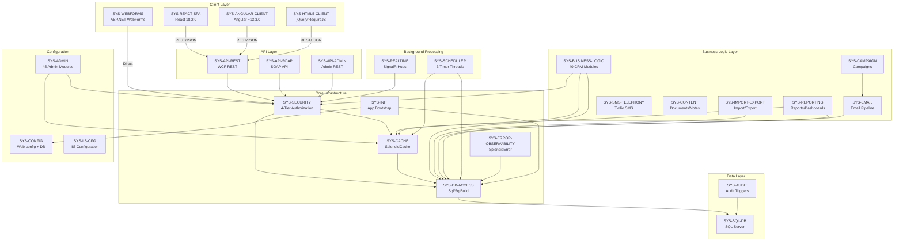

# Directive 0 — System Registry and Classification

## Executive Context

SplendidCRM Community Edition v15.2 is a full-lifecycle Customer Relationship Management platform with a 20-year development history (2005–2025), licensed under the GNU Affero General Public License v3 (AGPLv3). The platform implements a layered monolithic architecture built on ASP.NET 4.8 with a SQL Server database backend, and uniquely sustains four coexisting client interfaces: a primary React 18.2.0 Single-Page Application, an experimental Angular ~13.3.0 client, a legacy HTML5/jQuery (1.4.2–2.2.4) portal, and the original ASP.NET WebForms server-rendered interface. The entire system is designed for single-server deployment on Windows Server with IIS and SQL Server Express 2008 or higher.

In accordance with COSO Principle 3 (Establishes Structure, Authority, and Responsibility), this system registry decomposes the SplendidCRM codebase into discrete, identifiable systems to establish clear organizational boundaries for audit assessment. COSO Principle 7 (Identifies and Analyzes Risk) further mandates that systems be classified by their operational behavior — Static or Dynamic — to enable risk-proportionate evaluation and sampling in subsequent audit directives. COSO Principle 1 (Demonstrates Commitment to Integrity and Ethical Values) underscores that this decomposition must be exhaustive: every functional capability and architectural layer must be accounted for so that no material component escapes audit scrutiny.

This registry serves as the **authoritative reference** for all subsequent audit directives (Directives 1–8). Every finding, classification, and assessment produced by this audit suite is attributed to a `system_id` defined herein. The system_ids, classifications, and framework mappings established in this document are consumed by the companion mapping files ([COSO Mapping](./coso-mapping.md), [NIST Mapping](./nist-mapping.md), [CIS Mapping](./cis-mapping.md)) and by every subsequent directive report.

---

## System Decomposition Methodology

Systems within SplendidCRM are identified along two orthogonal axes. Each intersection that contains meaningful, auditable code constitutes a discrete system and receives a unique `system_id`.

### Vertical Axis — Functional Domains

Functional domains represent the business and technical capabilities of the CRM. Each domain encapsulates a cohesive set of responsibilities:

| Domain | Description |
|---|---|
| **Identity/Access** | Authentication mechanisms, authorization models, session management, encryption |
| **API Surface** | External-facing service endpoints (REST, SOAP, Admin) |
| **Core Infrastructure** | Shared utilities consumed across domains (cache, initialization, database access, error handling) |
| **Data Management** | CRM business logic modules, import/export pipelines |
| **Campaign Execution** | Email marketing, campaign queue processing, prospect management |
| **Communication** | Email processing, SMS/telephony integrations |
| **Real-Time** | SignalR bidirectional communication, chat, telephony hubs |
| **Background Processing** | Timer-based schedulers, workflow stubs |
| **Configuration/Administration** | Application configuration, admin modules, system settings |
| **Reporting** | Report engine, dashboard management |
| **Content Management** | Documents, notes, knowledge base |
| **Localization** | Multi-language support, currency, timezone handling |
| **Integration** | Enterprise integration stubs (Spring.Social.*, Google, Exchange, etc.) |

### Horizontal Axis — Architectural Layers

Architectural layers represent the technology stack tiers where code physically resides:

| Layer | Technology |
|---|---|
| **SQL Database** | SQL Server (Express 2008+) — schema, views, procedures, triggers, functions |
| **ASP.NET Application** | .NET Framework 4.8 — C# backend application server |
| **IIS/Web Configuration** | Web.config — IIS pipeline, security, session, assembly bindings |
| **React SPA Client** | React 18.2.0 / TypeScript 5.3.3 / MobX 6.12.0 / Webpack 5.90.2 |
| **Angular Client** | Angular ~13.3.0 (experimental) |
| **HTML5/jQuery Client** | jQuery 1.4.2–2.2.4 / RequireJS 2.3.3 (legacy) |
| **WebForms Client** | ASP.NET WebForms — server-rendered pages, master pages, themes |
| **Build Pipeline** | Build.bat (SQL), Webpack (React), MSBuild (.NET) |

### Classification Definitions

- **Static**: Configuration, infrastructure, or compiled artifacts that change infrequently. Evaluated with 1 sample instance in Directive 6 accuracy validation.
- **Dynamic**: Runtime behavior with variable state, execution paths, or user-dependent logic. Evaluated with 10–25 sample instances in Directive 6 accuracy validation.

### System Domain and Layer Listing

The following diagram enumerates all functional domains (vertical axis) and architectural layers (horizontal axis) with system counts per category. The complete two-axis grid mapping — showing which domain-layer intersections contain auditable systems — is detailed in the Vertical Domain Registry and Horizontal Layer Registry sections below.

```mermaid
graph TB
    subgraph "Functional Domains — Vertical Axis"
        direction TB
        FD1["Identity/Access<br/>3 systems"]
        FD2["API Surface<br/>3 systems"]
        FD3["Core Infrastructure<br/>4 systems"]
        FD4["Data Management<br/>2 systems"]
        FD5["Campaign Execution<br/>1 system"]
        FD6["Communication<br/>2 systems"]
        FD7["Real-Time<br/>1 system"]
        FD8["Background Processing<br/>2 systems"]
        FD9["Config/Administration<br/>2 systems"]
        FD10["Reporting<br/>1 system"]
        FD11["Content Management<br/>1 system"]
        FD12["Localization<br/>1 system"]
        FD13["Integration<br/>1 system"]
    end

    subgraph "Architectural Layers — Horizontal Axis"
        direction TB
        AL1["SQL Database<br/>2 systems"]
        AL2["ASP.NET Application<br/>1 system"]
        AL3["IIS/Web Config<br/>1 system"]
        AL4["React SPA<br/>1 system"]
        AL5["Angular Client<br/>1 system"]
        AL6["HTML5/jQuery<br/>1 system"]
        AL7["WebForms<br/>1 system"]
        AL8["Build Pipeline<br/>1 system"]
        AL9["Dependency Mgmt<br/>1 system"]
    end
```

---

## Vertical Domain Registry

### Identity/Access Domain

This domain governs all authentication, authorization, session management, and cryptographic operations within SplendidCRM. Per COSO Principle 5 (Enforces Accountability), the identity domain is the foundational control layer through which all user actions are mediated.

#### SYS-SECURITY — Core Security and Authorization Engine

| Attribute | Value |
|---|---|
| **system_id** | `SYS-SECURITY` |
| **Classification** | **Dynamic** |
| **Primary Source** | `SplendidCRM/_code/Security.cs` |
| **Supporting Sources** | 74 C# utility classes in `SplendidCRM/_code/` that consume Security APIs |

**Description:** Implements a 4-tier authorization model comprising module-level ACL enforcement, team-based record filtering, field-level access control, and record-level ownership checks. Provides multi-mechanism authentication supporting Forms-based login, Windows/NTLM integrated authentication, ADFS/Azure AD JWT validation, and DuoUniversal two-factor authentication. Cryptographic operations include MD5 password hashing (SugarCRM backward compatibility), Rijndael symmetric encryption for stored secrets, and session-based security context management via `HttpSessionState`.

**Key Methods:** `IsAuthenticated()`, `GetUserAccess()`, `Filter()`, `LoginUser()`, `HashPassword()`, `EncryptPassword()`, `DecryptPassword()`

**Classification Rationale:** Runtime behavior varies per user, session, and request. ACL filtering depends on current user context, team membership, module configuration, and field-level permissions — all of which change dynamically.

---

#### SYS-AUTH-AD — Active Directory / SSO Integration

| Attribute | Value |
|---|---|
| **system_id** | `SYS-AUTH-AD` |
| **Classification** | **Dynamic** |
| **Primary Source** | `SplendidCRM/_code/ActiveDirectory.cs` |

**Description:** Provides Windows/NTLM authentication integration and ADFS/Azure AD JWT token validation. Some SSO methods are partially stubbed in Community Edition, preserving the API surface for enterprise features while throwing descriptive exceptions for unsupported operations.

**Classification Rationale:** Authentication flows vary at runtime based on IIS authentication mode configuration and the presence of Windows credentials or JWT tokens in incoming requests.

---

#### SYS-AUTH-DUO — DuoUniversal Two-Factor Authentication

| Attribute | Value |
|---|---|
| **system_id** | `SYS-AUTH-DUO` |
| **Classification** | **Dynamic** |
| **Primary Source** | `SplendidCRM/Administration/DuoUniversal/` |
| **Supporting Sources** | `SplendidCRM/_code/DuoUniversal/` |

**Description:** Implements the Duo Universal Prompt two-factor authentication challenge/callback flow. When enabled, users are redirected to the Duo service for secondary authentication after primary credential validation.

**Classification Rationale:** 2FA challenge/response flow is inherently dynamic — it depends on per-user enrollment status, Duo service availability, and real-time authentication state.

---

### API Surface Domain

The API surface domain encompasses all external-facing service endpoints through which clients interact with the CRM backend. These systems form the primary attack surface and data exchange boundary.

#### SYS-API-REST — WCF REST API Gateway

| Attribute | Value |
|---|---|
| **system_id** | `SYS-API-REST` |
| **Classification** | **Dynamic** |
| **Primary Source** | `SplendidCRM/Rest.svc.cs` |

**Description:** Primary API gateway for SPA clients (React, Angular, HTML5). Exposes WCF REST endpoints for authentication, metadata retrieval (`Application_GetReactState` — bulk metadata dump), CRUD operations on all CRM modules, relationship management, data synchronization, export operations, and OData-style query capabilities. All endpoints enforce authentication via `Security.IsAuthenticated()` and module-level ACL via `Security.GetUserAccess()`.

**Classification Rationale:** Runtime request handling with variable endpoints, dynamic ACL enforcement, JSON serialization of user-specific data, and context-dependent query execution.

---

#### SYS-API-SOAP — SugarCRM-Compatible SOAP API

| Attribute | Value |
|---|---|
| **system_id** | `SYS-API-SOAP` |
| **Classification** | **Dynamic** |
| **Primary Source** | `SplendidCRM/soap.asmx.cs` |

**Description:** SugarCRM-compatible SOAP API using the `sugarsoap` namespace. Provides session-based authentication, entity CRUD operations, relationship management, and attachment handling. WSDL is runtime-generated by the ASP.NET framework — no maintained WSDL documentation artifact exists.

**Classification Rationale:** Runtime SOAP request processing with session-based authentication state, variable entity operations, and dynamic WSDL generation.

---

#### SYS-API-ADMIN — Administration REST API

| Attribute | Value |
|---|---|
| **system_id** | `SYS-API-ADMIN` |
| **Classification** | **Dynamic** |
| **Primary Source** | `SplendidCRM/Administration/Rest.svc.cs` |
| **Supporting Sources** | `SplendidCRM/Administration/Impersonation.svc.cs` |

**Description:** Administration REST API aggregator exposing endpoints for layout CRUD, configuration management, module management, ACL administration, terminology management, React state bootstrapping, and user impersonation (v15.2). All endpoints enforce `IS_ADMIN` or delegate-level access checks.

**Classification Rationale:** Admin-only runtime operations that modify system configuration, layouts, ACLs, and module metadata in real time.

---

### Core Infrastructure Domain

Core infrastructure systems are shared utilities consumed by virtually all other systems in the codebase. Per COSO Principle 10 (Selects and Develops Control Activities), the quality and reliability of these cross-cutting components directly determines the effectiveness of controls across the entire platform.

#### SYS-CACHE — In-Memory Metadata Cache

| Attribute | Value |
|---|---|
| **system_id** | `SYS-CACHE` |
| **Classification** | **Dynamic** |
| **Primary Source** | `SplendidCRM/_code/SplendidCache.cs` |

**Description:** Central caching hub implemented via `HttpApplicationState` and `HttpRuntime.Cache`. Provides thousands of metadata query getters for modules, fields, views, dashboards, dynamic buttons, ACL definitions, terminology, and configuration values. Supports cache seeding at application startup, targeted cache invalidation on data changes, and React-focused dictionary retrievals for bulk state transfer. Consumed by virtually all other systems — the highest blast-radius component in the codebase.

**Classification Rationale:** Cache contents change dynamically based on database state, user actions, admin configuration changes, and cache invalidation events triggered by the scheduler and background processors.

---

#### SYS-INIT — Application Initialization

| Attribute | Value |
|---|---|
| **system_id** | `SYS-INIT` |
| **Classification** | **Static** |
| **Primary Sources** | `SplendidCRM/_code/SplendidInit.cs`, `SplendidCRM/Global.asax.cs` |

**Description:** Orchestrates application lifecycle initialization including `Application_Start` (TLS 1.2 enforcement, unobserved task exception handling), `Session_Start` (SameSite cookie hardening, user context initialization), SQL build orchestration via `SqlBuild.cs`, timer initialization for 3 background processors (Scheduler 5-min, Email 1-min, Archive 5-min), and database connection validation.

**Classification Rationale:** Initialization sequence is deterministic and fixed — it executes once at `Application_Start` and `Session_Start` with no variable branching based on runtime state. Timer intervals are configured constants.

---

#### SYS-DB-ACCESS — Database Access Layer

| Attribute | Value |
|---|---|
| **system_id** | `SYS-DB-ACCESS` |
| **Classification** | **Dynamic** |
| **Primary Sources** | `SplendidCRM/_code/Sql.cs`, `SplendidCRM/_code/SqlBuild.cs`, `SplendidCRM/_code/SqlClientFactory.cs`, `SplendidCRM/_code/DbProviderFactory.cs`, `SplendidCRM/_code/DbProviderFactories.cs` |

**Description:** Provider-agnostic database operations layer. `Sql.cs` centralizes parameterized query execution, connection management, and data type conversions. `SqlBuild.cs` orchestrates schema construction and upgrades. `SqlClientFactory.cs` provides factory pattern access to ADO.NET providers. Transaction management is handled per-operation without a distributed transaction coordinator.

**Classification Rationale:** Runtime database operations involve variable queries, dynamic connection management, and context-dependent transaction scoping across all CRUD and administrative operations.

---

#### SYS-ERROR-OBSERVABILITY — Error Handling and Observability

| Attribute | Value |
|---|---|
| **system_id** | `SYS-ERROR-OBSERVABILITY` |
| **Classification** | **Dynamic** |
| **Primary Sources** | `SplendidCRM/_code/SplendidError.cs`, `SplendidCRM/_code/SyncError.cs` |

**Description:** Centralized error handling via `SplendidError.cs` which logs all exceptions to the `SYSTEM_LOG` table via `spSYSTEM_LOG_InsertOnly`. Maintains Application-state `DataTable` objects for in-memory error tracking accessible through the Admin UI. `SyncError.cs` handles synchronization-specific error logging. No external APM, distributed tracing, health check endpoints, or automated alerting exists.

**Classification Rationale:** Error events are inherently variable at runtime, occurring in response to unpredictable exceptions, failed operations, and system boundary failures.

---

### Data Management Domain

#### SYS-BUSINESS-LOGIC — CRM Business Logic Modules

| Attribute | Value |
|---|---|
| **system_id** | `SYS-BUSINESS-LOGIC` |
| **Classification** | **Dynamic** |
| **Primary Sources** | 40 CRM module folders under `SplendidCRM/` |

**Description:** Module-specific WebForms controllers (DetailView, EditView, ListView) implementing CRUD operations via stored procedures, ACL enforcement via `Security.Filter()`, and metadata-driven layout rendering via `SplendidDynamic.cs`. Supporting utilities include `SplendidDynamic.cs` (layout rendering), `SearchBuilder.cs` (WHERE clause generation), `RestUtil.cs` (REST serialization), `ModuleUtils.cs` (authentication edge cases, audit history).

**Module Folders:**
Accounts, Activities, ActivityStream, Audit, Bugs, Calendar, CallMarketing, Calls, CampaignTrackers, Campaigns, Cases, ChatChannels, ChatDashboard, ChatMessages, Contacts, Dashboard, Documents, EmailClient, EmailMarketing, EmailTemplates, Emails, Employees, Feeds, Import, Leads, Meetings, Notes, Opportunities, Orders, Parents, ProjectTasks, Projects, ProspectLists, Prospects, Reports, RulesWizard, SmsMessages, Tasks, TwitterMessages, Users

**Classification Rationale:** Runtime CRUD operations with variable business rules, per-module ACL enforcement, dynamic layout rendering, and user-specific data filtering.

---

#### SYS-IMPORT-EXPORT — Data Import/Export Pipeline

| Attribute | Value |
|---|---|
| **system_id** | `SYS-IMPORT-EXPORT` |
| **Classification** | **Dynamic** |
| **Primary Sources** | `SplendidCRM/_code/SplendidImport.cs`, `SplendidCRM/_code/SplendidExport.cs`, `SplendidCRM/_code/ImportUtils.cs` |

**Description:** Multi-format import pipeline supporting CSV, XML, spreadsheet (OpenXML), dBase, ACT, and zipped file uploads. Import operations include duplicate detection, rule application, and transactional persistence. Export pipeline produces CSV, XML, and OpenXML formats with ACL-aware field filtering.

**Classification Rationale:** Variable import/export operations depending on file format, data volume, duplicate filter rules, and module-specific field mappings.

---

### Campaign Execution Domain

#### SYS-CAMPAIGN — Campaign and Email Marketing

| Attribute | Value |
|---|---|
| **system_id** | `SYS-CAMPAIGN` |
| **Classification** | **Dynamic** |
| **Primary Sources** | `SplendidCRM/_code/EmailUtils.cs`, `SplendidCRM/Campaigns/`, `SplendidCRM/EmailMarketing/`, `SplendidCRM/ProspectLists/`, `SplendidCRM/Prospects/`, `SplendidCRM/CampaignTrackers/` |
| **Supporting Sources** | `SplendidCRM/campaign_trackerv2.aspx.cs`, `SplendidCRM/image.aspx.cs` |

**Description:** Campaign queue processing via `EmailUtils.OnTimer()`, email marketing execution, prospect list management, and campaign tracking via anonymous tracker endpoints (`campaign_trackerv2.aspx.cs`, `image.aspx.cs`). Campaign tracker endpoints are publicly accessible without authentication to enable email open/click tracking.

**Classification Rationale:** Runtime campaign execution with variable email queues, dynamic prospect list resolution, and time-triggered batch processing.

---

### Communication Domain

#### SYS-EMAIL — Email Processing Pipeline

| Attribute | Value |
|---|---|
| **system_id** | `SYS-EMAIL` |
| **Classification** | **Dynamic** |
| **Primary Sources** | `SplendidCRM/_code/EmailUtils.cs`, `SplendidCRM/_code/MimeUtils.cs`, `SplendidCRM/_code/ImapUtils.cs`, `SplendidCRM/_code/PopUtils.cs`, `SplendidCRM/_code/SplendidMailClient.cs` |

**Description:** Comprehensive email processing pipeline including campaign email dispatch, inbound mailbox polling (IMAP/POP3), outbound SMTP delivery, email reminders, ICS calendar generation, and MIME processing via MailKit. `SplendidMailClient.cs` abstracts multi-provider mail delivery (SMTP, Exchange, Gmail, Office365).

**Classification Rationale:** Runtime email processing with variable message queues, dynamic protocol selection (IMAP/POP3/SMTP), and content-dependent MIME processing.

---

#### SYS-SMS-TELEPHONY — SMS and Telephony Integration

| Attribute | Value |
|---|---|
| **system_id** | `SYS-SMS-TELEPHONY` |
| **Classification** | **Dynamic** |
| **Primary Sources** | `SplendidCRM/_code/SignalR/TwilioManagerHub.cs`, `SplendidCRM/_code/SignalR/TwilioManager.cs` |
| **Supporting Sources** | `SplendidCRM/TwiML.aspx.cs`, `SplendidCRM/SmsMessages/` |

**Description:** Twilio SMS/Voice integration with TwiML webhook processing for inbound messages, SMS message management UI, and SignalR-based real-time notification of incoming messages. Country code normalization and phone number formatting utilities included.

**Classification Rationale:** Runtime telephony operations with variable message delivery, webhook processing, and real-time notification state.

---

### Real-Time Domain

#### SYS-REALTIME — SignalR Real-Time Communication

| Attribute | Value |
|---|---|
| **system_id** | `SYS-REALTIME` |
| **Classification** | **Dynamic** |
| **Primary Sources** | `SplendidCRM/_code/SignalR/SignalRUtils.cs`, `SplendidCRM/_code/SignalR/SplendidHubAuthorize.cs`, `SplendidCRM/_code/SignalR/ChatManagerHub.cs`, `SplendidCRM/_code/SignalR/TwilioManagerHub.cs` |
| **Supporting Sources** | `SplendidCRM/_code/SignalR/ChatManager.cs`, `SplendidCRM/_code/SignalR/AsteriskManager.cs`, `SplendidCRM/_code/SignalR/AvayaManager.cs`, `SplendidCRM/_code/SignalR/PhoneBurnerManager.cs`, `SplendidCRM/_code/SignalR/TwitterManager.cs` |

**Description:** OWIN startup configuration via `SignalRUtils.cs` (`app.MapSignalR()`), SignalR hub implementations for chat and telephony, and session-aware authorization via `SplendidHubAuthorize.cs` (implements `IAuthorizeHubConnection` and `IAuthorizeHubMethodInvocation`). Server-side uses Microsoft.AspNet.SignalR.Core v1.2.2 (legacy). Client-side uses @microsoft/signalr 8.0.0 (React) and signalr 2.4.3 (legacy HTML5). Asterisk, Avaya, PhoneBurner, and Twitter managers are stubbed singletons preserving API surfaces for future integration.

**Classification Rationale:** Real-time bidirectional communication with variable connection state, group membership, message broadcasting, and session-dependent authorization checks.

---

### Background Processing Domain

#### SYS-SCHEDULER — Timer-Based Job Dispatch

| Attribute | Value |
|---|---|
| **system_id** | `SYS-SCHEDULER` |
| **Classification** | **Dynamic** |
| **Primary Sources** | `SplendidCRM/_code/SchedulerUtils.cs`, `SplendidCRM/Global.asax.cs` |

**Description:** Three timer-bound background processors initialized in `Global.asax.cs`:
- **Scheduler Timer** (5-minute interval): General job dispatch including `BackupDatabase`, `BackupTransactionLog`, `pruneDatabase`, `CleanSystemLog`, `CheckVersion`, `OfflineClientSync`
- **Email Timer** (1-minute interval): `runMassEmailCampaign`, `pollMonitoredInboxes`, email reminders
- **Archive Timer** (5-minute interval): `RunAllArchiveRules`

Implements cron expression parsing for flexible scheduling, reentrancy guards (`bInsideTimer` flags), job-level logging to `SYSTEM_LOG`, and cache invalidation on system events.

**Classification Rationale:** Timer-triggered execution with variable job queues, dynamic job selection based on cron schedules and database state, and reentrancy-dependent execution paths.

---

#### SYS-WORKFLOW — Workflow Engine (Stubbed)

| Attribute | Value |
|---|---|
| **system_id** | `SYS-WORKFLOW` |
| **Classification** | **Static** |
| **Primary Sources** | `SplendidCRM/_code/WorkflowInit.cs`, `SplendidCRM/_code/WorkflowUtils.cs` |
| **Supporting Sources** | `SplendidCRM/_code/Workflow/`, `SplendidCRM/_code/Workflow4/` |

**Description:** Workflow hooks and initialization scaffolding that maintain compilation compatibility with enterprise workflow features. Implementations are largely empty in Community Edition — methods exist to preserve API signatures and compilation but perform no runtime business logic.

**Classification Rationale:** Workflow hooks are compiled but non-functional in Community Edition. No runtime state changes occur; the code paths are fixed and predictable.

---

### Configuration/Administration Domain

#### SYS-CONFIG — Application Configuration

| Attribute | Value |
|---|---|
| **system_id** | `SYS-CONFIG` |
| **Classification** | **Static** |
| **Primary Sources** | `SplendidCRM/Web.config`, `SQL Scripts Community/Data/` |

**Description:** Application-level configuration including IIS session state (`InProc`, timeout 20 minutes), authentication mode (`Windows`), request validation settings (`requestValidationMode="2.0"`), WCF service model configuration, assembly binding redirects, and application settings. Database-level configuration stored in the SQL `CONFIG` table, seeded by `SQL Scripts Community/Data/` scripts.

**Key Security-Relevant Settings Observed:**
- `requestValidationMode="2.0"` — legacy request validation mode
- `enableEventValidation="false"` — ASP.NET event validation disabled
- `validateRequest="false"` — page-level request validation disabled
- `customErrors mode="Off"` — detailed error messages exposed
- `sessionState mode="InProc" timeout="20"` — in-process session, 20-minute timeout
- `authentication mode="Windows"` — Windows integrated authentication

Source: `SplendidCRM/Web.config`

**Classification Rationale:** Configuration is set at deployment time and changes infrequently during normal operations.

---

#### SYS-ADMIN — Administration Modules

| Attribute | Value |
|---|---|
| **system_id** | `SYS-ADMIN` |
| **Classification** | **Dynamic** |
| **Primary Sources** | `SplendidCRM/Administration/` (45 sub-module folders) |

**Description:** Administrative UI and backend for ACL role management, audit event viewing, backup configuration, business rules, configurator, currency management, dropdown editors, DuoUniversal 2FA setup, dynamic button management, dynamic layout design, custom field editing, email configuration, export administration, field validators, full-text search configuration, import administration, inbound email settings, language management, module builder, module management, archive rule management, NAICS codes, number sequences, outbound SMS, password manager, releases, tab renaming, scheduler configuration, shortcuts, system log viewing, tag management, terminology editing, social network integration settings (Facebook, LinkedIn, Salesforce, Twitter, Twilio), undelete management, updater, user login tracking, and zip code management.

**Classification Rationale:** Admin operations actively modify system configuration, ACLs, layouts, and module metadata at runtime. Changes propagate through cache invalidation to affect all active users.

---

### Reporting Domain

#### SYS-REPORTING — Report Engine

| Attribute | Value |
|---|---|
| **system_id** | `SYS-REPORTING` |
| **Classification** | **Dynamic** |
| **Primary Sources** | `SplendidCRM/_code/RdlUtil.cs`, `SplendidCRM/Reports/`, `SplendidCRM/Dashboard/` |

**Description:** RDL (Report Definition Language) and RDS payload sanitization, XML namespace validation, dataset/chart/filter rehydration, and SQL command injection for CRM-specific metadata. Dashboard management for configurable user dashboards with dashlet widgets.

**Classification Rationale:** Runtime report generation with variable datasets, user-specific filters, and dynamic SQL command construction based on report definitions.

---

### Content Management Domain

#### SYS-CONTENT — Documents, Notes, and Knowledge Base

| Attribute | Value |
|---|---|
| **system_id** | `SYS-CONTENT` |
| **Classification** | **Dynamic** |
| **Primary Sources** | `SplendidCRM/Documents/`, `SplendidCRM/Notes/`, `SplendidCRM/_code/KBDocuments.cs` |

**Description:** Document management with version tracking, note attachments linked to CRM entities, and knowledge base article management. File storage and retrieval operations are mediated through the database layer.

**Classification Rationale:** Runtime content creation, retrieval, and version management operations with variable file types and entity associations.

---

### Localization Domain

#### SYS-L10N — Localization and Internationalization

| Attribute | Value |
|---|---|
| **system_id** | `SYS-L10N` |
| **Classification** | **Static** |
| **Primary Sources** | `SplendidCRM/_code/L10n.cs`, `SplendidCRM/_code/Currency.cs`, `SplendidCRM/_code/TimeZone.cs` |
| **Supporting Sources** | `SQL Scripts Community/Terminology/` (112 terminology seed scripts) |

**Description:** Multi-language support via `L10n.cs` (terminology lookup, culture management), currency formatting via `Currency.cs`, and timezone handling via `TimeZone.cs`. Localization data is seeded from 112 SQL terminology scripts providing en-US labels, prompts, domain lists (countries, states, yes/no), and module-specific terminology.

**Classification Rationale:** Localization data is seeded at deployment and changes infrequently during normal operations. Language packs are additive administrative operations.

---

### Integration Domain

#### SYS-INTEGRATION-STUBS — Enterprise Integration Stubs

| Attribute | Value |
|---|---|
| **system_id** | `SYS-INTEGRATION-STUBS` |
| **Classification** | **Static** |
| **Primary Sources** | 8 Spring.Social.* directories, plus additional integration utility files |

**Description:** 16+ enterprise integration stubs preserving API signatures, DTOs, OAuth templates, and exception contracts for external services. All throw descriptive unsupported-operation exceptions in Community Edition. Specific stubs include:

- **Spring.Social.Facebook** — Facebook social integration
- **Spring.Social.HubSpot** — HubSpot CRM integration
- **Spring.Social.LinkedIn** — LinkedIn social integration
- **Spring.Social.Office365** — Office 365 integration
- **Spring.Social.PhoneBurner** — PhoneBurner telephony
- **Spring.Social.QuickBooks** — QuickBooks financial integration
- **Spring.Social.Salesforce** — Salesforce CRM integration
- **Spring.Social.Twitter** — Twitter social integration
- `GoogleApps.cs`, `GoogleUtils.cs`, `GoogleSync.cs` — Google services
- `ExchangeUtils.cs`, `ExchangeSync.cs` — Microsoft Exchange
- `iCloudSync.cs` — Apple iCloud synchronization
- `FacebookUtils.cs`, `SocialImport.cs` — Social media import
- `PayPal/` — PayPal payment integration
- `QuickBooks/` — QuickBooks accounting integration

**Classification Rationale:** Stubs are compiled but non-functional. They contain no runtime state changes, no conditional branching, and no dynamic behavior — all code paths terminate in descriptive exception throws.

---

## Horizontal Layer Registry

### SQL Database Layer

#### SYS-SQL-DB — SQL Server Database

| Attribute | Value |
|---|---|
| **system_id** | `SYS-SQL-DB` |
| **Classification** | **Dynamic** |
| **Primary Source** | `SQL Scripts Community/` (10 subdirectories) |

**Description:** Sole persistent data store for the entire SplendidCRM platform. Contains:

| Artifact Type | Count | Source Directory |
|---|---|---|
| Base Table Definitions | 229 | `SQL Scripts Community/BaseTables/` |
| View Projections | 581 | `SQL Scripts Community/Views/` |
| Stored Procedures | 833 | `SQL Scripts Community/Procedures/` |
| Scalar/Table Functions | 78 | `SQL Scripts Community/Functions/` |
| Trigger Scripts | 11 | `SQL Scripts Community/Triggers/` |
| Data Seed Scripts | 135 | `SQL Scripts Community/Data/` |
| Terminology Seeds | 112 | `SQL Scripts Community/Terminology/` |
| DDL Procedures | 80 | `SQL Scripts Community/ProceduresDDL/` |
| DDL Views | 26 | `SQL Scripts Community/ViewsDDL/` |

Schema definitions provide CREATE TABLE scripts with INFORMATION_SCHEMA guards, audit defaults, dynamic team references, and idempotent upgrade paths. Views project entity data in multiple formats (list, detail, edit, sync, SOAP, relationship, metadata). Stored procedures implement CRUD operations, relationship management, team/assignment normalization, import converters, mass operations, archival movers, and UI metadata loaders. DDL utilities enable runtime schema introspection and modification.

**Classification Rationale:** While schema definitions are Static (set at deployment), stored procedures execute dynamically at runtime with variable parameters, user-specific ACL filtering, and transactional state. Classified as Dynamic to ensure adequate sampling coverage in Directive 6 for the 833 stored procedures and 581 views that process runtime data.

---

#### SYS-AUDIT — SQL Audit Infrastructure

| Attribute | Value |
|---|---|
| **system_id** | `SYS-AUDIT` |
| **Classification** | **Static** |
| **Primary Source** | `SQL Scripts Community/Triggers/BuildAllAuditTables.1.sql` |

**Description:** Audit trigger generation for all CRM entities. Creates `_AUDIT` companion tables and INSERT/UPDATE/DELETE triggers that log entity changes with timestamps, user attribution, and before/after values. Trigger generation is conditional — only builds audit tables when the `SYSTEM_SYNC_CONFIG` table is absent, preventing conflicts with offline client synchronization.

**Classification Rationale:** Trigger definitions are created at deployment time and are structurally fixed. The triggers fire automatically on data changes but their definitions do not vary.

---

### ASP.NET Application Layer

#### SYS-ASPNET-APP — ASP.NET Application Server

| Attribute | Value |
|---|---|
| **system_id** | `SYS-ASPNET-APP` |
| **Classification** | **Dynamic** |
| **Primary Sources** | `SplendidCRM/Global.asax.cs`, `SplendidCRM/Rest.svc.cs`, `SplendidCRM/soap.asmx.cs`, `SplendidCRM/SystemCheck.aspx.cs`, `SplendidCRM/default.aspx.cs` |
| **Supporting Sources** | `SplendidCRM/TwiML.aspx.cs`, `SplendidCRM/campaign_trackerv2.aspx.cs`, `SplendidCRM/image.aspx.cs`, `SplendidCRM/RemoveMe.aspx.cs`, `SplendidCRM/AssemblyInfo.cs` |

**Description:** ASP.NET 4.8 application host running on .NET Framework 4.8 (`TargetFrameworkVersion v4.8`). Manages the complete application lifecycle including `Application_Start`, `Session_Start`, WCF REST service hosting, SOAP service hosting, system diagnostics endpoint, campaign tracking endpoints, and TwiML webhook endpoints. The application is compiled as a library (`OutputType: Library`) via MSBuild using Visual Studio 2017 project format.

**Classification Rationale:** Runtime request processing with variable routing, session management, and context-dependent endpoint dispatch.

---

### IIS/Web Configuration Layer

#### SYS-IIS-CFG — IIS and Web Server Configuration

| Attribute | Value |
|---|---|
| **system_id** | `SYS-IIS-CFG` |
| **Classification** | **Static** |
| **Primary Source** | `SplendidCRM/Web.config` |

**Description:** IIS Integrated Pipeline configuration defining the runtime behavior of the ASP.NET application. Key configuration sections include:

- **Session State:** `mode="InProc"`, `timeout="20"` — in-process session storage with 20-minute timeout
- **Authentication:** `mode="Windows"` — Windows Integrated Authentication
- **Authorization:** `<allow users="*"/>` — all users permitted
- **Request Validation:** `requestValidationMode="2.0"` — legacy validation mode
- **Page Settings:** `enableEventValidation="false"`, `validateRequest="false"` — validation disabled
- **Custom Errors:** `mode="Off"` — detailed errors exposed to all clients
- **HTTP Runtime:** `maxRequestLength="104857600"` (100MB), `executionTimeout="600"` (10 minutes), `targetFramework="4.8"`
- **Compilation:** `defaultLanguage="c#"`, `debug="false"`, `batch="false"`
- **WCF Service Model:** REST and SOAP service endpoint configurations
- **Assembly Binding Redirects:** Version redirect mappings for referenced assemblies

Source: `SplendidCRM/Web.config`

**Classification Rationale:** Configuration is set at deployment and requires an IIS restart to change. Values are deterministic and do not vary at runtime.

---

### React SPA Client

#### SYS-REACT-SPA — React Single-Page Application

| Attribute | Value |
|---|---|
| **system_id** | `SYS-REACT-SPA` |
| **Classification** | **Static** |
| **Primary Sources** | `SplendidCRM/React/`, `SplendidCRM/React/package.json`, `SplendidCRM/React/src/` |

**Description:** Primary modern client interface built as a TypeScript SPA. Key dependency versions (from `package.json` v15.2.9366):

| Dependency | Version | Purpose |
|---|---|---|
| react | 18.2.0 | Core UI framework |
| typescript | 5.3.3 | Type-safe development |
| mobx / mobx-react | 6.12.0 / 9.1.0 | State management |
| webpack | 5.90.2 | Module bundler |
| bootstrap | 5.3.2 | CSS framework |
| @microsoft/signalr | 8.0.0 | Real-time client |
| cordova | 12.0.0 | Mobile hybrid wrapper |
| idb | 8.0.0 | IndexedDB offline caching |
| react-router-dom | 6.22.1 | Client-side routing |
| jquery | 3.7.1 | DOM utilities |
| @amcharts/amcharts4 | 4.10.38 | Charting library |
| bpmn-js | 1.3.3 | Workflow designer |

Build is executed via `yarn build` (Webpack production configuration).

**Classification Rationale:** The React SPA is compiled into a static JavaScript bundle deployed as a static asset. The bundle does not change at runtime — all dynamic behavior occurs through API calls to the backend.

---

### Angular Client

#### SYS-ANGULAR-CLIENT — Angular Experimental Client

| Attribute | Value |
|---|---|
| **system_id** | `SYS-ANGULAR-CLIENT` |
| **Classification** | **Static** |
| **Primary Sources** | `SplendidCRM/Angular/`, `SplendidCRM/Angular/package.json` |

**Description:** Experimental Angular 13 client workspace (explicitly non-production). Key dependencies: Angular ~13.3.0, @ng-bootstrap/ng-bootstrap, Bootstrap 5.1.3, TypeScript ~4.6.2. Package version is 14.5.8220 (trailing the main v15.2 release).

**Classification Rationale:** Compiled output deployed as static assets. Experimental status with no active production use.

---

### HTML5/jQuery Legacy Client

#### SYS-HTML5-CLIENT — HTML5 Legacy Portal

| Attribute | Value |
|---|---|
| **system_id** | `SYS-HTML5-CLIENT` |
| **Classification** | **Static** |
| **Primary Source** | `SplendidCRM/html5/` |

**Description:** Legacy client interface using jQuery (1.4.2–2.2.4), RequireJS 2.3.3 for module loading, Bootstrap (legacy version), and legacy SignalR client. Includes SplendidScripts and SplendidUI modules, offline manifest support, ADAL.js for Azure AD authentication, and AES encryption utilities. Contains its own `default.aspx` entry point.

**Classification Rationale:** Bundled static assets deployed at build time. The JavaScript modules do not change at runtime.

---

### WebForms Client

#### SYS-WEBFORMS — ASP.NET WebForms Interface

| Attribute | Value |
|---|---|
| **system_id** | `SYS-WEBFORMS` |
| **Classification** | **Dynamic** |
| **Primary Sources** | `.aspx`/`.aspx.cs`/`.ascx`/`.ascx.cs` files across all CRM module folders |
| **Supporting Sources** | `SplendidCRM/_code/SplendidPage.cs`, `SplendidCRM/_code/SplendidControl.cs`, `SplendidCRM/_controls/`, `SplendidCRM/App_MasterPages/`, `SplendidCRM/App_Themes/` |

**Description:** Server-rendered WebForms pages providing the original CRM interface. Includes master page templates (`App_MasterPages/`), 7 CSS themes (Arctic, Atlantic, Mobile, Pacific, Seven, Six, Sugar), base page class (`SplendidPage.cs`), base control class (`SplendidControl.cs`), and shared controls (`_controls/`). Each CRM module contains DetailView, EditView, and ListView `.ascx` controls with corresponding code-behind files.

**Classification Rationale:** WebForms pages are server-rendered per request with dynamic content, user-specific ACL filtering, session-dependent state, and ViewState management.

---

### Build Pipeline Layer

#### SYS-BUILD-PIPELINE — Build and Deployment

| Attribute | Value |
|---|---|
| **system_id** | `SYS-BUILD-PIPELINE` |
| **Classification** | **Static** |
| **Primary Sources** | `SQL Scripts Community/Build.bat`, `SplendidCRM/React/package.json` (scripts section), `SplendidCRM/SplendidCRM7_VS2017.csproj` |

**Description:** Build orchestration comprising three independent pipelines:
1. **SQL Build:** `Build.bat` concatenates SQL scripts from 11 subdirectories into a single `Build.sql` deployment artifact using binary copy (`copy /b`) to avoid EOF byte corruption
2. **React Build:** `yarn build` via Webpack production configuration (`configs/webpack/prod.js`)
3. **.NET Build:** MSBuild via `SplendidCRM7_VS2017.csproj` (Visual Studio 2017 format, .NET 4.8 target)

No CI/CD pipeline exists. No automated testing is configured. No static analysis tools are integrated.

**Classification Rationale:** Build tooling configuration is fixed and deterministic. Build scripts do not vary at runtime.

---

### Dependency Management Layer

#### SYS-DEPENDENCY-MGMT — Dependency Management

| Attribute | Value |
|---|---|
| **system_id** | `SYS-DEPENDENCY-MGMT` |
| **Classification** | **Static** |
| **Primary Sources** | `SplendidCRM/SplendidCRM7_VS2017.csproj`, `BackupBin2012/`, `SplendidCRM/React/package.json`, `SplendidCRM/Angular/package.json` |

**Description:** Dependency management across three ecosystems:

1. **.NET Dependencies (manually managed):** 38 DLLs in `BackupBin2012/` referenced directly via HintPath in the `.csproj` file. No NuGet package management, no SBOM, no automated vulnerability scanning. Key DLLs include:
   - Security-critical: `BouncyCastle.Crypto.dll`, `Microsoft.Owin.Security.dll`, `Microsoft.AspNet.SignalR.Core.dll` (v1.2.2)
   - Communication: `MailKit.dll`, `MimeKit.dll`, `Twilio.Api.dll`, `Twilio.dll`
   - Serialization: `Newtonsoft.Json.dll` (→13.0.0.0)
   - Integration: `Spring.Rest.dll`, `Spring.Social.Core.dll`, `RestSharp.dll`
   - UI: `AjaxControlToolkit.dll`, `CKEditor.NET.dll`
   - Infrastructure: `DocumentFormat.OpenXml.dll`, `ICSharpCode.SharpZLib.dll`, `System.Web.Optimization.dll`, `WebGrease.dll`

2. **React npm Dependencies:** Managed via `package.json` with `yarn`. 80+ direct dependencies including React 18.2.0, TypeScript 5.3.3, MobX 6.12.0, Webpack 5.90.2.

3. **Angular npm Dependencies:** Managed via `package.json` with `npm`. Angular ~13.3.0 with supporting libraries.

**Classification Rationale:** Dependency versions are fixed at build time and do not change during runtime operations.

---

## Static vs Dynamic Classification Matrix

| system_id | System Name | Classification | Rationale | Directive 6 Sampling |
|---|---|---|---|---|
| `SYS-SECURITY` | Core Security and Authorization Engine | **Dynamic** | Per-user/session/request ACL filtering | 10–25 samples |
| `SYS-AUTH-AD` | Active Directory / SSO Integration | **Dynamic** | Variable authentication flows | 10–25 samples |
| `SYS-AUTH-DUO` | DuoUniversal Two-Factor Authentication | **Dynamic** | Runtime 2FA challenge/response | 10–25 samples |
| `SYS-API-REST` | WCF REST API Gateway | **Dynamic** | Variable endpoint handling with ACL | 10–25 samples |
| `SYS-API-SOAP` | SugarCRM-Compatible SOAP API | **Dynamic** | Runtime SOAP request processing | 10–25 samples |
| `SYS-API-ADMIN` | Administration REST API | **Dynamic** | Admin-only runtime operations | 10–25 samples |
| `SYS-CACHE` | In-Memory Metadata Cache | **Dynamic** | Runtime cache state changes | 10–25 samples |
| `SYS-INIT` | Application Initialization | **Static** | Fixed initialization sequence | 1 sample |
| `SYS-DB-ACCESS` | Database Access Layer | **Dynamic** | Variable runtime queries | 10–25 samples |
| `SYS-ERROR-OBSERVABILITY` | Error Handling and Observability | **Dynamic** | Variable runtime error events | 10–25 samples |
| `SYS-BUSINESS-LOGIC` | CRM Business Logic Modules | **Dynamic** | Per-module CRUD with variable rules | 10–25 samples |
| `SYS-IMPORT-EXPORT` | Data Import/Export Pipeline | **Dynamic** | Variable format/volume operations | 10–25 samples |
| `SYS-CAMPAIGN` | Campaign and Email Marketing | **Dynamic** | Runtime campaign execution | 10–25 samples |
| `SYS-EMAIL` | Email Processing Pipeline | **Dynamic** | Variable message queues and protocols | 10–25 samples |
| `SYS-SMS-TELEPHONY` | SMS and Telephony Integration | **Dynamic** | Runtime telephony operations | 10–25 samples |
| `SYS-REALTIME` | SignalR Real-Time Communication | **Dynamic** | Bidirectional real-time state | 10–25 samples |
| `SYS-SCHEDULER` | Timer-Based Job Dispatch | **Dynamic** | Variable job queues and scheduling | 10–25 samples |
| `SYS-WORKFLOW` | Workflow Engine (Stubbed) | **Static** | Non-functional stubs | 1 sample |
| `SYS-CONFIG` | Application Configuration | **Static** | Deployment-time settings | 1 sample |
| `SYS-ADMIN` | Administration Modules | **Dynamic** | Runtime config modifications | 10–25 samples |
| `SYS-REPORTING` | Report Engine | **Dynamic** | Runtime report generation | 10–25 samples |
| `SYS-CONTENT` | Documents, Notes, Knowledge Base | **Dynamic** | Runtime content operations | 10–25 samples |
| `SYS-L10N` | Localization and Internationalization | **Static** | Seeded deployment data | 1 sample |
| `SYS-INTEGRATION-STUBS` | Enterprise Integration Stubs | **Static** | Non-functional compiled stubs | 1 sample |
| `SYS-SQL-DB` | SQL Server Database | **Dynamic** | Runtime stored procedure execution | 10–25 samples |
| `SYS-AUDIT` | SQL Audit Infrastructure | **Static** | Fixed trigger definitions | 1 sample |
| `SYS-ASPNET-APP` | ASP.NET Application Server | **Dynamic** | Runtime request processing | 10–25 samples |
| `SYS-IIS-CFG` | IIS and Web Server Configuration | **Static** | Deployment-time configuration | 1 sample |
| `SYS-REACT-SPA` | React Single-Page Application | **Static** | Compiled static bundle | 1 sample |
| `SYS-ANGULAR-CLIENT` | Angular Experimental Client | **Static** | Compiled experimental output | 1 sample |
| `SYS-HTML5-CLIENT` | HTML5 Legacy Portal | **Static** | Bundled static assets | 1 sample |
| `SYS-WEBFORMS` | ASP.NET WebForms Interface | **Dynamic** | Server-rendered per request | 10–25 samples |
| `SYS-BUILD-PIPELINE` | Build and Deployment | **Static** | Fixed build configurations | 1 sample |
| `SYS-DEPENDENCY-MGMT` | Dependency Management | **Static** | Fixed dependency versions | 1 sample |

### Classification Summary

| Classification | Count | Systems |
|---|---|---|
| **Dynamic** | 22 | SYS-SECURITY, SYS-AUTH-AD, SYS-AUTH-DUO, SYS-API-REST, SYS-API-SOAP, SYS-API-ADMIN, SYS-CACHE, SYS-DB-ACCESS, SYS-ERROR-OBSERVABILITY, SYS-BUSINESS-LOGIC, SYS-IMPORT-EXPORT, SYS-CAMPAIGN, SYS-EMAIL, SYS-SMS-TELEPHONY, SYS-REALTIME, SYS-SCHEDULER, SYS-ADMIN, SYS-REPORTING, SYS-CONTENT, SYS-SQL-DB, SYS-ASPNET-APP, SYS-WEBFORMS |
| **Static** | 12 | SYS-INIT, SYS-WORKFLOW, SYS-CONFIG, SYS-L10N, SYS-INTEGRATION-STUBS, SYS-AUDIT, SYS-IIS-CFG, SYS-REACT-SPA, SYS-ANGULAR-CLIENT, SYS-HTML5-CLIENT, SYS-BUILD-PIPELINE, SYS-DEPENDENCY-MGMT |

---

## Framework Mapping Index

Detailed framework mappings are provided in companion documents. This index provides a quick-reference cross-reference for each `system_id` to applicable governance frameworks.

- **Detailed COSO Mapping:** [./coso-mapping.md](./coso-mapping.md)
- **Detailed NIST Mapping:** [./nist-mapping.md](./nist-mapping.md)
- **Detailed CIS Mapping:** [./cis-mapping.md](./cis-mapping.md)

| system_id | COSO Principles | NIST SP 800-53 | NIST CSF | CIS Controls v8 |
|---|---|---|---|---|
| `SYS-SECURITY` | COSO Principle 3, COSO Principle 5, COSO Principle 10, COSO Principle 11 | AC, IA, SC | Protect | CIS Control 5, CIS Control 6, CIS Control 16 |
| `SYS-AUTH-AD` | COSO Principle 3, COSO Principle 5, COSO Principle 10 | IA, AC | Protect | CIS Control 5, CIS Control 6 |
| `SYS-AUTH-DUO` | COSO Principle 5, COSO Principle 10, COSO Principle 11 | IA | Protect | CIS Control 6 |
| `SYS-API-REST` | COSO Principle 10, COSO Principle 11, COSO Principle 13 | AC, SC, SI | Protect, Detect | CIS Control 6, CIS Control 16 |
| `SYS-API-SOAP` | COSO Principle 10, COSO Principle 11, COSO Principle 13 | AC, SC, SI | Protect, Detect | CIS Control 6, CIS Control 16 |
| `SYS-API-ADMIN` | COSO Principle 3, COSO Principle 5, COSO Principle 10 | AC, CM | Protect | CIS Control 4, CIS Control 6 |
| `SYS-CACHE` | COSO Principle 10, COSO Principle 13 | CM, SI | Protect | CIS Control 4, CIS Control 16 |
| `SYS-INIT` | COSO Principle 3, COSO Principle 10 | CM, SI | Protect | CIS Control 4 |
| `SYS-DB-ACCESS` | COSO Principle 10, COSO Principle 11, COSO Principle 13 | CM, SI, SC | Protect | CIS Control 3, CIS Control 16 |
| `SYS-ERROR-OBSERVABILITY` | COSO Principle 10, COSO Principle 16, COSO Principle 17 | AU, SI | Detect, Respond | CIS Control 8 |
| `SYS-BUSINESS-LOGIC` | COSO Principle 10, COSO Principle 11, COSO Principle 12 | AC, SI | Protect | CIS Control 6, CIS Control 16 |
| `SYS-IMPORT-EXPORT` | COSO Principle 10, COSO Principle 11 | SI, SC | Protect | CIS Control 16 |
| `SYS-CAMPAIGN` | COSO Principle 10, COSO Principle 11 | SI, SC | Protect | CIS Control 16 |
| `SYS-EMAIL` | COSO Principle 10, COSO Principle 11 | SC, SI | Protect | CIS Control 9, CIS Control 16 |
| `SYS-SMS-TELEPHONY` | COSO Principle 10, COSO Principle 11 | SC, SI | Protect | CIS Control 9, CIS Control 16 |
| `SYS-REALTIME` | COSO Principle 10, COSO Principle 11 | AC, SC | Protect | CIS Control 6, CIS Control 16 |
| `SYS-SCHEDULER` | COSO Principle 10, COSO Principle 12, COSO Principle 16 | CM, SI | Protect, Detect | CIS Control 4, CIS Control 8 |
| `SYS-WORKFLOW` | COSO Principle 10 | CM | Identify | CIS Control 4 |
| `SYS-CONFIG` | COSO Principle 3, COSO Principle 10, COSO Principle 12 | CM | Identify, Protect | CIS Control 4 |
| `SYS-ADMIN` | COSO Principle 3, COSO Principle 5, COSO Principle 10 | AC, CM | Protect | CIS Control 4, CIS Control 5, CIS Control 6 |
| `SYS-REPORTING` | COSO Principle 13, COSO Principle 15 | AU, SI | Detect | CIS Control 8 |
| `SYS-CONTENT` | COSO Principle 10, COSO Principle 13 | SI | Protect | CIS Control 16 |
| `SYS-L10N` | COSO Principle 14 | CM | Identify | CIS Control 4 |
| `SYS-INTEGRATION-STUBS` | COSO Principle 9, COSO Principle 10 | CM | Identify | CIS Control 2 |
| `SYS-SQL-DB` | COSO Principle 10, COSO Principle 13, COSO Principle 16 | AU, CM, SI | Identify, Protect | CIS Control 1, CIS Control 3, CIS Control 4 |
| `SYS-AUDIT` | COSO Principle 16, COSO Principle 17 | AU | Detect | CIS Control 8 |
| `SYS-ASPNET-APP` | COSO Principle 3, COSO Principle 10 | CM, SI | Protect | CIS Control 4, CIS Control 16 |
| `SYS-IIS-CFG` | COSO Principle 3, COSO Principle 10, COSO Principle 12 | CM, SC | Protect | CIS Control 4 |
| `SYS-REACT-SPA` | COSO Principle 10, COSO Principle 11 | SI | Protect | CIS Control 2, CIS Control 16 |
| `SYS-ANGULAR-CLIENT` | COSO Principle 10 | SI | Identify | CIS Control 2 |
| `SYS-HTML5-CLIENT` | COSO Principle 10, COSO Principle 11 | SI | Identify, Protect | CIS Control 2, CIS Control 16 |
| `SYS-WEBFORMS` | COSO Principle 10, COSO Principle 11 | AC, SI | Protect | CIS Control 6, CIS Control 16 |
| `SYS-BUILD-PIPELINE` | COSO Principle 10, COSO Principle 12 | CM, SI | Protect | CIS Control 2, CIS Control 4 |
| `SYS-DEPENDENCY-MGMT` | COSO Principle 9, COSO Principle 10 | CM | Identify | CIS Control 2 |

### COSO Principle Legend

| Principle | Name | Primary Audit Application |
|---|---|---|
| Principle 1 | Demonstrates Commitment to Integrity and Ethical Values | System identification completeness |
| Principle 3 | Establishes Structure, Authority, and Responsibility | System decomposition rationale |
| Principle 5 | Enforces Accountability | Access control, admin privilege boundaries |
| Principle 7 | Identifies and Analyzes Risk | Static/Dynamic classification for risk assessment |
| Principle 9 | Identifies and Analyzes Significant Change | Dependency change management, integration stubs |
| Principle 10 | Selects and Develops Control Activities | Core control implementation quality |
| Principle 11 | Selects and Develops Technology Controls | Input validation, encryption, security mechanisms |
| Principle 12 | Deploys Through Policies and Procedures | Configuration management, build processes |
| Principle 13 | Uses Relevant Information | Data quality, cache integrity, API contracts |
| Principle 14 | Communicates Internally | Documentation, localization |
| Principle 15 | Communicates Externally | Reporting, external interfaces |
| Principle 16 | Conducts Ongoing and/or Separate Evaluations | Audit trails, monitoring, accuracy validation |
| Principle 17 | Evaluates and Communicates Deficiencies | Error handling, deficiency reporting |

---

## Domain Boundary Overview

The following diagram illustrates the major system boundaries and their primary dependency flows. The key architectural insight is that `SYS-SECURITY` and `SYS-CACHE` serve as the two most central systems — consumed by virtually every other system in the codebase.

### Key Dependency Observations

1. **SYS-CACHE** and **SYS-SECURITY** are the highest-centrality nodes — virtually every system depends on one or both.
2. **SYS-DB-ACCESS** → **SYS-SQL-DB** is the sole persistent data path — all state ultimately flows through this single channel.
3. **Client Layer** systems communicate exclusively through the **API Layer** (except SYS-WEBFORMS which directly invokes SYS-SECURITY due to server-side rendering).
4. **SYS-ERROR-OBSERVABILITY** is a cross-cutting concern consumed by all systems but shown with its primary data path to SYS-DB-ACCESS → SYS-SQL-DB for `SYSTEM_LOG` persistence.
5. **SYS-SCHEDULER** operates independently of the API layer, accessing the database directly for job dispatch and execution.

---

## Registry Summary

Per COSO Principle 1 (Demonstrates Commitment to Integrity and Ethical Values), this registry has been constructed to provide exhaustive coverage of the SplendidCRM v15.2 codebase, ensuring that no material component escapes audit scrutiny. The decomposition applies COSO Principle 3 (Establishes Structure, Authority, and Responsibility) by clearly delineating system boundaries, ownership domains, and dependency relationships.

### Summary Statistics

| Metric | Value |
|---|---|
| **Total Systems Registered** | 34 |
| **Dynamic Systems** | 22 (65%) |
| **Static Systems** | 12 (35%) |
| **Functional Domains** | 13 |
| **Architectural Layers** | 9 (including Dependency Management) |
| **Source Files Mapped** | 74 _code/*.cs classes, 40 CRM module folders, 45 admin sub-modules, 2,085 SQL scripts, 38 .NET DLLs, 80+ npm packages |

### Directive 6 Sampling Impact

Based on the Static/Dynamic classification:
- **Static systems (12):** Each receives exactly 1 sample instance during accuracy validation, contributing 12 total samples.
- **Dynamic systems (22):** Each receives 10–25 sample instances during accuracy validation, contributing 220–550 total samples.
- **Total estimated sample size:** 232–562 sample instances for Directive 6 accuracy validation at the ≥87% PASS threshold per COSO Principle 16.

### Source File Coverage Verification

All key source files identified in the audit scope are mapped to at least one system:

| Source File/Directory | Mapped System(s) |
|---|---|
| `SplendidCRM/Global.asax.cs` | SYS-INIT, SYS-SCHEDULER, SYS-ASPNET-APP |
| `SplendidCRM/_code/Security.cs` | SYS-SECURITY |
| `SplendidCRM/_code/SplendidCache.cs` | SYS-CACHE |
| `SplendidCRM/_code/SplendidInit.cs` | SYS-INIT |
| `SplendidCRM/_code/SchedulerUtils.cs` | SYS-SCHEDULER |
| `SplendidCRM/_code/EmailUtils.cs` | SYS-EMAIL, SYS-CAMPAIGN |
| `SplendidCRM/Rest.svc.cs` | SYS-API-REST, SYS-ASPNET-APP |
| `SplendidCRM/soap.asmx.cs` | SYS-API-SOAP, SYS-ASPNET-APP |
| `SplendidCRM/Administration/Rest.svc.cs` | SYS-API-ADMIN |
| `SplendidCRM/Web.config` | SYS-CONFIG, SYS-IIS-CFG |
| `SQL Scripts Community/` | SYS-SQL-DB, SYS-AUDIT |
| `SplendidCRM/React/` | SYS-REACT-SPA |
| `SplendidCRM/Angular/` | SYS-ANGULAR-CLIENT |
| `SplendidCRM/html5/` | SYS-HTML5-CLIENT |
| `BackupBin2012/` | SYS-DEPENDENCY-MGMT |
| `SplendidCRM/_code/SignalR/` | SYS-REALTIME |
| `SplendidCRM/_code/Spring.Social.*` | SYS-INTEGRATION-STUBS |
| `SplendidCRM/_code/SplendidError.cs` | SYS-ERROR-OBSERVABILITY |
| `SplendidCRM/_code/Sql.cs`, `SqlBuild.cs` | SYS-DB-ACCESS |
| `SplendidCRM/_code/ActiveDirectory.cs` | SYS-AUTH-AD |
| `SplendidCRM/_code/SignalR/SplendidHubAuthorize.cs` | SYS-REALTIME |
| `SplendidCRM/SplendidCRM7_VS2017.csproj` | SYS-DEPENDENCY-MGMT, SYS-BUILD-PIPELINE |

---

*This document was produced as part of the SplendidCRM Community Edition v15.2 Codebase Audit under Directive 0 — System Registry and Classification. It serves as the foundational reference for all subsequent audit directives (1–8). For framework-specific detailed mappings, consult the companion documents: [COSO Mapping](./coso-mapping.md) · [NIST Mapping](./nist-mapping.md) · [CIS Mapping](./cis-mapping.md).*
