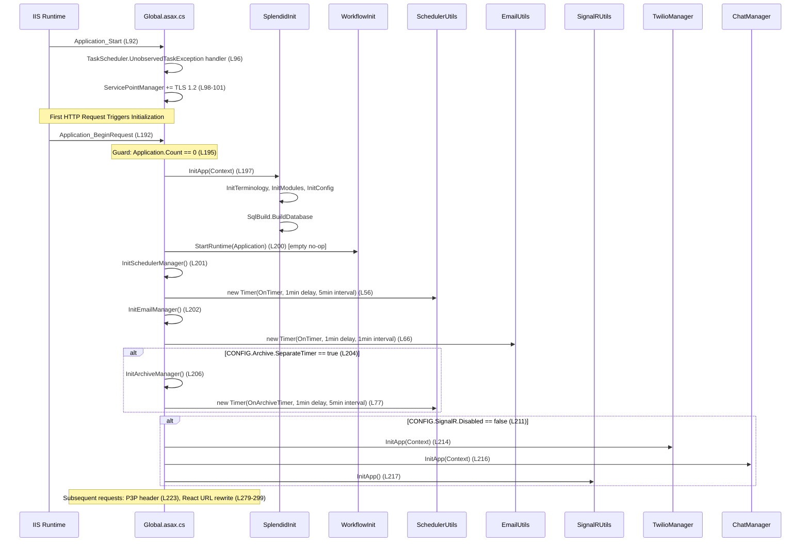
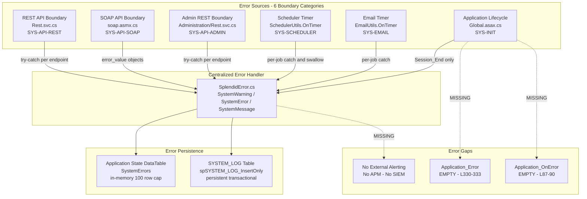

# Directive 1 — Structural Integrity Scan

**Validation of COSO Principle 10 — Selects and Develops Control Activities**

*SplendidCRM Community Edition v15.2 — Codebase Audit Report*

---

#### Report Executive Summary

The structural integrity scan of SplendidCRM Community Edition v15.2 reveals a **Theme of Failure** in the implementation of COSO Principle 10 (Selects and Develops Control Activities). While the codebase demonstrates robust application-level control activities — a 4-tier authorization model (module ACL, team filtering, field-level, record-level), centralized error logging via `SplendidError.cs`, and parameterized database access through `Sql.cs` — these controls are systematically undermined by structural decay accumulated over the platform's 20-year development history (2005–2025). Orphaned enterprise integration stubs comprising 334 non-functional C# files, manually managed dependencies with broken HintPath references pointing to non-existent directories, deliberately weakened ASP.NET security configurations dating back to workaround decisions made in 2006–2011, and the complete absence of automated testing infrastructure collectively erode the structural foundation upon which these controls depend. The Control Activities component of the COSO Internal Control — Integrated Framework (2013) requires that controls not only be selected and developed, but also that they remain effective over time — a requirement that fundamentally cannot be verified in the absence of testing, CI/CD, and configuration management automation.

Across the 6 structural integrity categories examined, the scan identified **25 findings** spanning Critical (7), Moderate (13), and Minor (5) severities. Of particular concern is the discovery that the MSBuild project file (`SplendidCRM7_VS2017.csproj`) references DLLs from 3 separate backup directories (`BackupBin2012/`, `BackupBin2022/`, `BackupBin2025/`), of which only `BackupBin2012/` exists in the repository — creating 15 broken HintPath references. The 15 affected DLLs do exist as copies within `BackupBin2012/`, suggesting a version migration that was started but never completed. Combined with 8 `Spring.Social.*` directories containing 334 non-functional stub C# files and 4 empty ASP.NET lifecycle event handlers including the critical `Application_Error` hook, the structural integrity posture demonstrates a pattern of incremental feature addition without corresponding cleanup — a direct manifestation of inadequate COSO Principle 9 (Identifies and Analyzes Significant Change) governance. The complete absence of automated testing (no unit tests, no integration tests, no E2E tests, no CI/CD pipeline, no static analysis) means that the effectiveness of every control activity in the codebase is assumption-based rather than evidence-based, representing a Critical violation of both COSO Principle 10 and COSO Principle 16 (Conducts Ongoing and/or Separate Evaluations).

---

#### Attention Required

| Component Path | Primary Finding | Risk Severity | Governing NIST/CIS Control | COSO Principle |
|---|---|---|---|---|
| `SplendidCRM/` (entire codebase) | Zero automated testing infrastructure — no unit, integration, E2E, or static analysis | Critical | NIST SI-2, CIS Control 16 | COSO Principle 10 |
| `SplendidCRM/SplendidCRM7_VS2017.csproj` | 15 DLL HintPath references to non-existent directories (`BackupBin2022/`, `BackupBin2025/`) | Critical | NIST CM-3, CIS Control 2 | COSO Principle 9 |
| `SplendidCRM/Web.config` | Security controls deliberately weakened: `requestValidationMode="2.0"`, `validateRequest="false"`, `customErrors="Off"` | Critical | NIST CM-6, CIS Control 4 | COSO Principle 11 |
| `SplendidCRM/Web.config:L5` | Database connection string hardcoded with `sa` credentials in plain text | Critical | NIST IA-5, CIS Control 3 | COSO Principle 5 |
| `BackupBin2012/` | 38 manually managed DLLs without NuGet, no version management, no SBOM | Critical | NIST CM-3, CIS Control 2 | COSO Principle 9 |
| `SplendidCRM/Global.asax.cs:L192-219` | Initialization chain runs without wrapping try-catch — partial initialization risk | Critical | NIST SI-11, CIS Control 16 | COSO Principle 10 |
| `SplendidCRM/_code/Spring.Social.*` | 8 enterprise integration stub directories (334 CS files) compiled but non-functional | Moderate | NIST CM-7, CIS Control 2 | COSO Principle 10 |
| `SplendidCRM/Global.asax.cs:L87-90,L302-333` | 4 empty lifecycle event handlers (`Application_Error`, `Application_OnError`, `Application_EndRequest`, `Application_AuthenticateRequest`) | Moderate | NIST SI-11, CIS Control 16 | COSO Principle 10 |
| `SplendidCRM/Web.config:L100` | InProc session state — non-resilient, single-server constraint | Moderate | NIST SC-7, CIS Control 4 | COSO Principle 10 |
| `SplendidCRM/_code/WorkflowInit.cs` | Workflow engine hooks present but non-functional (empty implementations) | Minor | NIST CM-7, CIS Control 2 | COSO Principle 10 |

---

## Detailed Findings

## 1. Broken Cross-References

Control activities that reference non-existent targets are, by definition, ineffective controls. Under COSO Principle 10 (Selects and Develops Control Activities), the integrity of configuration references is foundational — a build system that points to missing directories, code that references unavailable services, and commented-out functional logic all represent control activities whose structural prerequisites have eroded. This category examines cross-references within the SplendidCRM codebase that no longer resolve to valid targets.

### 1.1 MSBuild Project DLL HintPath References

**system_id:** `SYS-DEPENDENCY-MGMT`, `SYS-BUILD-PIPELINE`

The MSBuild project file `SplendidCRM/SplendidCRM7_VS2017.csproj` references 37 third-party DLLs via `<HintPath>` elements distributed across three backup directories. Only one of these directories exists in the repository:

| Backup Directory | HintPath References | Directory Status | DLL Count in Directory |
|---|---|---|---|
| `BackupBin2012/` | 22 | **EXISTS** | 38 DLLs present |
| `BackupBin2022/` | 2 | **DOES NOT EXIST** | N/A — directory missing |
| `BackupBin2025/` | 13 | **DOES NOT EXIST** | N/A — directory missing |

**BackupBin2022/ — 2 broken references:**

- `Newtonsoft.Json.dll` — Source: `SplendidCRM/SplendidCRM7_VS2017.csproj:L134`
- `Twilio.dll` — Source: `SplendidCRM/SplendidCRM7_VS2017.csproj:L215`

**BackupBin2025/ — 13 broken references:**

- `Microsoft.Bcl.AsyncInterfaces.dll` — Source: `SplendidCRM/SplendidCRM7_VS2017.csproj:L95`
- `Microsoft.IdentityModel.Abstractions.dll` — Source: `SplendidCRM/SplendidCRM7_VS2017.csproj:L100`
- `Microsoft.IdentityModel.JsonWebTokens.dll` — Source: `SplendidCRM/SplendidCRM7_VS2017.csproj:L104`
- `Microsoft.IdentityModel.Logging.dll` — Source: `SplendidCRM/SplendidCRM7_VS2017.csproj:L108`
- `Microsoft.IdentityModel.Tokens.dll` — Source: `SplendidCRM/SplendidCRM7_VS2017.csproj:L112`
- `System.Buffers.dll` — Source: `SplendidCRM/SplendidCRM7_VS2017.csproj:L155`
- `System.Memory.dll` — Source: `SplendidCRM/SplendidCRM7_VS2017.csproj:L165`
- `System.Net.Http.Json.dll` — Source: `SplendidCRM/SplendidCRM7_VS2017.csproj:L170`
- `System.Numerics.Vectors.dll` — Source: `SplendidCRM/SplendidCRM7_VS2017.csproj:L174`
- `System.Runtime.CompilerServices.Unsafe.dll` — Source: `SplendidCRM/SplendidCRM7_VS2017.csproj:L178`
- `System.Text.Encodings.Web.dll` — Source: `SplendidCRM/SplendidCRM7_VS2017.csproj:L185`
- `System.Text.Json.dll` — Source: `SplendidCRM/SplendidCRM7_VS2017.csproj:L189`
- `System.Threading.Tasks.Extensions.dll` — Source: `SplendidCRM/SplendidCRM7_VS2017.csproj:L193`

**Mitigating Factor:** All 15 DLLs referenced from the non-existent directories do exist as copies within `BackupBin2012/`. MSBuild may resolve these through fallback mechanisms or the DLLs may be manually copied to the output `bin/` directory during deployment. However, the HintPaths as written in the project file are technically broken and indicate an incomplete version migration.

**Risk Severity:** Critical — Configuration management integrity is violated. The project file does not accurately reflect the dependency resolution paths.

**Governing Controls:** NIST CM-3 (Configuration Change Control), CIS Control 2 (Inventory and Control of Software Assets)

**COSO Principle 9** (Identifies and Analyzes Significant Change) — The migration from `BackupBin2012/` to `BackupBin2022/` and `BackupBin2025/` was initiated (HintPaths were updated) but the corresponding directories were never created or committed to the repository, indicating that a significant change was started but not analyzed to completion.

---

### 1.2 Enterprise Integration Stub References

**system_id:** `SYS-INTEGRATION-STUBS`

Eight `Spring.Social.*` directories under `SplendidCRM/_code/` contain 334 C# files that reference enterprise APIs but provide no functional implementations in Community Edition. All methods throw descriptive "not supported in Community Edition" exceptions:

| Directory | Enterprise Service | CS File Count |
|---|---|---|
| `SplendidCRM/_code/Spring.Social.Facebook/` | Facebook Social Integration | Variable |
| `SplendidCRM/_code/Spring.Social.HubSpot/` | HubSpot CRM Integration | Variable |
| `SplendidCRM/_code/Spring.Social.LinkedIn/` | LinkedIn Social Integration | Variable |
| `SplendidCRM/_code/Spring.Social.Office365/` | Office 365 Integration | Variable |
| `SplendidCRM/_code/Spring.Social.PhoneBurner/` | PhoneBurner Telephony | Variable |
| `SplendidCRM/_code/Spring.Social.QuickBooks/` | QuickBooks Financial Integration | Variable |
| `SplendidCRM/_code/Spring.Social.Salesforce/` | Salesforce CRM Integration | Variable |
| `SplendidCRM/_code/Spring.Social.Twitter/` | Twitter Social Integration | Variable |
| **Total** | **8 directories** | **334 CS files** |

These stubs reference `Spring.Rest.dll` and `Spring.Social.Core.dll` (both present in `BackupBin2012/`), but the corresponding enterprise service endpoints are non-functional — all code paths terminate in exception throws.

**Additional single-file integration stubs** that compile but are non-functional:

- `SplendidCRM/_code/GoogleApps.cs`, `GoogleUtils.cs`, `GoogleSync.cs` — Google services integration
- `SplendidCRM/_code/ExchangeUtils.cs`, `ExchangeSync.cs` — Microsoft Exchange integration
- `SplendidCRM/_code/iCloudSync.cs` — Apple iCloud synchronization
- `SplendidCRM/_code/FacebookUtils.cs` — Facebook utility functions
- `SplendidCRM/_code/SocialImport.cs` — Social media import abstraction

**Total enterprise integration stubs:** 8 `Spring.Social.*` directories + 8 additional stub files = **16 enterprise integration stubs**

**Risk Severity:** Moderate — Code compiles and is included in the deployed assembly but provides no functionality, increasing the attack surface, compiled assembly size, and maintenance burden.

**Governing Controls:** NIST CM-7 (Least Functionality), CIS Control 2 (Inventory and Control of Software Assets)

**COSO Principle 10** — These stubs represent control activities that exist in compiled form but not in functional substance. Their presence violates the principle of least functionality.

---

### 1.3 Commented-Out Code References

**system_id:** `SYS-INIT`, `SYS-ASPNET-APP`

Commented-out functional code in `SplendidCRM/Global.asax.cs` creates reference noise and indicates abandoned features:

- **Lines 231–258:** CORS support code commented out. The comment at line 230 references `cordova-plugin-advanced-http` as the replacement, indicating a strategic decision to move CORS handling to the mobile client rather than the server. Source: `SplendidCRM/Global.asax.cs:L231-258`
- **Lines 263–274:** vCalendar URL rewriting commented out. References the `/vcal_server/` path for Outlook integration that was never completed (comment at L260 notes "vCalendar support is not going to be easy"). Source: `SplendidCRM/Global.asax.cs:L263-274`
- **Line 89:** `SplendidInit.Application_OnError()` call commented out within the `Application_OnError` handler, leaving the handler completely empty. Source: `SplendidCRM/Global.asax.cs:L89`

**Risk Severity:** Minor — Commented code creates maintenance noise but is not functionally active.

**Governing Controls:** NIST CM-7 (Least Functionality)

**COSO Principle 10** — Commented-out code paths do not affect control execution but indicate a pattern of deferred cleanup.

---

## 2. Orphaned Configurations

Orphaned configurations represent control activities that have been abandoned, bypassed, or deliberately weakened. Under COSO Principle 10, configuration settings that disable security protections or reference non-functional services undermine the effectiveness of the broader control environment. This category documents configurations that are present but do not serve their intended protective purpose.

### 2.1 Web.config Security Relaxations

**system_id:** `SYS-IIS-CFG`, `SYS-CONFIG`

Four security-weakening configurations in `SplendidCRM/Web.config` deliberately disable ASP.NET defense-in-depth protections. Each was introduced as a workaround for specific functional issues and was never revisited:

**`requestValidationMode="2.0"` — Source: `SplendidCRM/Web.config:L111`**

Downgrades ASP.NET request validation to legacy 2.0 behavior, significantly reducing protection against cross-site scripting (XSS) and injection attacks. The same `<httpRuntime>` element configures `targetFramework="4.8"`, yet deliberately uses 2.0-era validation rules that do not inspect all request data.

**`enableEventValidation="false"` — Source: `SplendidCRM/Web.config:L115`**

Disables WebForms event validation entirely. The inline comment explains: *"Disable Event Validation as it is causing a problem in the Configure Tabs area. (A .NET 2.0 issue)"* — a workaround applied on 07/17/2006 that was never revisited or replaced with a targeted fix.

**`validateRequest="false"` — Source: `SplendidCRM/Web.config:L115`**

Disables page-level request validation. The inline comment explains: *"Disable Request Validation is it is causing more problems with the use of HTML in description fields"* — a workaround applied on 07/07/2007 that became a permanent configuration.

**`customErrors mode="Off"` — Source: `SplendidCRM/Web.config:L51`**

Exposes detailed ASP.NET error information including full stack traces, server paths, and internal state to all users (not just local clients). The comment history reveals: a security hardening decision in 09/26/2010, followed by a reversal on 01/01/2011 (*"Restore the original error messages"*) with the expectation that users would apply service packs.

**Risk Severity:** Critical — Multiple defense-in-depth layers are deliberately disabled, reducing the application's resistance to XSS, injection attacks, and information disclosure.

**Governing Controls:** NIST CM-6 (Configuration Settings), NIST SI-10 (Information Input Validation), CIS Control 4 (Secure Configuration of Enterprise Assets and Software)

**COSO Principle 11** (Selects and Develops General Controls over Technology) — General technology controls have been selected (ASP.NET provides request validation, event validation, and custom errors) but have been deliberately disabled at the application configuration layer.

---

### 2.2 Hardcoded Credential in Configuration

**system_id:** `SYS-CONFIG`, `SYS-IIS-CFG`

The `SplendidCRM/Web.config` file at line 5 contains the `SplendidSQLServer` connection string with hardcoded SQL Server `sa` credentials in plain text:

```
user id=sa;password=splendidcrm2005
```

Source: `SplendidCRM/Web.config:L5`

This configuration uses the SQL Server system administrator account (`sa`) with a guessable, default-style password containing the application name and a year. There is no environment variable substitution, no Azure Key Vault integration, no Web.config transformation for deployment environments, and no credential rotation mechanism.

**Risk Severity:** Critical — System administrator database credentials are embedded in source code with a trivially guessable password.

**Governing Controls:** NIST IA-5 (Authenticator Management), CIS Control 3 (Data Protection)

**COSO Principle 5** (Enforces Accountability) — Hardcoded shared credentials (`sa`) eliminate individual accountability for database actions, as all application-tier operations execute under the same privileged identity.

---

### 2.3 StateServer Configuration Dead Reference

**system_id:** `SYS-IIS-CFG`

The `<sessionState>` element at `SplendidCRM/Web.config:L100` configures connection strings for both StateServer (`stateConnectionString="tcpip=127.0.0.1:42424"`) and SQL Server session state (`sqlConnectionString="data source=127.0.0.1;Trusted_Connection=yes"`), but the active session mode is `InProc`. These connection strings are orphaned configuration that would only activate if the administrator changed the session state mode to `StateServer` or `SQLServer`.

Source: `SplendidCRM/Web.config:L100`

**Risk Severity:** Minor — Dead configuration that consumes no resources but creates confusion about intended session state architecture.

**Governing Controls:** NIST CM-6 (Configuration Settings)

**COSO Principle 10** — Orphaned configuration represents a control that was planned but never activated.

---

### 2.4 Spring.Social.* Enterprise Stubs as Orphaned Code

**system_id:** `SYS-INTEGRATION-STUBS`

Cross-reference with finding 1.2 — The 8 `Spring.Social.*` directories containing 334 CS files are orphaned enterprise integration stubs. They compile, consume build time, appear in the deployed assembly, and increase the application's code surface area, but serve no functional purpose in Community Edition. All code paths terminate in descriptive exception throws.

Additional orphaned utility stubs under `SplendidCRM/_code/`:

- `PayPal/` directory — PayPal payment integration stubs
- `QuickBooks/` directory — QuickBooks accounting integration stubs

Source: `SplendidCRM/_code/Spring.Social.*/`, `SplendidCRM/_code/PayPal/`, `SplendidCRM/_code/QuickBooks/`

**Risk Severity:** Moderate — Violates the NIST CM-7 (Least Functionality) principle by including non-essential code in the deployed application.

**COSO Principle 10** — Orphaned code paths represent control activities that exist in compiled form but not in operational substance. Their continued presence indicates an absence of periodic code review and pruning governance.

---

### 2.5 Workflow Engine Stubs

**system_id:** `SYS-WORKFLOW`

`SplendidCRM/_code/WorkflowInit.cs` and `SplendidCRM/_code/WorkflowUtils.cs` contain empty method implementations that preserve API signatures for enterprise workflow features:

```csharp
public static void StartRuntime(HttpApplicationState Application)
{
}
```

Source: `SplendidCRM/_code/WorkflowInit.cs:L39-41`

`WorkflowInit.StartRuntime()` is called from `SplendidCRM/Global.asax.cs:L200` during application initialization, executing a no-op method on every application start. The `SplendidCRM/_code/Workflow/` and `SplendidCRM/_code/Workflow4/` directories contain additional workflow hooks that compile but do not execute meaningful business logic.

**Risk Severity:** Minor — Workflow infrastructure is present but non-functional in Community Edition. The empty method calls have negligible performance impact but represent dead code in the initialization path.

**Governing Controls:** NIST CM-7 (Least Functionality), CIS Control 2 (Inventory and Control of Software Assets)

**COSO Principle 10** — Stub implementations preserve the form of a control activity (workflow processing) without its substance.

---

## 3. Missing Environment Variables

Environment-based configuration is a foundational practice for deployment flexibility, credential security, and configuration management. Under COSO Principle 10 (Selects and Develops Control Activities), the absence of environment-driven configuration forces hardcoded values into source code, coupling deployment settings to the codebase and eliminating the ability to enforce different security postures across environments (development, staging, production).

### 3.1 Hardcoded Database Connection

**system_id:** `SYS-CONFIG`

`SplendidCRM/Web.config` lines 4–5 hardcode both the database provider and connection string without any environment variable substitution:

```xml
<add key="SplendidProvider" value="System.Data.SqlClient" />
<add key="SplendidSQLServer" value="data source=(local)\SplendidCRM;..." />
```

Source: `SplendidCRM/Web.config:L4-5`

There are no `web.config` transforms (no `Web.Debug.config`, `Web.Release.config`), no environment-based configuration management, no configuration builder, and no external secret store integration. The same connection string containing `sa` credentials is used in every environment.

**Risk Severity:** Critical — Hardcoded credentials in Web.config with no environment-based configuration management create direct credential exposure risk; deployment inflexibility is a secondary consequence.

**Governing Controls:** NIST CM-6 (Configuration Settings), CIS Control 4 (Secure Configuration of Enterprise Assets and Software)

**COSO Principle 10** — Configuration management controls require the ability to vary settings by environment; hardcoded values eliminate this capability.

---

### 3.2 Application Configuration via Database

**system_id:** `SYS-CONFIG`, `SYS-INIT`

Runtime configuration values are stored in the SQL `CONFIG` table and loaded into `Application["CONFIG.*"]` state by `SplendidInit.InitConfig()` during application initialization. Configuration keys are accessed throughout the codebase without documented defaults or validation:

- `Sql.ToBoolean(this.Context.Application["CONFIG.Archive.SeparateTimer"])` — Source: `SplendidCRM/Global.asax.cs:L204`
- `Sql.ToBoolean(this.Context.Application["CONFIG.SignalR.Disabled"])` — Source: `SplendidCRM/Global.asax.cs:L211`
- `Sql.ToString(Application["CONFIG.p3p"])` — Source: `SplendidCRM/Global.asax.cs:L223`

The `Sql.ToBoolean()` and `Sql.ToString()` helper methods provide null-safe access (returning `false` and empty string respectively for missing keys), but there is no configuration schema documentation, no validation of expected configuration keys, and no environment variable fallback mechanism.

**Risk Severity:** Moderate — Configuration is database-driven but undocumented; behavior depends on seed data that may vary between installations.

**Governing Controls:** NIST CM-6 (Configuration Settings), CIS Control 4 (Secure Configuration)

**COSO Principle 10** — Database-driven configuration without documentation means control behavior depends on an undocumented data store.

---

### 3.3 No Environment-Based Build Configuration

**system_id:** `SYS-BUILD-PIPELINE`

No `.env` files, no build-time environment variable injection, and no configuration transforms exist across any of the three build pipelines:

- **SQL Build:** `SQL Scripts Community/Build.bat` uses hardcoded file paths and directory references with no parameterization.
- **React Build:** `SplendidCRM/React/package.json` scripts use webpack defaults with no environment-specific build configurations observed (no `.env.development`, `.env.production`).
- **.NET Build:** `SplendidCRM/SplendidCRM7_VS2017.csproj` uses fixed Debug/Release configurations with no per-environment compilation constants beyond the default `TRACE;DEBUG;NET_4_0`.

Source: `SQL Scripts Community/Build.bat`, `SplendidCRM/React/package.json`, `SplendidCRM/SplendidCRM7_VS2017.csproj`

**Risk Severity:** Moderate — All three build pipelines produce identical output regardless of target environment.

**Governing Controls:** NIST CM-6 (Configuration Settings), CIS Control 4 (Secure Configuration)

**COSO Principle 10** — The absence of environment-aware build configuration means control activities (e.g., debug symbols, error verbosity) cannot be adjusted per deployment context.

---

## 4. Dangling Service Dependencies

Dependencies that are unmanaged, version-mismatched, or referenced without package management create fragile supply chain risks. Under COSO Principle 9 (Identifies and Analyzes Significant Change), the inability to track dependency changes, detect vulnerabilities, or enforce version consistency represents a governance failure in the management of significant changes to the application's operational dependencies.

### 4.1 Manually Managed .NET DLLs

**system_id:** `SYS-DEPENDENCY-MGMT`

`SplendidCRM/SplendidCRM7_VS2017.csproj` references 37 third-party DLLs via `<HintPath>` elements. These DLLs are manually managed — there is no NuGet, no package management system, no version locking file (`packages.lock.json`), and no Software Bill of Materials (SBOM).

**BackupBin2012/ — 22 references (directory EXISTS with 38 DLLs):**

AjaxControlToolkit, Antlr3.Runtime, BouncyCastle.Crypto, CKEditor.NET, Common.Logging, DocumentFormat.OpenXml, ICSharpCode.SharpZLib, MailKit, Microsoft.AspNet.SignalR.Core (v1.2.2), Microsoft.AspNet.SignalR.SystemWeb, Microsoft.Owin, Microsoft.Owin.Host.SystemWeb, Microsoft.Owin.Security, Microsoft.Web.Infrastructure, MimeKit, Owin, RestSharp, Spring.Rest, Spring.Social.Core, System.Web.Optimization, TweetinCore, WebGrease

**BackupBin2022/ — 2 references (directory MISSING):**

Newtonsoft.Json (→13.0.0.0 via binding redirect), Twilio

**BackupBin2025/ — 13 references (directory MISSING):**

Microsoft.Bcl.AsyncInterfaces, Microsoft.IdentityModel.Abstractions, Microsoft.IdentityModel.JsonWebTokens, Microsoft.IdentityModel.Logging, Microsoft.IdentityModel.Tokens, System.Buffers, System.Memory, System.Net.Http.Json, System.Numerics.Vectors, System.Runtime.CompilerServices.Unsafe, System.Text.Encodings.Web, System.Text.Json, System.Threading.Tasks.Extensions

Source: `SplendidCRM/SplendidCRM7_VS2017.csproj:L56-215`

No vulnerability scanning, dependency auditing, or automated version checking is configured for any of these 37 dependencies. Security-critical libraries (BouncyCastle.Crypto, Microsoft.Owin.Security, Microsoft.IdentityModel.*) are managed through the same manual copy mechanism as non-critical libraries.

**Risk Severity:** Critical — The dependency supply chain is entirely unmanaged, with no tooling for vulnerability detection, version verification, or integrity validation.

**Governing Controls:** NIST CM-3 (Configuration Change Control), CIS Control 2 (Inventory and Control of Software Assets)

**COSO Principle 9** — The absence of package management tooling means that dependency changes cannot be tracked, analyzed, or audited — a fundamental failure in change identification and analysis.

---

### 4.2 SignalR Version Asymmetry

**system_id:** `SYS-REALTIME`, `SYS-DEPENDENCY-MGMT`

The server-side SignalR implementation uses `Microsoft.AspNet.SignalR.Core` v1.2.2 (a legacy version from the `BackupBin2012/` directory), while the React SPA client uses two SignalR client packages:

- `@microsoft/signalr` v8.0.0 (modern ASP.NET Core SignalR client) — Source: `SplendidCRM/React/package.json`
- `signalr` v2.4.3 (legacy jQuery SignalR client) — Source: `SplendidCRM/React/package.json`

This version asymmetry (server v1.2.2 vs. client v8.0.0) creates a cross-version compatibility dependency where the modern client library must operate in backward-compatible mode to communicate with the legacy server hub.

Source: `SplendidCRM/SplendidCRM7_VS2017.csproj:L87`, `SplendidCRM/React/package.json`

**Risk Severity:** Moderate — Version asymmetry increases the risk of protocol incompatibility and limits the ability to leverage security improvements in newer SignalR versions.

**Governing Controls:** NIST CM-3 (Configuration Change Control)

**COSO Principle 9** — The SignalR version split indicates incremental client-side modernization without corresponding server-side updates.

---

### 4.3 Assembly Binding Redirects

**system_id:** `SYS-IIS-CFG`

The `<runtime>` section of `SplendidCRM/Web.config` contains 9 assembly binding redirects that patch version mismatches between referenced DLL versions and the versions actually deployed:

| Assembly | Redirect Target | Source Line |
|---|---|---|
| Newtonsoft.Json | → 13.0.0.0 | `Web.config:L157` |
| Microsoft.IdentityModel.JsonWebTokens | → 6.34.0.0 | `Web.config:L162` |
| Microsoft.IdentityModel.Tokens | → 6.34.0.0 | `Web.config:L166` |
| Microsoft.IdentityModel.Logging | → 6.34.0.0 | `Web.config:L170` |
| System.IdentityModel.Tokens.Jwt | → 6.15.1.0 | `Web.config:L174` |
| System.Buffers | → 4.0.3.0 | `Web.config:L178` |
| System.Runtime.CompilerServices.Unsafe | → 5.0.0.0 | `Web.config:L182` |
| System.Text.Json | → 5.0.0.2 | `Web.config:L186` |
| System.Threading.Tasks.Extensions | → 4.0.3.0 | `Web.config:L191` |

These redirects indicate that the referenced DLL versions in the `.csproj` file do not match the actually deployed versions, requiring runtime version resolution. This is a symptom of the manual dependency management approach — without NuGet, version reconciliation must be done manually via binding redirects.

**Risk Severity:** Moderate — Binding redirects are a valid .NET mechanism, but 9 redirects in a manually managed dependency ecosystem indicate a fragile version graph.

**Governing Controls:** NIST CM-3 (Configuration Change Control)

**COSO Principle 9** — The binding redirect count reflects accumulated version drift from incremental dependency updates without holistic version management.

---

## 5. Unreachable Code Paths

Unreachable code paths — whether by design, accident, or obsolescence — represent compiled code that cannot be exercised through normal application operation. Under COSO Principle 10 (Selects and Develops Control Activities), unreachable code increases the application's attack surface without providing corresponding control value, and empty handler methods represent control hooks that have been established but never implemented.

### 5.1 Enterprise Integration Throw-Only Stubs

**system_id:** `SYS-INTEGRATION-STUBS`

The 334 C# files across 8 `Spring.Social.*` directories compile into the application assembly but all code paths terminate in descriptive exception throws (e.g., "not supported in Community Edition"). These code paths are reachable only through configuration that enables enterprise features — but no enterprise license mechanism or feature toggle exists in Community Edition to activate these paths under normal operation.

Source: `SplendidCRM/_code/Spring.Social.*/`

**Risk Severity:** Moderate — Increases compiled assembly size, maintenance burden, build time, and theoretical attack surface without providing any functional capability.

**Governing Controls:** NIST CM-7 (Least Functionality), CIS Control 2 (Inventory and Control of Software Assets)

**COSO Principle 10** — Compiled but non-exercisable code represents control surface area that cannot be validated through testing.

---

### 5.2 Empty Lifecycle Event Handlers

**system_id:** `SYS-INIT`, `SYS-ASPNET-APP`

Four ASP.NET lifecycle event handlers in `SplendidCRM/Global.asax.cs` are registered but contain empty method bodies:

| Handler | Lines | Body Content |
|---|---|---|
| `Application_OnError` | L87–90 | Empty body; `SplendidInit.Application_OnError()` call commented out at L89 |
| `Application_EndRequest` | L302–305 | Completely empty body |
| `Application_AuthenticateRequest` | L307–310 | Completely empty body |
| `Application_Error` | L330–333 | Completely empty body |

Source: `SplendidCRM/Global.asax.cs:L87-90`, `SplendidCRM/Global.asax.cs:L302-305`, `SplendidCRM/Global.asax.cs:L307-310`, `SplendidCRM/Global.asax.cs:L330-333`

Of particular concern is `Application_Error` (L330–333), which is the ASP.NET global unhandled exception handler. This handler is intended to catch any exception that escapes individual try-catch blocks throughout the application. With an empty body, any unhandled exception triggers ASP.NET's default error page — which, combined with `customErrors mode="Off"` (finding 2.1), results in full stack trace exposure to all clients.

**Risk Severity:** Moderate — Global error capture mechanism is non-functional; unhandled exceptions bypass centralized logging entirely.

**Governing Controls:** NIST SI-11 (Error Handling), CIS Control 16 (Application Software Security)

**COSO Principle 10** — The ASP.NET framework provides the `Application_Error` hook as a control activity for global error management; leaving it empty negates this control.

---

### 5.3 Workflow Engine Empty Implementations

**system_id:** `SYS-WORKFLOW`

Cross-reference with finding 2.5 — `WorkflowInit.StartRuntime()` and `WorkflowInit.StopRuntime()` are empty methods that are called during application startup and shutdown respectively. `SplendidPersistenceService.OnTimer()` is similarly empty.

Source: `SplendidCRM/_code/WorkflowInit.cs:L39-45`

**Risk Severity:** Minor — No-op methods in the initialization/shutdown path; functional impact is negligible.

**COSO Principle 10** — Placeholder control hooks without implementation.

---

### 5.4 Conditional Compilation Paths

**system_id:** `SYS-ASPNET-APP`

`#if !SplendidApp` conditional compilation directives in `SplendidCRM/Global.asax.cs` gate significant initialization logic:

- **Lines 45–81:** Timer declarations and initializer methods (Scheduler, Email, Archive)
- **Lines 198–219:** Workflow, scheduler, email, archive, SignalR, Twilio, and Chat initialization
- **Lines 374–383:** Timer disposal and workflow shutdown

When the `SplendidApp` compilation constant is defined, all background processing (email, scheduling, archiving) and real-time features (SignalR, Twilio, Chat) are excluded from the build. This creates two distinct application profiles from a single codebase — the lightweight `SplendidApp` profile is unreachable in the default Community Edition build (which defines `TRACE;DEBUG;NET_4_0` or `TRACE;NET_4_0`).

Source: `SplendidCRM/Global.asax.cs:L45-81`, `SplendidCRM/Global.asax.cs:L198-219`, `SplendidCRM/Global.asax.cs:L374-383`

**Risk Severity:** Minor — Intentional design for a lightweight build variant, but the `SplendidApp` build profile is undocumented.

**Governing Controls:** NIST CM-7 (Least Functionality)

**COSO Principle 10** — Conditional compilation provides a mechanism for selecting control activities appropriate to the deployment profile, but the absence of documentation means the profiles and their security implications are not formally assessed.

---

## 6. Missing/Incomplete Error Handling at System Boundaries

Error handling at system boundaries is a critical control activity under COSO Principle 10 (Selects and Develops Control Activities) and NIST SI-11 (Error Handling). System boundaries — where the application interfaces with external clients, background timers, and the application lifecycle — are the points where exceptions are most likely to occur and where unhandled errors have the greatest impact. Incomplete error handling at these boundaries allows exceptions to propagate in unpredictable ways, potentially exposing internal state, disrupting service, or bypassing security controls.

### 6.1 REST API Boundary

**system_id:** `SYS-API-REST`

The WCF REST API gateway (`SplendidCRM/Rest.svc.cs`) is the primary API surface for the React SPA and external clients. Error handling varies significantly by endpoint:

- Authentication endpoints catch exceptions and return structured error objects
- CRUD endpoints use per-method try-catch blocks with `SplendidError` logging, but the error response format is inconsistent (some return error strings, others return exception objects)
- No standardized error envelope exists (no RFC 7807 Problem Details for HTTP APIs)
- With `customErrors mode="Off"` (finding 2.1), any unhandled exception that escapes a try-catch block exposes full stack traces to API clients

Source: `SplendidCRM/Rest.svc.cs`

**Risk Severity:** Moderate — Error handling exists but is inconsistent; information leakage risk from unhandled exceptions combined with disabled custom errors.

**Governing Controls:** NIST SI-11 (Error Handling), CIS Control 16 (Application Software Security)

**COSO Principle 10** — Control activities for error handling are present but not uniformly applied.

---

### 6.2 SOAP API Boundary

**system_id:** `SYS-API-SOAP`

The SOAP API (`SplendidCRM/soap.asmx.cs`) exposes SugarCRM-compatible `error_value` objects for error reporting. However:

- Error messages may contain internal implementation details from exception messages
- Exception wrapping is inconsistent across the approximately 30+ `[WebMethod]` endpoints
- The `track_email` method is explicitly stubbed to throw an exception (intentional non-implementation)

Source: `SplendidCRM/soap.asmx.cs`

**Risk Severity:** Moderate — SOAP error reporting exists but with potential information disclosure through verbose error messages.

**Governing Controls:** NIST SI-11 (Error Handling), CIS Control 16 (Application Software Security)

**COSO Principle 10** — Error handling control activities are present in the SOAP layer but are not consistently hardened against information leakage.

---

### 6.3 Admin REST API Boundary

**system_id:** `SYS-API-ADMIN`

The Administration REST API (`SplendidCRM/Administration/Rest.svc.cs`) aggregates 40+ administration modules with `IS_ADMIN` privilege enforcement. Error handling patterns mirror the primary REST API's inconsistencies (finding 6.1): per-method try-catch blocks with `SplendidError` logging but no standardized error envelope.

Source: `SplendidCRM/Administration/Rest.svc.cs`

**Risk Severity:** Moderate — Admin API inherits the same error handling inconsistencies as the primary REST API, compounded by the higher privilege level of admin operations.

**Governing Controls:** NIST SI-11 (Error Handling), CIS Control 16 (Application Software Security)

**COSO Principle 10** — Admin-tier error handling should be at least as robust as user-tier handling; instead, it mirrors the same inconsistencies.

---

### 6.4 Scheduler Timer Boundary

**system_id:** `SYS-SCHEDULER`

The scheduler timer (`SplendidCRM/_code/SchedulerUtils.cs`) uses a boolean flag as a reentrancy guard:

```csharp
private static bool bInsideTimer = false;
```

Source: `SplendidCRM/_code/SchedulerUtils.cs:L34`

Key error handling observations:

- The `bInsideTimer` flag is a simple boolean, not a thread-safe `Interlocked` operation — while .NET boolean assignment is atomic, the check-then-set pattern is susceptible to race conditions under thread pool pressure.
- Per-job exceptions are caught and logged via `SplendidError.SystemMessage()` but silently swallowed — job failures do not propagate to any monitoring or alerting system.
- Timer errors do not trigger backpressure, circuit-breaking, or adaptive scheduling.
- `OnArchiveTimer()` mirrors the same pattern with `bInsideArchiveTimer`.
- When the timer re-enters while a previous invocation is still running, a single "Scheduler Busy" warning is logged but no corrective action is taken.

Source: `SplendidCRM/_code/SchedulerUtils.cs:L34-38`

**Risk Severity:** Moderate — Reentrancy protection exists but is not thread-safe; error handling is catch-and-swallow with no external visibility.

**Governing Controls:** NIST SI-11 (Error Handling), NIST AU-2 (Event Logging)

**COSO Principle 10** — The scheduler implements control activities (reentrancy guards, per-job error logging) but these controls lack the robustness required for unattended background processing.

---

### 6.5 Email Timer Boundary

**system_id:** `SYS-EMAIL`

The email timer is initialized with a 1-minute interval (tighter than the scheduler's 5-minute interval), reflecting the time-sensitivity of email delivery:

```csharp
tEmailManager = new Timer(EmailUtils.OnTimer, this.Context, new TimeSpan(0, 1, 0), new TimeSpan(0, 1, 0));
```

Source: `SplendidCRM/Global.asax.cs:L66`

Errors in email processing (campaign dispatch, inbound polling, outbound delivery, reminders) are logged via `SplendidError` but do not trigger alerting, retry mechanisms with exponential backoff, or dead-letter queuing. Failed emails simply wait for the next 1-minute timer tick.

Source: `SplendidCRM/_code/EmailUtils.cs`

**Risk Severity:** Moderate — Email processing errors are logged but not actionable without manual SYSTEM_LOG review.

**Governing Controls:** NIST SI-11 (Error Handling), NIST AU-2 (Event Logging)

**COSO Principle 10** — Email delivery is a business-critical control activity whose error handling lacks the alerting and retry sophistication required for reliable operation.

---

### 6.6 Application Lifecycle Boundary

**system_id:** `SYS-INIT`

The application lifecycle in `SplendidCRM/Global.asax.cs` contains critical error handling gaps:

**`Application_Start` (L92–102):** Sets TLS 1.2 enforcement and TaskScheduler unobserved exception handler. No error handling wraps these operations — if either fails, the application starts in a degraded state without TLS 1.2 or unobserved task exception handling.

**`Application_BeginRequest` (L192–219):** The one-time initialization block (triggered when `Application.Count == 0`) executes a critical chain without a wrapping try-catch:

1. `SplendidInit.InitApp(this.Context)` — database build, configuration loading
2. `WorkflowInit.StartRuntime(this.Application)` — workflow initialization
3. `InitSchedulerManager()` — scheduler timer creation
4. `InitEmailManager()` — email timer creation
5. Conditional: `InitArchiveManager()` — archive timer creation
6. Conditional: `TwilioManager.InitApp()`, `ChatManager.InitApp()`, `SignalRUtils.InitApp()` — real-time services

If any step in this chain throws an exception, subsequent steps are skipped, leaving the application in a partially initialized state — for example, the scheduler timer might be running but SignalR might not be initialized.

**`Application_Error` (L330–333):** Empty body — no global unhandled exception capture. Combined with `customErrors mode="Off"`, this means unhandled exceptions display full stack traces.

**`Application_OnError` (L87–90):** Empty body with commented-out `SplendidInit.Application_OnError()` call.

**`Session_End` (L335–369):** Properly catches exceptions during logout logging and temp file cleanup, but swallows them silently.

Source: `SplendidCRM/Global.asax.cs:L92-102`, `SplendidCRM/Global.asax.cs:L192-219`, `SplendidCRM/Global.asax.cs:L330-333`, `SplendidCRM/Global.asax.cs:L87-90`, `SplendidCRM/Global.asax.cs:L335-369`

**Risk Severity:** Critical — The application initialization sequence is unprotected by error handling, and the empty `Application_Error` handler means unhandled exceptions are neither captured nor recovered from. The initialization chain gap is the primary risk; the empty global handler is a compounding factor.

**Governing Controls:** NIST SI-11 (Error Handling), CIS Control 16 (Application Software Security)

**COSO Principle 10** — The application initialization sequence is the most critical control setup path in the system; the absence of error handling around this chain means that control activity initialization failures are neither detected nor recovered from.

---

### 6.7 Zero Testing Infrastructure — Cross-Cutting Finding

**system_id:** ALL (cross-cutting — affects every system in the registry)

The complete absence of automated testing across all tiers of the SplendidCRM codebase means that error handling at every system boundary documented in findings 6.1 through 6.6 is **unverified by any automated mechanism**:

- **No unit tests** for any of the 60+ `_code/` utility classes
- **No integration tests** for REST, SOAP, or Admin API endpoints
- **No end-to-end tests** for client-server interactions across any of the 4 client interfaces
- **No smoke tests** for the application initialization sequence
- **No CI/CD pipeline** to execute any tests on commit or deployment
- **No static analysis tools** configured (no Roslyn analyzers, no StyleCop, no SonarQube)
- **No security scanning** — no SAST, DAST, or dependency vulnerability scanning
- **No code coverage measurement** — test coverage is 0% by definition

This is the single most significant structural integrity finding in this audit. Without automated testing, every error handling path, every ACL check, every input validation routine, and every boundary condition in the codebase is assumption-based rather than evidence-based. The existence of control activities (authorization checks, error logging, parameterized queries) cannot be verified as effective under COSO Principle 10 because no testing mechanism exists to exercise them.

Source: Entire codebase — no test directories, no test configurations, no test runners, no CI/CD configuration files found.

**Risk Severity:** Critical — The absence of automated testing is a systemic governance failure that undermines confidence in every other control activity.

**Governing Controls:** NIST SI-2 (Flaw Remediation), CIS Control 16 (Application Software Security)

**COSO Principle 10** (Selects and Develops Control Activities) — Control activities exist but their effectiveness cannot be demonstrated, measured, or maintained without automated testing.

**COSO Principle 16** (Conducts Ongoing and/or Separate Evaluations) — No mechanism exists for ongoing evaluation of the internal control system. The COSO framework requires that monitoring activities verify that controls are present and functioning; with zero testing infrastructure, this monitoring is entirely absent.

---

## Bootstrap Sequence Diagram

The application initialization sequence is a critical control path under COSO Principle 10 — it is the process by which all runtime control activities (authentication, authorization, caching, scheduling, error logging) are established. The following diagram documents the `Application_Start` → `Application_BeginRequest` → timer initialization chain in `SplendidCRM/Global.asax.cs`.



**Findings from Bootstrap Sequence Analysis:**

- **Finding:** The entire initialization chain from `SplendidInit.InitApp()` through `SignalRUtils.InitApp()` runs without a wrapping try-catch block. If any step throws an exception (e.g., database connection failure during `InitApp`, SignalR routing conflict during `InitApp()`), subsequent initialization steps are skipped, leaving the application in a partially initialized state with some timers running but other services unavailable. **system_id:** `SYS-INIT`
- **Finding:** The initialization is triggered by the first HTTP request (the `Application.Count == 0` check at L195), not by `Application_Start`. This creates a race condition window where the first request must complete the entire initialization sequence before the application is fully operational. If multiple requests arrive simultaneously at startup, only one will trigger initialization (guarded by `Application.Count`), but other requests may proceed against an incompletely initialized application. **system_id:** `SYS-INIT`

**Risk Severity:** Moderate

**Governing Controls:** NIST SI-11 (Error Handling), CIS Control 16 (Application Software Security)

---

## Error Handling Flow Diagram

The error handling architecture in SplendidCRM demonstrates a centralized pattern where 6 distinct boundary categories converge at `SplendidError.cs`, which provides dual persistence to both an in-memory `DataTable` (for Admin UI display) and the SQL `SYSTEM_LOG` table (for persistent audit trail). This architecture represents a well-designed control activity under COSO Principle 10, but its effectiveness is limited by empty global error handlers and the complete absence of external monitoring integration.



**Findings from Error Handling Architecture Analysis:**

- **Finding:** All boundary error paths converge at `SplendidError.cs`, which provides dual persistence via `Application.Lock()` / `Application.UnLock()` thread-safe access to the `SystemErrors` DataTable and `Sql.BeginTransaction()` / `trn.Commit()` transactional persistence to `SYSTEM_LOG` via `spSYSTEM_LOG_InsertOnly`. `ThreadAbortException` is explicitly filtered (expected from `Response.Redirect`). This represents a well-implemented centralized error handling control activity. **system_id:** `SYS-ERROR-OBSERVABILITY`. Source: `SplendidCRM/_code/SplendidError.cs:L111-278`
- **Finding:** The in-memory `DataTable` caps at 100 rows with oldest-first pruning (L264–268). Errors beyond 100 concurrent entries are removed from the in-memory view but remain preserved in the SQL `SYSTEM_LOG` table. Source: `SplendidCRM/_code/SplendidError.cs:L264-268`
- **Finding:** No external error monitoring integration exists — no APM (Application Performance Monitoring), no SIEM (Security Information and Event Management), no alerting webhooks, no email notifications for critical errors. Errors are visible only through the Admin UI's SystemLog module or direct SQL query against the `SYSTEM_LOG` table. **system_id:** `SYS-ERROR-OBSERVABILITY`
- **Finding:** The global error handlers (`Application_Error` at L330–333 and `Application_OnError` at L87–90) are both empty, meaning any unhandled exception that escapes individual try-catch blocks in boundary code will trigger ASP.NET's default error page. Combined with `customErrors mode="Off"` (finding 2.1), this results in full stack trace exposure to all clients — including remote users. **system_id:** `SYS-INIT`, `SYS-ERROR-OBSERVABILITY`

---

## Summary of Findings

| Category | Finding Count | Critical | Moderate | Minor |
|---|---|---|---|---|
| 1. Broken Cross-References | 3 | 1 | 1 | 1 |
| 2. Orphaned Configurations | 5 | 2 | 1 | 2 |
| 3. Missing Environment Variables | 3 | 1 | 2 | 0 |
| 4. Dangling Service Dependencies | 3 | 1 | 2 | 0 |
| 5. Unreachable Code Paths | 4 | 0 | 2 | 2 |
| 6. Error Handling at Boundaries | 7 | 2 | 5 | 0 |
| **Total** | **25** | **7** | **13** | **5** |

### COSO Principle 10 — Overall Assessment

Control activities are demonstrably present in the SplendidCRM codebase at the application level. The platform implements a sophisticated 4-tier authorization model (`Security.cs`), centralized error logging with dual persistence (`SplendidError.cs`), parameterized database queries through `Sql.cs`, TLS 1.2 enforcement at startup, session cookie hardening with SameSite attribute management, and reentrancy protection for background timers. These represent thoughtfully designed control activities that address real security and operational concerns.

However, the structural integrity scan reveals that these application-level controls are embedded within a framework of accumulated technical debt that systematically undermines their effectiveness: 15 broken dependency references pointing to non-existent directories, 334 compiled but non-functional enterprise stub files, deliberately weakened ASP.NET security configurations dating back 15–19 years, 4 empty lifecycle event handlers including the critical global error handler, hardcoded `sa` credentials in source-controlled configuration, and a dependency supply chain managed through manual DLL copying without any vulnerability scanning.

Most critically, the controls **cannot be verified as effective** under COSO Principle 10 because the codebase contains zero automated testing infrastructure. No unit tests, no integration tests, no end-to-end tests, no CI/CD pipeline, no static analysis, and no security scanning exist to validate that the control activities function as intended. This absence transforms every control from an evidence-based assurance into an assumption-based claim — a fundamental violation of both COSO Principle 10 (Selects and Develops Control Activities) and COSO Principle 16 (Conducts Ongoing and/or Separate Evaluations).

This report's findings establish the structural integrity baseline that feeds into Directive 2 (Materiality Classification) for determining which components require detailed code quality audit, and are synthesized in Directive 7 (Global Executive Summary) for executive communication.

---

## Cross-References

- **System Registry:** [../directive-0-system-registry/system-registry.md](../directive-0-system-registry/system-registry.md)
- **COSO Mapping:** [../directive-0-system-registry/coso-mapping.md](../directive-0-system-registry/coso-mapping.md)
- **NIST Mapping:** [../directive-0-system-registry/nist-mapping.md](../directive-0-system-registry/nist-mapping.md)
- **CIS Mapping:** [../directive-0-system-registry/cis-mapping.md](../directive-0-system-registry/cis-mapping.md)
