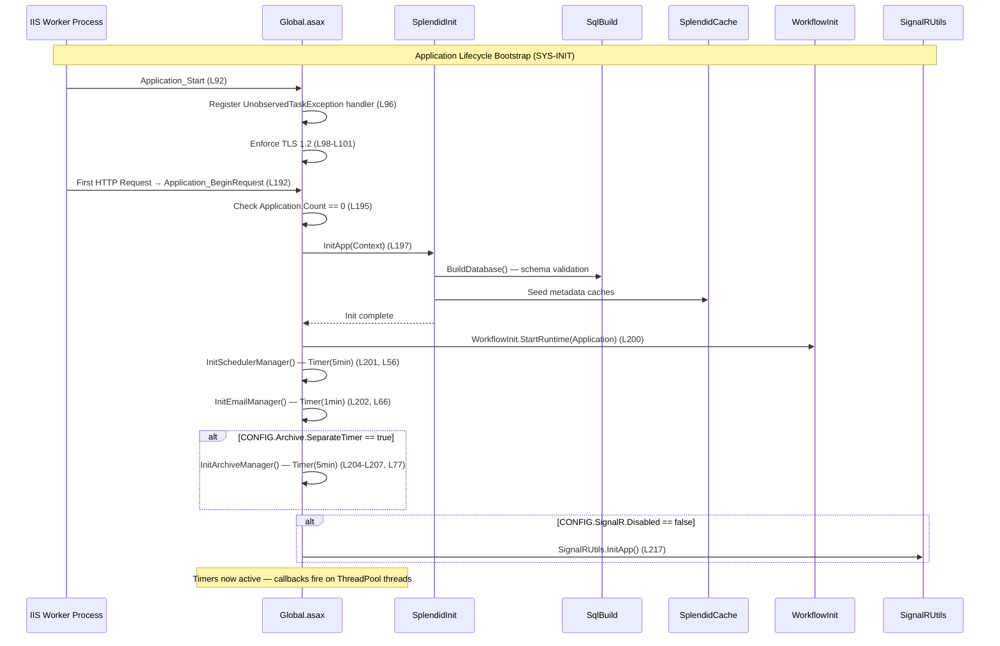

# Directive 3 — Background Processing Code Quality Audit

**Audit Scope:** Material components governing background processing — `SchedulerUtils.cs`, `EmailUtils.cs`, `Global.asax.cs`
**System IDs:** `SYS-SCHEDULER`, `SYS-EMAIL`, `SYS-INIT`
**Materiality Reference:** [Directive 2 — Materiality Classification](../directive-2-materiality/materiality-classification.md)
**System Registry Reference:** [Directive 0 — System Registry](../directive-0-system-registry/system-registry.md)

---

#### Report Executive Summary

**Theme of Failure: "Process-Local Timers Without Resilience, Synchronization, or Verification — Control Activities Exist in Form but Lack Operational Assurance"**

The background processing subsystem of SplendidCRM Community Edition v15.2 exhibits a **Theme of Failure** within the COSO Control Activities component (COSO Principle 10 — Selects and Develops Control Activities; COSO Principle 11 — Selects and Develops General Controls over Technology). The platform's entire background processing capability depends on three in-process `System.Threading.Timer` instances initialized inside `Global.asax.cs` at `Application_BeginRequest` time — `tSchedulerManager` (5-minute interval), `tEmailManager` (1-minute interval), and `tArchiveManager` (5-minute interval, conditionally enabled). These timers are bound to the IIS worker process lifecycle: if the application pool recycles, all timers cease immediately with zero guarantee of in-flight job completion, zero dead-letter queuing for failed jobs, and zero external notification of timer cessation. This architectural choice means that COSO Principle 10 control activities for job scheduling exist in implementation but lack the operational assurance mechanisms (monitoring, health checks, restart guarantees) that would make them reliable. The reentrancy protection mechanism — seven `static bool` flags across `SchedulerUtils.cs` (2 flags) and `EmailUtils.cs` (5 flags) — uses non-thread-safe reads and writes without `lock`, `Interlocked`, `Monitor`, or any synchronization primitive, creating race condition windows where two timer callbacks on different thread pool threads could simultaneously pass the guard and execute concurrently. Per NIST SI-16 (Memory Protection), this constitutes a Moderate integrity risk.

The code quality assessment further reveals extreme method lengths (`SendQueued` at 441 lines, `CheckInbound` at 585 lines, `OnTimer` in `SchedulerUtils.cs` at 236 lines), severe Single Responsibility Principle violations (`EmailUtils.cs` at 2,722 lines handling six distinct functional domains), DRY violations between `OnTimer` and `OnArchiveTimer`, and unmanaged thread creation for archive operations without cancellation tokens or exception propagation. Zero automated tests exist for any background processing path — a Critical finding under COSO Principle 10, as there is no mechanism to verify that control activities are operating as designed. No external job monitoring, no health check endpoints, no dead-letter queue for failed jobs, and no alerting on timer failure are present, representing gaps under COSO Principle 16 (Conducts Ongoing and/or Separate Evaluations) and NIST AU (Audit and Accountability). The complete absence of testing infrastructure across the background processing domain means that every scheduler change, every email pipeline modification, and every timer configuration adjustment is deployed without verification — a fundamental control deficiency per COSO Principle 11.

---

#### Attention Required

| Component Path | Primary Finding | Risk Severity | Governing NIST/CIS Control | COSO Principle |
|---|---|---|---|---|
| `SplendidCRM/Global.asax.cs` | InProc `System.Threading.Timer` background processing — no resilience guarantees if IIS app pool recycles | Moderate | NIST CP-10 | Principle 10 |
| `SplendidCRM/_code/SchedulerUtils.cs` | Reentrancy guard uses `static bool bInsideTimer` (L34) — race condition under concurrent timer callbacks | Moderate | NIST SI-16 | Principle 10 |
| `SplendidCRM/_code/SchedulerUtils.cs` | `OnTimer()` method (L653–L889) at 236 lines with nested switch/try-catch — extreme method length and high cyclomatic complexity | Moderate | CIS Control 16 | Principle 10 |
| `SplendidCRM/_code/SchedulerUtils.cs` | `RunJob()` switch statement (L370–L650) dispatching 12 job types — high cyclomatic complexity (estimated >25) | Moderate | CIS Control 16 | Principle 10 |
| `SplendidCRM/_code/SchedulerUtils.cs` | `new System.Threading.Thread(ArchiveExternalDB.RunArchive)` (L644) — unmanaged thread lifecycle, no cancellation token, no exception propagation | Moderate | NIST SI-16 | Principle 10 |
| `SplendidCRM/_code/SchedulerUtils.cs` | `OnArchiveTimer()` (L892–L1010) duplicates `OnTimer()` job-dispatch pattern — DRY violation | Minor | CIS Control 16 | Principle 10 |
| `SplendidCRM/_code/EmailUtils.cs` | 2,722-line email pipeline monolith handling 6 distinct responsibilities — severe SRP violation | Moderate | CIS Control 16 | Principle 10 |
| `SplendidCRM/_code/EmailUtils.cs` | `SendQueued()` method (L1021–L1462) at 441 lines — extreme method length violation | Moderate | CIS Control 16 | Principle 10 |
| `SplendidCRM/_code/EmailUtils.cs` | `CheckInbound()` method (L1480–L2065) at 585 lines — extreme method length violation | Moderate | CIS Control 16 | Principle 10 |
| `SplendidCRM/_code/EmailUtils.cs` | 5 `static bool` reentrancy flags (L46–L50) without synchronization primitives — race condition risk | Moderate | NIST SI-16 | Principle 10 |
| `SplendidCRM/_code/EmailUtils.cs` | Campaign email credentials handled in memory without secure disposal — credential exposure window | Moderate | NIST IA-5 | Principle 11 |
| `SplendidCRM/_code/EmailUtils.cs` | Bounce detection via string prefix matching (L1464–L1478) — fragile pattern susceptible to evasion | Minor | NIST SI-10 | Principle 11 |
| `SplendidCRM/Global.asax.cs` | Timer intervals hardcoded as `TimeSpan` literals (L56, L66, L77) — magic numbers without named constants | Minor | CIS Control 16 | Principle 10 |
| `SplendidCRM/Global.asax.cs` | `Application_BeginRequest` initialization on `Application.Count == 0` (L195) — error handling for partial init | Moderate | NIST SI-11 | Principle 10 |
| `SplendidCRM/Global.asax.cs` | TLS 1.2 enforcement (L98–L101) additive-only — TLS 1.0/1.1 not explicitly disabled | Minor | NIST SC-8 | Principle 11 |
| All background processing | Zero automated tests across SchedulerUtils, EmailUtils, and Global.asax bootstrap | Critical | NIST SI-7; CIS Control 16 | Principle 10 |

---

## Detailed Findings — SchedulerUtils.cs

**Component:** `SplendidCRM/_code/SchedulerUtils.cs`
**Lines of Code:** 1,013
**system_id:** `SYS-SCHEDULER`
**Materiality:** Material — System Integrity, Core Business Logic
Source: `SplendidCRM/_code/SchedulerUtils.cs`

### Code Smells

#### CS-SCHED-01: Extreme Method Length — `OnTimer()` (236 lines)

**Risk Severity:** Moderate
**Governing Control:** CIS Control 16 (Application Software Security)
**COSO Principle:** Principle 10 (Selects and Develops Control Activities)

The `OnTimer()` method spans lines 653–889 (236 lines), far exceeding the 50-line threshold. This single method is responsible for: reading the `bInsideTimer` reentrancy flag, querying `vwSYSTEM_EVENTS` for cache invalidation triggers, processing system events, dispatching cache clears per table name, running workflow processing, determining if this server is the job server, querying `vwSCHEDULERS_Run` for scheduled jobs, iterating through each scheduled job, calling `RunJob()`, and updating `spSCHEDULERS_UpdateLastRun` in a finally block. The method contains 3 levels of nesting (try/using/foreach/try) with database operations interleaved with job dispatch logic.

Source: `SplendidCRM/_code/SchedulerUtils.cs:L653–L889`

#### CS-SCHED-02: Extreme Method Length — `RunJob()` (283 lines)

**Risk Severity:** Moderate
**Governing Control:** CIS Control 16 (Application Software Security)
**COSO Principle:** Principle 10 (Selects and Develops Control Activities)

The `RunJob()` method spans lines 367–650 (283 lines) and consists of a single large `switch` statement dispatching 12 job types via string-matched case labels. Each case follows a near-identical pattern: open a database connection, begin a transaction, execute a stored procedure, commit or rollback, catch exceptions, and log errors. This repetitive dispatch pattern constitutes both a method length violation and a DRY violation.

```csharp
switch ( sJOB )
{
    case "function::BackupDatabase":
```
Source: `SplendidCRM/_code/SchedulerUtils.cs:L370–L371`

#### CS-SCHED-03: DRY Violation — `OnArchiveTimer()` Duplicates `OnTimer()` Pattern

**Risk Severity:** Minor
**Governing Control:** CIS Control 16 (Application Software Security)
**COSO Principle:** Principle 10 (Selects and Develops Control Activities)

The `OnArchiveTimer()` method (lines 892–1010, 118 lines) duplicates the core job-dispatch pattern from `OnTimer()`: check reentrancy flag, determine job server eligibility, query `vwSCHEDULERS_Run`, iterate jobs, call `RunJob()`, update last run in a finally block. The only difference is the SQL `WHERE` clause filtering for archive-specific jobs. This structural duplication means that any fix to the job dispatch logic (e.g., improved error isolation, proper synchronization) must be applied in two places.

Source: `SplendidCRM/_code/SchedulerUtils.cs:L892–L1010`

#### CS-SCHED-04: DRY Violation — Repeated Job Dispatch Pattern in `RunJob()`

**Risk Severity:** Minor
**Governing Control:** CIS Control 16 (Application Software Security)
**COSO Principle:** Principle 10 (Selects and Develops Control Activities)

Within `RunJob()`, six of the twelve switch cases follow an identical pattern: open connection, open transaction, execute stored procedure with `CommandTimeout = 0`, commit, catch-rollback-log. The cases for `BackupDatabase` (L372–L402), `BackupTransactionLog` (L404–L434), `pruneDatabase` (L442–L463), `CleanSystemLog` (L465–L515), `CleanSystemSyncLog` (L518–L546), and `RunAllArchiveRules` (L602–L637) share this structure with only the stored procedure name varying.

Source: `SplendidCRM/_code/SchedulerUtils.cs:L372–L637`

#### CS-SCHED-05: SRP Violation — Single Class Handles 6+ Responsibilities

**Risk Severity:** Moderate
**Governing Control:** CIS Control 16 (Application Software Security)
**COSO Principle:** Principle 10 (Selects and Develops Control Activities)

`SchedulerUtils.cs` handles: (1) timer callback management, (2) reentrancy protection, (3) cron expression parsing and human-readable description generation (`CronDescription`, 305 lines), (4) job dispatch for 12 job types, (5) system event processing and cache invalidation, (6) archive timer management, (7) job server determination for load-balanced deployments. These are seven distinct functional concerns colocated in a single class, violating the Single Responsibility Principle and reducing testability.

Source: `SplendidCRM/_code/SchedulerUtils.cs`

#### CS-SCHED-06: Magic Numbers — Hardcoded Job Function Strings

**Risk Severity:** Minor
**Governing Control:** CIS Control 16 (Application Software Security)
**COSO Principle:** Principle 10 (Selects and Develops Control Activities)

Job dispatch relies on string-matched function names prefixed with `"function::"` (e.g., `"function::BackupDatabase"`, `"function::pollMonitoredInboxes"`). While the static `Jobs` array (lines 40–53) defines 12 known job names, the `RunJob()` switch statement uses raw string literals without referencing this array. The job name strings serve as a de facto job registry but lack type safety or compile-time verification.

Source: `SplendidCRM/_code/SchedulerUtils.cs:L40–L53`

### Complexity Metrics

#### CX-SCHED-01: High Cyclomatic Complexity — `RunJob()` Estimated >25

**Risk Severity:** Moderate
**Governing Control:** CIS Control 16 (Application Software Security)
**COSO Principle:** Principle 10 (Selects and Develops Control Activities)

The `RunJob()` method contains a switch statement with 12 case branches. Each case contains at least one `try/catch` block, and several contain additional conditional logic (e.g., `RunAllArchiveRules` at line 606 checks `ArchiveConnectionString`; `CheckVersion` at line 558 filters `DataView`). With 12 switch cases, 10+ try/catch blocks, and 5+ conditional branches, the estimated cyclomatic complexity exceeds 25 — well above the threshold of 10.

Source: `SplendidCRM/_code/SchedulerUtils.cs:L367–L650`

#### CX-SCHED-02: High Cyclomatic Complexity — `OnTimer()` Estimated >15

**Risk Severity:** Moderate
**Governing Control:** CIS Control 16 (Application Software Security)
**COSO Principle:** Principle 10 (Selects and Develops Control Activities)

The `OnTimer()` method contains: 1 reentrancy guard branch, 1 `DateTime.MinValue` check, 1 `dt.Rows.Count > 0` branch, a `foreach` with 5 `if/else if` branches for table name matching (`TERMINOLOGY`, `MODULES`/`ACL_`, `CONFIG`, `TIMEZONES`, `CURRENCIES`), 1 workflow enable check, 1 job server determination with 3 branches, 1 archive timer config check, 1 suppress-warning check, plus outer try/catch. Estimated cyclomatic complexity: >15.

Source: `SplendidCRM/_code/SchedulerUtils.cs:L653–L889`

#### CX-SCHED-03: High Coupling — 9 External Dependencies

**Risk Severity:** Moderate
**Governing Control:** CIS Control 16 (Application Software Security)
**COSO Principle:** Principle 10 (Selects and Develops Control Activities)

`SchedulerUtils.cs` is coupled to the following external classes (exceeding the 7-dependency threshold):

| # | Dependency | Purpose |
|---|---|---|
| 1 | `SplendidCache` | Cache invalidation (`ClearTable`) |
| 2 | `SplendidError` | Error/warning logging to SYSTEM_LOG |
| 3 | `SplendidInit` | Terminology/module/config re-initialization |
| 4 | `EmailUtils` | Campaign email dispatch, inbox polling, outbound send |
| 5 | `Sql` / `SqlProcs` | Database operations, transactions, parameter binding |
| 6 | `DbProviderFactories` | Database provider factory |
| 7 | `HttpContext` | Application state (`Context.Application`) |
| 8 | `WorkflowUtils` | Workflow event processing |
| 9 | `ArchiveExternalDB` | Archive operations via raw thread |

Source: `SplendidCRM/_code/SchedulerUtils.cs`

#### CX-SCHED-04: High Cognitive Complexity — `CronDescription()` (305 lines)

**Risk Severity:** Minor
**Governing Control:** CIS Control 16 (Application Software Security)
**COSO Principle:** Principle 10 (Selects and Develops Control Activities)

The `CronDescription()` method (lines 59–363) performs cron expression parsing with 5 nested sections (minute, hour, dayOfMonth, month, dayOfWeek), each containing range detection (`IndexOf('-')`), comma-split iteration, value validation with boundary checks, and localized string assembly. The deep nesting (4 levels: method → if → for → if/else) and repetitive structure across all 5 cron fields create high cognitive load despite the logic being individually straightforward.

Source: `SplendidCRM/_code/SchedulerUtils.cs:L59–L363`

### Security Quality

#### SQ-SCHED-01: Reentrancy Race Condition — Non-Atomic Boolean Guard

**Risk Severity:** Moderate
**Governing Control:** NIST SI-16 (Memory Protection)
**COSO Principle:** Principle 10 (Selects and Develops Control Activities)

The reentrancy protection for the scheduler timer uses a plain `static bool`:

```csharp
private static bool bInsideTimer = false;
```
Source: `SplendidCRM/_code/SchedulerUtils.cs:L34`

This flag is read at line 657 (`if ( !bInsideTimer )`) and set at line 659 (`bInsideTimer = true`), then cleared at line 881 (`bInsideTimer = false` in `finally`). `System.Threading.Timer` callbacks execute on thread pool threads. Two callbacks firing in rapid succession could both read `bInsideTimer == false` before either writes `true`, bypassing the reentrancy guard entirely. The identical pattern exists for `bInsideArchiveTimer` (line 36). Neither flag uses `Interlocked.CompareExchange`, `lock`, `Monitor`, or any synchronization primitive.

**Impact:** Concurrent execution of the scheduler loop could cause duplicate job execution, database contention, or corrupted application state.

Source: `SplendidCRM/_code/SchedulerUtils.cs:L34,L36,L657–L659,L881`

#### SQ-SCHED-02: Unmanaged Thread Lifecycle — Archive Thread Creation

**Risk Severity:** Moderate
**Governing Control:** NIST SI-16 (Memory Protection)
**COSO Principle:** Principle 10 (Selects and Develops Control Activities)

Archive job execution creates a raw `System.Threading.Thread`:

```csharp
System.Threading.Thread t = new System.Threading.Thread(ArchiveExternalDB.RunArchive);
t.Start(Context);
```
Source: `SplendidCRM/_code/SchedulerUtils.cs:L644–L645`

This thread is not tracked, has no cancellation token, no timeout, no exception propagation to the caller, and no join/wait mechanism. If `RunArchive` throws an unhandled exception, the thread terminates silently. The thread reference `t` is a local variable that goes out of scope immediately, making it impossible to monitor or cancel. This approach bypasses the `ThreadPool` and the `Task`-based asynchronous pattern, preventing proper lifecycle management.

Source: `SplendidCRM/_code/SchedulerUtils.cs:L644–L645`

#### SQ-SCHED-03: Job Error Isolation — Per-Job Try/Catch

**Risk Severity:** Minor
**Governing Control:** NIST SI-11 (Error Handling)
**COSO Principle:** Principle 10 (Selects and Develops Control Activities)

Within `OnTimer()`, individual job execution is wrapped in a try block (line 837–848) with error logging, and the `spSCHEDULERS_UpdateLastRun` update occurs in a `finally` block (line 849–870). This means a failing job will be logged and the next job in the queue will still execute — the job-level error isolation is present. However, the outer try/catch (line 660/875–878) catches exceptions from the system event processing and job server determination phases. If the system event query fails (e.g., database timeout), the entire scheduler pass is aborted and no jobs execute. This partial isolation means infrastructure-level failures can block all job execution.

Source: `SplendidCRM/_code/SchedulerUtils.cs:L837–L878`

#### SQ-SCHED-04: Job Catalog — Admin-Controllable Job Names

**Risk Severity:** Minor
**Governing Control:** NIST SI-10 (Information Input Validation)
**COSO Principle:** Principle 11 (Selects and Develops General Controls over Technology)

Job names are read from the `vwSCHEDULERS_Run` database view (line 799), which returns `JOB` column values set by administrators through the Schedulers admin UI. The `RunJob()` switch statement only executes known cases — unrecognized job names fall through the switch without action. This is a **mitigating control**: arbitrary job name injection via the admin UI would not execute arbitrary code, as only the 12 predefined function names are matched. However, the job name validation is implicit (switch fall-through) rather than explicit (whitelist check with logged rejection).

Source: `SplendidCRM/_code/SchedulerUtils.cs:L799,L370–L649`

---

## Detailed Findings — EmailUtils.cs

**Component:** `SplendidCRM/_code/EmailUtils.cs`
**Lines of Code:** 2,722
**system_id:** `SYS-EMAIL`
**Materiality:** Material — Core Business Logic, System Integrity
Source: `SplendidCRM/_code/EmailUtils.cs`

### Code Smells

#### CS-EMAIL-01: Extreme Method Length — `CheckInbound()` (585 lines)

**Risk Severity:** Moderate
**Governing Control:** CIS Control 16 (Application Software Security)
**COSO Principle:** Principle 10 (Selects and Develops Control Activities)

The `CheckInbound()` method spans lines 1480–2065 (585 lines) — over 11× the 50-line threshold. This single method handles: reentrancy guard checking, inbound email configuration retrieval, iteration over monitored mailboxes, connection state validation, IMAP/POP3/Office365/GoogleApps protocol switching, message retrieval, duplicate detection via `MESSAGE_ID` lookup, MIME processing delegation to `MimeUtils`, email record creation via stored procedures, attachment processing, bounce detection, group assignment, watermark tracking, and connection error recovery. The method contains 6 levels of nesting in several code paths (method → if → try → foreach → try → if).

Source: `SplendidCRM/_code/EmailUtils.cs:L1480–L2065`

#### CS-EMAIL-02: Extreme Method Length — `SendQueued()` (441 lines)

**Risk Severity:** Moderate
**Governing Control:** CIS Control 16 (Application Software Security)
**COSO Principle:** Principle 10 (Selects and Develops Control Activities)

The `SendQueued()` method spans lines 1021–1462 (441 lines). This method handles: reentrancy guard, campaign manager configuration retrieval, mail client creation, database query for queued emails (with branching for preview vs. scheduled send), iteration over email queue rows, from-address parsing with error handling, recipient validation, template variable replacement, tracker URL injection, attachment retrieval and caching, email composition, SMTP delivery, success/failure status updates via stored procedures, and campaign log creation. The method manages three separate `Hashtable` caches for trackers, attachments, and note streams.

Source: `SplendidCRM/_code/EmailUtils.cs:L1021–L1462`

#### CS-EMAIL-03: Extreme Method Length — `SendActivityReminders()` (205 lines)

**Risk Severity:** Moderate
**Governing Control:** CIS Control 16 (Application Software Security)
**COSO Principle:** Principle 10 (Selects and Develops Control Activities)

The `SendActivityReminders()` method spans lines 2217–2422 (205 lines). It handles: reentrancy guard, reminder configuration check, database query for pending reminders, mail client creation, activity type enumeration resolution, timezone conversion, localized template loading with 3-level fallback (locale → English → hardcoded), template variable replacement, URL construction (both WebForms and React), stored procedure calls to mark reminders sent, email composition and delivery, and error logging per reminder.

Source: `SplendidCRM/_code/EmailUtils.cs:L2217–L2422`

#### CS-EMAIL-04: Severe SRP Violation — 6 Distinct Responsibilities in Single Class

**Risk Severity:** Moderate
**Governing Control:** CIS Control 16 (Application Software Security)
**COSO Principle:** Principle 10 (Selects and Develops Control Activities)

`EmailUtils.cs` at 2,722 lines combines the following distinct functional domains in a single class:

| # | Responsibility | Key Methods | Line Range |
|---|---|---|---|
| 1 | Campaign email queue processing | `SendQueued()` | L1021–L1462 |
| 2 | Inbound email monitoring (IMAP/POP3/Office365/Google) | `CheckInbound()`, `CheckMonitored()`, `CheckBounced()` | L1480–L2074 |
| 3 | Outbound email delivery | `SendOutbound()` | L2078–L2162 |
| 4 | Activity email reminders | `SendActivityReminders()` | L2217–L2422 |
| 5 | SMS activity reminders | `SendSmsActivityReminders()` | L2425–L2554+ |
| 6 | Email utility functions (validation, XSS filter, template filling, MIME parsing) | `IsValidEmail()`, `XssFilter()`, `FillEmail()`, utility methods | L54–L1020 |

Each of these responsibilities represents a distinct concern colocated within a single class, resulting in reduced testability, elevated coupling, and high modification risk.

Source: `SplendidCRM/_code/EmailUtils.cs`

#### CS-EMAIL-05: DRY Violation — Duplicate `FillEmail()` Overloads

**Risk Severity:** Minor
**Governing Control:** CIS Control 16 (Application Software Security)
**COSO Principle:** Principle 10 (Selects and Develops Control Activities)

Two nearly identical `FillEmail()` method overloads exist at lines 193–220 and lines 223–250. Both perform identical template variable replacement logic — the only difference is the row parameter type (`DataRow` vs. `DataRowView`). The method bodies are copy-pasted with the same iteration, conditional checks, and string replacement operations. The absence of a shared abstraction or common private helper results in duplicated logic that must be maintained in parallel.

Source: `SplendidCRM/_code/EmailUtils.cs:L193–L250`

#### CS-EMAIL-06: Magic Numbers — Hardcoded Campaign Email Limits

**Risk Severity:** Minor
**Governing Control:** CIS Control 16 (Application Software Security)
**COSO Principle:** Principle 10 (Selects and Develops Control Activities)

The campaign email processing uses a hardcoded default for emails per run:

```csharp
if ( nEmailsPerRun == 0 )
    nEmailsPerRun = 500;
```
Source: `SplendidCRM/_code/EmailUtils.cs:L1037–L1038`

While this default is overridable via the `CONFIG.massemailer_campaign_emails_per_run` configuration setting, the fallback value of 500 is a magic number without a named constant.

### Complexity Metrics

#### CX-EMAIL-01: Very High Cyclomatic Complexity — `CheckInbound()` Estimated >30

**Risk Severity:** Moderate
**Governing Control:** CIS Control 16 (Application Software Security)
**COSO Principle:** Principle 10 (Selects and Develops Control Activities)

The `CheckInbound()` method contains: 1 reentrancy branch, 1 bounce/monitor mode branch, 1 GUID filter branch, a foreach over inbound email accounts with: 1 connection state check, 1 Office365 OAuth branch, 1 GoogleApps OAuth branch, 1 IMAP/POP3 service type branch, nested foreach over messages with: duplicate detection branch, MIME processing branch, bounce detection branch, group assignment branch, watermark update logic, and multiple try/catch blocks. With the protocol-switching logic (Office365 vs. GoogleApps vs. IMAP vs. POP3), each containing its own message iteration and processing logic, the estimated cyclomatic complexity exceeds 30.

Source: `SplendidCRM/_code/EmailUtils.cs:L1480–L2065`

#### CX-EMAIL-02: Very High Cyclomatic Complexity — `SendQueued()` Estimated >20

**Risk Severity:** Moderate
**Governing Control:** CIS Control 16 (Application Software Security)
**COSO Principle:** Principle 10 (Selects and Develops Control Activities)

The `SendQueued()` method contains: 1 reentrancy branch, 1 preview vs. scheduled mode branch, 1 campaign ID filter branch, 1 send-now mode branch, a foreach over queued emails with: from-address validation try/catch, recipient email validation branch, template existence check, tracker URL construction loop, attachment retrieval and caching loop, multi-recipient handling, send success/failure branching, campaign log creation with type determination (targeted/send-error/invalid-email/removed/blocked). Estimated cyclomatic complexity exceeds 20.

Source: `SplendidCRM/_code/EmailUtils.cs:L1021–L1462`

#### CX-EMAIL-03: High Coupling — 11 External Dependencies

**Risk Severity:** Moderate
**Governing Control:** CIS Control 16 (Application Software Security)
**COSO Principle:** Principle 10 (Selects and Develops Control Activities)

`EmailUtils.cs` is coupled to the following external classes (significantly exceeding the 7-dependency threshold):

| # | Dependency | Purpose |
|---|---|---|
| 1 | `SplendidCache` | Inbound email config cache, reporting filter columns |
| 2 | `SplendidError` | Error/warning logging to SYSTEM_LOG |
| 3 | `SplendidMailClient` | Multi-provider mail client abstraction |
| 4 | `Sql` / `SqlProcs` | Database operations, transactions, stored procedure calls |
| 5 | `DbProviderFactories` | Database provider factory |
| 6 | `HttpContext` / `HttpApplicationState` | Application state, config values |
| 7 | `Security` | (Indirect) via stored procedure security context |
| 8 | `L10N` | Localization for reminder templates |
| 9 | `Crm` | `Crm.Config.SiteURL()` for URL construction |
| 10 | `MimeKit` / `MailKit` | MIME processing, IMAP/POP3 protocol handling |
| 11 | `Office365Utils` / `GoogleSync` | Cloud email provider integration |

Source: `SplendidCRM/_code/EmailUtils.cs`

### Security Quality

#### SQ-EMAIL-01: Non-Thread-Safe Reentrancy Guards — 5 Static Boolean Flags

**Risk Severity:** Moderate
**Governing Control:** NIST SI-16 (Memory Protection)
**COSO Principle:** Principle 10 (Selects and Develops Control Activities)

`EmailUtils.cs` declares five `public static bool` reentrancy flags:

```csharp
public static bool bInsideSendQueue        = false;
public static bool bInsideCheckInbound     = false;
public static bool bInsideCheckOutbound    = false;
```
Source: `SplendidCRM/_code/EmailUtils.cs:L46–L48`

And two additional flags at lines 49–50 (`bInsideActivityReminder`, `bInsideSmsActivityReminder`). All five follow the same non-thread-safe pattern: read → set true → process → set false in finally. The `OnTimer` email callback fires every 1 minute on a thread pool thread. If email processing takes longer than 1 minute (plausible for large campaign queues or slow IMAP servers), the next timer callback will fire on a different thread pool thread. While the reentrancy flags prevent concurrent execution in the common case, the race window between the read and the write makes the protection probabilistic rather than deterministic.

Source: `SplendidCRM/_code/EmailUtils.cs:L46–L50`

#### SQ-EMAIL-02: Email Credential Exposure Window

**Risk Severity:** Moderate
**Governing Control:** NIST IA-5 (Authenticator Management)
**COSO Principle:** Principle 11 (Selects and Develops General Controls over Technology)

Inbound email credentials are read from the cache and stored in local string variables during `CheckInbound()` processing:

```csharp
string sEMAIL_PASSWORD = Sql.ToString(rowInbound["EMAIL_PASSWORD"]);
```
Source: `SplendidCRM/_code/EmailUtils.cs:L1536`

The password string persists in managed heap memory until garbage collected. No `SecureString`, explicit zeroing, or memory pinning is applied. Given that the `CheckInbound()` method can run for extended periods (processing hundreds of messages across multiple mailboxes), the credential exposure window can be significant. The encrypted password is decrypted by the `SplendidCache` layer before reaching this point — the cleartext password exists in memory for the entire duration of the inbound email check.

Source: `SplendidCRM/_code/EmailUtils.cs:L1530–L1536`

#### SQ-EMAIL-03: Bounce Detection — String Prefix Matching

**Risk Severity:** Minor
**Governing Control:** NIST SI-10 (Information Input Validation)
**COSO Principle:** Principle 11 (Selects and Develops General Controls over Technology)

Bounce detection in `IsUndeliverableSubject()` (lines 1464–1478) uses a hardcoded list of 8 English-language subject line prefixes (e.g., `"Undeliverable:"`, `"DELIVERY FAILURE:"`, `"Mail delivery failed"`). This detection method does not account for: non-English bounce messages, DSN (Delivery Status Notification) RFC 3464 structured responses, or bounce messages with modified subject lines. The `StartsWith` matching is case-sensitive, meaning `"undeliverable:"` would not match.

Source: `SplendidCRM/_code/EmailUtils.cs:L1464–L1478`

#### SQ-EMAIL-04: Tracker URL Construction — Campaign Tracking Endpoints

**Risk Severity:** Minor
**Governing Control:** NIST SI-10 (Information Input Validation)
**COSO Principle:** Principle 11 (Selects and Develops General Controls over Technology)

Campaign tracker URLs are constructed by concatenating the site URL with tracker GUIDs and redirect targets. The tracker endpoint (`campaign_trackerv2.aspx.cs`) is publicly accessible without authentication to enable email open/click tracking. While the GUID-based tracker identification provides obscurity, the redirect URL parameter in tracker links could potentially be manipulated if not properly validated at the tracker endpoint. The tracker URL construction within `EmailUtils.cs` itself does not perform URL encoding or validation of the redirect target.

Source: `SplendidCRM/_code/EmailUtils.cs` (campaign tracker URL construction within `SendQueued()`)

---

## Detailed Findings — Global.asax.cs

**Component:** `SplendidCRM/Global.asax.cs`
**Lines of Code:** 399
**system_id:** `SYS-INIT`
**Materiality:** Material — Configuration Hardening, System Integrity
Source: `SplendidCRM/Global.asax.cs`

### Code Smells

#### CS-GLOBAL-01: Timer Initialization — Magic Number TimeSpan Literals

**Risk Severity:** Minor
**Governing Control:** CIS Control 16 (Application Software Security)
**COSO Principle:** Principle 10 (Selects and Develops Control Activities)

Three timers are initialized with hardcoded `TimeSpan` literals:

```csharp
tSchedulerManager = new Timer(SchedulerUtils.OnTimer, this.Context, new TimeSpan(0, 1, 0), new TimeSpan(0, 5, 0));
```
Source: `SplendidCRM/Global.asax.cs:L56`

| Timer | Initial Delay | Interval | Line |
|---|---|---|---|
| `tSchedulerManager` | 1 minute | 5 minutes | L56 |
| `tEmailManager` | 1 minute | 1 minute | L66 |
| `tArchiveManager` | 1 minute | 5 minutes | L77 |

These intervals are not configurable at runtime and are not defined as named constants. The 5-minute scheduler interval is documented in a code comment at line 54 ("The timer will fire every 5 minutes") but the relationship between this interval and the `vwSCHEDULERS_Run` view's rounding behavior is only implicit.

Source: `SplendidCRM/Global.asax.cs:L56,L66,L77`

#### CS-GLOBAL-02: Initialization Trigger — `Application_BeginRequest` Count Check

**Risk Severity:** Moderate
**Governing Control:** NIST SI-11 (Error Handling)
**COSO Principle:** Principle 10 (Selects and Develops Control Activities)

Application initialization occurs in `Application_BeginRequest` rather than `Application_Start` due to IIS7 Integrated Pipeline limitations (the `Request` object is unavailable in `Application_Start`):

```csharp
if ( Application.Count == 0 )
{
    SplendidInit.InitApp(this.Context);
```
Source: `SplendidCRM/Global.asax.cs:L195–L197`

This pattern uses `Application.Count == 0` as a proxy for "first request." If `InitApp()` throws an exception, the application enters a partially initialized state where `Application.Count` may be >0 (if `InitApp` added items before the exception) but timers and SignalR are not started. Subsequent requests would skip initialization entirely. The `Application_Start` handler (line 92–101) only registers the unobserved task exception handler and TLS enforcement — the actual initialization is deferred to the first request.

Source: `SplendidCRM/Global.asax.cs:L92–L220`

#### CS-GLOBAL-03: Empty Event Handlers

**Risk Severity:** Minor
**Governing Control:** CIS Control 16 (Application Software Security)
**COSO Principle:** Principle 10 (Selects and Develops Control Activities)

Four event handlers have empty bodies: `Application_OnError` (L87–L90), `Application_EndRequest` (L302–L305), `Application_AuthenticateRequest` (L307–L310), and `Application_Error` (L330–L333). While these are ASP.NET lifecycle hooks that may be intentionally left empty, the `Application_OnError` and `Application_Error` handlers represent missed opportunities for centralized error capture. The comment on line 89 (`//SplendidInit.Application_OnError();`) indicates error handling was considered but disabled.

Source: `SplendidCRM/Global.asax.cs:L87–L90,L302–L333`

### Security Quality

#### SQ-GLOBAL-01: TLS 1.2 Enforcement — Additive Only

**Risk Severity:** Minor
**Governing Control:** NIST SC-8 (Transmission Confidentiality and Integrity)
**COSO Principle:** Principle 11 (Selects and Develops General Controls over Technology)

TLS enforcement uses an additive bitwise OR:

```csharp
ServicePointManager.SecurityProtocol = ServicePointManager.SecurityProtocol | SecurityProtocolType.Tls12;
```
Source: `SplendidCRM/Global.asax.cs:L100`

This ensures TLS 1.2 is enabled but does not disable TLS 1.0 or TLS 1.1. On .NET Framework 4.8, the default `SecurityProtocol` value is `SystemDefault`, which delegates to the OS configuration. While modern Windows Server versions disable TLS 1.0/1.1 by default, the application code does not enforce this — it only guarantees TLS 1.2 is available, not that weaker protocols are unavailable. TLS 1.3 support depends on the OS and .NET runtime version; the code does not explicitly address it.

Source: `SplendidCRM/Global.asax.cs:L98–L101`

#### SQ-GLOBAL-02: Session Cookie Hardening — Conditional Secure Flag

**Risk Severity:** Minor
**Governing Control:** NIST SC-23 (Session Authenticity)
**COSO Principle:** Principle 11 (Selects and Develops General Controls over Technology)

Session cookie hardening in `Session_Start` (lines 149–189) applies the `Secure` flag only when `Request.IsSecureConnection` is true (line 174–175). SameSite attribute handling includes user-agent-based compatibility logic for iOS 12, Safari on macOS Mojave, and Chrome 50–69 (lines 110–146). When the connection is secure, `SameSite=None` is applied; otherwise, `SameSite=Lax` is applied. The `HttpOnly` flag is not explicitly set in this code — it depends on the `Web.config` `httpCookies` configuration.

Source: `SplendidCRM/Global.asax.cs:L149–L189`

#### SQ-GLOBAL-03: Timer Disposal — Application_End Cleanup

**Risk Severity:** Minor
**Governing Control:** NIST SI-16 (Memory Protection)
**COSO Principle:** Principle 10 (Selects and Develops Control Activities)

`Application_End` (lines 371–385) properly disposes all three timers via null-check and `Dispose()` calls. This prevents timer callbacks from firing after the application has begun shutdown. The disposal pattern is correct and follows the `IDisposable` contract. However, there is no mechanism to wait for in-progress timer callbacks to complete before disposal — a timer callback that is mid-execution when `Dispose()` is called will continue executing on its thread pool thread with a potentially invalid `HttpContext`.

Source: `SplendidCRM/Global.asax.cs:L371–L385`

### Bootstrap Sequence Diagram

The following diagram illustrates the application initialization chain from IIS to timer activation. The initialization is triggered by the first HTTP request (`Application_BeginRequest`) rather than `Application_Start` due to IIS7 Integrated Pipeline constraints.



---

## Summary Statistics

### Background Processing Domain — Aggregate Metrics

| Component | system_id | Lines of Code | Methods >50 Lines | Code Smells | Complexity Rating | Security Issues | Overall Risk |
|---|---|---|---|---|---|---|---|
| `SchedulerUtils.cs` | `SYS-SCHEDULER` | 1,013 | 4 (`CronDescription` 305, `RunJob` 283, `OnTimer` 236, `OnArchiveTimer` 118) | 6 (CS-SCHED-01 through CS-SCHED-06) | **High** (est. cyclomatic >25 in RunJob, >15 in OnTimer) | 4 (SQ-SCHED-01 through SQ-SCHED-04) | **Moderate** |
| `EmailUtils.cs` | `SYS-EMAIL` | 2,722 | 4 (`CheckInbound` 585, `SendQueued` 441, `SendActivityReminders` 205, `SendSmsActivityReminders` ~130) | 6 (CS-EMAIL-01 through CS-EMAIL-06) | **Very High** (est. cyclomatic >30 in CheckInbound, >20 in SendQueued) | 4 (SQ-EMAIL-01 through SQ-EMAIL-04) | **Moderate** |
| `Global.asax.cs` | `SYS-INIT` | 399 | 0 | 3 (CS-GLOBAL-01 through CS-GLOBAL-03) | **Low** (simple lifecycle handlers) | 3 (SQ-GLOBAL-01 through SQ-GLOBAL-03) | **Minor** |
| **Domain Total** | — | **4,134** | **8** | **15** | **High** (aggregate) | **11** | **Moderate** |

### Finding Severity Distribution

| Severity | Count | Findings |
|---|---|---|
| **Critical** | 1 | Zero automated testing across all background processing (all components) |
| **Moderate** | 12 | Reentrancy race conditions (2), extreme method lengths (4), SRP violations (2), coupling (2), credential exposure (1), initialization trigger (1) |
| **Minor** | 8 | DRY violations (3), magic numbers (2), bounce detection fragility (1), TLS additive-only (1), empty handlers (1) |
| **Total** | **21** | |

### Framework Control Coverage

| Framework | Controls Assessed | Findings Mapped |
|---|---|---|
| **NIST SP 800-53 Rev 5** | SI-16 (Memory Protection), SI-10 (Input Validation), SI-11 (Error Handling), SI-7 (Software Integrity), SC-8 (Transmission Confidentiality), SC-23 (Session Authenticity), IA-5 (Authenticator Management), CP-10 (System Recovery) | 11 findings |
| **CIS Controls v8** | CIS Control 16 (Application Software Security) | 10 findings |
| **COSO** | Principle 10 (Control Activities), Principle 11 (General Controls over Technology), Principle 16 (Monitoring) | 21 findings |

### Cross-Reference to Other Directives

- **Directive 0 (System Registry):** Findings attributed to `SYS-SCHEDULER`, `SYS-EMAIL`, `SYS-INIT` as defined in the [System Registry](../directive-0-system-registry/system-registry.md).
- **Directive 1 (Structural Integrity):** The in-process timer architecture and `Application.Count == 0` initialization pattern are structural integrity concerns documented in the [Structural Integrity Report](../directive-1-structural-integrity/structural-integrity-report.md).
- **Directive 2 (Materiality):** All three components confirmed Material per the [Materiality Classification](../directive-2-materiality/materiality-classification.md).
- **Directive 4 (Dependencies):** `SchedulerUtils.cs` coupling to 9 dependencies and `EmailUtils.cs` coupling to 11 dependencies feed the [Cross-Cutting Dependency Report](../directive-4-dependency-audit/cross-cutting-dependency-report.md) blast radius analysis.
- **Directive 5 (Documentation Coverage):** Zero inline documentation across all three components will be assessed in the [Documentation Coverage Report](../directive-5-documentation-coverage/documentation-coverage-report.md).
