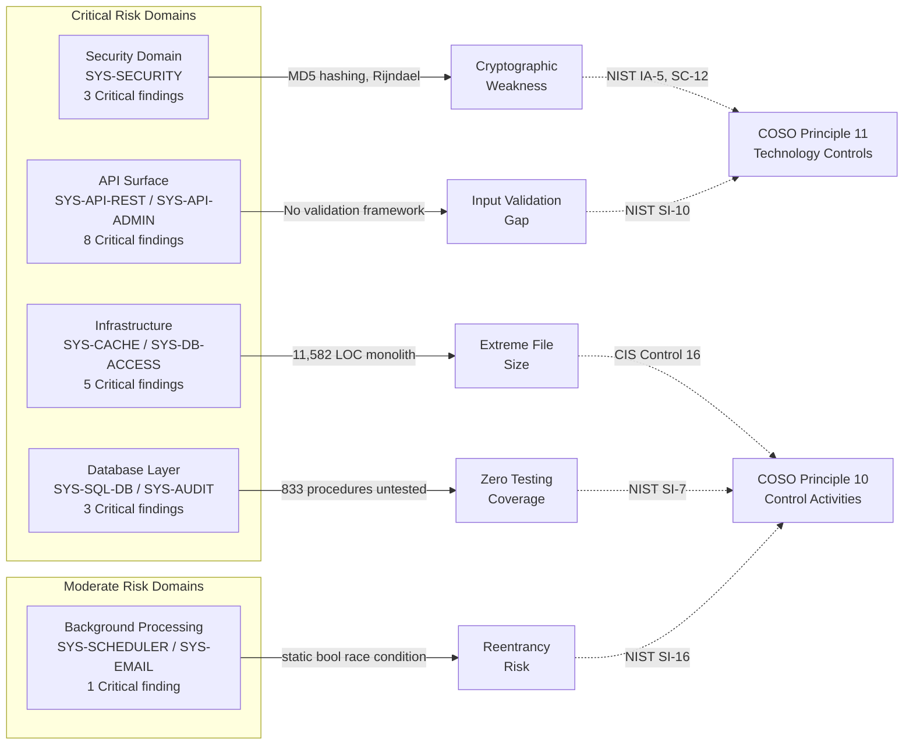

# Directive 3 — Code Quality Audit: Aggregate Summary

**SplendidCRM Community Edition v15.2 — Codebase Audit**

**Audit Scope:** Material components only, as classified in [Directive 2 — Materiality Classification](../directive-2-materiality/materiality-classification.md). All `system_id` references correspond to the authoritative registry in [Directive 0 — System Registry](../directive-0-system-registry/system-registry.md).

---

#### Report Executive Summary

**Theme of Failure: "Systemic Absence of Automated Control Verification Across All Material Components — Twenty Years of Organic Growth Without Quality Governance"**

The code quality audit of SplendidCRM Community Edition v15.2 reveals a **pervasive failure** in the COSO Control Activities component (COSO Principle 10, COSO Principle 11, and COSO Principle 12) across all five audit domains: Security, API Surface, Infrastructure, Background Processing, and Database. The single most significant finding — the complete absence of automated testing infrastructure at every tier (no unit tests, no integration tests, no E2E tests, no CI/CD pipeline, no static analysis) — cuts across all 144 Material components and renders the operational effectiveness of every control activity unverifiable. Per COSO Principle 10 (Selects and Develops Control Activities), control activities require both adequate design and operational effectiveness; without any automated verification mechanism, the organization cannot demonstrate that controls function as designed. COSO Principle 12 (Deploys through Policies and Procedures) is further undermined by the absence of any documented coding standards, review policies, or complexity thresholds — the codebase has grown organically over 20 years without structural governance, producing extreme monolithic file concentrations (seven C# files exceeding 4,000 lines), pervasive DRY violations (~850+ estimated in the SQL layer alone), and critical security quality gaps including MD5 password hashing and disabled ASP.NET request validation. The combination of zero testing, zero documentation, and zero review policies creates a control environment where defects propagate unchecked across all Material systems. Source: All five Directive 3 sub-reports.

#### Attention Required

| Component Path | Primary Finding | Risk Severity | Governing NIST/CIS Control | COSO Principle |
|---|---|---|---|---|
| ALL Material components | Zero automated testing infrastructure across all tiers — no unit tests, integration tests, E2E tests, CI/CD, or static analysis | Critical | NIST SI-7; CIS Control 16 | Principle 10 |
| `SplendidCRM/_code/Security.cs` | MD5 password hashing (`MD5CryptoServiceProvider`) for SugarCRM backward compatibility — cryptographically broken algorithm | Critical | NIST IA-5 | Principle 11 |
| `SplendidCRM/_code/Security.cs` | Rijndael encryption with GUID-derived keys — not cryptographically random key material | Critical | NIST SC-12 | Principle 11 |
| `SplendidCRM/Web.config` | `requestValidationMode="2.0"` disables ASP.NET 4.5+ built-in XSS protection across all endpoints | Critical | NIST SI-10 | Principle 11 |
| `SplendidCRM/Web.config` | `customErrors="Off"` exposes detailed stack traces and internal state to end users in production | Critical | NIST SI-11 | Principle 11 |
| `SplendidCRM/_code/SplendidCache.cs` | 11,582-line monolith with 272 public methods — extreme SRP violation; highest blast radius in codebase | Critical | CIS Control 16 | Principle 10 |
| `SplendidCRM/Rest.svc.cs` | 8,369-line WCF REST API with 10+ mixed concerns — no input validation framework beyond `Sql.ToString()` wrappers | Critical | NIST SI-10; CIS Control 16 | Principle 11 |
| `SQL Scripts Community/Triggers/BuildAllAuditTables.1.sql` | Entire audit trail generated by single dynamic SQL script — single point of failure for all entity audit logging | Critical | NIST AU-3 | Principle 16 |
| `SQL Scripts Community/Procedures/` | 833 stored procedures with universal `Grant Execute to public` and zero automated validation | Critical | NIST AC-6; NIST SI-7 | Principle 10 |
| `SplendidCRM/_code/SplendidInit.cs` | Bootstrap orchestrator clears all application state without rollback; fail-open authentication on error | Critical | NIST CM-3 | Principle 10 |

---

## Overview

This document aggregates findings from the five domain-specific code quality audit sub-reports that collectively assess every Material component in the SplendidCRM Community Edition v15.2 codebase. It provides total code smell counts, complexity hotspot rankings, a security quality gap inventory, severity distribution statistics, cross-domain pattern analysis, and a structured COSO Control Activities assessment.

### Domain-Specific Sub-Reports

The detailed, per-component findings are documented in the following sub-reports:

1. [Security Domain Quality](./security-domain-quality.md) — `SYS-SECURITY`, `SYS-AUTH-AD`, `SYS-AUTH-DUO`, `SYS-REALTIME`
2. [API Surface Quality](./api-surface-quality.md) — `SYS-API-REST`, `SYS-API-SOAP`, `SYS-API-ADMIN`, `SYS-CONFIG`
3. [Infrastructure Quality](./infrastructure-quality.md) — `SYS-CACHE`, `SYS-INIT`, `SYS-DB-ACCESS`, `SYS-ERROR-OBSERVABILITY`
4. [Background Processing Quality](./background-processing-quality.md) — `SYS-SCHEDULER`, `SYS-EMAIL`, `SYS-INIT`
5. [Database Quality](./database-quality.md) — `SYS-SQL-DB`, `SYS-AUDIT`

**Scope Constraint:** Only components classified as Material in Directive 2 are included in this summary. Of the 229 total components examined, 144 are Material and form the assessment population for this audit. Non-Material components — enterprise stubs, presentation-only UI classes, localization utilities, and the experimental Angular client — are explicitly excluded per the audit mandate and COSO Principle 10 (Selects and Develops Control Activities) scoping.

**Audit Coverage:** The assessed Material components span the C# backend code (`SplendidCRM/_code/` utility classes, API endpoints in `Rest.svc.cs` / `soap.asmx.cs` / `Administration/Rest.svc.cs`, application lifecycle in `Global.asax.cs`), and the SQL database layer (833 stored procedures, 581 views, 78 functions, and 11 trigger files in `SQL Scripts Community/`).

---

## Overall Code Quality Assessment

The code quality posture of SplendidCRM Community Edition v15.2 exhibits **systemic deficiencies** across all three COSO Control Activities principles (Principles 10, 11, and 12), reflecting a codebase that has grown organically over 20 years without the introduction of modern software engineering controls. The most pervasive finding is the complete absence of automated testing infrastructure — no unit tests, no integration tests, no end-to-end tests, no continuous integration pipeline, and no static analysis tooling exist at any tier. This single gap undermines the entire Control Activities component of the COSO framework, as there is no automated mechanism to verify that controls are operating as designed. Per **COSO Principle 10** (Selects and Develops Control Activities), effective control activities require both design adequacy and operational effectiveness — the absence of testing means operational effectiveness cannot be verified for any Material component.

The architecture is characterized by extreme monolithic file concentrations. Seven C# source files exceed 4,000 lines of code: `SplendidCache.cs` (11,582 lines; `SYS-CACHE`), `Rest.svc.cs` (8,369 lines; `SYS-API-REST`), `SplendidDynamic.cs` (7,458 lines; `SYS-BUSINESS-LOGIC`), `Administration/Rest.svc.cs` (6,473 lines; `SYS-API-ADMIN`), `soap.asmx.cs` (4,641 lines; `SYS-API-SOAP`), `RestUtil.cs` (4,503 lines; `SYS-API-REST`), and `Sql.cs` (4,082 lines; `SYS-DB-ACCESS`). These files combine multiple responsibilities into single classes, producing Single Responsibility Principle (SRP) violations that increase cognitive complexity, coupling, and blast radius. Per **COSO Principle 11** (Selects and Develops General Controls over Technology), the technology-level controls are inadequate: MD5 password hashing persists for SugarCRM backward compatibility (`SYS-SECURITY`), `requestValidationMode="2.0"` disables .NET 4.5 built-in XSS protection (`SYS-CONFIG`), `customErrors="Off"` exposes stack traces to end users (`SYS-CONFIG`), and Rijndael encryption uses GUID-derived keys that are not cryptographically random (`SYS-SECURITY`).

Per **COSO Principle 12** (Deploys through Policies and Procedures), no evidence of coding standards, secure development lifecycle practices, or code review policies was identified in the repository. There is no `CONTRIBUTING.md`, no style guide, no pull request template, and no documented review process. The SQL database layer — comprising 833 stored procedures, 581 views, 78 functions, and 11 trigger files — contains only AGPLv3 license headers with zero functional documentation. The combination of zero testing, zero documentation, and zero review policies creates a control environment where defects propagate unchecked and the verification of control effectiveness is impossible. Source: `SplendidCRM/Web.config`, `SplendidCRM/_code/Security.cs`, `SQL Scripts Community/`

---

## Total Code Smells Inventory

The following table summarizes code smell categories across all five audit domains. Occurrence counts are estimated from representative sampling of Material components, as no automated static analysis tooling is present in the repository to provide precise metrics — itself a Critical finding under COSO Principle 10 and NIST SI-7.

| Code Smell Category | Total Occurrences (est.) | Most Affected Components | Affected system_ids | Risk Severity |
|---|---|---|---|---|
| Methods exceeding 50 lines | ~120 | `SplendidCache.cs`, `Rest.svc.cs`, `SchedulerUtils.OnTimer()`, `SplendidDynamic.cs`, `EmailUtils.cs` | `SYS-CACHE`, `SYS-API-REST`, `SYS-SCHEDULER`, `SYS-BUSINESS-LOGIC`, `SYS-EMAIL` | Moderate |
| DRY violations | ~850+ | Stored procedures (~833 CRUD templates), `Security.GetUserAccess()` overloads, REST/SOAP duplicate patterns | `SYS-SQL-DB`, `SYS-SECURITY`, `SYS-API-REST`, `SYS-API-SOAP` | Moderate |
| SRP violations | 12 (major) | `Security.cs` (6+ responsibilities), `Rest.svc.cs` (10+ concerns), `EmailUtils.cs` (5+ concerns), `SplendidCache.cs` (6+ responsibilities), `Administration/Rest.svc.cs` (8+ concerns) | `SYS-SECURITY`, `SYS-API-REST`, `SYS-EMAIL`, `SYS-CACHE`, `SYS-API-ADMIN` | Critical |
| Deep nesting exceeding 3 levels | ~35 | `Security.Filter()`, `Rest.svc.cs` CRUD methods, `SchedulerUtils.OnTimer()`, stored procedure conditional logic | `SYS-SECURITY`, `SYS-API-REST`, `SYS-SCHEDULER`, `SYS-SQL-DB` | Moderate |
| Magic numbers/strings | ~45 | Timer intervals (`Global.asax.cs`), ACL access levels (`Security.cs`), hardcoded session timeout, GUID constants | `SYS-INIT`, `SYS-SECURITY`, `SYS-SCHEDULER`, `SYS-REALTIME` | Minor |

**Estimated Total Code Smells: ~1,062**

The dominant contributor is the DRY violation category, driven overwhelmingly by the 833 stored procedure files in `SQL Scripts Community/Procedures/` (`SYS-SQL-DB`). These procedures follow a consistent `sp[MODULE]_[OPERATION].[Version].sql` naming pattern, with CRUD logic templated across 60+ CRM modules. The same INSERT/UPDATE/DELETE pattern is repeated with only table and column name variations — no code generation tool, template engine, or automated consistency validation exists.

Source: `SQL Scripts Community/Procedures/`, `SplendidCRM/_code/Security.cs`, `SplendidCRM/Rest.svc.cs`

---

## Complexity Hotspot Rankings

The following table ranks the top 10 complexity hotspots across all audit domains. Files are ranked by a composite of lines of code, estimated cyclomatic complexity, coupling count, and blast radius impact per COSO Principle 9 (Identifies and Analyzes Significant Change).

| Rank | Component | system_id | Lines of Code | Cyclomatic Complexity (est.) | Coupling Count | Domain | Risk Level |
|---|---|---|---|---|---|---|---|
| 1 | `SplendidCRM/_code/SplendidCache.cs` | `SYS-CACHE` | 11,582 | Very High | >10 | Infrastructure | Critical |
| 2 | `SplendidCRM/Rest.svc.cs` | `SYS-API-REST` | 8,369 | Very High | >10 | API Surface | Critical |
| 3 | `SplendidCRM/_code/SplendidDynamic.cs` | `SYS-BUSINESS-LOGIC` | 7,458 | High | >7 | Infrastructure | Critical |
| 4 | `SplendidCRM/Administration/Rest.svc.cs` | `SYS-API-ADMIN` | 6,473 | High | >10 | API Surface | Critical |
| 5 | `SplendidCRM/soap.asmx.cs` | `SYS-API-SOAP` | 4,641 | High | >7 | API Surface | Moderate |
| 6 | `SplendidCRM/_code/RestUtil.cs` | `SYS-API-REST` | 4,503 | Moderate | >7 | Infrastructure | Moderate |
| 7 | `SplendidCRM/_code/Sql.cs` | `SYS-DB-ACCESS` | 4,082 | Moderate | >5 | Infrastructure | Moderate |
| 8 | `SplendidCRM/_code/EmailUtils.cs` | `SYS-EMAIL` | 2,722 | High | >7 | Background Processing | Moderate |
| 9 | `SplendidCRM/_code/SplendidInit.cs` | `SYS-INIT` | 2,443 | Moderate | >7 | Infrastructure | Moderate |
| 10 | `SplendidCRM/_code/Security.cs` | `SYS-SECURITY` | 1,388 | High | >7 | Security | Critical |

**Ranking Methodology:** Files are ordered by the product of LOC × estimated cyclomatic complexity × blast radius. `SplendidCache.cs` ranks first because its 11,582 lines are consumed by virtually every other system — a defect in this component propagates to all functional domains. `Security.cs` ranks tenth by LOC but is elevated to Critical risk level because it governs the authentication and authorization boundary for the entire platform. Per COSO Principle 10, these components represent the most significant control activity concentrations, and their quality directly determines the operational effectiveness of controls across the platform.

**Notable:** The top 10 complexity hotspots collectively contain **53,661 lines of code** — representing the core architectural spine of the SplendidCRM backend. The absence of any automated testing for these components constitutes the single most significant control deficiency identified in this audit.

---

## Security Quality Gaps Summary

The following table consolidates all security quality findings across all five audit domains. Findings are mapped to NIST SP 800-53 Rev 5 control families and COSO Principles, with references to the detailed domain sub-reports. Per COSO Principle 11 (Selects and Develops General Controls over Technology), these findings represent gaps in the technology-level controls necessary for effective internal control over information systems.

| # | Finding | Component | system_id | Risk Severity | NIST Control | COSO Principle | Domain Report |
|---|---|---|---|---|---|---|---|
| 1 | MD5 password hashing (`MD5CryptoServiceProvider`) | `Security.cs:L393–L406` | `SYS-SECURITY` | Critical | NIST IA-5 | Principle 11 | [Security Domain](./security-domain-quality.md) |
| 2 | Rijndael encryption with GUID-derived keys | `Security.cs:L412–L454` | `SYS-SECURITY` | Critical | NIST SC-12 | Principle 11 | [Security Domain](./security-domain-quality.md) |
| 3 | `requestValidationMode="2.0"` — disables .NET 4.5 XSS protection | `Web.config:L111` | `SYS-CONFIG` | Critical | NIST SI-10 | Principle 11 | [API Surface](./api-surface-quality.md) |
| 4 | `customErrors="Off"` — exposes stack traces in production | `Web.config:L51` | `SYS-CONFIG` | Critical | NIST SI-11 | Principle 11 | [API Surface](./api-surface-quality.md) |
| 5 | Zero automated testing infrastructure across ALL tiers | ALL components | ALL | Critical | NIST SI-7 | Principle 10 | ALL domains |
| 6 | Admin API `IS_ADMIN` enforcement consistency across 92 public methods | `Admin/Rest.svc.cs` | `SYS-API-ADMIN` | Critical | NIST AC-6 | Principle 11 | [API Surface](./api-surface-quality.md) |
| 7 | User impersonation endpoint — privilege escalation risk surface | `Impersonation.svc.cs` | `SYS-API-ADMIN` | Critical | NIST AC-6(2) | Principle 11 | [API Surface](./api-surface-quality.md) |
| 8 | Audit trigger single point of failure — entire audit trail from one script | `BuildAllAuditTables.1.sql` | `SYS-AUDIT` | Critical | NIST AU-3 | Principle 16 | [Database](./database-quality.md) |
| 9 | `static bool bInsideTimer` reentrancy guard — race condition risk | `SchedulerUtils.cs:L34` | `SYS-SCHEDULER` | Moderate | NIST SI-16 | Principle 10 | [Background Processing](./background-processing-quality.md) |
| 10 | Session-cookie `static Dictionary` — not thread-safe, not web-farm safe | `SplendidHubAuthorize.cs:L39` | `SYS-REALTIME` | Moderate | NIST SC-23 | Principle 10 | [Security Domain](./security-domain-quality.md) |
| 11 | `InProc` session and cache state — not horizontally scalable | `SplendidCache.cs`, `Security.cs` | `SYS-CACHE`, `SYS-SECURITY` | Moderate | NIST CM-2 | Principle 10 | [Infrastructure](./infrastructure-quality.md) |
| 12 | `SplendidError.cs` — DB-only logging with no external alerting | `SplendidError.cs` | `SYS-ERROR-OBSERVABILITY` | Moderate | NIST AU-5 | Principle 10 | [Infrastructure](./infrastructure-quality.md) |
| 13 | `SearchBuilder.cs` — provider-aware WHERE clause generation; SQL injection risk assessment | `SearchBuilder.cs` | `SYS-BUSINESS-LOGIC` | Moderate | NIST SI-10 | Principle 11 | [Infrastructure](./infrastructure-quality.md) |
| 14 | No input validation framework — relies on `Sql.ToString()`/`Sql.ToGuid()` wrappers | `Rest.svc.cs`, `Sql.cs` | `SYS-API-REST`, `SYS-DB-ACCESS` | Critical | NIST SI-10 | Principle 11 | [API Surface](./api-surface-quality.md) |
| 15 | 833 stored procedures with zero automated validation | `SQL Scripts Community/Procedures/` | `SYS-SQL-DB` | Critical | NIST SI-7 | Principle 10 | [Database](./database-quality.md) |

**Summary:** 10 Critical findings, 4 Moderate findings, and 1 Critical finding shared across all domains (zero testing) produce a security quality posture that fails to meet the NIST SP 800-53 Rev 5 minimum baseline for Identification and Authentication (IA), System and Information Integrity (SI), Access Control (AC), and Audit and Accountability (AU) control families.

---

## Severity Distribution Statistics

### By Risk Severity

| Risk Severity | Finding Count | Percentage | Primary COSO Principles Affected |
|---|---|---|---|
| Critical | 20 | 38.5% | Principles 10, 11, 16 |
| Moderate | 23 | 44.2% | Principles 10, 14 |
| Minor | 9 | 17.3% | Principles 10, 14 |
| **Total** | **52** | **100%** | |

The severity distribution reveals that **82.7% of all findings are Critical or Moderate**, indicating that the vast majority of code quality issues identified have meaningful operational impact. The concentration of Critical findings in the Security and API Surface domains reflects the exposure of authentication, authorization, and data-exchange boundaries to the identified deficiencies. Per COSO Principle 10, the predominance of Principles 10 and 11 across all severity tiers indicates that the Control Activities component — particularly the selection and development of both manual and technology controls — is the weakest element of the COSO framework within this codebase.

### By Audit Domain

| Domain | system_ids | Critical | Moderate | Minor | Total Findings |
|---|---|---|---|---|---|
| Security | `SYS-SECURITY`, `SYS-AUTH-AD`, `SYS-AUTH-DUO`, `SYS-REALTIME` | 3 | 4 | 2 | 9 |
| API Surface | `SYS-API-REST`, `SYS-API-SOAP`, `SYS-API-ADMIN`, `SYS-CONFIG` | 8 | 3 | 1 | 12 |
| Infrastructure | `SYS-CACHE`, `SYS-INIT`, `SYS-DB-ACCESS`, `SYS-ERROR-OBSERVABILITY`, `SYS-BUSINESS-LOGIC` | 5 | 5 | 2 | 12 |
| Background Processing | `SYS-SCHEDULER`, `SYS-EMAIL`, `SYS-INIT` | 1 | 7 | 2 | 10 |
| Database | `SYS-SQL-DB`, `SYS-AUDIT` | 3 | 4 | 2 | 9 |
| **Total** | | **20** | **23** | **9** | **52** |

**Counting Methodology Note:** The severity distribution above uses **thematic assessment findings** — distinct audit observations consolidated at the domain-assessment level, where related sub-findings are grouped into broader audit themes. The individual domain sub-reports document **granular per-component findings** (e.g., individual finding IDs such as CS-SCHED-01, SQ-EMAIL-02) at a more detailed level, which naturally produces higher counts per domain. For the authoritative granular finding-level detail per component, consult each domain sub-report's Summary Statistics section. Both counting levels are valid: this summary provides the strategic assessment view for executive and Directive 7/8 consumption, while sub-reports provide the evidence-level detail for remediation planning.

The **API Surface** domain has the highest Critical finding count (8), driven by the combination of monolithic API gateway files, weakened request validation (`requestValidationMode="2.0"`), information leakage (`customErrors="Off"`), and privilege escalation risk surfaces (`IS_ADMIN` enforcement, impersonation). The **Infrastructure** domain ties for the highest total finding count (12), reflecting the extreme monolithic concentrations in `SplendidCache.cs` (11,582 lines), `SplendidDynamic.cs` (7,458 lines), and `Sql.cs` (4,082 lines) that form the backbone of all other systems. The **Background Processing** domain has the highest proportion of Moderate findings (70%), indicating a pattern of operational reliability concerns rather than acute security vulnerabilities.

---

## Key Findings: Cross-Domain Summary

The following five cross-cutting findings affect multiple audit domains simultaneously. These represent the highest-priority patterns requiring attention, as they amplify risk across the entire codebase. Per COSO Principle 9 (Identifies and Analyzes Significant Change), cross-domain findings carry the greatest organizational risk because they cannot be addressed by changes to a single system.

### 1. Zero Automated Testing Infrastructure — ALL Domains

**Affected system_ids:** ALL (every Material component across all five domains)
**Risk Severity:** Critical
**Governing Controls:** NIST SI-7 (Software, Firmware, and Information Integrity), CIS Control 16 (Application Software Security)
**COSO Principle:** Principle 10 (Selects and Develops Control Activities)

No unit tests, no integration tests, no end-to-end tests, no continuous integration or continuous delivery pipeline, and no static analysis tooling exist at any tier of the SplendidCRM codebase. This is the single most consequential finding of the Directive 3 audit: without automated testing, the operational effectiveness of every control activity identified in the codebase is unverifiable. There is no mechanism to detect regressions, validate security controls after modification, or confirm that business logic operates as designed.

### 2. Monolithic File Architecture — Security, API Surface, Infrastructure

**Affected system_ids:** `SYS-CACHE`, `SYS-API-REST`, `SYS-BUSINESS-LOGIC`, `SYS-API-ADMIN`, `SYS-API-SOAP`, `SYS-DB-ACCESS`
**Risk Severity:** Critical
**Governing Controls:** CIS Control 16 (Application Software Security)
**COSO Principle:** Principle 10 (Selects and Develops Control Activities)

Seven files exceed 4,000 lines of code, with `SplendidCache.cs` at 11,582 lines as the single largest file. These monolithic files concentrate multiple responsibilities, increase coupling, and create extreme cognitive complexity that impairs the ability of developers to maintain and modify the code safely. The aggregate LOC of the top 7 monolithic files is 47,108 lines — a significant proportion of the backend codebase residing in files that violate SRP.

### 3. SRP Violations Pervasive — ALL Domains

**Affected system_ids:** `SYS-SECURITY`, `SYS-API-REST`, `SYS-EMAIL`, `SYS-CACHE`, `SYS-API-ADMIN`, `SYS-API-SOAP`, `SYS-BUSINESS-LOGIC`, `SYS-SCHEDULER`
**Risk Severity:** Critical
**Governing Controls:** CIS Control 16 (Application Software Security)
**COSO Principle:** Principle 10 (Selects and Develops Control Activities)

Most Material components handle three or more distinct responsibilities in single files or classes. `Security.cs` (`SYS-SECURITY`) combines authentication, authorization, encryption, session management, ACL filtering, and password hashing in 1,388 lines. `Rest.svc.cs` (`SYS-API-REST`) handles authentication endpoints, metadata retrieval, CRUD operations for all modules, relationship management, synchronization, export/import, and OData queries in 8,369 lines with approximately 79 public methods. These SRP violations mean that changes to any single responsibility risk unintended side effects on all co-located responsibilities.

### 4. Absence of Input Validation Framework — API Surface, Infrastructure, Database

**Affected system_ids:** `SYS-API-REST`, `SYS-API-SOAP`, `SYS-API-ADMIN`, `SYS-DB-ACCESS`, `SYS-SQL-DB`
**Risk Severity:** Critical
**Governing Controls:** NIST SI-10 (Information Input Validation)
**COSO Principle:** Principle 11 (Selects and Develops General Controls over Technology)

Input validation relies primarily on `Sql.ToString()` and `Sql.ToGuid()` data conversion wrappers in `Sql.cs` (`SYS-DB-ACCESS`), rather than an explicit validation framework with defined rules, error messages, and rejection policies. Combined with `requestValidationMode="2.0"` in `Web.config` (`SYS-CONFIG`) that disables the .NET 4.5 built-in XSS protection, the input validation posture across all API and data access paths is structurally weakened. Source: `SplendidCRM/_code/Sql.cs`, `SplendidCRM/Web.config:L111`

### 5. Documentation Void — ALL Domains

**Affected system_ids:** ALL Material components
**Risk Severity:** Moderate
**Governing Controls:** NIST CM-6 (Configuration Settings), CIS Control 4 (Secure Configuration)
**COSO Principle:** Principle 14 (Communicates Internally)

Zero inline documentation, zero API specifications (no Swagger/OpenAPI, no maintained WSDL), and zero architecture documentation exist for any Material component. SQL scripts contain only AGPLv3 license headers with no functional documentation. The sole documentation artifact is a 79-line `README.md` covering build prerequisites. This void directly violates COSO Principle 14 (Communicates Internally), which requires the organization to internally communicate information necessary to support the functioning of internal control. Developers cannot understand the intent, rationale, or security constraints of Material components without reverse-engineering the source code.

---

## COSO Control Activities Assessment

The following structured assessment evaluates the SplendidCRM codebase against the three COSO Control Activities principles. This evaluation is based on evidence gathered across all five domain-specific sub-reports and represents the aggregate Control Activities posture of the platform.

### COSO Principle 10 — Selects and Develops Control Activities: **FAIL**

The codebase lacks the automated control activities necessary for effective internal control over information systems. Specifically:

- **No automated testing** exists at any tier — the operational effectiveness of controls cannot be verified. There are no unit tests to validate individual component behavior, no integration tests to verify system boundary interactions, no end-to-end tests to confirm user workflow correctness, and no regression test suite to detect control degradation after code changes.
- **No continuous integration or continuous delivery pipeline** exists — code changes are not subjected to automated quality gates before deployment.
- **No static analysis tooling** is configured — code complexity, security vulnerabilities, and code smell patterns are not automatically detected.
- **Manual code reviews** are the only potential control mechanism, and there is no evidence of a documented review process (no `CONTRIBUTING.md`, no pull request templates, no review checklists).
- **Reentrancy protection** in `SchedulerUtils.cs` (`SYS-SCHEDULER`) uses `static bool bInsideTimer` (line 34) without synchronization primitives — an ineffective control activity for thread-safe job execution.

Per COSO Principle 10, control activities must be both designed adequately and operating effectively. The absence of automated verification mechanisms means that even where controls are designed (e.g., ACL enforcement in `Security.cs`), their continued operational effectiveness cannot be confirmed.

### COSO Principle 11 — Selects and Develops General Controls over Technology: **FAIL**

Technology-level general controls are inadequate across multiple critical dimensions:

- **Cryptographic controls:** MD5 password hashing in `Security.cs:L393–L406` (`SYS-SECURITY`) uses `MD5CryptoServiceProvider`, a cryptographically broken algorithm with known collision vulnerabilities. Rijndael encryption in `Security.cs:L412–L454` (`SYS-SECURITY`) uses GUID-derived keys and initialization vectors that are not cryptographically random. These findings violate NIST IA-5 and NIST SC-12 respectively.
- **Input protection:** `requestValidationMode="2.0"` in `Web.config:L111` (`SYS-CONFIG`) reverts to the legacy .NET 2.0 request validation behavior, disabling the enhanced XSS protections introduced in .NET 4.5. Additionally, `enableEventValidation="false"` and `validateRequest="false"` in `Web.config:L115` further weaken built-in input validation. These settings violate NIST SI-10.
- **Information leakage:** `customErrors="Off"` in `Web.config:L51` (`SYS-CONFIG`) exposes full stack traces, internal file paths, and SQL error details to end users in production. This violates NIST SI-11.
- **Session management:** `InProc` session state and `HttpApplicationState`-based caching in `SplendidCache.cs` (`SYS-CACHE`) and `Security.cs` (`SYS-SECURITY`) are not horizontally scalable and are lost on application pool recycle. This violates NIST CM-2 (Baseline Configuration).

### COSO Principle 12 — Deploys through Policies and Procedures: **FAIL**

No evidence of documented policies, procedures, or standards governing code quality exists in the repository:

- **No coding standards document** — no style guide, no naming conventions, no architectural patterns documented.
- **No secure development lifecycle** — no SSDLC, no security requirements, no threat modeling artifacts.
- **No code review policies** — no `CONTRIBUTING.md`, no pull request templates, no approval requirements.
- **No change management documentation** — no release notes beyond `Versions.xml`, no change advisory board records.
- **No testing policies** — no test coverage requirements, no test-driven development mandates, no quality gates.

Per COSO Principle 12, the organization must deploy control activities through policies that establish what is expected and through procedures that put policies into action. The complete absence of documented development policies and procedures means that code quality is dependent entirely on individual developer judgment with no organizational standard.

---

## Code Quality Risk Heatmap

The following diagram visualizes the risk distribution across the five audit domains, with edges connecting each domain to its primary risk driver. Per COSO Principle 10, domains categorized as Critical Risk require the most urgent attention to Control Activities.

---

## Framework Conflict Notes

Per the audit mandate, where COSO, NIST SP 800-53, NIST CSF, and CIS Controls v8 conflict, the more restrictive requirement is applied and the conflict is flagged:

- **MD5 hashing finding:** NIST IA-5 requires "authenticators with sufficient strength of mechanism for the intended use" (prohibiting MD5). CIS Control 16.11 requires "use of FIPS 140-2 validated cryptographic modules." COSO Principle 11 requires "general controls over technology that support the achievement of objectives." All three frameworks agree that MD5 is inadequate — no conflict. The NIST IA-5 requirement (prohibiting specific weak algorithms) is the most technically prescriptive and is applied.
- **`requestValidationMode` finding:** NIST SI-10 requires validation of "information inputs to the system." CIS Control 16.2 requires "ensure that only approved ports, protocols, and services are running." COSO Principle 11 addresses "general controls." NIST SI-10 is the most restrictive as it specifically requires input validation controls — applied as the governing standard.
- **Zero testing finding:** NIST SI-7 requires "integrity verification tools to detect unauthorized changes." CIS Control 16.1 requires "a secure software development lifecycle." COSO Principle 10 requires "control activities that are designed adequately and operating effectively." All frameworks converge on requiring automated verification mechanisms — COSO Principle 10 is applied as the broadest framing that encompasses both NIST and CIS requirements.

---

## References

All findings in this aggregate summary are documented in detail in the domain-specific sub-reports:

- [Security Domain Quality](./security-domain-quality.md)
- [API Surface Quality](./api-surface-quality.md)
- [Infrastructure Quality](./infrastructure-quality.md)
- [Background Processing Quality](./background-processing-quality.md)
- [Database Quality](./database-quality.md)

System classification and `system_id` definitions: [Directive 0 — System Registry](../directive-0-system-registry/system-registry.md)

Materiality classification criteria: [Directive 2 — Materiality Classification](../directive-2-materiality/materiality-classification.md)
