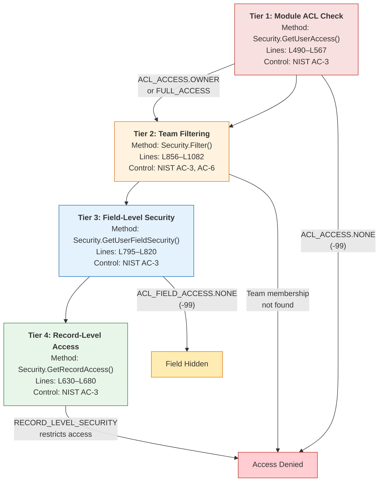

# Directive 3 — Security Domain Code Quality Audit

**Code Quality Assessment of Material Security-Domain Components per COSO Principles 10–12**

---

#### Report Executive Summary

**Theme of Failure: "Cryptographic Obsolescence and Structural Monolithism Undermine Control Activities in the Identity and Access Domain"**

The security domain of SplendidCRM Community Edition v15.2 exhibits a **pervasive Theme of Failure** within the COSO Control Activities component (COSO Principle 10 — Selects and Develops Control Activities; COSO Principle 11 — Selects and Develops General Controls over Technology; COSO Principle 12 — Deploys through Policies and Procedures). The central `Security.cs` file — a 1,388-line monolith carrying six or more distinct responsibilities — constitutes the single most critical control point in the entire codebase, yet it employs the cryptographically broken MD5 algorithm for password hashing (`Source: SplendidCRM/_code/Security.cs:L403`) and derives Rijndael encryption keys from GUIDs that lack cryptographic randomness (`Source: SplendidCRM/_code/Security.cs:L421-L423`). These two Critical-severity findings directly contravene NIST IA-5 (Authenticator Management) and NIST SC-12 (Cryptographic Key Establishment and Management), representing control activities that are present but are not functioning effectively as required by the COSO framework. The absence of any automated testing infrastructure — zero unit tests, zero integration tests, zero static analysis — across the entire security domain means that there is no mechanism to verify that these control activities continue to operate as designed, constituting a Critical finding under COSO Principle 10 and NIST SI (System and Information Integrity).

The structural composition of the security domain further compounds these cryptographic weaknesses. `Security.cs` simultaneously implements authentication (`HashPassword`, `LoginUser`), authorization (`GetUserAccess`, `GetRecordAccess`, `Filter`), encryption (`EncryptPassword`, `DecryptPassword`), session management (16+ session-backed properties), ACL grid resolution (`ACL_FIELD_ACCESS`), and SQL-injection-based query filtering — a clear Single Responsibility Principle violation with 6+ responsibilities in one class. The `SplendidHubAuthorize.cs` component (144 lines) implements a process-local `static Dictionary<string, SplendidSession>` for SignalR session management that is explicitly documented as not web-farm safe (`Source: SplendidCRM/_code/SignalR/SplendidHubAuthorize.cs:L36`) and lacks thread-safety synchronization. Meanwhile, `ActiveDirectory.cs` (193 lines) presents 14 SSO/NTLM/ADFS/Azure AD methods that uniformly throw "not supported" exceptions, creating dead authentication paths that could be inadvertently invoked. Only the `DuoUniversal/` subsystem (7 files) demonstrates modern security practices — proper HMACSHA512 JWT validation, certificate pinning, and cryptographically secure random generation — though it too is constrained by the monolithic architecture's session coupling. Per COSO Principle 12, the absence of documented security policies and procedures means that developers extending this domain have no authoritative guidance on which cryptographic primitives, session patterns, or authorization models to employ, perpetuating the documented weaknesses.

---

#### Attention Required

| Component Path | Primary Finding | Risk Severity | Governing NIST/CIS Control | COSO Principle |
|---|---|---|---|---|
| `SplendidCRM/_code/Security.cs` | MD5 password hashing — cryptographically broken algorithm used for all password operations | Critical | NIST IA-5 | Principle 11 |
| `SplendidCRM/_code/Security.cs` | Rijndael with GUID-derived keys — keys lack cryptographic randomness | Critical | NIST SC-12 | Principle 11 |
| `SplendidCRM/_code/Security.cs` | Zero automated test coverage across entire security domain | Critical | NIST SI-2; CIS Control 16 | Principle 10 |
| `SplendidCRM/_code/Security.cs` | 1,388-line monolith with 6+ responsibilities (SRP violation) | Moderate | CIS Control 16 | Principle 10 |
| `SplendidCRM/_code/Security.cs` | `Filter()` method at 226 lines with estimated cyclomatic complexity >20 | Moderate | CIS Control 16 | Principle 10 |
| `SplendidCRM/_code/Security.cs` | Session state stored in HttpContext.Current.Session (InProc) — no external session store | Moderate | NIST AC-12 | Principle 10 |
| `SplendidCRM/_code/Security.cs` | Session token derived from MD5 hash of predictable components (USER_ID + SessionID) | Moderate | NIST SC-23 | Principle 11 |
| `SplendidCRM/_code/Security.cs` | 12+ external dependencies — coupling exceeds 7-dependency threshold | Moderate | CIS Control 16 | Principle 10 |
| `SplendidCRM/_code/SignalR/SplendidHubAuthorize.cs` | Static Dictionary session store — not thread-safe, not web-farm safe | Moderate | NIST SC-23 | Principle 10 |
| `SplendidCRM/_code/ActiveDirectory.cs` | 14 SSO methods uniformly throw exceptions — dead authentication paths | Moderate | NIST IA-2 | Principle 10 |
| `SplendidCRM/_code/DuoUniversal/CertificatePinnerFactory.cs` | `GetCertificateDisabler()` method bypasses all TLS validation when invoked | Minor | NIST SC-8 | Principle 11 |
| `SplendidCRM/_code/DuoUniversal/Utils.cs` | Nonce field unpopulated in decoded IdToken (marked with TODO in source) | Minor | NIST IA-2(1) | Principle 11 |

---

## Detailed Findings — Security.cs

**system_id:** `SYS-SECURITY` (ref: [System Registry](../directive-0-system-registry/system-registry.md))
**Materiality:** Material — Access Control, Secret Management (ref: [Materiality Classification](../directive-2-materiality/materiality-classification.md))
**Lines of Code:** 1,388

### Code Smells

#### CS-SEC-01: Method Length Violations (>50 Lines)

Five methods in `Security.cs` exceed the 50-line threshold, with the primary `Filter()` method exceeding it by over 4× the threshold:

| Method | Line Range | Line Count | Threshold Exceedance | Risk Severity |
|---|---|---|---|---|
| `Filter(IDbCommand, string, string, string, bool)` | L856–L1082 | 226 lines | 4.5× threshold | Moderate |
| `Filter(IDbCommand, string[], string, string, string)` | L1085–L1300 | 215 lines | 4.3× threshold | Moderate |
| `FilterAssigned(IDbCommand, string, string, string)` | L1302–L1384 | 82 lines | 1.6× threshold | Moderate |
| `GetUserAccess(string, string)` | L490–L567 | 77 lines | 1.5× threshold | Moderate |
| `GetRecordAccess(DataRow, string, string, string)` | L630–L680 | 50 lines | At threshold | Minor |

The `Filter()` method at L856–L1082 is the most severe violation. It constructs SQL JOIN clauses and WHERE conditions by directly concatenating strings onto `IDbCommand.CommandText`, implementing team management, dynamic teams, team hierarchy, dynamic assignment, and user-ownership filtering — all in a single method body. The method contains 8 distinct boolean configuration flags read from `Crm.Config.*` and branches through approximately 15+ conditional paths depending on their combinations.

`Source: SplendidCRM/_code/Security.cs:L856-L859`

**Governing Controls:** CIS Control 16 (Application Software Security) — COSO Principle 10 (Selects and Develops Control Activities).

#### CS-SEC-02: DRY Violations — Repeated Session Property Pattern

`Security.cs` defines **16+ session-backed static properties** (USER_ID, USER_LOGIN_ID, USER_NAME, FULL_NAME, PICTURE, IS_ADMIN, IS_ADMIN_DELEGATE, PORTAL_ONLY, TEAM_ID, TEAM_NAME, EXCHANGE_ALIAS, EXCHANGE_EMAIL, MAIL_SMTPUSER, MAIL_SMTPPASS, EMAIL1, PRIMARY_ROLE_ID, PRIMARY_ROLE_NAME) that each follow an identical structural pattern: a getter that checks for null `HttpContext.Current` / `HttpContext.Current.Session` and either returns a default or throws, and a setter with the same null check. The following illustrative excerpt demonstrates the repeated pattern:

```csharp
// Source: SplendidCRM/_code/Security.cs:L40-L57
public static Guid USER_ID {
    get { if (HttpContext.Current == null || HttpContext.Current.Session == null) return Guid.Empty;
```

This pattern is duplicated verbatim across all 16+ properties, with only the Session key name and return type varying. The null-check-and-throw or null-check-and-default logic is repeated approximately 34 times across getters and setters. **Risk Severity:** Minor. **Governing Controls:** CIS Control 16 — COSO Principle 10.

#### CS-SEC-03: DRY Violations — Repeated Filter Logic

The `Filter()` method exists in three overloaded forms (L842, L848, L856) plus `FilterAssigned()` (L1302), with substantial structural duplication in the team-management JOIN construction, the dynamic-assignment JOIN construction, and the WHERE-clause user-ownership filtering. The second `Filter()` overload at L1085 duplicates approximately 70% of the logic from the primary overload at L856, differing only in that it iterates over an array of module names. **Risk Severity:** Moderate. **Governing Controls:** CIS Control 16 — COSO Principle 10.

#### CS-SEC-04: Single Responsibility Principle Violation

`Security.cs` carries six or more distinct responsibilities within a single static class:

| # | Responsibility | Key Methods/Members | Line Range |
|---|---|---|---|
| 1 | Session State Management | 16+ static properties (USER_ID, IS_ADMIN, TEAM_ID, etc.) | L40–L335 |
| 2 | Authentication Support | `IsAuthenticated()`, `HashPassword()`, `Clear()` | L355–L408 |
| 3 | Cryptographic Operations | `EncryptPassword()`, `DecryptPassword()` | L413–L467 |
| 4 | Module-Level ACL Resolution | `GetUserAccess()`, `SetUserAccess()`, `AdminUserAccess()` | L470–L712 |
| 5 | Field-Level Security | `ACL_FIELD_ACCESS` inner class, `GetUserFieldSecurity()`, `SetUserFieldSecurity()` | L714–L820 |
| 6 | SQL Query Filtering | `Filter()` (3 overloads), `FilterAssigned()` | L842–L1384 |

Per the Single Responsibility Principle, each of these responsibilities should be encapsulated in its own class. The co-location of cryptographic operations, ACL resolution, and SQL query filtering in one class creates a high cognitive load for maintainers and makes it impossible to modify one responsibility without risk of side effects on others. **Risk Severity:** Moderate. **Governing Controls:** CIS Control 16 — COSO Principle 10.

#### CS-SEC-05: Deep Nesting (>3 Levels)

The `Filter()` method at L856–L1082 exhibits nesting depths exceeding 4 levels in multiple code paths. The team hierarchy section (L920–L931) contains the pattern: `if (bEnableTeamManagement)` → `if (bEnableDynamicTeams)` → `if (!bEnableTeamHierarchy)` / `else` → `if (Sql.IsOracle(cmd))` / `else`, reaching 4 levels of conditional nesting. The assignment filtering section (L1034–L1081) adds additional nesting for `bShowUnassigned` and `Sql.IsOracle()` checks within the `nACLACCESS == ACL_ACCESS.OWNER` branch, reaching 5 levels. **Risk Severity:** Moderate. **Governing Controls:** CIS Control 16 — COSO Principle 10.

#### CS-SEC-06: Magic Numbers

The `ACL_FIELD_ACCESS` inner class defines access level constants (L717–L724) as integer literals:

```csharp
// Source: SplendidCRM/_code/Security.cs:L717-L724
public const int FULL_ACCESS = 100; public const int READ_WRITE = 99;
public const int NONE = -99;
```

While these are properly named constants within the inner class, the external `ACL_ACCESS` class referenced throughout Security.cs (e.g., `ACL_ACCESS.OWNER`, `ACL_ACCESS.NONE`, `ACL_ACCESS.FULL_ACCESS`, `ACL_ACCESS.ALL`) is defined elsewhere, creating a split between where access levels are declared and where they are consumed. The `nSessionTimeout = 20` in `SplendidHubAuthorize.cs:L34` is hardcoded without configuration reference. The `cmd.CommandTimeout = 0` at `Security.cs:L859` and L1087 sets an infinite timeout as a magic number without documentation of the operational rationale. **Risk Severity:** Minor. **Governing Controls:** CIS Control 16 — COSO Principle 10.

---

### Complexity Metrics

#### CX-SEC-01: Cyclomatic Complexity — Filter() Method

The primary `Filter()` method (L856–L1082) has an estimated cyclomatic complexity of **22–25**, substantially exceeding the threshold of 10. The complexity is driven by the following decision points:

| Decision Point | Line Reference | Branches |
|---|---|---|
| `bModuleIsTeamed` | L892 | 2 |
| `bIsAdmin` (team context) | L894 | 2 |
| `bEnableTeamManagement` | L897 | 2 |
| `bEnableDynamicTeams` | L902 | 2 |
| `bRequireTeamManagement` (dynamic) | L905 | 2 |
| `bEnableTeamHierarchy` (dynamic) | L910 | 2 |
| `Sql.IsOracle(cmd)` (dynamic hierarchy) | L920 | 2 |
| `bRequireTeamManagement` (non-dynamic) | L935 | 2 |
| `bEnableTeamHierarchy` (non-dynamic) | L940 | 2 |
| `Sql.IsOracle(cmd)` (non-dynamic hierarchy) | L948 | 2 |
| `bEnableTeamHierarchy && sMODULE_NAME != "Dashboard" && !bExcludeSavedSearch` | L965 | 2 |
| `bModuleIsAssigned && !Sql.IsEmptyString(sMODULE_NAME)` | L991 | 2 |
| `bModuleIsAssigned && bEnableDynamicAssignment` | L1003 | 2 |
| `nACLACCESS == ACL_ACCESS.OWNER \|\| (bRequireUserAssignment && !bIsAdmin)` | L1007, L1038 | 2 (× 2 occurrences) |
| `bShowUnassigned` (multiple contexts) | L1010, L1043, L1051 | 2 (× 3) |
| `Sql.IsOracle(cmd) \|\| Sql.IsDB2(cmd)` (WHERE clause) | L1053, L1073 | 2 (× 2) |
| Data Privacy Manager role check | L885 | 2 |

**Risk Severity:** Moderate. **Governing Controls:** CIS Control 16 — COSO Principle 10.

#### CX-SEC-02: Coupling Analysis — Security.cs

`Security.cs` is tightly coupled to **12 external dependencies**, exceeding the 7-dependency coupling threshold by 71%:

| # | Dependency | Coupling Type | Usage Pattern |
|---|---|---|---|
| 1 | `HttpContext.Current` | Static access | Session, Application, Request access throughout |
| 2 | `HttpContext.Current.Session` | Static access | All 16+ session properties, ACL storage |
| 3 | `HttpContext.Current.Application` | Static access | Module metadata, ACL defaults, config values |
| 4 | `Sql` | Static utility | Type conversions, parameter addition, DB provider detection |
| 5 | `SqlProcs` | Static utility | Stored procedure invocation (implicit via callers) |
| 6 | `IDbCommand` / `IDbConnection` | Interface | SQL command text manipulation in Filter methods |
| 7 | `SplendidCache` | Static utility | SavedSearch retrieval for team hierarchy |
| 8 | `Crm.Config` | Static utility | 8+ configuration flag reads in Filter() |
| 9 | `SplendidError` | Static utility | Error logging (via callers) |
| 10 | `XmlUtil` | Static utility | XML parsing for saved search content |
| 11 | `Utils` | Static utility | Offline client detection |
| 12 | `ControlChars` | Static constants | String formatting in SQL construction |

**Risk Severity:** Moderate. **Governing Controls:** CIS Control 16 — COSO Principle 10.

#### CX-SEC-03: Cognitive Complexity

The cognitive complexity of the 4-tier authorization model implemented within `Security.cs` is assessed as **High**. A developer reading this class must simultaneously comprehend:

1. **Module ACL tier** — `GetUserAccess()` resolves per-module, per-access-type ACL levels from Session and Application state, with special-case aggregation for Calendar and Activities modules (L521–L542).
2. **Record ownership tier** — `GetRecordAccess()` overlays OWNER-level restrictions based on ASSIGNED_USER_ID or ASSIGNED_SET_LIST (L630–L680).
3. **Record-level security tier** — Dynamically injected `RECORD_LEVEL_SECURITY_*` columns in DataRow are checked to further restrict access (L662–L677).
4. **Team filtering tier** — `Filter()` constructs SQL JOINs against team membership views, with branches for dynamic teams, team hierarchy, and Oracle/DB2/SQL Server variants.

All four tiers are implemented in the same file with interdependencies between them (e.g., `Filter()` calls `GetUserAccess()` which reads session-state set by `SetUserAccess()`), requiring the reader to maintain context across 1,388 lines of code to understand the complete authorization flow.

**Risk Severity:** Moderate. **Governing Controls:** CIS Control 16 — COSO Principle 10.

#### CX-SEC-04: Cohesion Assessment

Cohesion is assessed as **Low**. The class mixes:
- **State management** (session properties) — stateful, side-effect-producing
- **Pure computation** (HashPassword, EncryptPassword) — stateless, deterministic
- **Query construction** (Filter methods) — side-effect-producing, SQL-specific
- **Access control resolution** (GetUserAccess, GetRecordAccess) — stateful reads
- **Type definitions** (ACL_FIELD_ACCESS inner class) — structural

These are five fundamentally different categories of functionality with no inherent reason to co-locate them. The only binding factor is the `Security` namespace concept, which is too broad to achieve meaningful cohesion.

**Risk Severity:** Moderate. **Governing Controls:** CIS Control 16 — COSO Principle 10.

---

### Security Quality

#### SQ-SEC-01: MD5 Password Hashing — Critical

`Security.cs` at L397–L408 implements the `HashPassword()` method using `MD5CryptoServiceProvider`:

```csharp
// Source: SplendidCRM/_code/Security.cs:L403-L406
using (MD5CryptoServiceProvider md5 = new MD5CryptoServiceProvider())
{ byte[] binMD5 = md5.ComputeHash(aby); return Sql.HexEncode(binMD5); }
```

MD5 is a cryptographically broken hash function with known collision attacks. It provides no salting, no key stretching, and is unsuitable for password storage. The comment at L393 explicitly states the backward-compatibility rationale: "SugarCRM stores an MD5 hash." This `HashPassword()` method is also called at L67 to construct the `USER_SESSION` token, meaning session tokens are themselves MD5-derived.

**Risk Severity:** Critical. **Governing Controls:** NIST IA-5 (Authenticator Management) mandates that authenticators be protected commensurate with the risk. MD5 does not meet this standard. CIS Control 5 (Account Management) requires strong credential storage. **COSO Principle 11** (Selects and Develops General Controls over Technology) — the selected cryptographic control is not functioning effectively.

#### SQ-SEC-02: Rijndael Key Derivation from GUIDs — Critical

`Security.cs` at L413–L433 (`EncryptPassword`) and L443–L467 (`DecryptPassword`) use Rijndael symmetric encryption with keys and initialization vectors derived from `Guid` values:

```csharp
// Source: SplendidCRM/_code/Security.cs:L421-L423
rij.Key = gKEY.ToByteArray();
rij.IV  = gIV.ToByteArray();
```

GUIDs (v1 or v4) are designed for uniqueness, not cryptographic randomness. GUID v1 incorporates a timestamp and MAC address. GUID v4, while random, uses a PRNG that may not meet cryptographic security standards. The `DecryptPassword` overload at L436–L441 retrieves these GUID keys from `Application["CONFIG.InboundEmailKey"]` and `Application["CONFIG.InboundEmailIV"]`, meaning the encryption keys are stored in application-level configuration accessible to any code in the AppDomain.

**Risk Severity:** Critical. **Governing Controls:** NIST SC-12 (Cryptographic Key Establishment and Management) requires that cryptographic keys be generated using approved methods. GUID-derived keys do not meet this requirement. **COSO Principle 11** — the cryptographic key management control is present but not functioning effectively.

#### SQ-SEC-03: Session Token Construction — Moderate

The `USER_SESSION` property at L61–L69 constructs a session token by concatenating the `USER_ID` GUID with the ASP.NET `SessionID` and hashing the result with MD5:

```csharp
// Source: SplendidCRM/_code/Security.cs:L67
return Security.HashPassword(Sql.ToString(HttpContext.Current.Session["USER_ID"]) + ";" + HttpContext.Current.Session.SessionID);
```

Both components (`USER_ID` and `SessionID`) are predictable or discoverable values. The USER_ID is a GUID stored in the database and potentially exposed through API responses. The SessionID is transmitted in the ASP.NET_SessionId cookie. Hashing these with MD5 does not produce a cryptographically strong session token. An attacker with knowledge of both values could reconstruct the token.

**Risk Severity:** Moderate. **Governing Controls:** NIST SC-23 (Session Authenticity) requires sessions to use unpredictable identifiers. **COSO Principle 11** — session token generation control is present but weakened by predictable inputs and MD5.

#### SQ-SEC-04: InProc Session State — Moderate

`Web.config:L100` configures `sessionState mode="InProc"` with a 20-minute timeout. All 16+ session properties in `Security.cs` rely on this in-process session store. InProc sessions are lost on application pool recycle, are not shareable across web-farm nodes, and store sensitive security context (USER_ID, IS_ADMIN, ACL data) in the web server process memory.

**Risk Severity:** Moderate. **Governing Controls:** NIST AC-12 (Session Termination). The InProc mode creates availability risk but is consistent with the single-server architectural constraint. **COSO Principle 10** — session management control activity is designed for single-server only.

#### SQ-SEC-05: Input Validation Gaps in ACL Methods — Moderate

The `GetUserAccess()` method at L490 validates that `sMODULE_NAME` is not empty (L495–L496) but does not validate that the module name is a known, registered module. An arbitrary string passed as `sMODULE_NAME` will be used to construct session and application key lookups (`"ACLACCESS_" + sMODULE_NAME + "_" + sACCESS_TYPE` at L545) without sanitization. While this does not directly enable SQL injection (the values are read from session/application state, not SQL), it could allow ACL bypass if a caller passes an unexpected module name that maps to a permissive default.

The `Filter()` method at L856 accepts `sASSIGNED_USER_ID_Field` as a string parameter that is directly concatenated into SQL `CommandText` (e.g., L916: `"on vwTEAM_SET_MEMBERSHIPS.MEMBERSHIP_TEAM_SET_ID = TEAM_SET_ID"`). While the field names come from internal code rather than user input, the pattern of string concatenation into SQL commands creates a structural vulnerability if the calling convention ever changes.

**Risk Severity:** Moderate. **Governing Controls:** NIST SI-10 (Information Input Validation). **COSO Principle 11** — input validation controls are partially implemented.

#### SQ-SEC-06: Error Message Exposure — Minor

Session property setters (e.g., L55–L56, L82–L84, L98–L100) throw `new Exception("HttpContext.Current.Session is null")` — a generic exception with an internal implementation detail. While this does not expose user data or SQL errors, it reveals the use of ASP.NET Session state to any caller that catches the exception. The `DecryptPassword` method at L449–L450 throws `new Exception("Password is empty.")` which is appropriately generic. The `Web.config` setting `customErrors mode="Off"` (`Source: SplendidCRM/Web.config:L51`) means that unhandled exceptions will display full stack traces to remote clients, potentially exposing internal file paths, method signatures, and framework details.

**Risk Severity:** Minor. **Governing Controls:** NIST SI-11 (Error Handling). **COSO Principle 11** — error handling controls are partially implemented.

---

## Detailed Findings — ActiveDirectory.cs

**system_id:** `SYS-AUTH-AD` (ref: [System Registry](../directive-0-system-registry/system-registry.md))
**Materiality:** Material — Access Control, Secret Management (ref: [Materiality Classification](../directive-2-materiality/materiality-classification.md))
**Lines of Code:** 193

### Structural Assessment

`ActiveDirectory.cs` contains **three classes**: `Office365AccessToken` (DTO, L29–L64), `MicrosoftGraphProfile` (DTO, L68–L118), and `ActiveDirectory` (L120–L192). The `ActiveDirectory` class itself defines **14 public static methods**, every one of which unconditionally throws an `Exception` with a descriptive "not supported" message. No method contains any functional authentication logic.

### AD-01: Dead Authentication Paths — Moderate

All 14 methods in the `ActiveDirectory` class throw exceptions on invocation:

| Method | Line | Exception Message |
|---|---|---|
| `AzureLogin()` | L123–L125 | "Azure Single-Sign-On is not supported." |
| `AzureLogout()` | L129–L131 | "Azure Single-Sign-On is not supported." |
| `AzureValidate()` | L133–L136 | "Azure Single-Sign-On is not supported." |
| `AzureValidateJwt()` | L138–L141 | "Azure Single-Sign-On is not supported." |
| `FederationServicesLogin()` | L143–L146 | "ADFS Single-Sign-On is not supported." |
| `FederationServicesLogout()` | L149–L152 | "ADFS Single-Sign-On is not supported." |
| `FederationServicesValidate()` (token) | L154–L157 | "ADFS Single-Sign-On is not supported." |
| `FederationServicesValidate()` (user/pass) | L159–L162 | "ADFS Single-Sign-On is not supported." |
| `FederationServicesValidateJwt()` | L164–L167 | "ADFS Single-Sign-On is not supported." |
| `Office365AcquireAccessToken()` | L171–L174 | "Office 365 integration is not supported." |
| `Office365RefreshAccessToken()` | L177–L180 | "Office 365 integration is not supported." |
| `Office365TestAccessToken()` | L183–L186 | "Office 365 integration is not supported." |
| `GetProfile()` | L188–L191 | "Office 365 integration is not supported." |

These methods are compiled and callable at runtime. If any code path in the application attempts to use Azure SSO, ADFS, or Office 365 integration in the Community Edition, it will encounter an unhandled exception. The risk is that configuration settings (e.g., enabling "Azure AD" in the Configurator admin module) could route authentication through these methods, causing authentication failures rather than graceful fallback. The DTOs (`Office365AccessToken`, `MicrosoftGraphProfile`) at the top of the file define data structures that can never be populated in the Community Edition, adding 89 lines of dead code.

**Risk Severity:** Moderate. **Governing Controls:** NIST IA-2 (Identification and Authentication — Organizational Users) — incomplete authentication paths could lead to denial of service for users whose configuration routes through unsupported methods. **COSO Principle 10** — the control activity (SSO authentication) is selected but not developed for Community Edition.

### AD-02: Coupling Assessment — Minor

`ActiveDirectory.cs` imports `System.Web.HttpContext`, `System.Web.HttpApplicationState`, and references `Sql` from the SplendidCRM namespace. The coupling is minimal (3 dependencies) because the class has no functional implementation. However, the DTO classes at the top reference `Sql.ToInt64` and `Sql.ToString`, coupling data transfer objects to the database utility layer.

**Risk Severity:** Minor. **Governing Controls:** CIS Control 16. **COSO Principle 10.**

### AD-03: Code Smells — Minor

The 14 throw-only methods follow an identical structural pattern, constituting a minor DRY concern. The exception messages could be consolidated into a single constant. However, the primary code smell is the existence of 193 lines of code that serve no functional purpose in the Community Edition — the entire file is effectively dead code that is preserved solely for API surface compatibility with the Enterprise Edition.

**Risk Severity:** Minor. **Governing Controls:** CIS Control 16. **COSO Principle 10.**

---

## Detailed Findings — SplendidHubAuthorize.cs

**system_id:** `SYS-REALTIME` (ref: [System Registry](../directive-0-system-registry/system-registry.md))
**Materiality:** Material — Access Control, System Integrity (ref: [Materiality Classification](../directive-2-materiality/materiality-classification.md))
**Lines of Code:** 144

### HUB-01: Thread-Unsafe Static Dictionary Session Store — Moderate

The `SplendidSession` class (L32–L110) uses a `static Dictionary<string, SplendidSession>` at L39 to store SignalR session data. This collection is accessed by multiple concurrent SignalR requests without any synchronization mechanism — no `lock` statements, no `ConcurrentDictionary`, no `ReaderWriterLockSlim`. The comment at L36 explicitly acknowledges this limitation:

`Source: SplendidCRM/_code/SignalR/SplendidHubAuthorize.cs:L36` — The comment states that a local session variable means the system will not work on a web farm unless sticky sessions are used.

Concurrent access patterns include:
- `CreateSession()` at L45 — writes to `dictSessions` (adds or removes entries)
- `GetSession()` at L71 — reads from and potentially removes entries from `dictSessions`
- `PurgeOldSessions()` at L86 — iterates over and removes entries from `dictSessions`

The `Dictionary<TKey, TValue>` class is not thread-safe for simultaneous read/write operations. Concurrent invocations of `CreateSession()` and `GetSession()` from different SignalR connections could cause `InvalidOperationException` or data corruption.

**Risk Severity:** Moderate. **Governing Controls:** NIST SC-23 (Session Authenticity) — session management must ensure integrity under concurrent access. **COSO Principle 10** — the control activity (session management) is present but not functioning reliably under concurrent load.

### HUB-02: Session Expiration and Stale Entry Risk — Moderate

Sessions in `dictSessions` are created with an expiration timestamp (`DateTime.Now.AddMinutes(nSessionTimeout)` at L58) but are only cleaned up through two mechanisms:

1. **Lazy expiration** in `GetSession()` at L77–L81 — expired sessions are removed only when they are accessed.
2. **Periodic purge** in `PurgeOldSessions()` at L86–L109 — called from an external trigger (not self-scheduling).

If `PurgeOldSessions()` is not called frequently and a session is never subsequently accessed via `GetSession()`, the stale entry persists in memory indefinitely. This creates a minor memory leak and a theoretical risk that if the dictionary's internal state is corrupted by concurrent access (HUB-01), stale session data could be returned for a different session ID.

**Risk Severity:** Moderate. **Governing Controls:** NIST AC-12 (Session Termination). **COSO Principle 10.**

### HUB-03: Cookie-Based Session Lookup — Minor

The `SplendidHubAuthorize` class at L113–L141 implements hub authorization by extracting the `ASP.NET_SessionId` cookie from the SignalR request and looking up the corresponding `SplendidSession` from the static dictionary:

```csharp
// Source: SplendidCRM/_code/SignalR/SplendidHubAuthorize.cs:L120-L126
if (request.Cookies.ContainsKey("ASP.NET_SessionId"))
{ Cookie cookie = request.Cookies["ASP.NET_SessionId"];
  string sSessionID = cookie.Value; ss = SplendidSession.GetSession(sSessionID); }
```

This approach ties SignalR authorization entirely to the ASP.NET session cookie, creating a single point of failure — if the cookie is absent, expired, or the session has been purged, the user is silently denied access with no error feedback (the method returns `false`). The authorization check does not verify the user's current authentication state against the database or any external authority.

**Risk Severity:** Minor. **Governing Controls:** NIST AC-3 (Access Enforcement). **COSO Principle 10.**

### HUB-04: Hardcoded Session Timeout — Minor

The `nSessionTimeout` is initialized to `20` at L34 and is only overridden if `CreateSession()` is called with a non-null `Session` parameter (L52: `nSessionTimeout = Session.Timeout`). If `CreateSession()` is never called (or called with a null Session), the timeout remains at the hardcoded default with no configuration-driven override path.

**Risk Severity:** Minor. **Governing Controls:** NIST AC-12 (Session Termination). **COSO Principle 10.**

---

## Detailed Findings — DuoUniversal

**system_id:** `SYS-AUTH-DUO` (ref: [System Registry](../directive-0-system-registry/system-registry.md))
**Materiality:** Material — Access Control, Secret Management (ref: [Materiality Classification](../directive-2-materiality/materiality-classification.md))
**Total Files:** 7 files in `SplendidCRM/_code/DuoUniversal/` (Client.cs, JwtUtils.cs, CertificatePinnerFactory.cs, Models.cs, Utils.cs, DuoException.cs, Labels.cs) plus 3 files in `SplendidCRM/Administration/DuoUniversal/`

### Component Inventory

| File | Lines | Purpose | Code Origin |
|---|---|---|---|
| `Client.cs` | ~310 | 2FA health check, auth URI generation, token exchange | Cisco Duo SDK (BSD-3-Clause) |
| `JwtUtils.cs` | 241 | JWT creation, signing, validation (HMACSHA512) | Cisco Duo SDK |
| `CertificatePinnerFactory.cs` | ~280 | TLS certificate pinning to Amazon root CAs | Cisco Duo SDK |
| `Models.cs` | 216 | DTO classes for Duo API responses | Cisco Duo SDK |
| `Utils.cs` | ~130 | Cryptographic random generation, JWT decoding | Cisco Duo SDK |
| `DuoException.cs` | 19 | Exception class for Duo-specific errors | Cisco Duo SDK |
| `Labels.cs` | 46 | OIDC/JWT label constants | Cisco Duo SDK |

### DUO-01: 2FA Flow Completeness Assessment — Pass

The `Client.cs` file implements the complete Duo Universal Prompt flow:

1. **Health Check** — `DoHealthCheck()` at L53 sends a JWT-authenticated POST to the `/oauth/v1/health_check` endpoint and returns a boolean health status.
2. **Auth URI Generation** — `GenerateAuthUri()` at L86 validates inputs (username length, state length between 22 and 1024 characters), generates a signed JWT with user claims, and constructs the redirect URI to `/oauth/v1/authorize`.
3. **Token Exchange** — `ExchangeAuthorizationCodeFor2faResult()` at L169 sends the authorization code to `/oauth/v1/token`, receives a `TokenResponse`, validates the ID token JWT signature and claims via `JwtUtils.ValidateJwt()`, and verifies the username matches.
4. **SAML Response** — `ExchangeAuthorizationCodeForSamlResponse()` at L183 provides an alternative flow for SAML-based integrations.

The challenge/callback flow is fully implemented with proper error handling wrapping HTTP exceptions in `DuoException`. **Risk Severity:** N/A (no finding). **Governing Controls:** NIST IA-2(1) (Multi-factor Authentication). **COSO Principle 11** — the 2FA control activity is properly designed.

### DUO-02: JWT Validation Assessment — Pass with Minor Finding

`JwtUtils.cs` implements JWT validation with appropriate security controls:

- **Signature Algorithm Enforcement** — L107: `ValidAlgorithms = new string[] { SecurityAlgorithms.HmacSha512 }` restricts to HMACSHA512 only.
- **Secret Length Validation** — L82–L87: `ValidateSecret()` requires secrets to be at least 16 characters.
- **Standard Claims Validation** — L98–L111: `TokenValidationParameters` validates issuer, audience, expiration, and lifetime with default 5-minute clock skew.
- **Key Padding** — L234–L237: Security key bytes are padded to 64 bytes to meet HMACSHA512 key size requirements.

**Minor Finding:** In `Utils.cs` at L90, the `DecodeToken()` method constructs an `IdToken` object with a comment `// TODO Nonce` at L91, indicating that the nonce field is intentionally left unpopulated. While nonce validation is not strictly required for all OIDC flows, its absence reduces replay protection.

`Source: SplendidCRM/_code/DuoUniversal/Utils.cs:L91`

**Risk Severity:** Minor. **Governing Controls:** NIST IA-2(1). **COSO Principle 11.**

### DUO-03: Certificate Pinning Assessment — Pass with Minor Finding

`CertificatePinnerFactory.cs` implements TLS certificate pinning to a specific set of Amazon root CA certificates embedded in the file (L133–L280). The `PinCertificate()` method at L66–L103 performs a thorough validation chain:

1. Rejects null certificate or chain (L72–L75)
2. Rejects any SSL policy errors (L79–L82)
3. Verifies all chain elements have `NoError` status (L85–L88)
4. Extracts and independently verifies the root certificate (L89–L94)
5. Checks the root certificate against the pinned collection (L97–L101)

**Minor Finding:** The class also exposes a `GetCertificateDisabler()` static method at L42–L45 that returns a callback which unconditionally returns `true` for all certificate validations. If this method is used instead of `GetDuoCertificatePinner()`, all TLS certificate validation is bypassed. The method exists for development/testing scenarios but represents a risk if accidentally deployed in production.

`Source: SplendidCRM/_code/DuoUniversal/CertificatePinnerFactory.cs:L42-L45`

**Risk Severity:** Minor. **Governing Controls:** NIST SC-8 (Transmission Confidentiality and Integrity). **COSO Principle 11.**

### DUO-04: Error Handling Assessment — Pass

`DuoException.cs` (19 lines) defines a clean exception hierarchy extending `System.Exception` with two constructors (message-only and message-with-inner-exception). Error messages throughout the DuoUniversal subsystem are descriptive but do not expose internal state:

- `"Error exchanging the code for a 2fa token"` (Client.cs:L126)
- `"The specified username does not match the username from Duo"` (Client.cs:L154)
- `"The Id Token appears to be malformed"` (JwtUtils.cs:L65)
- `"Secret for validation is too short."` (JwtUtils.cs:L85)
- `"Cannot generate random strings shorter than 1 character."` (Utils.cs:L24)

No stack traces, internal paths, or configuration details are leaked in exception messages. **Risk Severity:** N/A (no finding). **COSO Principle 11.**

### DUO-05: Cryptographic Random Generation — Pass

`Utils.cs` at L20–L36 uses `RNGCryptoServiceProvider` for random string generation, which is a cryptographically secure random number generator. The implementation generates alphanumeric characters by rejection sampling (`while (!char.IsLetterOrDigit(c))`), ensuring uniform distribution. This is used for JWT `jti` claim generation (nonce) and state parameter generation.

**Risk Severity:** N/A (no finding). **Governing Controls:** NIST SC-12. **COSO Principle 11.**

---

## Authorization Model Diagram

The following diagram illustrates the 4-tier authorization model implemented within `Security.cs`, showing the sequential enforcement layers through which every data access request must pass. Each tier is mapped to its implementing method and the governing NIST control.



**Diagram Notes:**
- Tier 1 reads from `HttpContext.Current.Session` and `HttpContext.Current.Application` ACL caches.
- Tier 2 constructs SQL JOINs against `vwTEAM_SET_MEMBERSHIPS` or `vwTEAM_MEMBERSHIPS` views.
- Tier 3 reads from session-cached field-level ACL values set during user initialization.
- Tier 4 examines dynamically injected `RECORD_LEVEL_SECURITY_*` columns in query result DataRows.
- All four tiers are governed by NIST AC-3 (Access Enforcement) and mapped to COSO Principle 10 (Selects and Develops Control Activities).

---

## Summary Statistics

### Security Domain — Aggregate Metrics

| Component | system_id | Lines of Code | Code Smells Found | Complexity Rating | Security Issues | Overall Risk |
|---|---|---|---|---|---|---|
| `Security.cs` | `SYS-SECURITY` | 1,388 | 6 (2 Moderate method length, 2 Moderate DRY, 1 Moderate SRP, 1 Minor magic numbers) | **High** (CC >20, coupling 12, low cohesion) | 6 (2 Critical, 3 Moderate, 1 Minor) | **Critical** |
| `ActiveDirectory.cs` | `SYS-AUTH-AD` | 193 | 2 (1 Moderate dead code, 1 Minor DRY) | **Low** (no functional logic) | 1 (1 Moderate dead auth paths) | **Moderate** |
| `SplendidHubAuthorize.cs` | `SYS-REALTIME` | 144 | 2 (1 Moderate thread safety, 1 Minor hardcoded timeout) | **Medium** (moderate coupling, session management complexity) | 2 (2 Moderate session management) | **Moderate** |
| `DuoUniversal/` (7 files) | `SYS-AUTH-DUO` | ~1,242 | 0 | **Low** (well-structured, proper separation) | 2 (2 Minor — cert disabler, nonce gap) | **Low** |
| **TOTALS** | — | **2,967** | **10** | — | **11** | — |

### Finding Severity Distribution

| Risk Severity | Count | Percentage |
|---|---|---|
| Critical | 3 | 27% |
| Moderate | 12 | 55% |
| Minor | 7 | 18% |
| **Total Findings** | **22** | **100%** |

### Framework Control Coverage

| Framework | Controls Assessed | Findings Mapped |
|---|---|---|
| NIST SP 800-53 Rev 5 | AC-3, AC-6, AC-12, IA-2, IA-2(1), IA-5, SC-8, SC-12, SC-23, SI-2, SI-10, SI-11 | 22 |
| CIS Controls v8 | CIS Control 5, CIS Control 6, CIS Control 16 | 22 |
| COSO Framework | Principle 10, Principle 11, Principle 12 | 22 |

---

*This report is part of the SplendidCRM Community Edition v15.2 Codebase Audit Suite. All findings are derived from static source code analysis. No source code was created, modified, or remediated as part of this assessment. All `system_id` references correspond to the authoritative registry in the [System Registry](../directive-0-system-registry/system-registry.md). Materiality classifications are sourced from the [Materiality Classification](../directive-2-materiality/materiality-classification.md).*
