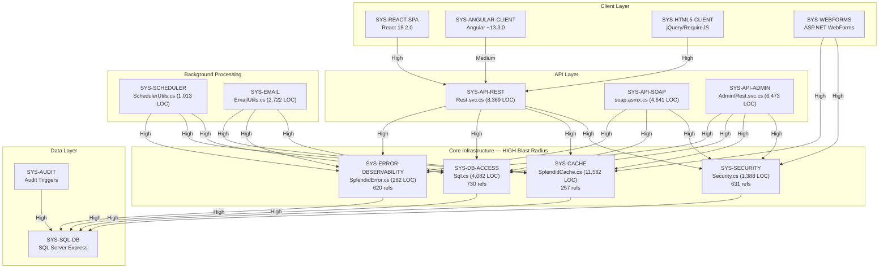
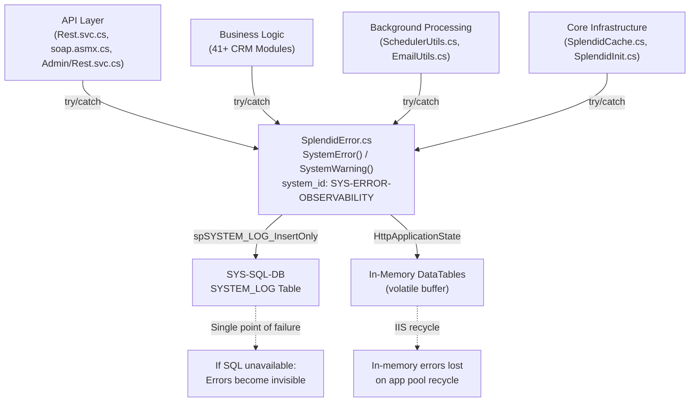

# Directive 4 — Cross-Cutting Dependency Audit

**SplendidCRM Community Edition v15.2 — Codebase Audit**

**Audit Scope:** All systems from the [Directive 0 — System Registry](../directive-0-system-registry/system-registry.md), with cross-cutting dependency analysis per COSO Principle 9 (Identifies and Analyzes Significant Change). Findings incorporate code quality evidence from [Directive 3 — Code Quality Audit](../directive-3-code-quality/code-quality-summary.md) and materiality classifications from [Directive 2 — Materiality Classification](../directive-2-materiality/materiality-classification.md).

---

#### Report Executive Summary

**Theme of Failure: "Ungoverned Dependency Landscape with Extreme Shared-Utility Coupling and Zero Change-Impact Analysis — A Configuration Management Vacuum"**

The cross-cutting dependency audit of SplendidCRM Community Edition v15.2 reveals a **pervasive failure** in the COSO Control Activities component, specifically COSO Principle 9 (Identifies and Analyzes Significant Change) and COSO Principle 10 (Selects and Develops Control Activities). Dependency governance is entirely absent across the .NET backend: 38 DLLs are manually managed in `BackupBin2012/` without NuGet, without a Software Bill of Materials (SBOM), and without automated vulnerability scanning. The `.csproj` project file references DLLs from three separate directories — `BackupBin2012/` (22 references), `BackupBin2022/` (2 references), and `BackupBin2025/` (13 references) — but only `BackupBin2012/` exists in the repository. The other two are phantom path references that point to non-existent directories, representing a Critical configuration management failure under NIST CM-3 (Configuration Change Control) and CIS Control 2 (Inventory and Control of Software Assets). Notably, all 38 DLLs physically reside in `BackupBin2012/` regardless of where the `.csproj` HintPath references claim they should be, meaning the build process relies on the `.csproj` fallback behavior of searching the output directory rather than the specified paths. This undocumented build behavior is itself a control deficiency. Source: `SplendidCRM/SplendidCRM7_VS2017.csproj`

Shared utility coupling is extreme and represents the highest-impact risk identified in this audit. Four core infrastructure classes — `Sql.cs`, `Security.cs`, `SplendidError.cs`, and `SplendidCache.cs` — are consumed by virtually every system in the codebase. Grep analysis across `SplendidCRM/` confirms: `Sql.*` is referenced in 730 C# files, `Security.*` in 631 files, `SplendidError.*` in 620 files, and `SplendidCache.*` in 257 files. These four classes form a convergence point through which all application traffic flows — any defect, security vulnerability, or behavioral change in any one of them propagates across the entire application with no containment boundary. Per COSO Principle 9, the codebase has zero formal process to identify or analyze changes to these critical shared utilities: no CI/CD pipeline, no automated dependency auditing, no blast radius analysis tooling, no vulnerability alerting, and no change review workflow. Per COSO Principle 10, the absence of dependency management controls means configuration changes are untracked and unauditable. The SignalR version asymmetry compounds this risk: the server uses `Microsoft.AspNet.SignalR.Core` v1.2.2 (legacy, from `BackupBin2012/`), while the React client simultaneously consumes `@microsoft/signalr` v8.0.0 and the legacy `signalr` v2.4.3 package — three incompatible SignalR versions coexisting in a single application, creating protocol-level fragility at the real-time communication boundary. Source: `SplendidCRM/SplendidCRM7_VS2017.csproj:L85`, `SplendidCRM/React/package.json:L81,L105`

---

#### Attention Required

| Component Path | Primary Finding | Risk Severity | Governing NIST/CIS Control | COSO Principle |
|---|---|---|---|---|
| `BackupBin2012/` | 38 manually managed DLLs — no NuGet, no SBOM, no vulnerability scanning | Critical | NIST CM-3, CIS Control 2 | Principle 9 |
| `SplendidCRM/SplendidCRM7_VS2017.csproj` | Phantom HintPath references to `BackupBin2022/` and `BackupBin2025/` — folders do not exist in repository | Critical | NIST CM-2, CIS Control 4 | Principle 9 |
| `SplendidCRM/_code/Sql.cs` | Referenced in 730 files — highest coupling shared utility; any defect propagates system-wide | Critical | NIST SC-5 | Principle 9 |
| `SplendidCRM/_code/Security.cs` | Referenced in 631 files — authentication/authorization consumed by all API and module systems | Critical | NIST SC-5, NIST AC | Principle 9 |
| `SplendidCRM/_code/SplendidError.cs` | Referenced in 620 files — centralized error handler; failure stops all error logging | Critical | NIST SC-5, NIST AU-5 | Principle 9 |
| `SplendidCRM/_code/SplendidCache.cs` | Referenced in 257 files — 11,582-line monolith consumed by virtually all systems | Critical | NIST SC-5 | Principle 9 |
| `BackupBin2012/Microsoft.AspNet.SignalR.Core.dll` | SignalR server v1.2.2 vs client v8.0.0 — 3 incompatible versions coexist | Critical | NIST CM-3 | Principle 9 |
| `BackupBin2012/BouncyCastle.Crypto.dll` | Critical security library — version unknown, no NuGet version tracking | Critical | NIST SC-13, CIS Control 2 | Principle 9 |
| `BackupBin2012/Microsoft.Owin.Security.dll` | Authentication middleware — version unknown, manually managed | Critical | NIST IA, CIS Control 2 | Principle 9 |
| `SplendidCRM/React/package.json` | npm-managed dependencies but no `npm audit` or automated vulnerability scanning | Moderate | CIS Control 2, CIS Control 16 | Principle 9 |
| `SplendidCRM/Angular/package.json` | Experimental Angular ~13.3.0 client — end-of-life Angular version (Nov 2022) | Moderate | NIST CM-3 | Principle 9 |
| `BackupBin2012/MailKit.dll` | Email security boundary — version unknown, handles SMTP/IMAP/POP3 credentials | Moderate | NIST SC-8 | Principle 9 |
| `SplendidCRM/_code/Spring.Social.*` | 8 enterprise integration stub directories (334 files) — compiled but non-functional dead code | Moderate | NIST CM-7 | Principle 9 |

---

## Inter-System Dependency Map

Per COSO Principle 9 (Identifies and Analyzes Significant Change), all systems from the [Directive 0 — System Registry](../directive-0-system-registry/system-registry.md) have been analyzed for inter-system dependencies. The dependency map below identifies which systems consume which other systems at runtime, build time, or bootstrap time, along with the coupling strength of each relationship. This analysis is essential for understanding how changes in one system propagate to others — a core requirement of NIST CM-3 (Configuration Change Control), which mandates that the impact of proposed changes be determined before implementation.

| Source System (`system_id`) | Depends On (`system_id`s) | Dependency Type | Coupling Strength |
|---|---|---|---|
| `SYS-API-REST` | `SYS-SECURITY`, `SYS-CACHE`, `SYS-DB-ACCESS`, `SYS-ERROR-OBSERVABILITY`, `SYS-L10N` | Runtime | Tight |
| `SYS-API-SOAP` | `SYS-SECURITY`, `SYS-CACHE`, `SYS-DB-ACCESS`, `SYS-ERROR-OBSERVABILITY` | Runtime | Tight |
| `SYS-API-ADMIN` | `SYS-SECURITY`, `SYS-CACHE`, `SYS-DB-ACCESS`, `SYS-ERROR-OBSERVABILITY` | Runtime | Tight |
| `SYS-BUSINESS-LOGIC` | `SYS-SECURITY`, `SYS-CACHE`, `SYS-DB-ACCESS`, `SYS-ERROR-OBSERVABILITY`, `SYS-L10N` | Runtime | Tight |
| `SYS-SCHEDULER` | `SYS-CACHE`, `SYS-DB-ACCESS`, `SYS-ERROR-OBSERVABILITY`, `SYS-EMAIL`, `SYS-INIT` | Runtime | Moderate |
| `SYS-EMAIL` | `SYS-DB-ACCESS`, `SYS-CACHE`, `SYS-SECURITY`, `SYS-ERROR-OBSERVABILITY` | Runtime | Moderate |
| `SYS-REALTIME` | `SYS-SECURITY`, `SYS-CACHE`, `SYS-DEPENDENCY-MGMT` (SignalR DLL) | Runtime | Tight |
| `SYS-REACT-SPA` | `SYS-API-REST`, `SYS-REALTIME`, `SYS-DEPENDENCY-MGMT` (npm) | Build/Runtime | Moderate |
| `SYS-ANGULAR-CLIENT` | `SYS-API-REST`, `SYS-DEPENDENCY-MGMT` (npm) | Build/Runtime | Loose |
| `SYS-HTML5-CLIENT` | `SYS-API-REST`, `SYS-REALTIME` | Runtime | Moderate |
| `SYS-WEBFORMS` | `SYS-SECURITY`, `SYS-CACHE`, `SYS-DB-ACCESS`, `SYS-ERROR-OBSERVABILITY`, `SYS-L10N` | Runtime | Tight |
| `SYS-INIT` | `SYS-DB-ACCESS`, `SYS-CACHE`, `SYS-SECURITY`, `SYS-BUILD-PIPELINE` | Bootstrap | Tight |
| `SYS-CAMPAIGN` | `SYS-EMAIL`, `SYS-DB-ACCESS`, `SYS-SCHEDULER` | Runtime | Moderate |
| `SYS-IMPORT-EXPORT` | `SYS-DB-ACCESS`, `SYS-SECURITY`, `SYS-CACHE`, `SYS-ERROR-OBSERVABILITY` | Runtime | Moderate |
| `SYS-SQL-DB` | `SYS-AUDIT` (triggers) | Schema | Tight |
| `SYS-CONFIG` | `SYS-IIS-CFG` | Static | Tight |
| `SYS-CONTENT` | `SYS-DB-ACCESS`, `SYS-SECURITY`, `SYS-CACHE` | Runtime | Moderate |
| `SYS-REPORTING` | `SYS-DB-ACCESS`, `SYS-SECURITY`, `SYS-CACHE` | Runtime | Moderate |
| `SYS-INTEGRATION-STUBS` | `SYS-DEPENDENCY-MGMT` (Spring.Rest/Social DLLs), `SYS-DB-ACCESS` | Compile | Loose |

**Critical Observation — Convergence Point:** Virtually ALL application-layer systems depend on the same 4 core utilities: `Sql.cs` (`SYS-DB-ACCESS`), `Security.cs` (`SYS-SECURITY`), `SplendidCache.cs` (`SYS-CACHE`), and `SplendidError.cs` (`SYS-ERROR-OBSERVABILITY`). This creates a high-blast-radius convergence point — per COSO Principle 9, any change to these four components affects every dependent system simultaneously. There is no circuit breaker, fallback mechanism, or dependency isolation between consuming systems and these shared utilities. The coupling strength is "Tight" for all direct consumers because these utilities are invoked via static method calls with no abstraction layer, interface, or dependency injection — changes to method signatures or behavior are immediately felt across the entire codebase.

---

## Shared Utilities Consumed by 3+ Systems

Per COSO Principle 9 (Identifies and Analyzes Significant Change), shared utilities consumed by 3 or more systems require explicit risk analysis because changes to these components propagate across multiple functional domains simultaneously. A defect introduced into a shared utility does not merely affect the utility itself — it cascades outward to every consuming system, amplifying the operational impact in proportion to the number of dependents. This section inventories all shared utilities that meet the 3+ system consumption threshold, quantified by grep reference counts and Lines of Code (LOC) as measured directly from the source repository.

| Shared Utility | File Path | LOC | Consuming Systems | Reference Count (grep) | Blast Radius Score | `system_id` |
|---|---|---|---|---|---|---|
| Sql.cs | `SplendidCRM/_code/Sql.cs` | 4,082 | ALL application-layer systems (15+) | 730 files | **High** | `SYS-DB-ACCESS` |
| SqlProcs.cs | `SplendidCRM/_code/SqlProcs.cs` | 75,511 | ALL systems using stored procedures | 396 files | **High** | `SYS-DB-ACCESS` |
| Security.cs | `SplendidCRM/_code/Security.cs` | 1,388 | ALL application-layer systems (15+) | 631 files | **High** | `SYS-SECURITY` |
| SplendidError.cs | `SplendidCRM/_code/SplendidError.cs` | 282 | ALL application-layer systems (15+) | 620 files | **High** | `SYS-ERROR-OBSERVABILITY` |
| SplendidCache.cs | `SplendidCRM/_code/SplendidCache.cs` | 11,582 | ALL application-layer systems (15+) | 257 files | **High** | `SYS-CACHE` |
| L10n.cs | `SplendidCRM/_code/L10n.cs` | 226 | 10+ systems (API, modules, WebForms) | 465 files (full reference) | **Medium** | `SYS-L10N` |
| SplendidDynamic.cs | `SplendidCRM/_code/SplendidDynamic.cs` | 7,458 | 5+ systems (WebForms, Admin, module folders) | 146 files | **Medium** | `SYS-BUSINESS-LOGIC` |
| RestUtil.cs | `SplendidCRM/_code/RestUtil.cs` | 4,503 | 3+ API systems (REST, Admin REST, modules) | 4 files in `_code/` | **Medium** | `SYS-API-REST` |
| SplendidInit.cs | `SplendidCRM/_code/SplendidInit.cs` | 2,443 | 3+ systems (bootstrap, session, scheduler) | N/A (init-chain) | **Medium** | `SYS-INIT` |
| SqlProcsDynamicFactory.cs | `SplendidCRM/_code/SqlProcsDynamicFactory.cs` | 103 | ALL systems using dynamic SQL | N/A (universal) | **High** | `SYS-DB-ACCESS` |
| SearchBuilder.cs | `SplendidCRM/_code/SearchBuilder.cs` | 441 | 3+ systems (REST API, SOAP API, module search) | 6 files | **Medium** | `SYS-API-REST` |

### Failure Impact Analysis per Shared Utility

Per COSO Principle 9, the following describes the operational impact if each shared utility fails or contains a defect:

- **Sql.cs (High Blast Radius):** ALL database operations fail. No data reads, no data writes, no stored procedure execution. The entire application is rendered non-functional because every system depends on `Sql.cs` for database connectivity. There is no fallback mechanism, no connection pooling abstraction, and no circuit breaker. `system_id: SYS-DB-ACCESS`. Source: `SplendidCRM/_code/Sql.cs`

- **SqlProcs.cs (High Blast Radius):** ALL stored procedure invocations fail. This auto-generated 75,511-line file contains typed wrappers for every stored procedure in the database. A defect in the generation pattern or a signature mismatch causes cascading CRUD failures across all modules. `system_id: SYS-DB-ACCESS`. Source: `SplendidCRM/_code/SqlProcs.cs`

- **Security.cs (High Blast Radius):** ALL authentication and authorization fails. Users cannot log in. ACL filtering stops working. API endpoints become either inaccessible (if security exceptions propagate) or unprotected (if error handling falls through to a permissive default). The MD5 password hashing and Rijndael encryption used in this file are documented as Critical security quality findings in the [Security Domain Quality report](../directive-3-code-quality/security-domain-quality.md). `system_id: SYS-SECURITY`. Source: `SplendidCRM/_code/Security.cs`

- **SplendidError.cs (High Blast Radius):** ALL error logging fails. Errors become invisible across the entire application. The SYSTEM_LOG table stops recording events. The application loses observability entirely — a direct COSO Principle 17 (Evaluates and Communicates Deficiencies) failure because deficiencies can no longer be detected or communicated. `system_id: SYS-ERROR-OBSERVABILITY`. Source: `SplendidCRM/_code/SplendidError.cs`

- **SplendidCache.cs (High Blast Radius):** ALL metadata queries fail. Module configurations, ACL role data, layout definitions, dropdown values, and terminology become unavailable. The application cannot render any pages correctly or respond to API calls with accurate metadata. As documented in the [Infrastructure Quality report](../directive-3-code-quality/infrastructure-quality.md), this is an 11,582-line monolith with 272 public methods — the largest single file in the codebase. `system_id: SYS-CACHE`. Source: `SplendidCRM/_code/SplendidCache.cs`

- **L10n.cs (Medium Blast Radius):** Localization fails across all UI-facing systems. All user-visible text becomes untranslated or throws exceptions. The impact is functional but not security-critical — users see raw resource keys rather than localized strings. `system_id: SYS-L10N`. Source: `SplendidCRM/_code/L10n.cs`

- **SplendidDynamic.cs (Medium Blast Radius):** Metadata-driven layout rendering fails. WebForms pages, administration screens, and any module using dynamic field layout cannot render correctly. The 7,458-line file implements the metadata-to-UI translation layer. `system_id: SYS-BUSINESS-LOGIC`. Source: `SplendidCRM/_code/SplendidDynamic.cs`

- **RestUtil.cs (Medium Blast Radius):** REST JSON serialization and deserialization fails. All API responses from `SYS-API-REST` and `SYS-API-ADMIN` become malformed. React SPA and HTML5 clients receive invalid data. `system_id: SYS-API-REST`. Source: `SplendidCRM/_code/RestUtil.cs`

- **SplendidInit.cs (Medium Blast Radius):** Application fails to start on IIS recycle or server restart. The bootstrap sequence that initializes session state, user context, and database connections cannot complete. As documented in the [Infrastructure Quality report](../directive-3-code-quality/infrastructure-quality.md), the init process clears all application state without rollback capability. `system_id: SYS-INIT`. Source: `SplendidCRM/_code/SplendidInit.cs`

---

## Blast Radius Score Analysis

### Methodology

The Blast Radius Score quantifies the propagation impact of a component failure or defect across the SplendidCRM system landscape, per COSO Principle 9 (Identifies and Analyzes Significant Change). The score is calculated based on the number of consuming systems, the criticality of the dependency relationship, and the availability of fallback or containment mechanisms:

- **High:** Component failure or defect propagates to >50% of systems (8+ of the 15+ application-layer systems). Consumed by virtually all functional domains. No fallback mechanism exists. A defect here constitutes a potential total application outage or security boundary collapse.
- **Medium:** Component failure or defect propagates to 3–50% of systems (3–7 systems). Consumed by multiple but not all functional domains. Limited containment may be possible through graceful degradation or error handling in consuming systems.
- **Low:** Component failure or defect is contained within 1–2 systems. Minimal cross-domain impact. Alternative pathways or fallback mechanisms exist.

### Comprehensive Blast Radius Score Table

| Component | Blast Radius Score | Consuming Systems | Failure Impact Description | NIST Control | `system_id` |
|---|---|---|---|---|---|
| Sql.cs | **High** | 15+ | Total application failure — all data operations cease | NIST CM-3, SC-5 | `SYS-DB-ACCESS` |
| SqlProcs.cs | **High** | 15+ | Stored procedure invocation fails — all CRUD operations fail | NIST SI, SC-5 | `SYS-DB-ACCESS` |
| Security.cs | **High** | 15+ | Authentication/authorization collapse — security boundary failure | NIST AC, IA, SC-5 | `SYS-SECURITY` |
| SplendidError.cs | **High** | 15+ | Observability blackout — all error logging ceases | NIST AU-5, SC-5 | `SYS-ERROR-OBSERVABILITY` |
| SplendidCache.cs | **High** | 15+ | Metadata unavailable — application renders incorrectly or not at all | NIST CM-3, SC-5 | `SYS-CACHE` |
| Rest.svc.cs | **High** | 3+ (React SPA, HTML5, external consumers) | Primary API gateway down — all SPA clients non-functional | NIST SC-5 | `SYS-API-REST` |
| SQL Server (sole data store) | **High** | ALL systems | Complete data unavailability — no reads, no writes, no audit | NIST SC-5, CP | `SYS-SQL-DB` |
| SplendidInit.cs | **Medium** | 3+ | Application fails to start — complete outage on restart | NIST CM-3 | `SYS-INIT` |
| L10n.cs | **Medium** | 10+ | Localization fails — UI text becomes untranslated | NIST CM-3 | `SYS-L10N` |
| SplendidDynamic.cs | **Medium** | 5+ | Layout rendering fails — WebForms pages break | NIST CM-3 | `SYS-BUSINESS-LOGIC` |
| RestUtil.cs | **Medium** | 3+ | REST serialization fails — API responses malformed | NIST SC-5 | `SYS-API-REST` |
| SearchBuilder.cs | **Medium** | 3+ | Search queries fail — list views return errors | NIST SI-10 | `SYS-API-REST` |
| SchedulerUtils.cs | **Medium** | 3+ | Background processing stops — campaigns, email polling halt | NIST SC-5 | `SYS-SCHEDULER` |
| EmailUtils.cs | **Medium** | 3+ | Email processing stops — campaign delivery, reminders halt | NIST SC-5 | `SYS-EMAIL` |
| ActiveDirectory.cs | **Low** | 1–2 | SSO authentication fails — forms auth fallback available | NIST IA | `SYS-AUTH-AD` |
| SplendidHubAuthorize.cs | **Low** | 1–2 | SignalR auth fails — real-time features degrade | NIST AC | `SYS-REALTIME` |
| SignalRUtils.cs | **Low** | 1–2 | Real-time features fail — chat, telephony unavailable | NIST SC | `SYS-REALTIME` |

---

## Dependency Graph

The following Mermaid directed graph visualizes the inter-system dependencies identified in this audit, with edge labels indicating the Blast Radius Score of each dependency relationship. The core infrastructure layer forms the central hub through which virtually all application traffic flows.

**Graph Interpretation:** The core infrastructure layer (`Sql.cs`, `Security.cs`, `SplendidCache.cs`, `SplendidError.cs`) forms a convergence point through which ALL application traffic flows. Every API call, every page render, every background job, and every data operation must pass through these four components. The SQL Server database (`SYS-SQL-DB`) is the ultimate dependency — a single-server, InProc-cached architecture with zero redundancy. Per COSO Principle 9, this architecture means that any change to the core infrastructure layer or the database has the potential to affect every system in the application simultaneously. The absence of dependency injection, interface abstraction, or circuit breaker patterns means there is no mechanism to isolate the impact of failures at any layer.

---

## .NET Backend Dependency Inventory

### Critical Finding: 38 Manually Managed DLLs Without Package Management

The SplendidCRM .NET backend manages all third-party dependencies as manually copied DLL files in the `BackupBin2012/` directory — without NuGet, without any package management system, without a Software Bill of Materials (SBOM), and without automated vulnerability scanning. This is a **Critical** finding under NIST CM-3 (Configuration Change Control) and CIS Control 2 (Inventory and Control of Software Assets). Per COSO Principle 9 (Identifies and Analyzes Significant Change), no process exists to identify or analyze changes to these dependencies — version upgrades, security patches, and compatibility changes are entirely manual and undocumented.

The `.csproj` project file references DLLs from three separate directories:
- `BackupBin2012/`: 22 HintPath references — **directory exists** (38 DLLs present)
- `BackupBin2022/`: 2 HintPath references (Newtonsoft.Json, Twilio) — **directory does not exist in repository**
- `BackupBin2025/`: 13 HintPath references (Microsoft.IdentityModel.*, System.*) — **directory does not exist in repository**

However, ALL 38 DLLs physically reside in `BackupBin2012/` regardless of HintPath. The build succeeds because MSBuild falls back to the output directory when HintPath resolution fails — an undocumented, fragile build behavior that masks the configuration management failure.

Source: `SplendidCRM/SplendidCRM7_VS2017.csproj:L56-L219`

### Complete DLL Inventory

| DLL Name | Referenced From (csproj HintPath) | Version (from csproj) | Audit Relevance | Blast Radius | Security Boundary? |
|---|---|---|---|---|---|
| AjaxControlToolkit.dll | BackupBin2012 | 3.0.30930.5585 | Medium — WebForms UI controls | Low | No |
| Antlr3.Runtime.dll | BackupBin2012 | Unknown | Low — parser runtime | Low | No |
| BouncyCastle.Crypto.dll | BackupBin2012 | Unknown | **Critical** — cryptographic operations | Medium | **Yes** |
| CKEditor.NET.dll | BackupBin2012 | 3.6.6.2 | Low — rich text editor server control | Low | No |
| Common.Logging.dll | BackupBin2012 | 2.0.0.0 | Medium — logging abstraction | Low | No |
| DocumentFormat.OpenXml.dll | BackupBin2012 | 2.0.5022.0 | Medium — Excel/Word export generation | Low | No |
| ICSharpCode.SharpZLib.dll | BackupBin2012 | 0.84.0.0 | Low — compression library | Low | No |
| MailKit.dll | BackupBin2012 | Unknown | **High** — email security boundary (SMTP/IMAP/POP3 credentials) | Medium | **Yes** |
| Microsoft.AspNet.SignalR.Core.dll | BackupBin2012 | **1.2.2.0** | **High** — real-time security; **VERSION ASYMMETRY** with client v8.0.0 | Medium | **Yes** |
| Microsoft.AspNet.SignalR.SystemWeb.dll | BackupBin2012 | 1.2.2.0 | High — SignalR IIS hosting integration | Medium | Yes |
| Microsoft.Bcl.AsyncInterfaces.dll | **BackupBin2025** (phantom) | 5.0.0.0 | Medium — async infrastructure | Low | No |
| Microsoft.IdentityModel.Abstractions.dll | **BackupBin2025** (phantom) | 6.34.0.0 | High — identity token handling | Medium | **Yes** |
| Microsoft.IdentityModel.JsonWebTokens.dll | **BackupBin2025** (phantom) | 6.34.0.0 | **High** — JWT validation | Medium | **Yes** |
| Microsoft.IdentityModel.Logging.dll | **BackupBin2025** (phantom) | 6.34.0.0 | Medium — identity logging | Low | No |
| Microsoft.IdentityModel.Tokens.dll | **BackupBin2025** (phantom) | 6.34.0.0 | **High** — token validation cryptography | Medium | **Yes** |
| Microsoft.Owin.dll | BackupBin2012 | Unknown | High — OWIN middleware pipeline | Medium | Yes |
| Microsoft.Owin.Host.SystemWeb.dll | BackupBin2012 | 1.0.0.0 | High — OWIN IIS hosting | Medium | Yes |
| Microsoft.Owin.Security.dll | BackupBin2012 | Unknown | **Critical** — authentication middleware | Medium | **Yes** |
| Microsoft.Web.Infrastructure.dll | BackupBin2012 | 1.0.0.0 | Medium — ASP.NET web infrastructure | Low | No |
| MimeKit.dll | BackupBin2012 | Unknown | Medium — MIME processing for email | Low | No |
| Newtonsoft.Json.dll | **BackupBin2022** (phantom) | 6.0.0.0 (→13.0.0.0 via assembly redirect) | **High** — API data handling, JSON serialization for all REST endpoints | High | Indirect |
| Owin.dll | BackupBin2012 | 1.0.0.0 | Medium — OWIN interface specification | Low | No |
| RestSharp.dll | BackupBin2012 | 104.2.0.0 | Medium — external REST API client | Low | No |
| Spring.Rest.dll | BackupBin2012 | 1.1.0.0 | Low — enterprise stub dependency only | Low | No |
| Spring.Social.Core.dll | BackupBin2012 | 1.0.0.0 | Low — enterprise stub dependency only | Low | No |
| System.Buffers.dll | **BackupBin2025** (phantom) | 4.0.3.0 | Low — .NET runtime support | Low | No |
| System.Memory.dll | **BackupBin2025** (phantom) | 4.0.1.1 | Low — .NET runtime support | Low | No |
| System.Net.Http.Json.dll | **BackupBin2025** (phantom) | 5.0.0.0 | Medium — HTTP JSON handling | Low | No |
| System.Numerics.Vectors.dll | **BackupBin2025** (phantom) | 4.0.0.0 | Low — .NET runtime support | Low | No |
| System.Runtime.CompilerServices.Unsafe.dll | **BackupBin2025** (phantom) | 5.0.0.0 | Low — .NET runtime support | Low | No |
| System.Text.Encodings.Web.dll | **BackupBin2025** (phantom) | 5.0.0.1 | Medium — encoding security for web output | Low | Indirect |
| System.Text.Json.dll | **BackupBin2025** (phantom) | 5.0.0.2 | Medium — System.Text.Json processing | Low | Indirect |
| System.Threading.Tasks.Extensions.dll | **BackupBin2025** (phantom) | 4.2.0.1 | Low — .NET runtime support | Low | No |
| System.Web.Optimization.dll | BackupBin2012 | Unknown | Low — CSS/JS bundling and minification | Low | No |
| TweetinCore.dll | BackupBin2012 | Unknown | Low — Twitter enterprise stub dependency | Low | No |
| Twilio.Api.dll | BackupBin2012 | Unknown | **High** — external SMS/Voice communication | Medium | **Yes** |
| Twilio.dll | **BackupBin2022** (phantom) | 6.0.1.0 | **High** — Twilio SDK for SMS/Voice | Medium | **Yes** |
| WebGrease.dll | BackupBin2012 | Unknown | Low — CSS/JS optimization tool | Low | No |

### DLL Inventory Summary Statistics

| Metric | Count | Finding |
|---|---|---|
| Total DLLs in BackupBin2012/ | 38 | All manually managed — no NuGet |
| DLLs referenced from BackupBin2012 in csproj | 22 | References resolve correctly |
| DLLs referenced from BackupBin2022 in csproj | 2 | **Folder does not exist** — phantom references |
| DLLs referenced from BackupBin2025 in csproj | 13 | **Folder does not exist** — phantom references |
| Security-critical DLLs | 12 | BouncyCastle, MailKit, SignalR (×2), OWIN Security, Microsoft.IdentityModel (×3), Twilio (×2), Microsoft.Owin (×2) |
| DLLs with known versions (from csproj attributes) | 15 | Partial version tracking |
| DLLs with unknown versions | 23 | No version metadata in csproj reference — version unauditable |

Per COSO Principle 9 and NIST CM-3, the absence of version tracking for 23 of 38 DLLs means that vulnerability assessments, compatibility checks, and change impact analysis are impossible for the majority of the dependency inventory. CIS Control 2 (Inventory and Control of Software Assets) requires maintaining an accurate inventory of all software assets — this requirement is not met.

---

## React SPA npm Dependency Inventory

Source: `SplendidCRM/React/package.json`

The React SPA uses npm-managed dependencies with `package-lock.json`, providing partial coverage under CIS Control 2 (Inventory and Control of Software Assets). However, there is no `npm audit` integration, no automated vulnerability scanning pipeline, no CI/CD enforcement of dependency security, and no Dependabot or Snyk integration. Per COSO Principle 9, dependency changes in the React SPA are not formally analyzed for impact before implementation.

### Runtime Dependencies (`dependencies`)

| Package | Version | Audit Relevance | Blast Radius | Security Boundary? |
|---|---|---|---|---|
| `@microsoft/signalr` | 8.0.0 | **Critical** — version asymmetry with server v1.2.2 | Medium | **Yes** |
| `signalr` (legacy) | 2.4.3 | **High** — legacy real-time client coexisting with v8.0.0 | Medium | **Yes** |
| `jquery` | 3.7.1 | Medium — DOM manipulation (potential XSS vector) | Low | Indirect |
| `lodash` | 3.10.1 | Medium — utility library (significantly outdated; current is 4.x) | Low | No |
| `idb` | 8.0.0 | Medium — IndexedDB offline storage (client-side data persistence) | Medium | Indirect |
| `ckeditor5-custom-build` | file:./ckeditor5-custom-build | Medium — rich text editor (local custom build) | Low | Indirect |
| `react` | 18.2.0 | High — core UI framework | High | No |
| `react-dom` | 18.2.0 | High — DOM rendering engine | High | No |
| `react-router-dom` | 6.22.1 | Medium — client-side routing | Low | No |
| `@amcharts/amcharts4` | 4.10.38 | Low — charting library | Low | No |
| `bpmn-js` | 1.3.3 | Low — workflow designer component | Low | No |
| `query-string` | 8.2.0 | Medium — URL query parsing (input handling) | Low | Indirect |
| `react-select` | 5.8.0 | Low — dropdown component | Low | No |
| `inherits` | 2.0.4 | Low — prototype inheritance utility | Low | No |
| `process` | 0.11.10 | Low — Node.js process polyfill | Low | No |

### Development Dependencies (`devDependencies`)

| Package | Version | Audit Relevance |
|---|---|---|
| `typescript` | 5.3.3 | Medium — build-time type checking |
| `webpack` | 5.90.2 | Medium — module bundler |
| `cordova` | 12.0.0 | Medium — mobile build framework |
| `@babel/standalone` | 7.22.20 | Low — JavaScript transpiler |
| `mobx` | 6.12.0 | High — state management (security context stored in MobX observables) |
| `mobx-react` | 9.1.0 | High — MobX-React integration |
| `bootstrap` | 5.3.2 | Medium — UI framework |
| `moment` | 2.30.1 | Low — date/time library |
| `node-sass` | 9.0.0 | Medium — SCSS compilation |

### SignalR Version Asymmetry — Critical Finding

Three incompatible SignalR versions coexist within the SplendidCRM application:

| Component | Package | Version | Protocol |
|---|---|---|---|
| Server (.NET) | `Microsoft.AspNet.SignalR.Core` | **1.2.2.0** | Legacy SignalR (pre-.NET Core) |
| Client (modern) | `@microsoft/signalr` | **8.0.0** | .NET Core SignalR |
| Client (legacy) | `signalr` | **2.4.3** | Legacy jQuery SignalR |

Source: `SplendidCRM/SplendidCRM7_VS2017.csproj:L85`, `SplendidCRM/React/package.json:L81`, `SplendidCRM/React/package.json:L105`

The server uses the pre-.NET Core `Microsoft.AspNet.SignalR.Core` v1.2.2 (released circa 2013), while the React client simultaneously imports both the modern `@microsoft/signalr` v8.0.0 (.NET Core SignalR client) and the legacy `signalr` v2.4.3 (jQuery-based SignalR client). These represent fundamentally different protocol implementations. Protocol compatibility between the v1.2.2 server and the v8.0.0 client relies on backward-compatibility mode that is fragile, undocumented within the codebase, and subject to silent failure if either side is updated independently. The Blast Radius is **High** because real-time features (chat via `ChatManagerHub`, telephony via `TwilioManagerHub`, notifications) depend on this connection. Per COSO Principle 9, there is no mechanism to analyze the impact of upgrading any one of these three SignalR components — a change to any one could break real-time communication across the entire application. Per NIST CM-3, this version asymmetry represents uncontrolled configuration drift.

---

## Angular Client npm Dependency Inventory

Source: `SplendidCRM/Angular/package.json`

This is an **EXPERIMENTAL** Angular ~13.3.0 client (Constraint C-007 — explicitly non-production). Angular 13 reached end of life in November 2022. The `package.json` version field (`14.5.8220`) does not match the Angular dependency version (`~13.3.0`), indicating inconsistent version metadata. Per COSO Principle 9, this client introduces additional dependency surface without providing production value. `system_id: SYS-ANGULAR-CLIENT`

### Key Dependencies

| Package | Version | Audit Relevance |
|---|---|---|
| `@angular/core` | ~13.3.0 | Critical — EOL framework version (end of life November 2022) |
| `@angular/router` | ~13.3.0 | Medium — routing (EOL) |
| `@ng-bootstrap/ng-bootstrap` | ^12.1.2 | Medium — UI component framework |
| `bootstrap` | ^5.1.3 | Low — UI framework (different version than React 5.3.2) |
| `rxjs` | ~7.5.0 | Medium — reactive programming framework |
| `zone.js` | ~0.11.4 | Medium — Angular change detection runtime |
| `typescript` | ~4.6.2 | Medium — different TypeScript version than React (5.3.3 vs 4.6.2) |
| `idb` | ^7.0.1 | Medium — offline storage (different version than React 8.0.0) |
| `moment` | ^2.29.3 | Low — date library (different version than React 2.30.1) |
| `fast-xml-parser` | 4.0.8 | Low — XML parsing (different version than React 3.21.1) |

### Cross-Client Version Discrepancies

The React and Angular clients consume overlapping packages at incompatible versions, creating configuration management complexity under NIST CM-3:

| Package | React Version | Angular Version | Discrepancy |
|---|---|---|---|
| `bootstrap` | 5.3.2 | ^5.1.3 | Minor version difference |
| `idb` | 8.0.0 | ^7.0.1 | Major version difference |
| `moment` | 2.30.1 | ^2.29.3 | Patch version difference |
| `typescript` | 5.3.3 | ~4.6.2 | Major version difference |
| `fast-xml-parser` | 3.21.1 | 4.0.8 | Major version difference |

Per COSO Principle 9, these version discrepancies mean that security patches applied to one client do not automatically propagate to the other. A vulnerability fixed in `idb` v8.0.0 (React) may still be present in `idb` v7.0.1 (Angular). The experimental nature of the Angular client mitigates the production risk, but the dependency surface remains compiled and deployable.

---

## Enterprise Integration Stub Analysis

### Spring.Social.* — 334 Files of Compiled Dead Code

Eight enterprise integration stub directories exist under `SplendidCRM/_code/`, containing a total of 334 C# files that are compiled into the application binary but are non-functional in the Community Edition. These stubs throw descriptive exceptions when invoked, as the enterprise integration functionality is reserved for the Professional/Enterprise editions. `system_id: SYS-INTEGRATION-STUBS`

| Directory | File Count | Purpose (Enterprise Only) |
|---|---|---|
| `Spring.Social.Facebook` | 109 files | Facebook social integration |
| `Spring.Social.Twitter` | 77 files | Twitter social integration |
| `Spring.Social.Salesforce` | 53 files | Salesforce CRM integration |
| `Spring.Social.LinkedIn` | 43 files | LinkedIn social integration |
| `Spring.Social.Office365` | 43 files | Microsoft Office 365 integration |
| `Spring.Social.QuickBooks` | 4 files | QuickBooks accounting integration |
| `Spring.Social.HubSpot` | 3 files | HubSpot marketing integration |
| `Spring.Social.PhoneBurner` | 2 files | PhoneBurner telephony integration |
| **Total** | **334 files** | — |

Source: `SplendidCRM/_code/Spring.Social.*`

### Dependency Chain

These stubs depend on two DLLs from `BackupBin2012/`:
- `Spring.Rest.dll` (v1.1.0.0) — Spring REST framework
- `Spring.Social.Core.dll` (v1.0.0.0) — Spring Social framework

### Risk Assessment

The stubs represent dead code that:
- **Increases the attack surface** — 334 compiled files of unused code paths are included in the application binary, violating NIST CM-7 (Least Functionality), which requires configuring systems to provide only essential capabilities
- **Adds 2 DLL dependencies** (`Spring.Rest.dll`, `Spring.Social.Core.dll`) that serve no functional purpose in the Community Edition
- **Creates maintenance overhead** — 334 files must be compiled successfully on every build but provide no value to Community Edition users
- **Represents orphaned change artifacts** — per COSO Principle 9, these stubs are remnants of the enterprise/community code split and have no change management lifecycle in the Community Edition context

**Blast Radius Score: Low** — The stubs are isolated and throw exceptions when invoked, limiting propagation. However, their compiled presence in the binary violates the principle of least functionality and unnecessarily expands the codebase surface area.

---

## NIST CM-3 — Configuration Change Control Risk Assessment

NIST CM-3 requires organizations to determine the types of changes to the system that are configuration-controlled, review and approve proposed changes, document configuration changes, retain records of changes, and audit and review activities associated with configuration-controlled changes. Per COSO Principle 9 (Identifies and Analyzes Significant Change) and COSO Principle 10 (Selects and Develops Control Activities), the following assessment evaluates the SplendidCRM codebase against each CM-3 requirement.

| CM-3 Requirement | Implementation Status | Finding | Risk Severity | `system_id` |
|---|---|---|---|---|
| Determine types of configuration-controlled changes | **Not Implemented** — no change classification scheme, no configuration baseline documented | No change taxonomy exists | Critical | `SYS-DEPENDENCY-MGMT` |
| Document proposed changes | **Not Implemented** — no change management documentation, no PR templates, no CONTRIBUTING.md | No change documentation process | Critical | `SYS-DEPENDENCY-MGMT` |
| Determine impact of changes | **Not Implemented** — no impact assessment process, no dependency graph tooling, no blast radius analysis prior to changes | No impact analysis capability | Critical | `SYS-DEPENDENCY-MGMT` |
| Review proposed changes | **Not Implemented** — no code review process, no approval gates, no pull request workflow documented | No review process | Critical | `SYS-DEPENDENCY-MGMT` |
| Implement approved changes | **Not Implemented** — no CI/CD pipeline, no automated deployment, no staging environment documented | No deployment controls | Critical | `SYS-BUILD-PIPELINE` |
| Retain records of changes | **Partially Implemented** — git history provides change records, but no changelog, no release notes beyond `Versions.xml` | Minimal change records | Moderate | `SYS-DEPENDENCY-MGMT` |
| Audit configuration changes | **Partially Implemented** — SQL audit triggers track data changes (`SYS-AUDIT`), but code and dependency changes are unaudited | Partial audit coverage — code/deps unaudited | Moderate | `SYS-AUDIT` |

**Overall CM-3 Assessment: Not Implemented.** The SplendidCRM codebase has no formal configuration change control process for code or dependencies. The 38 manually managed DLLs have no version tracking for 23 of them, no SBOM, and no mechanism to detect or analyze dependency changes. The `.csproj` file contains phantom HintPath references to non-existent directories (`BackupBin2022/`, `BackupBin2025/`), indicating that even the project file configuration has drifted from the actual repository state without detection. Per COSO Principle 9, the organization cannot identify significant changes to its dependency landscape because no inventory or monitoring mechanism exists. Per COSO Principle 10, no control activities have been developed to govern configuration changes.

---

## NIST SC-5 — Denial of Service Protection Risk Assessment

NIST SC-5 requires protection against denial of service attacks, including limiting the effects of attacks and ensuring availability of critical resources. The shared utility architecture of SplendidCRM creates multiple single points of failure that, per COSO Principle 9 (Identifies and Analyzes Significant Change), represent systemic availability risks.

| Availability Risk | Component (`system_id`) | Finding | Risk Severity |
|---|---|---|---|
| Single point of failure — Database | `SYS-SQL-DB` | SQL Server is the sole data store; InProc caching with no cache fallback; all systems fail if SQL Server is unavailable | Critical |
| Single point of failure — Cache | `SYS-CACHE` | `SplendidCache.cs` uses `HttpApplicationState` (InProc); not web-farm safe; IIS recycle clears all cached metadata | Critical |
| Single point of failure — Session | `SYS-SECURITY` | Session state is InProc (`mode="InProc"` in Web.config:L100); IIS recycle logs out all users simultaneously | Critical |
| Single point of failure — Error Logging | `SYS-ERROR-OBSERVABILITY` | `SplendidError.cs` depends on SQL Server for persistent logging; database outage creates observability blackout | Moderate |
| Single point of failure — Background Processing | `SYS-SCHEDULER` | Three in-process timers (`Global.asax.cs:L46-48`); IIS recycle stops all background jobs (scheduler, email, archive) | Moderate |
| No load balancing support | `SYS-IIS-CFG` | InProc session/cache precludes horizontal scaling; architecture is limited to single-server deployment | Moderate |
| Generous request size limits | `SYS-IIS-CFG` | `maxRequestLength=104857600` (100 MB), `executionTimeout=600` seconds, WCF `maxReceivedMessageSize=2147483647` (~2 GB) — potential DoS vectors via resource exhaustion | Moderate |
| No rate limiting | `SYS-API-REST` | No request rate limiting on REST, SOAP, or Admin REST APIs | Moderate |
| No health check endpoints | `SYS-ERROR-OBSERVABILITY` | No `/health` or `/ready` endpoints for automated monitoring or load balancer integration | Moderate |

Source: `SplendidCRM/Web.config:L100` (session state), `SplendidCRM/Web.config:L111` (httpRuntime limits), `SplendidCRM/Web.config:L149` (WCF binding limits), `SplendidCRM/Global.asax.cs:L46-48` (timer declarations)

**Overall SC-5 Assessment:** The single-server, InProc architecture creates multiple single points of failure with no redundancy, no failover, and no graceful degradation. The absence of horizontal scaling capability, cache redundancy, external session state, or external message queuing means that any single component failure — database outage, IIS recycle, memory exhaustion — can cascade into total application outage. Per COSO Principle 9, the impact of infrastructure changes (server restarts, memory pressure, disk failures) propagates to all systems simultaneously because there is no isolation boundary between application state and server process lifecycle.

---

## Dependency Risk Summary

The following consolidated table summarizes the dependency risk landscape across all categories analyzed in this audit. Per COSO Principle 9 (Identifies and Analyzes Significant Change) and COSO Principle 10 (Selects and Develops Control Activities), each category is assessed for its overall risk level and mapped to the governing NIST and COSO control requirements.

| Dependency Category | Count | Risk Level | Key Findings | NIST Control | COSO Principle |
|---|---|---|---|---|---|
| .NET DLLs (manual) | 38 | Critical | No NuGet, phantom HintPaths, no version tracking for 23 DLLs, no SBOM | CM-3 | Principle 9 |
| React npm packages | ~40+ | Moderate | npm-managed but no audit pipeline, no CI/CD enforcement | CM-3, SI | Principle 9 |
| Angular npm packages | ~15+ | Moderate | EOL framework (Angular 13), experimental only, version discrepancies with React | CM-3 | Principle 9 |
| Shared C# utilities (High blast radius) | 5 | Critical | Sql.cs (730 refs), Security.cs (631 refs), SplendidError.cs (620 refs), SplendidCache.cs (257 refs), SqlProcs.cs (396 refs) — consumed by ALL systems | SC-5 | Principle 9 |
| Shared C# utilities (Medium blast radius) | 6 | Moderate | L10n.cs, SplendidDynamic.cs, RestUtil.cs, SplendidInit.cs, SearchBuilder.cs, SqlProcsDynamicFactory.cs | CM-3 | Principle 9 |
| Spring.Social stubs | 8 dirs (334 files) | Moderate | Dead code; compiled but non-functional; violates least functionality | CM-7 | Principle 9 |
| SignalR versions | 3 incompatible | Critical | Server v1.2.2, Client v8.0.0 + v2.4.3 — protocol-level fragility | CM-3 | Principle 9 |
| SQL Server (sole data store) | 1 | Critical | Single point of failure, no redundancy, InProc cache, InProc session | SC-5, CP | Principle 9 |

---

## Error Handling Dependency Flow

The following Mermaid flowchart documents how errors propagate through the shared utility layer, converging at `SplendidError.cs` (`SYS-ERROR-OBSERVABILITY`). This visualization demonstrates the single-point-of-failure risk in the observability infrastructure.

**Flow Analysis:** `SplendidError.cs` is the convergence point for ALL error handling across the entire application. Every API endpoint, business logic module, background process, and infrastructure component routes its exceptions through this single 282-line class. The error handler persists errors to two destinations: (1) the `SYSTEM_LOG` SQL table via the `spSYSTEM_LOG_InsertOnly` stored procedure, and (2) in-memory `DataTable` objects stored in `HttpApplicationState`. Per COSO Principle 9, this architecture creates two critical risks: a SQL Server outage simultaneously disables both the application AND its error logging, creating an observability blackout where failures become invisible; and an IIS application pool recycle clears all in-memory error data, losing any errors that occurred between the last successful SQL write and the recycle event. There is no external logging destination (no Syslog, no external APM, no file-based logging fallback) to provide observability continuity during database outages. Source: `SplendidCRM/_code/SplendidError.cs`

---

*This report was produced as part of the SplendidCRM Community Edition v15.2 Codebase Audit. All findings are attributed to `system_id` values defined in the [System Registry](../directive-0-system-registry/system-registry.md). Code quality evidence is sourced from the [Directive 3 — Code Quality Audit](../directive-3-code-quality/code-quality-summary.md) sub-reports. This is an assess-only audit — no code remediation has been performed or is recommended within this document.*
