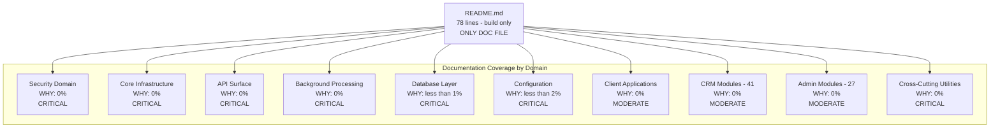

# Directive 5 — Documentation Coverage Audit

**SplendidCRM Community Edition v15.2 — Codebase Audit**

**Verification of WHY Documentation per COSO Principle 14 — Communicates Internally**

**Audit Scope:** Material components only, as classified in [Directive 2 — Materiality Classification](../directive-2-materiality/materiality-classification.md). Cross-cutting concern documentation verified against [Directive 4 — Cross-Cutting Dependency Report](../directive-4-dependency-audit/cross-cutting-dependency-report.md). All `system_id` references correspond to the authoritative registry in [Directive 0 — System Registry](../directive-0-system-registry/system-registry.md). Non-Material components are explicitly excluded from this assessment per the audit mandate.

---

#### Report Executive Summary

**Theme of Failure: "Systemic Collapse of Internal Communication Controls — Near-Total Absence of WHY Documentation Across All Material Components"**

COSO Principle 14 (Communicates Internally) requires that the entity "internally communicates information, including objectives and responsibilities for internal control, necessary to support the functioning of internal control." The SplendidCRM Community Edition v15.2 codebase exhibits a **near-total absence of WHY documentation** — the documentation that explains intent, rationale, and design decisions for each component. Across approximately 144 Material components examined (from [Directive 2](../directive-2-materiality/materiality-classification.md)), the WHY documentation coverage rate is effectively **0%**. This represents a systemic failure of the COSO Information & Communication component. Without WHY documentation, developers cannot safely modify Material components, auditors cannot assess control intent, and the organization cannot communicate internally about the purpose and constraints of its internal control mechanisms. The single documentation file in the entire repository — `README.md` (78 lines) — covers only build prerequisites and compilation steps; it provides zero architectural rationale, zero security justification, zero design decisions, and zero operational guidance. Per COSO Principle 13 (Uses Relevant Information), the absence of documentation means quality information about control design is not available to support internal control functioning. Source: `README.md`

The quantitative documentation deficit is pervasive across every audit domain. All 74 C# utility classes in `SplendidCRM/_code/` contain only AGPLv3 license headers (exactly 3 `///` XML doc comment lines per file) — zero XML doc comments explaining intent, zero architectural decision records, and zero design rationale documentation. The sole exception is `SqlProcs.cs`, which has 8,112 XML doc comment lines; however, these are auto-generated parameter name/type documentation for stored procedure wrappers — they document WHAT parameters exist, not WHY the procedures are designed as they are. The 3 API surfaces (REST at ~393KB, SOAP at ~194KB, Admin REST at ~318KB) have zero external API documentation — no Swagger/OpenAPI specification, no maintained WSDL documentation, and no endpoint catalog. The SQL database layer (581 views, 833 stored procedures, 78 functions, 11 trigger files) contains only license headers and sparse change-history comments in the format `-- MM/DD/YYYY Author. Description.` — these are WHAT/WHEN documentation, not WHY documentation; fewer than 5% of SQL view files have any change comments at all. The React SPA (React 18.2.0 / TypeScript 5.3.3) has zero JSDoc blocks across all examined `.tsx`/`.ts` files. No `CONTRIBUTING.md`, no `ARCHITECTURE.md`, no `CHANGELOG.md`, no Architecture Decision Records (ADRs), no Swagger/OpenAPI specification, no security documentation, no deployment guide, no monitoring runbooks, and no incident response procedures exist anywhere in the repository. Source: `SplendidCRM/_code/`, `SplendidCRM/Rest.svc.cs`, `SQL Scripts Community/`

Cross-cutting concerns lack ownership and blast radius documentation entirely. [Directive 4](../directive-4-dependency-audit/cross-cutting-dependency-report.md) identified 4 core shared utilities — `Sql.cs` (730+ file references), `Security.cs` (631+ file references), `SplendidError.cs` (620+ file references), and `SplendidCache.cs` (257+ file references) — each consumed by 15+ systems with High Blast Radius scores. None of these components have documented ownership, modification guidelines, blast radius warnings, or dependency contracts. Per COSO Principle 14, the absence of this documentation means that change impact cannot be assessed, violating both COSO Principle 9 (Identifies and Analyzes Significant Change) and NIST CM-3 (Configuration Change Control). The combination of zero WHY documentation and extreme shared-utility coupling creates a control environment where the intent behind every control activity (COSO Principle 10) is opaque, unverifiable, and unmaintainable.

---

#### Attention Required

| Component Path | Primary Finding | Risk Severity | Governing NIST/CIS Control | COSO Principle |
|---|---|---|---|---|
| `SplendidCRM/_code/Security.cs` | Zero WHY documentation — 1,388-line security core with MD5 hashing, 4-tier ACL, Rijndael encryption; no rationale for algorithm choices, no threat model | Critical | NIST IA, AC; CIS Control 5, 6 | Principle 14 |
| `SplendidCRM/_code/SplendidCache.cs` | Zero WHY documentation — 11,582-line cache monolith consumed by ALL systems; no cache strategy rationale, no invalidation policy docs, no ownership | Critical | NIST CM; CIS Control 4 | Principle 14 |
| `SplendidCRM/_code/Sql.cs` | Zero WHY documentation — 4,082-line database access layer; no transaction safety rationale, no provider abstraction design docs | Critical | NIST SI; CIS Control 16 | Principle 14 |
| `SplendidCRM/_code/SplendidError.cs` | Zero WHY documentation — centralized error handler with no documented error severity model, no escalation policy, no ownership | Critical | NIST AU; CIS Control 8 | Principle 14 |
| `SplendidCRM/Rest.svc.cs` | Zero API documentation — primary REST gateway (~393KB); no Swagger/OpenAPI spec, no endpoint documentation, no input validation rationale | Critical | NIST AC, SI; CIS Control 16 | Principle 14 |
| `SplendidCRM/soap.asmx.cs` | Zero API documentation — SOAP API (~194KB); no maintained WSDL docs, no protocol design rationale | Critical | NIST SC; CIS Control 16 | Principle 14 |
| `SplendidCRM/Administration/Rest.svc.cs` | Zero API documentation — Admin REST API (~318KB); no privilege model documentation, no IS_ADMIN enforcement rationale | Critical | NIST AC; CIS Control 6 | Principle 14 |
| `SplendidCRM/Web.config` | Minimal inline XML comments (26 total) — no rationale for security-weakening settings: `requestValidationMode="2.0"`, `customErrors="Off"`, `enableEventValidation="false"` | Critical | NIST CM-6; CIS Control 4 | Principle 14 |
| `README.md` | Build steps only — 78 lines covering prerequisites and build commands; zero architecture overview, zero security docs, zero deployment guide, zero operational guidance | Critical | NIST CM; CIS Control 4 | Principle 14 |
| `BackupBin2012/` | Zero ownership documentation — 24+ manually managed DLLs; no SBOM, no version tracking, no upgrade policy, no dependency ownership | Critical | NIST CM-3; CIS Control 2 | Principle 14, Principle 9 |
| `SplendidCRM/Global.asax.cs` | Zero WHY documentation — bootstrap sequence, timer initialization, TLS enforcement with no design rationale documented | Moderate | NIST CM; CIS Control 4 | Principle 14 |
| `SplendidCRM/_code/SchedulerUtils.cs` | Zero WHY documentation — timer reentrancy guards with no rationale for scheduling design, no job catalog documentation | Moderate | NIST SI; CIS Control 16 | Principle 14 |
| `SplendidCRM/_code/EmailUtils.cs` | Zero WHY documentation — 2,722-line email pipeline; no campaign processing rationale, no security boundary docs | Moderate | NIST SC; CIS Control 16 | Principle 14 |
| `SQL Scripts Community/Procedures/` | License-only headers — 833+ stored procedures with no intent/rationale docs; sparse change-history comments only | Moderate | NIST SI, AU; CIS Control 8 | Principle 14 |
| `SQL Scripts Community/Triggers/` | No WHY documentation — audit trigger generation with no documented audit scope rationale | Moderate | NIST AU; CIS Control 8 | Principle 14, Principle 16 |
| `SplendidCRM/_code/SplendidInit.cs` | Zero WHY documentation — 2,443-line bootstrap/initialization; no startup sequence design rationale | Moderate | NIST CM; CIS Control 4 | Principle 14 |
| `SplendidCRM/_code/ActiveDirectory.cs` | Zero WHY documentation — SSO/NTLM integration with stubbed ADFS/Azure AD methods; no integration design rationale | Moderate | NIST IA; CIS Control 5 | Principle 14 |
| `SplendidCRM/_code/SignalR/SplendidHubAuthorize.cs` | Zero WHY documentation — session-cookie authorization with no security design rationale, no threat model | Moderate | NIST AC, SC; CIS Control 6 | Principle 14 |
| `SplendidCRM/React/` | Zero component documentation — 0 JSDoc blocks in React SPA source; no client-side architecture docs | Moderate | NIST SI; CIS Control 16 | Principle 14 |

---

## Documentation Coverage Methodology

### Definition of WHY Documentation

This audit assesses documentation that explains the **intent and rationale** behind implementation decisions — WHY documentation — as distinct from WHAT documentation (code comments describing what code does) or WHEN documentation (change-history comments recording when code changed). Per COSO Principle 14 (Communicates Internally), the entity must internally communicate information necessary to support the functioning of internal control. WHY documentation is the mechanism through which design intent, architectural decisions, and control rationale are preserved and communicated.

The following documentation categories are assessed for WHY coverage:

- **Intent Documentation:** Explains WHY a component exists, what problem it solves, and what design trade-offs were made. Example: an ADR explaining why MD5 hashing was retained for SugarCRM backward compatibility despite known cryptographic weakness.
- **Rationale Documentation:** Explains WHY specific implementation choices were made (e.g., why InProc session state was chosen over StateServer, why manual DLL management was chosen over NuGet). This category captures the reasoning behind technical decisions that affect operational reliability.
- **Architecture Decision Records (ADRs):** Formal records of significant architecture decisions with context, decision, consequences, and alternatives considered. Per COSO Principle 14, ADRs represent a structured method of communicating design intent.
- **API Documentation:** External-facing documentation explaining API contracts, authentication requirements, error codes, and usage patterns. Per NIST SI (System and Information Integrity), API consumers must understand the contract to use the system correctly and securely.
- **Ownership Documentation:** Identifies who is responsible for maintaining a component, who to contact for changes, and what the blast radius of changes is. Per COSO Principle 14, responsibility communication is a core requirement.
- **Inline WHY Comments:** Code comments explaining WHY (not WHAT) — comments that provide design rationale beyond what the code itself communicates. Change-history comments in the format `// 08/22/2006 Paul. Added field...` are classified as WHAT/WHEN documentation, not WHY documentation.

### Classification of Non-WHY Documentation

The following are explicitly **not counted** as WHY documentation:

- **License headers** (AGPLv3 boilerplate in every file) — legal compliance, not design rationale
- **Auto-generated XML doc comments** (e.g., SqlProcs.cs 8,112 lines) — parameter name/type documentation, not design intent
- **Change-history comments** (e.g., `-- 11/22/2006 Paul. Add TEAM_ID for team management.`) — records WHAT changed and WHEN, not WHY
- **Region markers and code-level step descriptions** (e.g., `// Load the module configuration`) — describes WHAT the code does, not WHY it does it that way
- **Auto-generated Designer comments** (e.g., `/// Required designer variable`) — IDE boilerplate

### COSO Principle 14 Reference

> "The entity internally communicates information, including objectives and responsibilities for internal control, necessary to support the functioning of internal control."
> — COSO Internal Control — Integrated Framework (2013), Principle 14

This audit specifically assesses whether the INTENT and RATIONALE behind Material components are documented, enabling internal stakeholders to understand, verify, and maintain the internal controls implemented in the codebase.

---

## Repository-Level Documentation Inventory

A comprehensive search of the SplendidCRM repository reveals a **near-zero documentation infrastructure**. The command `find . -name "*.md" -not -path "./.git/*"` returns only `./README.md` — confirming that no documentation files exist beyond the single root-level README. No documentation framework (MkDocs, Docusaurus, Sphinx), no documentation generator, no API documentation tools (Swagger/OpenAPI), and no diagram tools (Mermaid CLI, PlantUML) are configured in the repository. Per COSO Principle 14, this represents a complete absence of structured internal communication infrastructure for the codebase.

| Documentation Asset | Location | Type | Content | Coverage Scope | WHY Coverage |
|---|---|---|---|---|---|
| README.md | `/README.md` | Developer Guide | Build prerequisites, DLL list (24 items), React build steps (`yarn install`, `yarn build`), SQL build steps (`Build.bat`) | Build process only | **None** — no architectural rationale, no design decisions |
| XML IntelliSense Docs | `BackupBin2012/*.xml` | Auto-generated API Reference | 25 .NET assembly XML documentation files | Third-party library APIs only | **None** — auto-generated for third-party libs, not SplendidCRM code |
| SQL Script Headers | `SQL Scripts Community/**/*.sql` | License Headers | AGPLv3 license text on every file | Legal compliance only | **None** — license-only; no functional documentation |
| SQL Change Comments | `SQL Scripts Community/Views/*.sql` | Inline Comments | Sparse date/author change-history (e.g., `-- 11/22/2006 Paul. Add TEAM_ID for team management.`) | Individual view modifications | **Minimal** — WHAT/WHEN only (not WHY); <5% of views have any change comments |
| Web.config Comments | `SplendidCRM/Web.config` | Inline XML Comments | 26 inline XML comments (`<!-- -->`) | IIS/ASP.NET configuration | **Minimal** — describe settings, not rationale for settings |
| Versions.xml | `SplendidCRM/Administration/Versions.xml` | Metadata | Version history entries | Release tracking | **None** — structured data, not WHY documentation |
| CONTRIBUTING.md | Not found | — | — | — | **Missing** |
| ARCHITECTURE.md | Not found | — | — | — | **Missing** |
| CHANGELOG.md | Not found | — | — | — | **Missing** |
| ADR (Architecture Decision Records) | Not found | — | — | — | **Missing** |
| Swagger/OpenAPI Spec | Not found | — | — | — | **Missing** |
| Security Documentation | Not found | — | — | — | **Missing** |
| Deployment Guide | Not found | — | — | — | **Missing** |
| API Documentation | Not found | — | — | — | **Missing** |
| Monitoring/Alerting Runbook | Not found | — | — | — | **Missing** |
| Incident Response Procedures | Not found | — | — | — | **Missing** |

**Summary:** The repository contains **one** documentation file (`README.md`, 78 lines) and zero WHY documentation artifacts. No architecture documentation, no security documentation, no API documentation, no contribution guidelines, no changelogs, and no ADRs exist anywhere in the repository. Per COSO Principle 14, the internal communication infrastructure for the codebase is absent.

---

## Security Domain — WHY Documentation Coverage

The security domain encompasses the most governance-critical components in the SplendidCRM codebase. Per COSO Principle 14, security components require the highest standard of WHY documentation because their design rationale directly governs the effectiveness of access control (NIST AC), identification and authentication (NIST IA), and system and communications protection (NIST SC) controls. All components in this section are classified as Material in [Directive 2](../directive-2-materiality/materiality-classification.md).

| Component | system_id | LOC | XML Doc Comments | Inline WHY Comments | External Docs | API Docs | Ownership Docs | Overall WHY Coverage |
|---|---|---|---|---|---|---|---|---|
| `SplendidCRM/_code/Security.cs` | `SYS-SECURITY` | 1,388 | 3 (license only) | 0 | None | None | None | **0%** |
| `SplendidCRM/_code/ActiveDirectory.cs` | `SYS-AUTH-AD` | ~500 | 0 | 0 | None | None | None | **0%** |
| `SplendidCRM/_code/SignalR/SplendidHubAuthorize.cs` | `SYS-REALTIME` | ~100 | 0 | 0 | None | None | None | **0%** |
| `SplendidCRM/Administration/DuoUniversal/` | `SYS-AUTH-DUO` | ~300 | 0 | 0 | None | None | None | **0%** |

### Specific WHY Documentation Gaps — Security Domain

**Security.cs** (`SYS-SECURITY`): No documentation explaining WHY MD5 was chosen for password hashing. SugarCRM backward compatibility is the likely reason based on code context, but this critical cryptographic decision is entirely undocumented — no ADR, no inline rationale comment, no security assessment. No documentation of the 4-tier authorization model design (module ACL → team filtering → field-level → record-level) explaining WHY this specific layering was chosen. No documentation of the Rijndael encryption key management approach explaining WHY GUID-derived keys are used instead of cryptographically random key material. No threat model documenting the security boundaries and acceptable risk. The 157 inline `//` comments in this file are exclusively WHAT/WHEN comments (code-level descriptions and change dates). Source: `SplendidCRM/_code/Security.cs`

**ActiveDirectory.cs** (`SYS-AUTH-AD`): No documentation explaining WHY certain SSO methods are stubbed in Community Edition versus Enterprise. No documentation of ADFS/Azure AD integration design decisions. No documentation of the Windows/NTLM authentication flow design rationale. Source: `SplendidCRM/_code/ActiveDirectory.cs`

**SplendidHubAuthorize.cs** (`SYS-REALTIME`): No documentation explaining WHY session-cookie coupling was chosen for SignalR authorization instead of token-based authentication. No documentation of bypass risk assessment for the `static Dictionary` session-to-cookie mapping. No security design rationale for the real-time communication boundary. Source: `SplendidCRM/_code/SignalR/SplendidHubAuthorize.cs`

**DuoUniversal/** (`SYS-AUTH-DUO`): No documentation of 2FA flow design decisions. No documentation of fallback behavior when the Duo service is unavailable. No integration architecture documentation explaining how the 2FA challenge/callback flow interacts with the primary authentication mechanism. Source: `SplendidCRM/Administration/DuoUniversal/`

---

## Core Infrastructure — WHY Documentation Coverage

Core infrastructure components are shared utilities consumed by virtually all other systems in the codebase. Per COSO Principle 14, these components require WHY documentation proportional to their blast radius — the higher the blast radius, the more critical the need for documented design rationale to enable safe modification. Per [Directive 4](../directive-4-dependency-audit/cross-cutting-dependency-report.md), the 4 highest-blast-radius components (Sql.cs, Security.cs, SplendidError.cs, SplendidCache.cs) have zero ownership or blast radius documentation.

| Component | system_id | LOC | XML Doc Comments | Inline WHY Comments | External Docs | Ownership Docs | Overall WHY Coverage |
|---|---|---|---|---|---|---|---|
| `SplendidCRM/_code/SplendidCache.cs` | `SYS-CACHE` | 11,582 | 3 (license only) | ~939 // comments (WHAT, not WHY) | None | None | **<1%** |
| `SplendidCRM/_code/SplendidInit.cs` | `SYS-INIT` | 2,443 | 3 (license only) | ~439 // comments (WHAT) | None | None | **<1%** |
| `SplendidCRM/_code/Sql.cs` | `SYS-DB-ACCESS` | 4,082 | 3 (license only) | ~515 // comments (WHAT) | None | None | **<1%** |
| `SplendidCRM/_code/SqlBuild.cs` | `SYS-DB-ACCESS` | ~800 | 0 | Minimal | None | None | **0%** |
| `SplendidCRM/_code/SplendidError.cs` | `SYS-ERROR-OBSERVABILITY` | 282 | 3 (license only) | ~26 // comments (WHAT) | None | None | **0%** |
| `SplendidCRM/_code/RestUtil.cs` | `SYS-API-REST` | 4,503 | 0 | ~489 // comments (WHAT) | None | None | **<1%** |
| `SplendidCRM/_code/SplendidDynamic.cs` | `SYS-BUSINESS-LOGIC` | 7,458 | 0 | Moderate // comments (WHAT) | None | None | **<1%** |
| `SplendidCRM/_code/SearchBuilder.cs` | `SYS-BUSINESS-LOGIC` | 441 | 3 (license only) | Minimal | None | None | **0%** |
| `SplendidCRM/_code/SqlProcs.cs` | `SYS-DB-ACCESS` | ~75,511 | ~8,112 (auto-generated parameter docs) | Minimal | None | None | **<1%** (auto-gen only) |

### Important Distinction: SqlProcs.cs Auto-Generated Documentation

`SqlProcs.cs` has 8,112 XML doc comment lines (`///`), which superficially appears to be significant documentation coverage. However, these are **auto-generated parameter name/type documentation** for stored procedure wrappers — they document WHAT parameters exist (name, type, direction) but provide zero insight into WHY the procedures are designed the way they are, what business rules they enforce, or what the expected caller contract is. This auto-generated documentation is explicitly classified as WHAT documentation, not WHY documentation, for the purposes of this audit. Source: `SplendidCRM/_code/SqlProcs.cs`

### Inline Comment Analysis — WHAT vs. WHY

The `//` comments in core infrastructure files are primarily code-level WHAT/WHEN comments. Sampling reveals consistent patterns:

- **Change-history pattern:** `// 08/22/2006 Paul. Added field...` — records WHAT changed and WHEN, not WHY
- **Region markers:** `// region Authentication` — organizational markers, not design rationale
- **Step descriptions:** `// Load the module configuration` — describes WHAT the code does
- **Conditional notes:** `// 03/14/2014 Paul. Use sCRM_PATH as virtual prefix.` — WHAT was changed with date

The 939 `//` comments in `SplendidCache.cs` and the 515 in `Sql.cs` overwhelmingly follow these patterns. Zero WHY rationale comments were identified in sampling (e.g., no comments explaining "We chose InProc caching because..." or "Transaction isolation is set to ReadCommitted because...").

---

## API Surface — WHY Documentation Coverage

The API surface represents the external-facing boundary through which all client applications interact with the CRM backend. Per NIST SI (System and Information Integrity), API consumers must understand the interface contract to use the system securely and correctly. Per COSO Principle 14, the absence of API documentation means the organization has not communicated the information necessary for clients to interact with internal controls correctly.

| Component | system_id | Size | Swagger/OpenAPI | WSDL Docs | Inline WHY | Error Code Docs | Auth Flow Docs | Overall WHY Coverage |
|---|---|---|---|---|---|---|---|---|
| `SplendidCRM/Rest.svc.cs` | `SYS-API-REST` | ~393KB | None | N/A | 0 | None | None | **0%** |
| `SplendidCRM/soap.asmx.cs` | `SYS-API-SOAP` | ~194KB | N/A | Runtime-generated only | 0 | None | None | **0%** |
| `SplendidCRM/Administration/Rest.svc.cs` | `SYS-API-ADMIN` | ~318KB | None | N/A | 0 | None | None | **0%** |
| `SplendidCRM/Administration/Impersonation.svc.cs` | `SYS-API-ADMIN` | ~10KB | None | N/A | 0 | None | None | **0%** |

### Specific API Documentation Gaps

**Rest.svc.cs** (`SYS-API-REST`): No external API documentation exists for the primary REST gateway consumed by the React SPA, HTML5 client, and Angular client. No Swagger/OpenAPI specification. No endpoint catalog documenting available routes, HTTP methods, request/response schemas, or authentication requirements. No input validation rules documented — consumers must reverse-engineer the API contract from source code. No error response format documentation. No authentication flow documentation explaining how session-based auth interacts with the WCF REST pipeline. Source: `SplendidCRM/Rest.svc.cs`

**soap.asmx.cs** (`SYS-API-SOAP`): WSDL is runtime-generated by the ASP.NET framework but is not maintained as a documentation artifact. No SugarCRM compatibility documentation explaining which SOAP methods from the `sugarsoap` namespace are fully functional and which are stubs. No session authentication flow documentation. Source: `SplendidCRM/soap.asmx.cs`

**Administration/Rest.svc.cs** (`SYS-API-ADMIN`): No documentation of the IS_ADMIN enforcement pattern across the 92 public methods documented in the [API Surface Quality report](../directive-3-code-quality/api-surface-quality.md). No documentation of which admin endpoints exist or their privilege requirements. No documentation of the impersonation endpoint risk model. Source: `SplendidCRM/Administration/Rest.svc.cs`

---

## Background Processing — WHY Documentation Coverage

Background processing components implement timer-based job dispatch, email processing, and application lifecycle management. Per COSO Principle 14, these components require WHY documentation because their design decisions (timer intervals, reentrancy strategies, error recovery behavior) directly affect system reliability and cannot be inferred from the code alone.

| Component | system_id | LOC | WHY Comments | Job Catalog Docs | Timer Design Docs | Error Recovery Docs | Overall WHY Coverage |
|---|---|---|---|---|---|---|---|
| `SplendidCRM/_code/SchedulerUtils.cs` | `SYS-SCHEDULER` | 1,013 | 0 | None | None | None | **0%** |
| `SplendidCRM/_code/EmailUtils.cs` | `SYS-EMAIL` | 2,722 | 0 | None | None | None | **0%** |
| `SplendidCRM/Global.asax.cs` | `SYS-INIT` | ~400 | 0 | None | None | None | **0%** |

### Specific Background Processing Documentation Gaps

**SchedulerUtils.cs** (`SYS-SCHEDULER`): No documentation of available scheduled jobs, their purpose, or their execution frequency. No documentation of the reentrancy guard design rationale (why `static bool bInsideTimer` was chosen over `Monitor.TryEnter` or `Mutex`). No documentation of the cron parsing implementation choices. No job catalog enumerating all background tasks. The 81 `//` comments are exclusively WHAT/WHEN change-history annotations. Source: `SplendidCRM/_code/SchedulerUtils.cs`

**EmailUtils.cs** (`SYS-EMAIL`): No documentation of the campaign email processing pipeline design. No documentation of the inbound vs. outbound email handling rationale. No documentation of the SMTP delivery retry strategy or failure escalation behavior. No documentation explaining WHY email processing runs on a 1-minute timer interval. The 321 `//` comments are exclusively WHAT/WHEN annotations. Source: `SplendidCRM/_code/EmailUtils.cs`

**Global.asax.cs** (`SYS-INIT`): No documentation of the 3-timer architecture design (scheduler timer at 5 minutes, email timer at 1 minute, archive timer at 5 minutes). No documentation of the TLS 1.2 enforcement rationale. No documentation of the SameSite cookie hardening decisions. The only 2 `///` comments in this file are auto-generated Designer comments (`Required designer variable`, `Required method for Designer support`) — not functional documentation. Source: `SplendidCRM/Global.asax.cs`

---

## Database Layer — WHY Documentation Coverage

The SQL database layer represents the data integrity foundation of the CRM. Per COSO Principle 14 and NIST AU (Audit and Accountability), the design rationale for stored procedures, views, triggers, and schema decisions must be communicated to support the functioning of data integrity controls.

| Component | system_id | File Count | License Headers | Change History Comments | Functional WHY Docs | Schema Design Docs | Overall WHY Coverage |
|---|---|---|---|---|---|---|---|
| `SQL Scripts Community/Procedures/` | `SYS-SQL-DB` | 833 | Yes (all files) | Sparse — <5% of files | None | None | **<1%** |
| `SQL Scripts Community/Views/` | `SYS-SQL-DB` | 581 | Yes (all files) | Some change-history | None | None | **~2%** |
| `SQL Scripts Community/Triggers/` | `SYS-AUDIT` | 11 | Yes | None | None | None | **0%** |
| `SQL Scripts Community/BaseTables/` | `SYS-SQL-DB` | 229 | Yes | Minimal | None | None | **<1%** |
| `SQL Scripts Community/Functions/` | `SYS-SQL-DB` | 78 | Yes | Minimal | None | None | **<1%** |
| `SQL Scripts Community/Data/` | `SYS-SQL-DB` | 135 | Yes | Minimal | None | None | **<1%** |

### Specific Database Documentation Gaps

**Views** (`SYS-SQL-DB`): The SQL Views directory has the highest documentation density in the entire codebase, but it consists solely of change-history comments in the format `-- MM/DD/YYYY Author. Description of change.` These are WHAT/WHEN documentation, not WHY documentation. Example: `-- 11/22/2006 Paul. Add TEAM_ID for team management.` — this tells us WHAT changed (TEAM_ID column added) and WHEN (November 2006), but not WHY team management was added to this view or how it fits the 4-tier authorization model. Fewer than 5% of the 581 view files have any change comments beyond the license header.

**Triggers** (`SYS-AUDIT`): `BuildAllAuditTables.1.sql` generates audit triggers for all CRM entities through dynamic SQL, but contains no documentation explaining the audit scope (which entities are audited and why), retention policy (how long audit data is retained), compliance rationale (which regulatory or governance requirement drives the audit trail), or the consequences of trigger failure. This is particularly concerning given COSO Principle 16 (Conducts Ongoing and/or Separate Evaluations) requirements — the monitoring mechanism itself is undocumented.

**Procedures** (`SYS-SQL-DB`): No stored procedure in the 833-file collection has documentation explaining its business purpose, expected callers, data integrity constraints, transaction behavior, or error handling contract. The universal `Grant Execute to public` permission documented in the [Database Quality report](../directive-3-code-quality/database-quality.md) has no accompanying rationale explaining WHY this permissive grant was chosen over role-based permissions.

---

## Configuration — WHY Documentation Coverage

Configuration components define the operational behavior and security posture of the application. Per COSO Principle 14 and NIST CM-6 (Configuration Settings), security-relevant configuration settings require documented rationale to enable change-impact assessment per COSO Principle 9.

| Component | system_id | Comment Count | WHY Rationale | Security Justification | Deployment Docs | Overall WHY Coverage |
|---|---|---|---|---|---|---|
| `SplendidCRM/Web.config` | `SYS-IIS-CFG`, `SYS-CONFIG` | 26 XML comments | None | None | None | **<2%** |
| `SplendidCRM/SplendidCRM7_VS2017.csproj` | `SYS-BUILD-PIPELINE` | 0 | None | None | None | **0%** |

### Critical Configuration Documentation Gaps

The following security-critical configuration settings in `Web.config` have **zero documentation** explaining WHY they were configured as observed:

- `requestValidationMode="2.0"` — DELIBERATELY WEAKENED ASP.NET request validation that disables .NET 4.5+ built-in XSS protection across all endpoints. Zero documentation explaining WHY this was necessary or what compensating controls exist. Source: `SplendidCRM/Web.config`
- `customErrors="Off"` — Error pages expose internal stack traces and detailed exception information to end users. No documentation of WHY this is set to Off in what appears to be a production configuration template.
- `enableEventValidation="false"` — ViewState event validation disabled globally. No documentation of WHY this ASP.NET security feature was turned off.
- `validateRequest="false"` on specific pages — Request validation disabled per-page. No documentation of WHY specific pages require unvalidated input.
- `sessionState mode="InProc"` — In-process session state with no documentation of WHY InProc was chosen over StateServer or SQLServer, or what the availability and scalability implications are (single-server constraint, no web-farm support, session loss on IIS recycle).

---

## Client Applications — WHY Documentation Coverage

Client application components represent the user-facing interface layer. Per COSO Principle 14 and NIST SI (System and Information Integrity), client-side architecture decisions affecting security posture and data handling must be documented to support internal control functioning.

| Component | system_id | JSDoc/TSDoc Blocks | Architecture Docs | Component Docs | Overall WHY Coverage |
|---|---|---|---|---|---|
| `SplendidCRM/React/` | `SYS-REACT-SPA` | 0 JSDoc blocks found | None | None | **0%** |
| `SplendidCRM/html5/` | `SYS-HTML5-CLIENT` | 0 | None | None | **0%** |
| `SplendidCRM/React/package.json` | `SYS-REACT-SPA` | N/A | None | None | **0%** |

### Specific Client Application Documentation Gaps

**React SPA** (`SYS-REACT-SPA`): Examination of `React/src/App.tsx` and representative component files reveals zero JSDoc blocks. No component documentation, no routing documentation, no state management documentation (MobX store design rationale), no client-side security architecture documentation, and no documentation of the React-to-REST API contract. The only metadata is in `package.json`, which provides dependency versions but no architectural rationale. Source: `SplendidCRM/React/src/App.tsx`

**HTML5 Client** (`SYS-HTML5-CLIENT`): The legacy jQuery/RequireJS client has zero documentation. No documentation explains WHY jQuery 1.4.2 (a severely outdated version with known security vulnerabilities) remains in use alongside newer jQuery versions (2.2.4). No documentation of the RequireJS module loading architecture or the client-side security posture of this legacy interface.

---

## Cross-Cutting Concern Documentation Coverage

Per COSO Principle 14 and the [Directive 4 — Cross-Cutting Dependency Audit](../directive-4-dependency-audit/cross-cutting-dependency-report.md), shared utilities consumed by 3+ systems must have documented blast radius and ownership. This section verifies the documentation status of all cross-cutting shared utilities identified in Directive 4. The absence of ownership and blast radius documentation for these high-impact components means that developers cannot assess the impact of changes before implementation, directly violating NIST CM-3 (Configuration Change Control) and COSO Principle 9 (Identifies and Analyzes Significant Change).

| Shared Utility | system_id | Blast Radius Score (from D4) | Ownership Documented? | Blast Radius Documented? | Modification Guidelines? | Dependency Contract Documented? | WHY Coverage |
|---|---|---|---|---|---|---|---|
| `Sql.cs` | `SYS-DB-ACCESS` | High (730+ refs) | **No** | **No** | **No** | **No** | **0%** |
| `Security.cs` | `SYS-SECURITY` | High (631+ refs) | **No** | **No** | **No** | **No** | **0%** |
| `SplendidError.cs` | `SYS-ERROR-OBSERVABILITY` | High (620+ refs) | **No** | **No** | **No** | **No** | **0%** |
| `SplendidCache.cs` | `SYS-CACHE` | High (257+ refs) | **No** | **No** | **No** | **No** | **0%** |
| `SqlProcs.cs` | `SYS-DB-ACCESS` | High (universal) | **No** | **No** | **No** | **No** | **0%** |
| `SplendidInit.cs` | `SYS-INIT` | Medium | **No** | **No** | **No** | **No** | **0%** |
| `L10n.cs` | `SYS-L10N` | Medium | **No** | **No** | **No** | **No** | **0%** |
| `RestUtil.cs` | `SYS-API-REST` | Medium | **No** | **No** | **No** | **No** | **0%** |
| `SplendidDynamic.cs` | `SYS-BUSINESS-LOGIC` | Medium | **No** | **No** | **No** | **No** | **0%** |
| `SearchBuilder.cs` | `SYS-BUSINESS-LOGIC` | Medium | **No** | **No** | **No** | **No** | **0%** |

**Summary:** Zero out of 10 cross-cutting shared utilities have ANY form of ownership or blast radius documentation. This is a Critical finding under COSO Principle 14. Without ownership documentation, no individual or team can be identified as responsible for these components — violating COSO Principle 3 (Establishes Structure, Authority, and Responsibility). Without blast radius documentation, developers modifying these utilities cannot assess the impact of their changes across the 15+ consuming systems. This directly violates NIST CM-3 (Configuration Change Control), which requires that the impact of proposed changes be determined before implementation.

---

## CRM Business Logic Modules — WHY Documentation Coverage

All 41 CRM module folders classified as Material in [Directive 2](../directive-2-materiality/materiality-classification.md) (Accounts, Contacts, Leads, Opportunities, Cases, Bugs, Campaigns, Emails, Calendar, Meetings, Calls, Tasks, Documents, Notes, Reports, Dashboard, Orders, Quotes, Invoices, Payments, Products, ProductTemplates, ProspectLists, Prospects, EmailMarketing, EmailTemplates, SmsMessages, ChatChannels, ChatMessages, Projects, ProjectTask, Contracts, iFrames, Feeds, Threads, KBDocuments, Releases, Teams, Users, Roles, and additional modules) follow an identical metadata-driven pattern with DetailView, EditView, ListView, and SubPanel WebForms pages.

None of the 41 modules have WHY documentation explaining:

- Module purpose and business context within the CRM lifecycle
- Module-specific business rules and data validation logic
- Module relationship to other modules (e.g., how Accounts relate to Contacts, Opportunities, and Cases)
- Module-specific security considerations (e.g., which fields contain sensitive data)
- Module customization guidelines (e.g., safe customization points vs. fragile internals)

The metadata-driven architecture (`SplendidDynamic.cs` rendering from database-stored layouts in `EDITVIEWS_FIELDS`, `DETAILVIEWS_FIELDS`, `GRIDVIEWS_COLUMNS`) means the "documentation" of module behavior is implicit in the database configuration data rather than explicit in code or documentation files. This is a form of documentation-by-convention that is fragile and opaque — per COSO Principle 14, implicit documentation does not satisfy the requirement to communicate information necessary for internal control.

**Overall WHY coverage for CRM modules: 0%**

---

## Administration Modules — WHY Documentation Coverage

All 27 Material administration sub-modules identified in [Directive 2](../directive-2-materiality/materiality-classification.md) (ACLRoles, AuditEvents, Backups, Config, Configurator, DuoUniversal, DynamicButtons, DynamicLayout, EditCustomFields, EmailMan, Export, FieldValidators, FullTextSearch, Import, InboundEmail, Languages, ModuleBuilder, Modules, ModulesArchiveRules, PasswordManager, Schedulers, SystemLog, Undelete, UserLogins, BusinessRules, and administration-level Rest.svc.cs and Impersonation.svc.cs) have zero WHY documentation.

No documentation explains:

- How ACL roles interact with the 4-tier authorization model in `Security.cs`
- Audit event retention policies and compliance rationale
- Backup strategy and recovery procedures (RPO/RTO targets)
- Configuration parameter effects and safe value ranges
- Dynamic layout metadata schema and customization boundaries
- Email campaign processing workflow and failure handling
- Password policy enforcement logic and compliance alignment
- Scheduler job catalog, execution frequency, and reentrancy behavior

**Overall WHY coverage for Material admin modules: 0%**

---

## Aggregate Documentation Coverage Metrics

The following table summarizes WHY documentation coverage across all audit domains. Per COSO Principle 14, every Material component was assessed for the presence of intent/rationale documentation that supports the functioning of internal control.

| Domain | Material Components | With WHY Docs | Without WHY Docs | WHY Coverage % | Risk Level |
|---|---|---|---|---|---|
| Security Domain | 4 | 0 | 4 | **0%** | Critical |
| Core Infrastructure | 9+ | 0 | 9+ | **0%** | Critical |
| API Surface | 4 | 0 | 4 | **0%** | Critical |
| Background Processing | 3 | 0 | 3 | **0%** | Critical |
| Database Layer | 6 directories (1,867 files) | 0 | 6 | **<1%** (change-history only) | Critical |
| Configuration | 2 | 0 | 2 | **<2%** (inline only) | Critical |
| Client Applications | 2 | 0 | 2 | **0%** | Moderate |
| CRM Modules | 41 | 0 | 41 | **0%** | Moderate |
| Administration Modules | 27 | 0 | 27 | **0%** | Moderate |
| Cross-Cutting Utilities | 10 | 0 | 10 | **0%** | Critical |
| **TOTAL** | **~144** | **0** | **~144** | **~0%** | **Critical** |

**Summary:** The SplendidCRM codebase has effectively **0% WHY documentation coverage** across all approximately 144 Material components. The only documentation artifact is `README.md` (78 lines, build-only), which provides no architectural rationale, no design decisions, no security justification, and no operational guidance. This represents a complete failure of COSO Principle 14 (Communicates Internally) — the organization has not internally communicated the information necessary to support the functioning of internal controls over the codebase. Per COSO Principle 13 (Uses Relevant Information), the absence of quality information about control design means internal control cannot function effectively. The combination of 0% WHY documentation with extreme shared-utility coupling (per [Directive 4](../directive-4-dependency-audit/cross-cutting-dependency-report.md)) creates a control environment where any modification to a Material component carries unassessable risk.

---

## Documentation Type Gap Analysis

The following table assesses required documentation types against their presence in the repository. Per COSO Principle 14 and applicable NIST/CIS controls, each documentation type serves a specific governance function.

| Documentation Type | COSO/NIST Requirement | Present? | Coverage | Finding |
|---|---|---|---|---|
| Architecture Decision Records | COSO Principle 14 | **No** | 0% | No ADRs exist; no design decisions are recorded anywhere in the repository |
| Security Architecture Docs | NIST SC, AC | **No** | 0% | No security architecture documentation, no threat model, no authentication flow diagrams |
| API Documentation (Swagger/OpenAPI) | NIST SI, CIS Control 16 | **No** | 0% | 3 API surfaces with zero external documentation; consumers must reverse-engineer contracts |
| Deployment/Operations Guide | NIST CM, CIS Control 4 | **No** | 0% | No deployment guide, no operational runbook, no disaster recovery documentation |
| Contributing Guidelines | COSO Principle 14 | **No** | 0% | No `CONTRIBUTING.md`; developers have no guidance for safe code changes |
| Testing Strategy Docs | COSO Principle 16, NIST SI | **No** | 0% | No testing documentation (no tests exist to document — itself a Critical finding per [Directive 3](../directive-3-code-quality/code-quality-summary.md)) |
| Dependency Management Docs | NIST CM-3, CIS Control 2 | **No** | 0% | No SBOM, no dependency upgrade policy, no version tracking documentation |
| Monitoring/Alerting Runbook | NIST AU, CIS Control 8 | **No** | 0% | No observability documentation; internal-only DB-based monitoring is undocumented |
| Incident Response Procedures | NIST IR | **No** | 0% | No incident response documentation exists |
| Change Management Docs | NIST CM-3, COSO Principle 9 | **No** | 0% | No change management process documented; no review policies, no approval workflows |
| Data Flow Diagrams | NIST SC | **No** | 0% | No data flow documentation; data paths must be inferred from source code |
| Inline XML/JSDoc Comments | COSO Principle 14 | **Negligible** | <1% | License headers only; 8,112 auto-gen lines in SqlProcs.cs are WHAT documentation, not WHY |

**Summary:** Zero out of 12 required documentation types are present in the repository. The only documentation artifact (`README.md`) is classified as a partial Developer Guide covering build steps only. Per COSO Principle 14, the organization lacks every category of documentation necessary to communicate information supporting internal control.

---

## COSO Principle 14 — Compliance Assessment

The following table assesses each sub-requirement of COSO Principle 14 (Communicates Internally) against the observed state of the SplendidCRM codebase. Per the COSO Internal Control — Integrated Framework (2013), Principle 14 requires all of the following attributes to be present and functioning for effective internal control.

| COSO Principle 14 Sub-Requirement | Implementation Status | Evidence | Finding |
|---|---|---|---|
| Communicates information needed to support internal control | **Not Implemented** | Zero WHY documentation across all ~144 Material components; 0% coverage | Critical — developers cannot understand control intent; auditors cannot assess control design |
| Communicates with the board of directors | **Not Implemented** | No executive-level documentation, no risk reports, no audit history, no governance artifacts | Critical — no governance communication mechanism exists in the codebase |
| Provides separate communication lines | **Not Implemented** | No escalation procedures, no incident reporting documentation, no whistleblower channels | Critical — no communication alternatives exist for reporting control deficiencies |
| Selects relevant method of communication | **Partially Implemented** | Code comments exist (~WHAT level) across some files; `README.md` provides build steps | Moderate — some tacit communication through code, but no structured WHY documentation |
| Communicates objectives and responsibilities | **Not Implemented** | No component ownership documentation, no responsibility assignments, no RACI matrix, no `CODEOWNERS` | Critical — ownership is unknown for all components including High Blast Radius utilities |

**Overall COSO Principle 14 Assessment: NOT COMPLIANT**

The SplendidCRM codebase demonstrates a systematic failure to communicate information necessary for internal control. The near-total absence of WHY documentation means that the intent behind control activities (COSO Principle 10) cannot be understood, verified, or maintained. COSO Principle 13 (Uses Relevant Information) is likewise compromised — without documentation, quality information about control design is simply not available. The absence of ownership documentation means COSO Principle 3 (Establishes Structure, Authority, and Responsibility) cannot be satisfied at the component level. This compliance failure propagates upstream to the COSO Monitoring Activities component — per COSO Principle 16, evaluations of control effectiveness require understanding of control design intent, which is unavailable without WHY documentation.

---

## Documentation Coverage Visualization

The following diagram visualizes the WHY documentation coverage across all audit domains, illustrating the pervasive 0% coverage finding. Per COSO Principle 14, every domain shown below represents a failure to communicate information necessary for internal control.

---

## Cross-References

This report consumes outputs from and connects to the following audit directive reports:

- **System Registry:** [Directive 0 — System Registry](../directive-0-system-registry/system-registry.md) — authoritative `system_id` reference for all findings
- **COSO Mapping:** [Directive 0 — COSO Mapping](../directive-0-system-registry/coso-mapping.md) — COSO Principle 14 mapping context
- **Materiality Classification:** [Directive 2 — Materiality Classification](../directive-2-materiality/materiality-classification.md) — defines the ~144 Material components assessed in this report
- **Code Quality Summary:** [Directive 3 — Code Quality Summary](../directive-3-code-quality/code-quality-summary.md) — code quality findings for Material components
- **Cross-Cutting Dependencies:** [Directive 4 — Cross-Cutting Dependency Report](../directive-4-dependency-audit/cross-cutting-dependency-report.md) — blast radius scores and shared utility inventory verified in this report
- **Accuracy Validation (next):** [Directive 6 — Accuracy Validation Report](../directive-6-accuracy-validation/accuracy-validation-report.md) — will sample and validate findings from this report
- **Operational Artifacts:** [Directive 7 — Global Executive Summary](../directive-7-operational-artifacts/artifact-0-global-executive-summary.md) — synthesizes documentation coverage findings

---

*Report generated as part of the SplendidCRM Community Edition v15.2 Codebase Audit. This report assesses documentation coverage only — per the assess-only mandate, no code or documentation within the SplendidCRM repository has been created, modified, or remediated. All findings are observations of the existing codebase state.*
