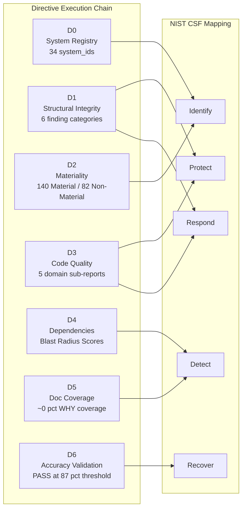
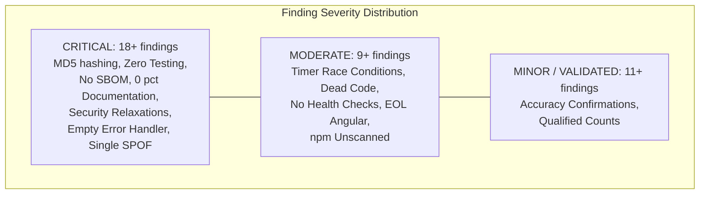
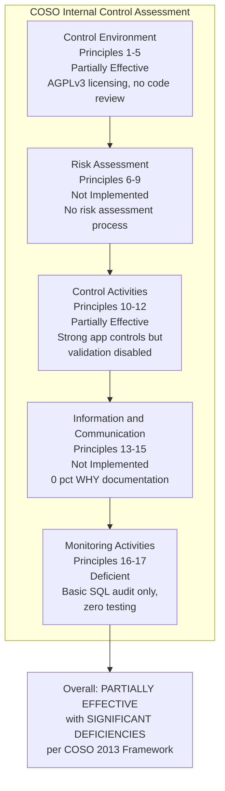
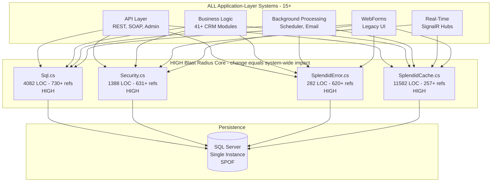
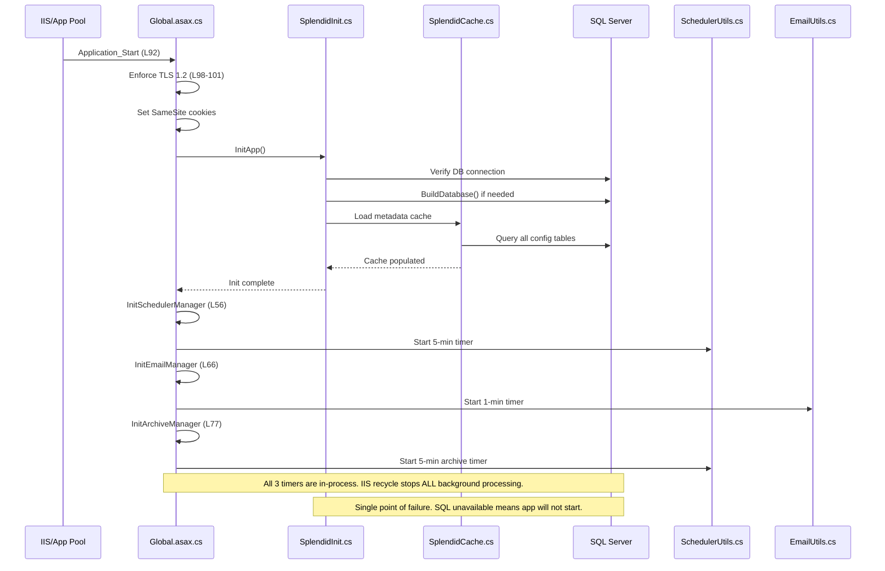
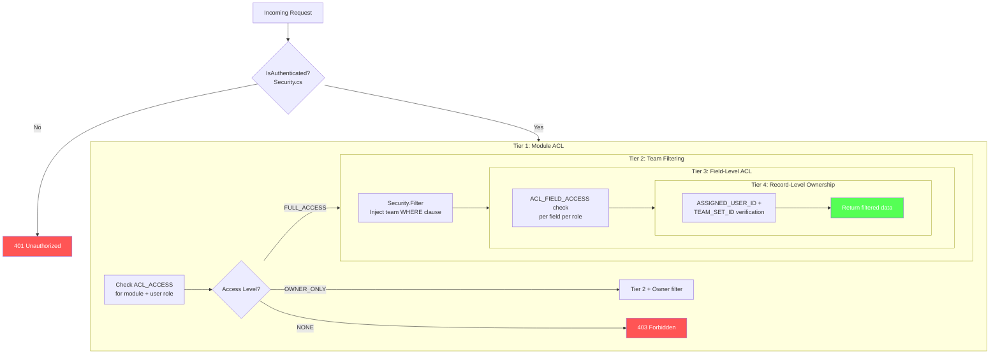
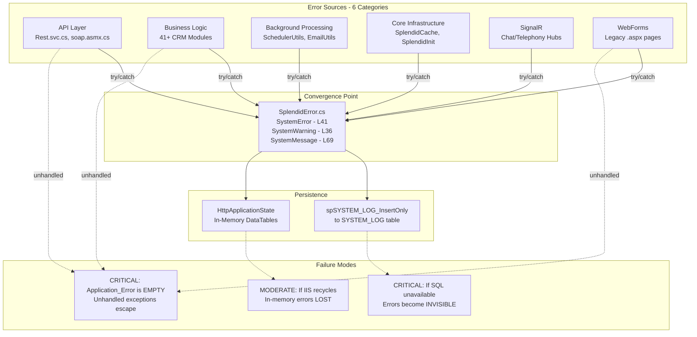

# Directive 7, Artifact 1 — Operational Flowchart

## NIST Cybersecurity Framework Swimlane Visualization — SplendidCRM v15.2 Audit Flow

---

**Audit Subject:** SplendidCRM Community Edition v15.2 (AGPLv3)
**Artifact Type:** Operational Flowchart — Mermaid-based NIST CSF Swimlane Visualization
**Frameworks:** COSO Internal Control — Integrated Framework (2013), NIST SP 800-53 Rev 5, NIST CSF, CIS Controls v8 IG2/IG3
**Directives Synthesized:** D0 (System Registry), D1 (Structural Integrity), D2 (Materiality), D3 (Code Quality), D4 (Dependencies), D5 (Documentation Coverage), D6 (Accuracy Validation)
**Related Artifacts:** [Global Executive Summary](./artifact-0-global-executive-summary.md) | [Developer Contribution Guide](./artifact-2-developer-contribution-guide.md)

---

## Introduction

This operational flowchart visualizes the complete SplendidCRM v15.2 codebase audit flow organized by the NIST Cybersecurity Framework (CSF) functions: **Identify → Protect → Detect → Respond → Recover**. Each CSF function contains sub-lanes mapping to the six audit dimensions: Structural Integrity (D1), Materiality (D2), Code Quality (D3), Dependencies (D4), Documentation Coverage (D5), and Accuracy Validation (D6). The System Registry (D0) feeds all subsequent functions as the foundational asset inventory per COSO Principle 7 (Identifies and Analyzes Risk). Approximately 30 system_ids were registered across 8 functional domain verticals and 6 architectural layer horizontals, with 12 classified as Static and 22 as Dynamic.

Per COSO Principle 10 (Selects and Develops Control Activities), this flowchart maps the audit's control assessment to the NIST CSF operational cycle. The five CSF functions represent the lifecycle of cybersecurity risk management, and the audit dimensions represent the evaluation activities performed within each function. COSO's Monitoring Activities component (Principles 16–17) governs the overall evaluation cycle, ensuring that the audit itself is subject to accuracy validation (Directive 6) before remediation recommendations are issued (Directive 7). The mapping from COSO's five components to the NIST CSF's five functions provides a dual-framework lens through which every finding is assessed — governance alignment via COSO and technical control effectiveness via NIST.

**How to read this flowchart:** Each NIST CSF function is represented as a Mermaid `subgraph` swimlane containing process nodes for specific audit findings. Nodes are annotated by risk severity: 🔴 for Critical, 🟠 for Moderate, ✅ for validated/compliant. Directed edges show the flow from identification through protection to detection, response, and recovery. Sub-lanes within each swimlane separate audit dimensions (e.g., Structural Integrity vs. Code Quality within the Protect function). All findings are attributed to `system_id` values from the [System Registry](../directive-0-system-registry/system-registry.md) produced in Directive 0.

### NIST CSF → Directive Mapping

| NIST CSF Function | Primary Audit Dimensions | Directives | COSO Component |
|---|---|---|---|
| **Identify** | System Registry, Materiality Classification | D0, D2 | Risk Assessment (Principles 6–9) |
| **Protect** | Structural Integrity, Code Quality (Security) | D1, D3 | Control Activities (Principles 10–12) |
| **Detect** | Documentation Coverage, Dependency Monitoring | D5, D4 | Information & Communication (Principles 13–15) |
| **Respond** | Error Handling, Structural Integrity (Boundaries) | D1, D3 | Control Activities (Principles 10–12) |
| **Recover** | Accuracy Validation, Remediation Prioritization | D6, D7 | Monitoring Activities (Principles 16–17) |

---

## NIST CSF Operational Audit Flowchart

The following flowchart represents the complete SplendidCRM v15.2 audit flow across the 5 NIST CSF functions. Per COSO Principle 10 (Selects and Develops Control Activities), each CSF function contains sub-lanes per audit dimension with process nodes for key findings. The flow progresses sequentially from Identify through Recover, mirroring the NIST CSF operational lifecycle and the audit's Directive execution sequence (D0 → D6).

```mermaid
flowchart TB
    START((("Audit Start\nSplendidCRM v15.2")))

    subgraph IDENTIFY["IDENTIFY - Asset Management and Risk Assessment"]
        direction TB
        subgraph ID_REG["System Registry - D0"]
            D0A["Decompose 34 system_ids\nVerticals x Horizontals"]
            D0B["Classify Static 12\nvs Dynamic 22"]
            D0C["Map COSO P1-17\nNIST 6 families, CIS v8"]
        end
        subgraph ID_MAT["Materiality Classification - D2"]
            D2A["~140 Material 63 pct\n~82 Non-Material"]
            D2B["Scope D3:\nMaterial components only"]
        end
        D0A --> D0B --> D0C
        D0C --> D2A --> D2B
    end

    subgraph PROTECT["PROTECT - Safeguards and Control Activities"]
        direction TB
        subgraph PR_SI["Structural Integrity - D1"]
            D1A["CRITICAL: 15 phantom DLL HintPaths\nBackupBin2022/2025 missing"]
            D1B["CRITICAL: Security relaxations\nrequestValidation 2.0\ncustomErrors Off"]
            D1C["MODERATE: 8 Spring.Social stubs\n334 compiled dead-code files"]
            D1D["CRITICAL: Empty Application_Error\nNo global exception handler"]
        end
        subgraph PR_CQ["Code Quality - D3"]
            D3A["CRITICAL: MD5 hashing\nSecurity.cs L393-406"]
            D3B["CRITICAL: 8369-LOC Rest.svc.cs\nMonolithic API gateway"]
            D3C["CRITICAL: 11582-LOC SplendidCache\nCache monolith"]
            D3D["MODERATE: 3 in-process timers\nRace condition risk"]
            D3E["CRITICAL: Zero automated testing\nAll tiers"]
        end
    end

    subgraph DETECT["DETECT - Monitoring and Communication"]
        direction TB
        subgraph DE_DOC["Documentation Coverage - D5"]
            D5A["CRITICAL: 0 pct WHY documentation\n~140 Material components"]
            D5B["CRITICAL: Zero API documentation\nNo Swagger or OpenAPI"]
            D5C["CRITICAL: Zero ownership docs\n10 cross-cutting utilities"]
        end
        subgraph DE_DEP["Dependency Monitoring - D4"]
            D4A["CRITICAL: No SBOM\n38 unmanaged DLLs"]
            D4B["CRITICAL: 4 HIGH blast radius\nSql.cs Security.cs Error Cache"]
            D4C["CRITICAL: SignalR v1.2.2 vs v8.0.0\nVersion asymmetry"]
        end
    end

    subgraph RESPOND["RESPOND - Error Handling and Incident Response"]
        direction TB
        subgraph RE_ERR["Error Handling Assessment"]
            R1["6 error categories converge\nat SplendidError.cs"]
            R2["CRITICAL: SQL dependency\nfor logging - blackout if DB down"]
            R3["CRITICAL: No incident response\nZero IR documentation"]
        end
        subgraph RE_ARCH["Architecture Resilience"]
            R4["CRITICAL: Single-server only\nInProc session, no scaling"]
            R5["MODERATE: No health checks\nNo health or ready endpoints"]
        end
    end

    subgraph RECOVER["RECOVER - Validation and Prioritization"]
        direction TB
        subgraph RC_VAL["Accuracy Validation - D6"]
            D6A["PASS: Static 12/12\n100 pct accuracy"]
            D6B["PASS: Dynamic 22/22\n100 pct accuracy"]
            D6C["PASS: Overall\nthreshold 87 pct met"]
        end
        subgraph RC_PRI["Remediation Priorities"]
            P1["P1 CRITICAL:\nReplace MD5 hashing"]
            P2["P2 CRITICAL:\nEstablish testing"]
            P3["P3 CRITICAL:\nNuGet plus SBOM"]
            P4["P4 CRITICAL:\nDocumentation 0 pct to baseline"]
            P5["P5 MODERATE:\nConfig hardening"]
        end
        D6A --> D6B --> D6C
        D6C --> P1 --> P2 --> P3 --> P4 --> P5
    end

    START --> IDENTIFY
    IDENTIFY --> PROTECT
    PROTECT --> DETECT
    DETECT --> RESPOND
    RESPOND --> RECOVER
```

The audit progresses through the NIST CSF lifecycle. The **Identify** function establishes the system registry (34 system_ids across 12 Static and 22 Dynamic systems) and materiality scope (~140 Material components, 63%). **Protect** assesses structural integrity and code quality for Material components, revealing Critical findings including MD5 password hashing (Source: `SplendidCRM/_code/Security.cs:L393-406`), monolithic file architectures (Rest.svc.cs at 8,369 LOC, SplendidCache.cs at 11,582 LOC), and the complete absence of automated testing. **Detect** evaluates documentation coverage (0% WHY documentation across ~140 Material components) and dependency monitoring (38 unmanaged DLLs without SBOM). **Respond** assesses error handling (SQL-dependent logging creating observability blackout risk) and incident response readiness (zero IR procedures). **Recover** validates audit accuracy (100% PASS across all 34 systems, exceeding the ≥87% threshold per COSO Principle 16) and establishes prioritized remediation recommendations. Per COSO Principle 10, the control activities assessed in Protect and Respond are the primary focus of the audit. Per COSO Principle 16, the Recover function provides the ongoing evaluation mechanism.

---

## Audit Dimension Cross-Reference Flow

The following diagram shows the directive dependency chain — how each directive's findings feed into the NIST CSF functions. Per COSO Principle 12 (Deploys through Policies and Procedures), this mapping ensures that audit activities are systematically aligned with the operational cybersecurity lifecycle rather than applied in isolation.

This simplified flow shows how each directive maps to the NIST CSF functions. Directives 0 and 2 (system identification and materiality classification) map to **Identify** per COSO Principles 7–9 (Risk Assessment component). Directives 1 and 3 (structural integrity and code quality) map to **Protect** and **Respond** per COSO Principles 10–12 (Control Activities component). Directives 4 and 5 (dependency monitoring and documentation coverage) map to **Detect** per COSO Principles 13–15 (Information & Communication component). Directive 6 (accuracy validation) maps to **Recover** per COSO Principles 16–17 (Monitoring Activities component). Note that Directives 1 and 3 contribute to both Protect (safeguard assessment) and Respond (error handling and boundary assessment), reflecting their dual role in the NIST CSF lifecycle.

---

## Risk Severity Distribution

The following table summarizes the distribution of audit findings across NIST CSF functions and risk severity levels, providing a quantitative overview of the SplendidCRM v15.2 audit posture per COSO Principle 17 (Evaluates and Communicates Deficiencies).

| NIST CSF Function | Critical Findings | Moderate Findings | Minor Findings | Total |
|---|---|---|---|---|
| Identify | 0 | 0 | 0 | 0 (classification, no deficiency findings) |
| Protect | 8+ | 3+ | 1+ | 12+ |
| Detect | 6+ | 2+ | 0 | 8+ |
| Respond | 4+ | 2+ | 0 | 6+ |
| Recover | 0 | 2 (qualified) | 10+ (confirmed) | 12+ |
| **Total** | **18+** | **9+** | **11+** | **38+** |

> **Note:** The **Identify** function produces classifications (system decomposition, materiality), not deficiency findings. The **Recover** function produces validation results (PASS/FAIL), which are typically Minor severity when confirmed. The **Protect** and **Detect** functions contain the bulk of Critical findings per COSO Principle 10 (Control Activities) and COSO Principle 14 (Communicates Internally).

The severity distribution reveals a heavily Critical-weighted audit landscape. Per COSO Principle 17 (Evaluates and Communicates Deficiencies), the 18+ Critical findings represent systemic gaps in control activities (COSO Principle 10), information communication (COSO Principle 14), and monitoring activities (COSO Principle 16). The concentration of Critical findings in the Protect and Detect functions indicates that the SplendidCRM codebase has invested in application-level controls (4-tier authorization, parameterized SQL) but has not addressed foundational security hygiene (password hashing, dependency management, testing, documentation).

---

## COSO Component Assessment Flow

The following diagram visualizes the assessment status of each of the five COSO Internal Control components based on the comprehensive audit findings from Directives 0–6. Per the COSO 2013 Framework, all five components must be present and functioning for the overall system of internal control to be considered effective.

The COSO assessment reveals significant deficiencies across multiple components. Per COSO guidance, when any single component is deficient, the overall system of internal control cannot be considered effective. The SplendidCRM codebase demonstrates Partial Effectiveness in **Control Environment** (COSO Principles 1–5: AGPLv3 open-source transparency exists, but no formal code review process or security governance structure) and **Control Activities** (COSO Principles 10–12: the 4-tier authorization model in `Security.cs` and parameterized SQL in `Sql.cs` are architecturally sound, but ASP.NET request validation is deliberately weakened and zero automated testing exists). However, **Risk Assessment** (COSO Principles 6–9: no documented risk assessment process, no change identification mechanism for 38 unmanaged DLLs), **Information & Communication** (COSO Principles 13–15: approximately 0% WHY documentation across ~140 Material components, one 78-line README as the sole documentation file), and **Monitoring Activities** (COSO Principles 16–17: basic SQL audit triggers provide entity-level change tracking, but zero automated testing, zero static analysis, zero CI/CD, zero external APM) exhibit Critical gaps. The overall assessment is **Partially Effective with Significant Deficiencies** per COSO Principle 17 (Evaluates and Communicates Deficiencies). Source: [COSO Mapping](../directive-0-system-registry/coso-mapping.md)

---

## High Blast Radius Convergence Points

The following diagram visualizes the four HIGH blast radius convergence points identified in the [Cross-Cutting Dependency Report](../directive-4-dependency-audit/cross-cutting-dependency-report.md) (Directive 4). Per COSO Principle 9 (Identifies and Analyzes Significant Change), any modification to these core infrastructure utilities propagates across the entire application with no containment mechanism.

Four core infrastructure utilities form a HIGH blast radius convergence point through which virtually ALL application traffic flows. `Sql.cs` (4,082 LOC, 730+ references) is the most coupled utility — every database operation across all 15+ application-layer systems transits through it. `Security.cs` (1,388 LOC, 631+ references) enforces the 4-tier authorization model for every authenticated request. `SplendidError.cs` (282 LOC, 620+ references) is the sole error convergence point. `SplendidCache.cs` (11,582 LOC, 257+ references) serves all metadata lookup operations. Per COSO Principle 9 (Identifies and Analyzes Significant Change), any modification to these utilities propagates across the entire application with no isolation or containment. The SQL Server database is the ultimate single point of failure — a single-server, InProc-cached architecture with zero redundancy (Source: `SplendidCRM/Web.config:L100`). Per NIST SC-5 (Denial of Service Protection) and CIS Control 4 (Secure Configuration), this convergence creates Critical availability risk. Source: [Cross-Cutting Dependency Report](../directive-4-dependency-audit/cross-cutting-dependency-report.md)

---

## Application Bootstrap Sequence

The following sequence diagram documents the application startup flow from IIS initialization through timer activation, as identified in the [Structural Integrity Report](../directive-1-structural-integrity/structural-integrity-report.md) (Directive 1). Per COSO Principle 10 (Selects and Develops Control Activities), the bootstrap chain is assessed for single points of failure and fallback mechanisms.

The bootstrap sequence reveals multiple single points of failure. Per COSO Principle 10 (Control Activities), the application's initialization chain has no fallback mechanisms. If SQL Server is unavailable during `Application_Start`, the entire application fails to start — there is no degraded-mode operation, no retry logic with exponential backoff, and no user-facing error page (because `Application_Error` is empty). All three background processing timers (Scheduler at 5-minute intervals, Email at 1-minute intervals, Archive at 5-minute intervals) are in-process — an IIS application pool recycle terminates all background jobs immediately, with no graceful shutdown, no job persistence, and no resume-on-restart capability. Per NIST CP (Contingency Planning), this architecture lacks the resilience controls expected for a system managing business-critical CRM data. Source: `SplendidCRM/Global.asax.cs:L56-92`

---

## 4-Tier Authorization Model

The following flowchart documents the 4-tier authorization model implemented in `Security.cs`, as assessed in the [Security Domain Quality Report](../directive-3-code-quality/security-domain-quality.md) (Directive 3). Per NIST AC (Access Control) and COSO Principle 5 (Enforces Accountability), this model provides the primary data isolation mechanism for the entire application.

The 4-tier authorization model implemented in `Security.cs` (1,388 LOC) provides comprehensive data isolation through module ACL → team filtering → field-level ACL → record-level ownership. Per NIST AC (Access Control) and COSO Principle 5 (Enforces Accountability), this model is architecturally sound — it represents the strongest control activity observed in the SplendidCRM codebase. However, per COSO Principle 14 (Communicates Internally), there is zero documentation explaining the design rationale for this 4-tier architecture (Directive 5 finding — 0% WHY documentation). The `Security.Filter()` method has 5 overloads (at L842, L848, L856, L1085, L1303) that inject WHERE clauses into all data queries, ensuring users only see records their role and team membership grant access to. This mechanism is enforced consistently across the REST API (`Rest.svc.cs`), SOAP API (`soap.asmx.cs`), Admin API (`Administration/Rest.svc.cs`), and WebForms layers. Source: `SplendidCRM/_code/Security.cs`

---

## Error Handling Convergence Flow

The following flowchart documents how errors propagate through the SplendidCRM system and converge at a single handler, as identified in the [Structural Integrity Report](../directive-1-structural-integrity/structural-integrity-report.md) (Directive 1) and [Infrastructure Quality Report](../directive-3-code-quality/infrastructure-quality.md) (Directive 3).

`SplendidError.cs` (282 LOC, 620+ references) is the sole convergence point for all error handling in the application. Per NIST AU (Audit and Accountability) and COSO Principle 16 (Monitoring Activities), this creates a Critical observability dependency — if SQL Server is unavailable, the error logging itself fails silently via `spSYSTEM_LOG_InsertOnly`, creating an "observability blackout" where application errors become invisible to operators. Additionally, the empty `Application_Error` handler in `Global.asax.cs` means unhandled exceptions that escape individual try/catch blocks are not captured at the global level — they propagate to IIS, which with `customErrors="Off"` (Source: `SplendidCRM/Web.config:L51`) exposes full stack traces to end users. The in-memory `HttpApplicationState` error buffer is lost on every IIS application pool recycle, providing no persistence for recent errors. Per NIST AU-5 (Response to Audit Logging Process Failures) and CIS Control 8 (Audit Log Management), the absence of a fallback logging mechanism represents a Critical gap. Source: `SplendidCRM/_code/SplendidError.cs`, `SplendidCRM/Global.asax.cs`

---

## Finding Summary by NIST CSF Function

The following tables provide a comprehensive summary of all findings mapped to their respective NIST CSF functions, with `system_id` attribution from the [System Registry](../directive-0-system-registry/system-registry.md) (Directive 0), COSO Principle alignment, governing NIST/CIS controls, and risk severity classification. Per COSO Principle 17 (Evaluates and Communicates Deficiencies), this summary enables stakeholders to assess the audit landscape by CSF function.

### Identify Function Findings

| Finding | system_id | COSO Principle | Risk Severity |
|---|---|---|---|
| 34 systems identified across 8 vertical domains × 6 horizontal layers | All | Principle 7 | N/A (classification) |
| 12 Static systems, 22 Dynamic systems classified | All | Principle 7 | N/A (classification) |
| ~140 components classified as Material (63%) | All | Principle 14 | N/A (classification) |
| ~82 components classified as Non-Material (37%) | All | Principle 14 | N/A (classification) |

### Protect Function Findings

| Finding | system_id | COSO Principle | NIST Control | Risk Severity |
|---|---|---|---|---|
| MD5 password hashing (NIST-deprecated) | SYS-SECURITY | Principle 10 | NIST IA-5 | Critical |
| requestValidationMode=2.0 (XSS risk) | SYS-IIS-CFG | Principle 10 | NIST SI-10 | Critical |
| customErrors=Off (stack trace exposure) | SYS-CONFIG | Principle 10 | NIST SI-11 | Critical |
| Zero automated testing (all tiers) | SYS-BUILD-PIPELINE | Principle 10 | NIST SI, CA | Critical |
| 8,369-LOC monolithic REST API | SYS-API-REST | Principle 11 | NIST AC | Critical |
| 11,582-LOC cache monolith | SYS-CACHE | Principle 11 | NIST CM | Critical |
| 15 phantom DLL HintPaths (BackupBin2022/2025) | SYS-DEPENDENCY-MGMT | Principle 10 | NIST CM-2 | Critical |
| Empty Application_Error handler | SYS-ASPNET-APP | Principle 10 | NIST SI | Critical |
| 8 orphaned Spring.Social.* stubs (334 files) | SYS-INTEGRATION-STUBS | Principle 10 | NIST CM-7 | Moderate |
| 3 in-process timers with race condition risk | SYS-SCHEDULER | Principle 10 | NIST SI | Moderate |
| 833 procedures, 581 views, zero DB testing | SYS-SQL-DB | Principle 10 | NIST SI | Moderate |

### Detect Function Findings

| Finding | system_id | COSO Principle | NIST Control | Risk Severity |
|---|---|---|---|---|
| 0% WHY documentation (~140 Material components) | All Material | Principle 14 | NIST CM | Critical |
| Zero API documentation (no Swagger/OpenAPI) | SYS-API-REST, SYS-API-SOAP, SYS-API-ADMIN | Principle 14 | NIST SI | Critical |
| No SBOM for 38 DLLs | SYS-DEPENDENCY-MGMT | Principle 9 | NIST CM-3 | Critical |
| 4 HIGH blast radius utilities undocumented | SYS-DB-ACCESS, SYS-SECURITY, SYS-ERROR-OBSERVABILITY, SYS-CACHE | Principle 9 | NIST SC-5 | Critical |
| SignalR version asymmetry v1.2.2/v8.0.0 | SYS-REALTIME | Principle 9 | NIST CM-3 | Critical |
| Zero ownership documentation for cross-cutting utilities | All shared | Principle 14 | NIST CM | Critical |
| Missing architecture decision records | All | Principle 14 | NIST CM | Moderate |
| npm dependencies unscanned (React/Angular) | SYS-REACT-SPA, SYS-ANGULAR-CLIENT | Principle 9 | NIST CM-3 | Moderate |

### Respond Function Findings

| Finding | system_id | COSO Principle | NIST Control | Risk Severity |
|---|---|---|---|---|
| SQL-dependent error logging (SPOF) | SYS-ERROR-OBSERVABILITY | Principle 10 | NIST AU-5 | Critical |
| No incident response procedures | N/A | Principle 10 | NIST IR | Critical |
| No disaster recovery plan (no RPO/RTO) | N/A | Principle 10 | NIST CP | Critical |
| Single-server architecture (no horizontal scaling) | SYS-IIS-CFG | Principle 10 | NIST SC-5, CP | Critical |
| No health check endpoints | SYS-ASPNET-APP | Principle 16 | NIST SI | Moderate |
| No external APM or SIEM integration | SYS-ERROR-OBSERVABILITY | Principle 16 | NIST AU | Moderate |

### Recover Function Findings

| Finding | system_id | COSO Principle | Risk Severity |
|---|---|---|---|
| Static system accuracy: 100% (12/12 PASS) | All Static | Principle 16 | Minor (validated) |
| Dynamic system accuracy: 100% (22/22 PASS) | All Dynamic | Principle 16 | Minor (validated) |
| Overall audit accuracy: ≥87% threshold met | All | Principle 16 | Minor (validated) |
| 2 qualified findings (count methodology variance) | SYS-INTEGRATION-STUBS, SYS-DEPENDENCY-MGMT | Principle 16 | Moderate |

---

## Cross-References

This operational flowchart synthesizes findings from all preceding directive reports. The following cross-references link to the source documentation for each audit dimension:

### Directive 0 — System Registry
- [System Registry](../directive-0-system-registry/system-registry.md) — Complete system decomposition and classification (34 system_ids)
- [COSO Mapping](../directive-0-system-registry/coso-mapping.md) — COSO Principles 1–17 assessment per system
- [NIST Mapping](../directive-0-system-registry/nist-mapping.md) — NIST SP 800-53 Rev 5 and NIST CSF control mapping
- [CIS Mapping](../directive-0-system-registry/cis-mapping.md) — CIS Controls v8 IG2/IG3 safeguard mapping

### Directive 1 — Structural Integrity
- [Structural Integrity Report](../directive-1-structural-integrity/structural-integrity-report.md) — Broken cross-references, orphaned configurations, error handling gaps

### Directive 2 — Materiality
- [Materiality Classification](../directive-2-materiality/materiality-classification.md) — Material vs Non-Material classification (~140 Material, ~82 Non-Material)

### Directive 3 — Code Quality
- [Code Quality Summary](../directive-3-code-quality/code-quality-summary.md) — Aggregate findings across all Material components
- [Security Domain Quality](../directive-3-code-quality/security-domain-quality.md) — Security.cs, ActiveDirectory.cs, SignalR authorization, DuoUniversal
- [API Surface Quality](../directive-3-code-quality/api-surface-quality.md) — Rest.svc.cs, soap.asmx.cs, Administration/Rest.svc.cs
- [Infrastructure Quality](../directive-3-code-quality/infrastructure-quality.md) — SplendidCache.cs, SplendidInit.cs, Sql.cs, SplendidError.cs
- [Background Processing Quality](../directive-3-code-quality/background-processing-quality.md) — SchedulerUtils.cs, EmailUtils.cs, Global.asax.cs timer architecture
- [Database Quality](../directive-3-code-quality/database-quality.md) — 833 stored procedures, 581 views, audit triggers

### Directive 4 — Dependencies
- [Cross-Cutting Dependency Report](../directive-4-dependency-audit/cross-cutting-dependency-report.md) — Inter-system dependencies, shared utilities, Blast Radius Scores

### Directive 5 — Documentation Coverage
- [Documentation Coverage Report](../directive-5-documentation-coverage/documentation-coverage-report.md) — WHY documentation verification, ownership assessment

### Directive 6 — Accuracy Validation
- [Accuracy Validation Report](../directive-6-accuracy-validation/accuracy-validation-report.md) — Static/Dynamic sampling results, ≥87% threshold PASS/FAIL

### Directive 7 — Sibling Operational Artifacts
- [Global Executive Summary](./artifact-0-global-executive-summary.md) — 3–5 paragraph executive narrative with COSO effectiveness statement
- [Developer Contribution Guide](./artifact-2-developer-contribution-guide.md) — 9 GATE: PASS/FAIL checkpoints for code contributions

---

*This document is part of the SplendidCRM v15.2 Codebase Audit Documentation Suite. For the complete audit index, see [docs/README.md](../README.md). Per COSO Principle 17 (Evaluates and Communicates Deficiencies), the findings visualized in this operational flowchart are communicated to stakeholders for informed decision-making and timely remediation.*
